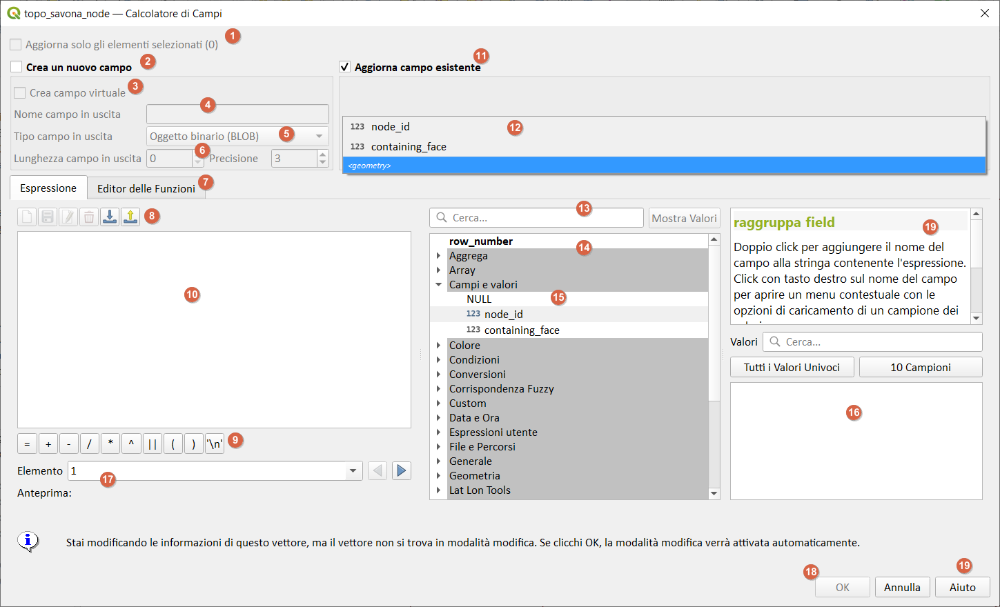
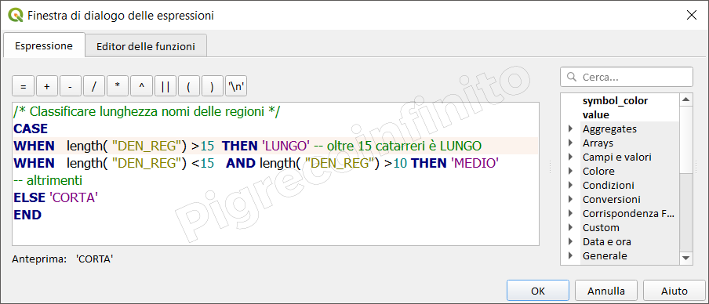
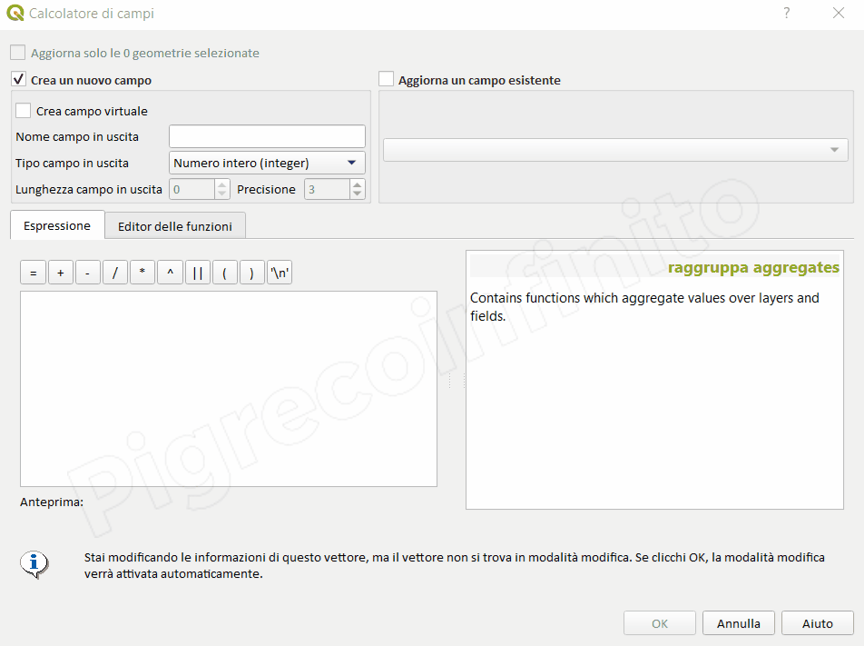
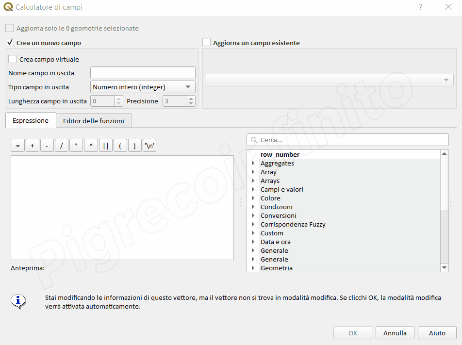
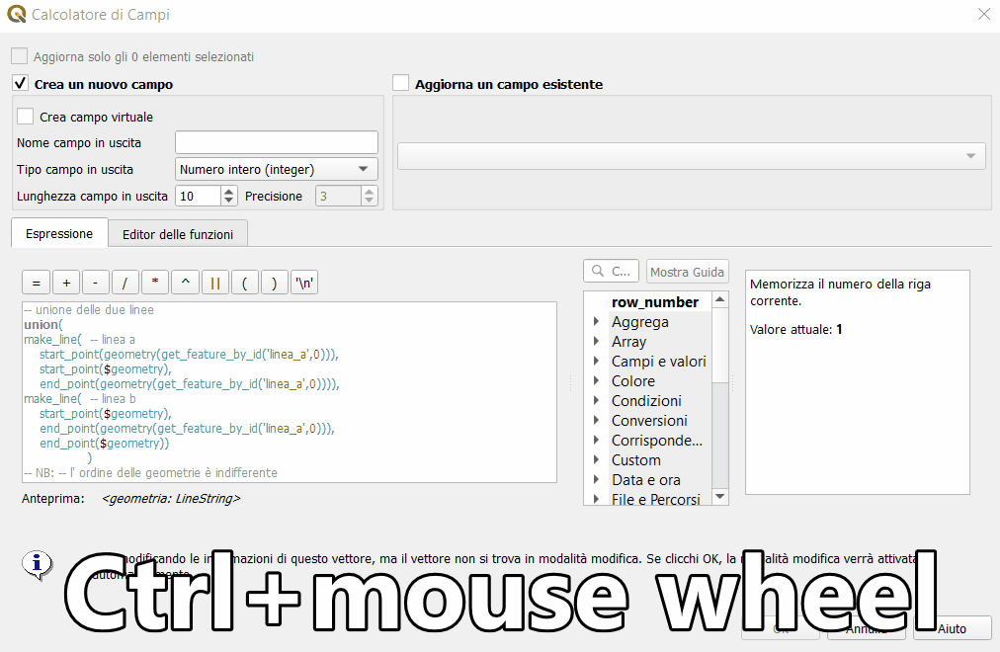

---
hide:
  # - navigation
  # - toc
title: Motore delle espressioni
description: Motore delle espressioni di QGIS 3.x
---

# Motore delle espressioni di QGIS

## Perché usarlo

Il Field Calc di QGIS ha oltre 400 funzioni (in evoluzione) e di queste oltre 140 sono funzioni geometriche. Tutta questa potenza di calcolo permette di risolvere molti problemi GIS come la vicinanza, sovrapposizione, aggregazioni, selezioni ecc... inoltre permette di scrivere/aggiornare i risultati di espressioni direttamente nella tabella degli attributi senza creare altri layer.

## Dove usarlo

Il calcolatore di campi è ora disponibile su qualsiasi livello che supporti la modifica. Il Calcolatore in realtà è solo una interfaccia che ci permette di accedere alle funzioni e di creare semplici o complesse espressioni. Le espressioni di QGIS vengono utilizzate in molti contesti, per esempio:

1. tabella degli attributi;
2. tematizzazione;
3. etichettatura;
4. sovrascrittura definita dai dati;
5. selezione;
6. compositore di stampe, atlas e report;
7. legenda;
8. strumenti di processing: (Seleziona tramite espressione; Estrai tramite espressione; Geometria da espressione; Ordina tramite espressione);
9. moduli inserimento dati e widget;
10. azioni;
11. modellatore grafico;
12. diagrammi;
13. filtri;
14. decorazioni;
15. proprietà layer: variabili;
16. statistiche;
17. suggerimenti mappa;
18. plugin;
19. ecc..

## Campo virtuale

Un campo virtuale è un campo basato su un'espressione calcolata al volo, il che significa che il suo valore viene automaticamente aggiornato non appena il parametro sottostante cambia. L'espressione è impostata una volta; non è più necessario calcolare nuovamente il campo se i valori sottostanti cambiano. Ad esempio, è possibile utilizzare un campo virtuale se è necessario calcolare i valori dell'area durante un processo di digitalizzazione (creazione, unione, divisione di feature) o calcolare una durata che deve essere aggiornata di volta in volta.

## Aggiorna geometria

Attraverso il calcolatore di campi è possibile aggiornare tutti gli attributi di un layer editabile, ma è possibile anche aggiornare la geometria, per esempio diminuire il numero di vertici di una linea o di un poligono; spostare/traslare i punti ecc...

## Field Calc rapido

La barra del calcolatore di campo rapido, nella parte superiore della tabella degli attributi, è visibile solo se il livello è modificabile:


## Interfaccia calcolatore di campi

In questa sezioni descriveremo tutte le parti dell'interfaccia del Field Calc.



1. se attivato aggiorna solo le geometrie selezionate (indica anche il numero delle feature selezionate);
2. se attivato crea un nuovo campo;
3. se attivato crea un campo virtuale;
4. permette di digitare nome del campo (per shapefile NON più di 10 caratteri);
5. permette di selezionare il Tipo di campo in uscita;
6. permette di digitare la Lunghezzacampo in uscita e relativa precisione in caso di numeri Reali;
7. permette di accedere al tab Editor delle Funzioni personalizzate (occorre conoscere il linguaggio Python);
8. icone che permettono di:
      1.  cancellare l'editor delle espressioni;
      2.  salvare le espressioni utente;
      3.  modificare le espressioni utente salvate;
      4.  cancellare le espressioni utente salvate;
      5.  importa espressioni utente;
      6.  esporta funzioni utente.
9. operatori più usati:
      1. `=` uguale;
      2. `+` somma;
      3. `-` differenza;
      4. `/` divisione;
      5. `*` moltiplicazione;
      6. `^` potenza;
      7. `||` unione stringhe (doppio pipe);
      8. `()` parentesi;
      9. `'\n'`nuova riga;
10. editore delle espressioni;
11. se attivato aggiorna campo esistente (anche la geometria);
12. elenco di tutti i campi aggiornabili relativi al layer selezionato;
13. permette di cercare le funzioni, il bottone `Mostra Guida` permette di abilitare l'area dell'Help;
14. area dei gruppi funzione;
15. gruppo Campi e valori relativi al layer selezionato;
16. permette di visualizzare i valori dei campi presenti nel gruppo Campi e valori;
17. permette di selezionare l'Elemento per cui visualizzare l'Anteprima e con il tasto destro del mouse copiare il contenuto;
18. tasto OK per applicare l'espressione;
19. Help sulla funzione selezionata.

### Commenti espressione



È possibile aggiungere commenti alle espressioni nell'area dell'editor espressioni:

1. per riga intera `/*commento*/`
2. per commentare una riga `--commento`

### Campi e valori nel Gruppo Layer Mappa

A partire da >= QGIS 3.24


### Interfaccia e finestre nascoste

=== "Sezione gruppi"

    Nel caso risulti nascosta la sezione Gruppi funzioni (vale fino alla QGIS 3.4):

    

=== "Sezione help"

    Nel caso risulti nascosta la sezione help in linea:

    

=== "Sezione zoom testo"

    Per aumentare dimensione caratteri:

    

## Esempi pratici :material-comment-flash:

### Calcolo fattore di forma

!!! Info inline end

    Permette di individuare poligono con forme strette e lunghe, oppure forme simili a cerchi o quadrati.

```py
/* calcola il fattore di forma*/

(2*pi()*((area(@geometry)/pi())^0.5))/perimeter(@geometry)
```

### Calcolo rapporto di allungamento

!!! Info inline

    Il rapporto di allungamento (E) è:    
    E = 1 - S / L
    Dove S è la lunghezza dell'asse corto e L è la lunghezza dell'asse lungo. Le lunghezze degli assi vengono determinate stimando il riquadro di delimitazione minimo.

```py
/* calcola il rapporto di allungamento */

with_variable('latiBBOX',
    array_foreach(
        array_foreach(
            generate_series(1, 2),
            geometry_n(segments_to_lines(oriented_bbox($geometry)),@element)),
round(length(@element),3)),
1- (array_min(@latiBBOX)/array_max(@latiBBOX)))
```

- <https://hfcqgis.opendatasicilia.it/blog/2024/01/15/rapporto-di-allungamento/>

### Calcolo Sliver polygon

- <https://pigrecoinfinito.com/2023/04/04/individuare-le-sliver-polygon-con-le-espressioni-di-qgis/>

### Spatial join

- <https://pigrecoinfinito.com/2023/07/30/spatial-join-one-to-many-qgis-vs-arcgis-pro/>

{!includes/disclaimer.md!}
