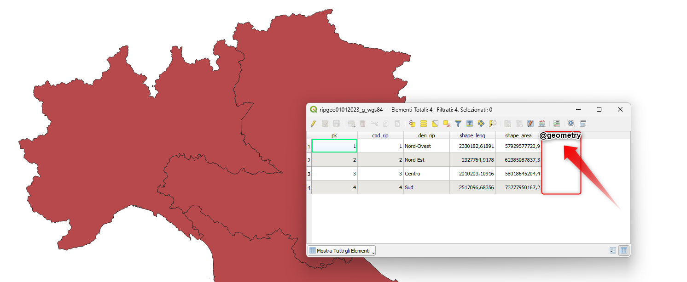
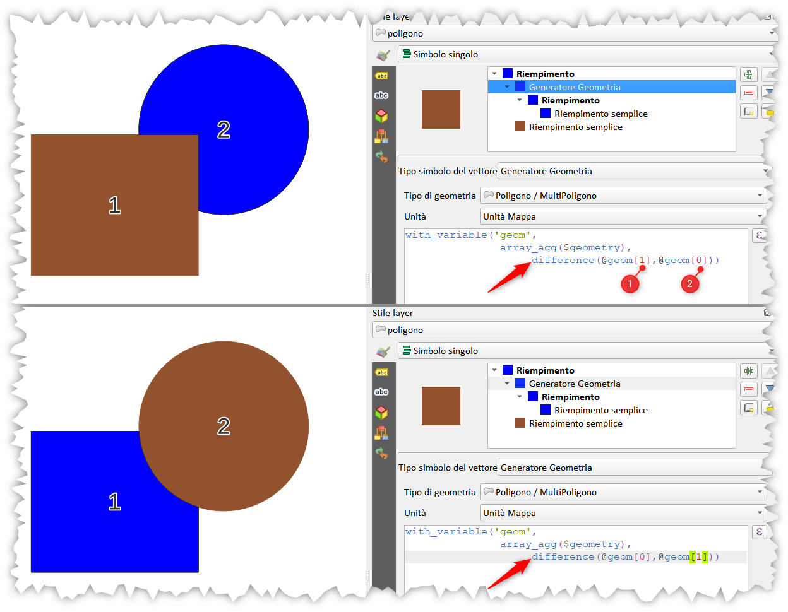
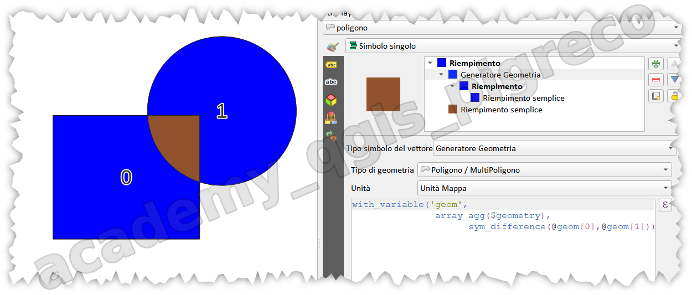
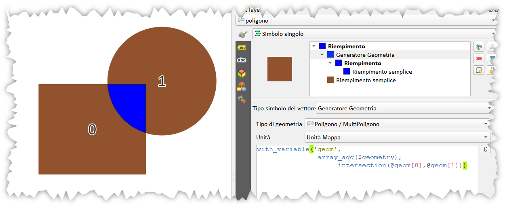
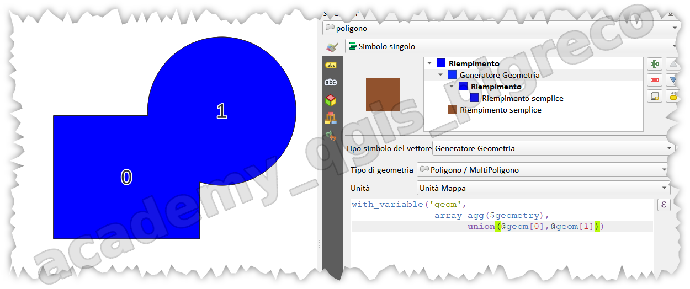
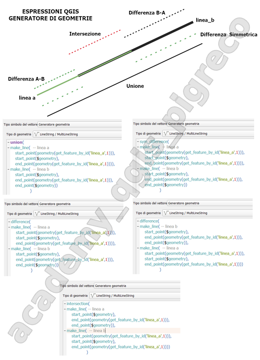
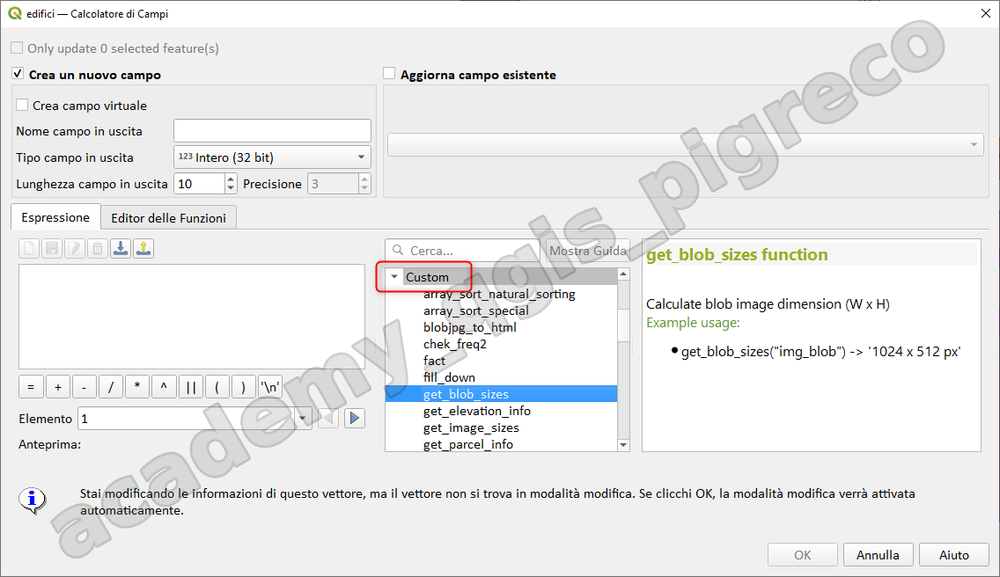
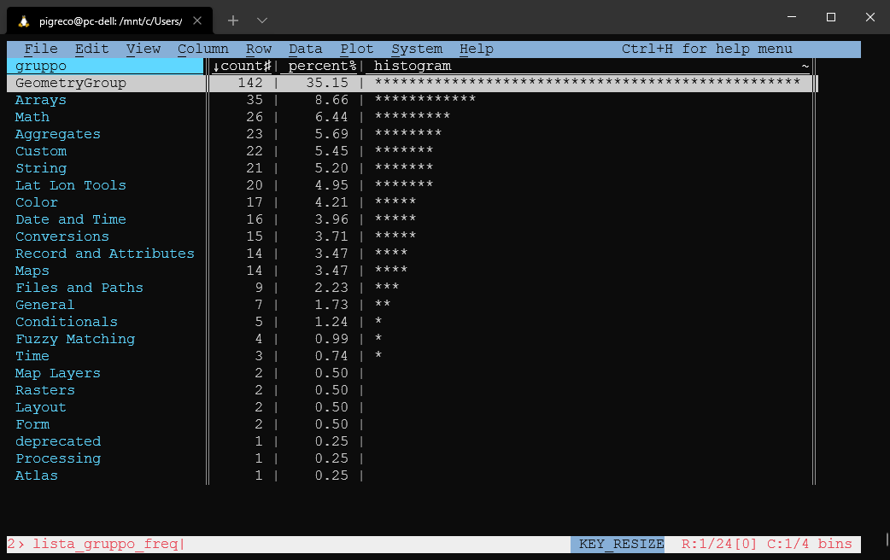

---
hide:
  #- navigation
  # - toc
title: Funzioni core
description: Funzioni core
---

# Le funzioni geometriche

## Introduzione

Le funzioni geometriche sono quelle funzioni che utilizzano l'attributo `geometry` dei vettori, questo attributo non è visibile nella tabella attributi, ma è presente. Queste funzioni permettono di calcolare valori intrinsechi alla geometria come: l'area e il perimetro, per i poligono; lunghezza, per le linee e le coordinate, per i punti.

{.center-img .img-90}

## Osservazione

La **geometria** di un vettore è essa stessa un attributo (molto particolare) ma NON è visibile (per scelta di QGIS) nella tabella attributi. Tutti gli attributi alfanumerici possono essere richiamati, nelle espressioni, tramite il nome del campo (meglio usare gli apici doppi `"field1"`): ma come richiamiamo l'attributo geometria? semplicemente scrivendo `$geometry`(vecchio modo ma ancora funzionante) oppure `@geometry`

## Funzioni geometriche

### CLASSIFICAZIONE

Le funzioni geometriche (oltre 100) si possono classificare in funzione dell'argomento:

1. quelle che `non richiedono argomenti` (sono poche, sono 7);
    1. $Area;
    2. $Perimeter;
    3. $length;
    4. $geometry;
    5. $x;
    6. $y;
    7. $z;
2. quelle che hanno bisogno di almeno un `argomento` (sono molte):
    1. Buffer();
    2. perimeter();
    3. area();
    4. Azimuth();
    5. Centroid();
    6. $x_at();
    7. $y_at();
    8. z()
    9. ect.....

### Predicati geometrici

Nel gruppo funzione geometriche ci sono anche i `predicati geometrici`:

che controllano/verificano se due geometrie sono `sovrapposte in vario modo`:

- [`contains`](https://hfcqgis.opendatasicilia.it/gr_funzioni/geometria/geometria_unico/#contains);
- [`crosses`](https://hfcqgis.opendatasicilia.it/gr_funzioni/geometria/geometria_unico/#crosses);
- [`disjoint`](https://hfcqgis.opendatasicilia.it/gr_funzioni/geometria/geometria_unico/#disjoint);
- [`intersects`](https://hfcqgis.opendatasicilia.it/gr_funzioni/geometria/geometria_unico/#intersects);
- [`overlaps`](https://hfcqgis.opendatasicilia.it/gr_funzioni/geometria/geometria_unico/#overlaps);
- [`touches`](https://hfcqgis.opendatasicilia.it/gr_funzioni/geometria/geometria_unico/#touches);
- [`within`](https://hfcqgis.opendatasicilia.it/gr_funzioni/geometria/geometria_unico/#within);

sono molto utilizzate nel filtro delle funzioni di aggregazione.

vedi : <http://postgis.net/workshops/postgis-intro/spatial_relationships.html>

### Bounding box

- [`boundary`](https://hfcqgis.opendatasicilia.it/gr_funzioni/geometria/geometria_unico/#boundary);
- [`bounds`](https://hfcqgis.opendatasicilia.it/gr_funzioni/geometria/geometria_unico/#bounds);
- [`oriented_bbox`](https://hfcqgis.opendatasicilia.it/gr_funzioni/geometria/geometria_unico/#oriented_bbox);
- [`bounds_height`](https://hfcqgis.opendatasicilia.it/gr_funzioni/geometria/geometria_unico/#bounds_height);
- [`bounds_width`](https://hfcqgis.opendatasicilia.it/gr_funzioni/geometria/geometria_unico/#bounds_width);

### Punti interni al poligono

Alcune volte occorre che un punto sia necessariamente interno al poligono (il centroid può cadere fuori):

- [`point_on_surface`](https://hfcqgis.opendatasicilia.it/gr_funzioni/geometria/geometria_unico/#point_on_surface);
- [`pole_of_inaccessibility`](https://hfcqgis.opendatasicilia.it/gr_funzioni/geometria/geometria_unico/#pole_of_inaccessibility);

### Punti lungo una linea

- [`line_interpolate_point`](https://hfcqgis.opendatasicilia.it/gr_funzioni/geometria/geometria_unico/#line_interpolate_point)

questo è utile, per esempio, per tracciare un punto nel centroide della stessa e che sia sulla linea: <https://pigrecoinfinito.com/2018/09/05/qgis-e-la-funzione-length/>

### Rappresentazione geometria

Nel gruppo geometria sono presenti anche funzioni che modificano la `rappresentazione della geometria`:

- [`geom_from_gml`](https://hfcqgis.opendatasicilia.it/gr_funzioni/geometria/geometria_unico/#geom_from_gml);
- [`geom_from_wkb`](https://hfcqgis.opendatasicilia.it/gr_funzioni/geometria/geometria_unico/#geom_from_wkb);
- [`geom_from_wkt`](https://hfcqgis.opendatasicilia.it/gr_funzioni/geometria/geometria_unico/#geom_from_wkt);
- [`geom_to_wkb`](https://hfcqgis.opendatasicilia.it/gr_funzioni/geometria/geometria_unico/#geom_to_wkb);
- [`geom_to_wkt`](https://hfcqgis.opendatasicilia.it/gr_funzioni/geometria/geometria_unico/#geom_to_wkt);

### Analisi sovrapposizione

Nel gruppo geometria ci sono funzioni di `analisi di sovrapposizione`:

- [`difference`](https://hfcqgis.opendatasicilia.it/gr_funzioni/geometria/geometria_unico/#difference);
- [`sym_difference`](https://hfcqgis.opendatasicilia.it/gr_funzioni/geometria/geometria_unico/#sym_difference);
- [`intersection`](https://hfcqgis.opendatasicilia.it/gr_funzioni/geometria/geometria_unico/#intersection);
- [`union`](https://hfcqgis.opendatasicilia.it/gr_funzioni/geometria/geometria_unico/#union);

| difference                                                                        | sym_difference                                                                        | intersection                                                                        | union                                                                        |
| --------------------------------------------------------------------------------- | ------------------------------------------------------------------------------------- | ----------------------------------------------------------------------------------- | ---------------------------------------------------------------------------- |
| {data-gallery="analisi sovrapposizione"} | {data-gallery="analisi sovrapposizione"} | {data-gallery="analisi sovrapposizione"} | {data-gallery="analisi sovrapposizione"} |
| with_variable('geom', array_agg($geometry), difference(@geom[0],@geom[1]))        | with_variable('geom', array_agg($geometry), sym_difference(@geom[0],@geom[1]))        | with_variable('geom', array_agg($geometry), intersection(@geom[0],@geom[1]))        | with_variable('geom', array_agg($geometry), union(@geom[0],@geom[1]))        |

{.center-img .img-70}

- [`overlay_contains`](https://hfcqgis.opendatasicilia.it/gr_funzioni/geometria/geometria_unico/#overlay_contains);
- [`overlay_crosses`](https://hfcqgis.opendatasicilia.it/gr_funzioni/geometria/geometria_unico/#overlay_crosses);
- [`overlay_disjoint`](https://hfcqgis.opendatasicilia.it/gr_funzioni/geometria/geometria_unico/#overlay_disjoint);
- [`overlay_equals`](https://hfcqgis.opendatasicilia.it/gr_funzioni/geometria/geometria_unico/#overlay_equals);
- [`overlay_intersects`](https://hfcqgis.opendatasicilia.it/gr_funzioni/geometria/geometria_unico/#overlay_intersects);
- [`overlay_nearest`](https://hfcqgis.opendatasicilia.it/gr_funzioni/geometria/geometria_unico/#overlay_nearest);
- [`overlay_touches`](https://hfcqgis.opendatasicilia.it/gr_funzioni/geometria/geometria_unico/#overlay_touches);
- [`overlay_within`](https://hfcqgis.opendatasicilia.it/gr_funzioni/geometria/geometria_unico/#overlay_within);

### Crea geometrie

Nel gruppo geometria ci sono funzioni per `creare geometrie nuove`:

- [`make_circle`](https://hfcqgis.opendatasicilia.it/gr_funzioni/geometria/geometria_unico/#make_circle);
- [`make_ellipse`](https://hfcqgis.opendatasicilia.it/gr_funzioni/geometria/geometria_unico/#make_ellipse);
- [`make_line`](https://hfcqgis.opendatasicilia.it/gr_funzioni/geometria/geometria_unico/#make_line);
- [`make_point`](https://hfcqgis.opendatasicilia.it/gr_funzioni/geometria/geometria_unico/#make_point);
- [`make_point_m`](https://hfcqgis.opendatasicilia.it/gr_funzioni/geometria/geometria_unico/#make_point_m);
- [`make_polygon`](https://hfcqgis.opendatasicilia.it/gr_funzioni/geometria/geometria_unico/#make_polygon);
- [`make_rectangle_3points`](https://hfcqgis.opendatasicilia.it/gr_funzioni/geometria/geometria_unico/#make_rectangle_3points);
- [`make_regular_polygon`](https://hfcqgis.opendatasicilia.it/gr_funzioni/geometria/geometria_unico/#make_regular_polygon);
- [`make_square`](https://hfcqgis.opendatasicilia.it/gr_funzioni/geometria/geometria_unico/#make_square);
- [`make_triangle`](https://hfcqgis.opendatasicilia.it/gr_funzioni/geometria/geometria_unico/#make_triangle).

### Conteggio geometrie

Nel gruppo geometria ci sono funzioni per il `conteggio di geometrie`:

- [`num_geometries`](https://hfcqgis.opendatasicilia.it/gr_funzioni/geometria/geometria_unico/#num_geometries);
- [`num_interior_rings`](https://hfcqgis.opendatasicilia.it/gr_funzioni/geometria/geometria_unico/#num_interior_rings);
- [`num_points`](https://hfcqgis.opendatasicilia.it/gr_funzioni/geometria/geometria_unico/#num_points);

### Semplificazione geometrie

Nel gruppo geometria ci sono funzioni per `semplificare le geometrie`:

- [`simplify`](https://hfcqgis.opendatasicilia.it/gr_funzioni/geometria/geometria_unico/#simplify);
- [`simplify_vw`](https://hfcqgis.opendatasicilia.it/gr_funzioni/geometria/geometria_unico/#simplify_vw);
- [`smooth`](https://hfcqgis.opendatasicilia.it/gr_funzioni/geometria/geometria_unico/#smooth);

**osservazione:** queste funzioni possono essere utilizzate per `aggiornare` la geometria

### Riproiezioni

Nel gruppo geometria c'è una funzione per `modificare proiezione`:

- [`transform`](https://hfcqgis.opendatasicilia.it/gr_funzioni/geometria/geometria_unico/#transform);

... e altre ancora, per calcolo angoli, azimuth, perimetro, lunghezze, aree ecc...

Le funzioni **geometriche** sono fortemente legate al **SR** (Sistema di Riferimento), quindi occorre aver chiaro la differenza tra i vari **SR** (Geografici, Proiettati). Inoltre alcune funzioni (`$area`, `$length`) dipendono dalla configurazione del progetto **QGIS**, cioè dipendono da come vengono impostate le proprietà del progetto: Menu `Progetto | Proprietà | Generale | Misure` qui è possibile settare le unità di misura, il datum (ellissoide), quindi in generale:

!!! Warning
    - `$area`[^1] <> `Area($geometry)`[^2]
    - `$length`[^3] <> `length($geometry)`[^4]

[Blog post](https://pigrecoinfinito.wordpress.com/2018/09/05/qgis-e-la-funzione-length/) su `$length`

!!! Note
    Per evitare brutte sorprese è consigliabile leggere sempre la definizione delle funzione.

## Lista funzioni geometriche

**NB:** <https://github.com/qgis/QGIS/pull/45744>

sono 129 in QGIS 3.22 - link [HfcQGIS](https://hfcqgis.opendatasicilia.it/)

| 1                                                                                                                                                                                                                                                                                                                                                                                                                                                                                                                                                                                                                                                                                                                                                                                                                                                                                                                                                                                                                                                                                                                                                                                                                                                                                                                                                                                                                                                                                                                                                                                                                                                                                                                                                                                                                                                                                                                                                                                                                                                                                                                                                                                                                                                                                                                                                                                                                                                                                                                                                                                                                                                                                                                                                                                                                                                                                                                                                                                                                                                                                                                                                                                                                                                                                                                                                                                                                                                                                                                                                                                        | 2                                                                                                                                                                                                                                                                                                                                                                                                                                                                                                                                                                                                                                                                                                                                                                                                                                                                                                                                                                                                                                                                                                                                                                                                                                                                                                                                                                                                                                                                                                                                                                                                                                                                                                                                                                                                                                                                                                                                                                                                                                                                                                                                                                                                                                                                                                                                                                                                                                                                                                                                                                                                                                                                                                                                                                                                                                                                                                                                                                                                                                                                                                                                                                                                                                                                                                                                                                                                                                                                                                                                                                                                                                           | 3                                                                                                                                                                                                                                                                                                                                                                                                                                                                                                                                                                                                                                                                                                                                                                                                                                                                                                                                                                                                                                                                                                                                                                                                                                                                                                                                                                                                                                                                                                                                                                                                                                                                                                                                                                                                                                                                                                                                                                                                                                                                                                                                                                                                                                                                                                                                                                                                                                                                                                                                                                                                                                                                                                                                                                                                                                                                                                                                                                                                                                                                                                                                                                                                                                                                                                                                                                                                                                                                                                                                                                                                                                                                                                                                                                                    | 4                                                                                                                                                                                                                                                                                                                                                                                                                                                                                                                                                                                                                                                                                                                                                                                                                                                                                                                                                                                                                                                                                                                                                                                                                                                                                                                                                                                                                                                                                                                                                                                                                                                                                                                                                                                                                                                                                                                                                                                                                                                                                                                                                                                                                                                                                                                                                                                                                                                                                                                                                                                                                                                                                                                                                                                                                                                                                                                                                                                                                                                                                                      |
| ---------------------------------------------------------------------------------------------------------------------------------------------------------------------------------------------------------------------------------------------------------------------------------------------------------------------------------------------------------------------------------------------------------------------------------------------------------------------------------------------------------------------------------------------------------------------------------------------------------------------------------------------------------------------------------------------------------------------------------------------------------------------------------------------------------------------------------------------------------------------------------------------------------------------------------------------------------------------------------------------------------------------------------------------------------------------------------------------------------------------------------------------------------------------------------------------------------------------------------------------------------------------------------------------------------------------------------------------------------------------------------------------------------------------------------------------------------------------------------------------------------------------------------------------------------------------------------------------------------------------------------------------------------------------------------------------------------------------------------------------------------------------------------------------------------------------------------------------------------------------------------------------------------------------------------------------------------------------------------------------------------------------------------------------------------------------------------------------------------------------------------------------------------------------------------------------------------------------------------------------------------------------------------------------------------------------------------------------------------------------------------------------------------------------------------------------------------------------------------------------------------------------------------------------------------------------------------------------------------------------------------------------------------------------------------------------------------------------------------------------------------------------------------------------------------------------------------------------------------------------------------------------------------------------------------------------------------------------------------------------------------------------------------------------------------------------------------------------------------------------------------------------------------------------------------------------------------------------------------------------------------------------------------------------------------------------------------------------------------------------------------------------------------------------------------------------------------------------------------------------------------------------------------------------------------------------------------------- | ------------------------------------------------------------------------------------------------------------------------------------------------------------------------------------------------------------------------------------------------------------------------------------------------------------------------------------------------------------------------------------------------------------------------------------------------------------------------------------------------------------------------------------------------------------------------------------------------------------------------------------------------------------------------------------------------------------------------------------------------------------------------------------------------------------------------------------------------------------------------------------------------------------------------------------------------------------------------------------------------------------------------------------------------------------------------------------------------------------------------------------------------------------------------------------------------------------------------------------------------------------------------------------------------------------------------------------------------------------------------------------------------------------------------------------------------------------------------------------------------------------------------------------------------------------------------------------------------------------------------------------------------------------------------------------------------------------------------------------------------------------------------------------------------------------------------------------------------------------------------------------------------------------------------------------------------------------------------------------------------------------------------------------------------------------------------------------------------------------------------------------------------------------------------------------------------------------------------------------------------------------------------------------------------------------------------------------------------------------------------------------------------------------------------------------------------------------------------------------------------------------------------------------------------------------------------------------------------------------------------------------------------------------------------------------------------------------------------------------------------------------------------------------------------------------------------------------------------------------------------------------------------------------------------------------------------------------------------------------------------------------------------------------------------------------------------------------------------------------------------------------------------------------------------------------------------------------------------------------------------------------------------------------------------------------------------------------------------------------------------------------------------------------------------------------------------------------------------------------------------------------------------------------------------------------------------------------------------------------------------------------------- | ------------------------------------------------------------------------------------------------------------------------------------------------------------------------------------------------------------------------------------------------------------------------------------------------------------------------------------------------------------------------------------------------------------------------------------------------------------------------------------------------------------------------------------------------------------------------------------------------------------------------------------------------------------------------------------------------------------------------------------------------------------------------------------------------------------------------------------------------------------------------------------------------------------------------------------------------------------------------------------------------------------------------------------------------------------------------------------------------------------------------------------------------------------------------------------------------------------------------------------------------------------------------------------------------------------------------------------------------------------------------------------------------------------------------------------------------------------------------------------------------------------------------------------------------------------------------------------------------------------------------------------------------------------------------------------------------------------------------------------------------------------------------------------------------------------------------------------------------------------------------------------------------------------------------------------------------------------------------------------------------------------------------------------------------------------------------------------------------------------------------------------------------------------------------------------------------------------------------------------------------------------------------------------------------------------------------------------------------------------------------------------------------------------------------------------------------------------------------------------------------------------------------------------------------------------------------------------------------------------------------------------------------------------------------------------------------------------------------------------------------------------------------------------------------------------------------------------------------------------------------------------------------------------------------------------------------------------------------------------------------------------------------------------------------------------------------------------------------------------------------------------------------------------------------------------------------------------------------------------------------------------------------------------------------------------------------------------------------------------------------------------------------------------------------------------------------------------------------------------------------------------------------------------------------------------------------------------------------------------------------------------------------------------------------------------------------------------------------------------------------------------------------------------ | ------------------------------------------------------------------------------------------------------------------------------------------------------------------------------------------------------------------------------------------------------------------------------------------------------------------------------------------------------------------------------------------------------------------------------------------------------------------------------------------------------------------------------------------------------------------------------------------------------------------------------------------------------------------------------------------------------------------------------------------------------------------------------------------------------------------------------------------------------------------------------------------------------------------------------------------------------------------------------------------------------------------------------------------------------------------------------------------------------------------------------------------------------------------------------------------------------------------------------------------------------------------------------------------------------------------------------------------------------------------------------------------------------------------------------------------------------------------------------------------------------------------------------------------------------------------------------------------------------------------------------------------------------------------------------------------------------------------------------------------------------------------------------------------------------------------------------------------------------------------------------------------------------------------------------------------------------------------------------------------------------------------------------------------------------------------------------------------------------------------------------------------------------------------------------------------------------------------------------------------------------------------------------------------------------------------------------------------------------------------------------------------------------------------------------------------------------------------------------------------------------------------------------------------------------------------------------------------------------------------------------------------------------------------------------------------------------------------------------------------------------------------------------------------------------------------------------------------------------------------------------------------------------------------------------------------------------------------------------------------------------------------------------------------------------------------------------------------------------ |
| \- [affine_transform](https://hfcqgis.opendatasicilia.it/gr_funzioni/geometria/geometria_unico/#affine_transform) - [angle_at_vertex](https://hfcqgis.opendatasicilia.it/gr_funzioni/geometria/geometria_unico/#angle_at_vertex) - [$area](https://hfcqgis.opendatasicilia.it/gr_funzioni/geometria/geometria_unico/#area) - [area](https://hfcqgis.opendatasicilia.it/gr_funzioni/geometria/geometria_unico/#area_1) - [azimuth](https://hfcqgis.opendatasicilia.it/gr_funzioni/geometria/geometria_unico/#azimuth) - [boundary](https://hfcqgis.opendatasicilia.it/gr_funzioni/geometria/geometria_unico/#boundary) - [bounds](https://hfcqgis.opendatasicilia.it/gr_funzioni/geometria/geometria_unico/#bounds) - [bounds_height](https://hfcqgis.opendatasicilia.it/gr_funzioni/geometria/geometria_unico/#bounds_height) - [bounds_width](https://hfcqgis.opendatasicilia.it/gr_funzioni/geometria/geometria_unico/#bounds_width) - [buffer](https://hfcqgis.opendatasicilia.it/gr_funzioni/geometria/geometria_unico/#buffer) - [buffer_by_m](https://hfcqgis.opendatasicilia.it/gr_funzioni/geometria/geometria_unico/#buffer_by_m) - [centroid](https://hfcqgis.opendatasicilia.it/gr_funzioni/geometria/geometria_unico/#centroid) - [close_line](https://hfcqgis.opendatasicilia.it/gr_funzioni/geometria/geometria_unico/#close_line) - [closest_point](https://hfcqgis.opendatasicilia.it/gr_funzioni/geometria/geometria_unico/#closest_point) - [collect_geometries](https://hfcqgis.opendatasicilia.it/gr_funzioni/geometria/geometria_unico/#collect_geometries) - [combine](https://hfcqgis.opendatasicilia.it/gr_funzioni/geometria/geometria_unico/#combine) - [contains](https://hfcqgis.opendatasicilia.it/gr_funzioni/geometria/geometria_unico/#contains) - [convex_hull](https://hfcqgis.opendatasicilia.it/gr_funzioni/geometria/geometria_unico/#convex_hull) - [crosses](https://hfcqgis.opendatasicilia.it/gr_funzioni/geometria/geometria_unico/#crosses) - [difference](https://hfcqgis.opendatasicilia.it/gr_funzioni/geometria/geometria_unico/#difference) - [disjoint](https://hfcqgis.opendatasicilia.it/gr_funzioni/geometria/geometria_unico/#disjoint) - [distance](https://hfcqgis.opendatasicilia.it/gr_funzioni/geometria/geometria_unico/#distance) - [distance_to_vertex](https://hfcqgis.opendatasicilia.it/gr_funzioni/geometria/geometria_unico/#distance_to_vertex) - [end_point](https://hfcqgis.opendatasicilia.it/gr_funzioni/geometria/geometria_unico/#end_point) - [exif_geotag](https://hfcqgis.opendatasicilia.it/gr_funzioni/geometria/geometria_unico/#exif_geotag) - [extend](https://hfcqgis.opendatasicilia.it/gr_funzioni/geometria/geometria_unico/#extend) - [exterior_ring](https://hfcqgis.opendatasicilia.it/gr_funzioni/geometria/geometria_unico/#exterior_ring) - [extrude](https://hfcqgis.opendatasicilia.it/gr_funzioni/geometria/geometria_unico/#extrude) - [flip_coordinates](https://hfcqgis.opendatasicilia.it/gr_funzioni/geometria/geometria_unico/#flip_coordinates) - [force_rhr](https://hfcqgis.opendatasicilia.it/gr_funzioni/geometria/geometria_unico/#force_rhr) - [geom_from_gml](https://hfcqgis.opendatasicilia.it/gr_funzioni/geometria/geometria_unico/#geom_from_gml) - [geom_from_wkb](https://hfcqgis.opendatasicilia.it/gr_funzioni/geometria/geometria_unico/#geom_from_wkb) - [geom_from_wkt](https://hfcqgis.opendatasicilia.it/gr_funzioni/geometria/geometria_unico/#geom_from_wkt) | \- [geom_to_wkb](https://hfcqgis.opendatasicilia.it/gr_funzioni/geometria/geometria_unico/#geom_to_wkb) - [geom_to_wkt](https://hfcqgis.opendatasicilia.it/gr_funzioni/geometria/geometria_unico/#geom_to_wkt) - [\$geometry](https://hfcqgis.opendatasicilia.it/gr_funzioni/geometria/geometria_unico/#$geometry) - [geometry](https://hfcqgis.opendatasicilia.it/gr_funzioni/geometria/geometria_unico/#geometry) - [geometry_n](https://hfcqgis.opendatasicilia.it/gr_funzioni/geometria/geometria_unico/#geometry_n) - [hausdorff_distance](https://hfcqgis.opendatasicilia.it/gr_funzioni/geometria/geometria_unico/#hausdorff_distance) - [inclination](https://hfcqgis.opendatasicilia.it/gr_funzioni/geometria/geometria_unico/#inclination) - [interior_ring_n](https://hfcqgis.opendatasicilia.it/gr_funzioni/geometria/geometria_unico/#interior_ring_n) - [intersection](https://hfcqgis.opendatasicilia.it/gr_funzioni/geometria/geometria_unico/#intersection) - [intersects](https://hfcqgis.opendatasicilia.it/gr_funzioni/geometria/geometria_unico/#intersects) - [intersects_bbox](https://hfcqgis.opendatasicilia.it/gr_funzioni/geometria/geometria_unico/#intersects_bbox) - [is_closed](https://hfcqgis.opendatasicilia.it/gr_funzioni/geometria/geometria_unico/#is_closed) - [is_empty](https://hfcqgis.opendatasicilia.it/gr_funzioni/geometria/geometria_unico/#is_empty) - [is_empty_or_null](https://hfcqgis.opendatasicilia.it/gr_funzioni/geometria/geometria_unico/#is_empty_or_null) - [is_multipart](https://hfcqgis.opendatasicilia.it/gr_funzioni/geometria/geometria_unico/#is_multipart) - [is_valid](https://hfcqgis.opendatasicilia.it/gr_funzioni/geometria/geometria_unico/#is_valid) - [$length](https://hfcqgis.opendatasicilia.it/gr_funzioni/geometria/geometria_unico/#length) - [length](https://hfcqgis.opendatasicilia.it/gr_funzioni/geometria/geometria_unico/#length_1) - [length3D](https://hfcqgis.opendatasicilia.it/gr_funzioni/geometria/geometria_unico/#length3D) - [line_interpolate_angle](https://hfcqgis.opendatasicilia.it/gr_funzioni/geometria/geometria_unico/#line_interpolate_angle) - [line_interpolate_point](https://hfcqgis.opendatasicilia.it/gr_funzioni/geometria/geometria_unico/#line_interpolate_point) - [line_locate_point](https://hfcqgis.opendatasicilia.it/gr_funzioni/geometria/geometria_unico/#line_locate_point) - [line_merge](https://hfcqgis.opendatasicilia.it/gr_funzioni/geometria/geometria_unico/#line_merge) - [line_substring](https://hfcqgis.opendatasicilia.it/gr_funzioni/geometria/geometria_unico/#line_substring) - [m](https://hfcqgis.opendatasicilia.it/gr_funzioni/geometria/geometria_unico/#m) - [m_max](https://hfcqgis.opendatasicilia.it/gr_funzioni/geometria/geometria_unico/#m_max) - [m_min](https://hfcqgis.opendatasicilia.it/gr_funzioni/geometria/geometria_unico/#m_min) - [main_angle](https://hfcqgis.opendatasicilia.it/gr_funzioni/geometria/geometria_unico/#main_angle) - [make_circle](https://hfcqgis.opendatasicilia.it/gr_funzioni/geometria/geometria_unico/#make_circle) - [make_ellipse](https://hfcqgis.opendatasicilia.it/gr_funzioni/geometria/geometria_unico/#make_ellipse) - [make_line](https://hfcqgis.opendatasicilia.it/gr_funzioni/geometria/geometria_unico/#make_line) - [make_point](https://hfcqgis.opendatasicilia.it/gr_funzioni/geometria/geometria_unico/#make_point) - [make_point_m](https://hfcqgis.opendatasicilia.it/gr_funzioni/geometria/geometria_unico/#make_point_m) | \- [make_polygon](https://hfcqgis.opendatasicilia.it/gr_funzioni/geometria/geometria_unico/#make_polygon) - [make_rectangle_3points](https://hfcqgis.opendatasicilia.it/gr_funzioni/geometria/geometria_unico/#make_rectangle_3points) - [make_regular_polygon](https://hfcqgis.opendatasicilia.it/gr_funzioni/geometria/geometria_unico/#make_regular_polygon) - [make_square](https://hfcqgis.opendatasicilia.it/gr_funzioni/geometria/geometria_unico/#make_square) - [make_triangle](https://hfcqgis.opendatasicilia.it/gr_funzioni/geometria/geometria_unico/#make_triangle) - [minimal_circle](https://hfcqgis.opendatasicilia.it/gr_funzioni/geometria/geometria_unico/#minimal_circle) - [nodes_to_points](https://hfcqgis.opendatasicilia.it/gr_funzioni/geometria/geometria_unico/#nodes_to_points) - [num_geometries](https://hfcqgis.opendatasicilia.it/gr_funzioni/geometria/geometria_unico/#num_geometries) - [num_interior_rings](https://hfcqgis.opendatasicilia.it/gr_funzioni/geometria/geometria_unico/#num_interior_rings) - [num_points](https://hfcqgis.opendatasicilia.it/gr_funzioni/geometria/geometria_unico/#num_points) - [num_rings](https://hfcqgis.opendatasicilia.it/gr_funzioni/geometria/geometria_unico/#num_rings) - [offset_curve](https://hfcqgis.opendatasicilia.it/gr_funzioni/geometria/geometria_unico/#offset_curve) - [order_parts](https://hfcqgis.opendatasicilia.it/gr_funzioni/geometria/geometria_unico/#order_parts) - [oriented_bbox](https://hfcqgis.opendatasicilia.it/gr_funzioni/geometria/geometria_unico/#oriented_bbox) - [overlaps](https://hfcqgis.opendatasicilia.it/gr_funzioni/geometria/geometria_unico/#overlaps) - [overlay_contains](https://hfcqgis.opendatasicilia.it/gr_funzioni/geometria/geometria_unico/#overlay_contains) - [overlay_crosses](https://hfcqgis.opendatasicilia.it/gr_funzioni/geometria/geometria_unico/#overlay_crosses) - [overlay_disjoint](https://hfcqgis.opendatasicilia.it/gr_funzioni/geometria/geometria_unico/#overlay_disjoint) - [overlay_equals](https://hfcqgis.opendatasicilia.it/gr_funzioni/geometria/geometria_unico/#overlay_equals) - [overlay_intersects](https://hfcqgis.opendatasicilia.it/gr_funzioni/geometria/geometria_unico/#overlay_intersects) - [overlay_nearest](https://hfcqgis.opendatasicilia.it/gr_funzioni/geometria/geometria_unico/#overlay_nearest) - [overlay_touches](https://hfcqgis.opendatasicilia.it/gr_funzioni/geometria/geometria_unico/#overlay_touches) - [overlay_within](https://hfcqgis.opendatasicilia.it/gr_funzioni/geometria/geometria_unico/#overlay_within) - [$perimeter](https://hfcqgis.opendatasicilia.it/gr_funzioni/geometria/geometria_unico/#perimeter) - [perimeter](https://hfcqgis.opendatasicilia.it/gr_funzioni/geometria/geometria_unico/#perimeter_1) - [point_n](https://hfcqgis.opendatasicilia.it/gr_funzioni/geometria/geometria_unico/#point_n) - [point_on_surface](https://hfcqgis.opendatasicilia.it/gr_funzioni/geometria/geometria_unico/#point_on_surface) - [pole_of_inaccessibility](https://hfcqgis.opendatasicilia.it/gr_funzioni/geometria/geometria_unico/#pole_of_inaccessibility) - [project](https://hfcqgis.opendatasicilia.it/gr_funzioni/geometria/geometria_unico/#project) - [relate](https://hfcqgis.opendatasicilia.it/gr_funzioni/geometria/geometria_unico/#relate) - [reverse](https://hfcqgis.opendatasicilia.it/gr_funzioni/geometria/geometria_unico/#reverse) - [rotate](https://hfcqgis.opendatasicilia.it/gr_funzioni/geometria/geometria_unico/#rotate) - [segments_to_lines](https://hfcqgis.opendatasicilia.it/gr_funzioni/geometria/geometria_unico/#segments_to_lines) | \- [shortest_line](https://hfcqgis.opendatasicilia.it/gr_funzioni/geometria/geometria_unico/#shortest_line) - [simplify](https://hfcqgis.opendatasicilia.it/gr_funzioni/geometria/geometria_unico/#simplify) - [simplify_vw](https://hfcqgis.opendatasicilia.it/gr_funzioni/geometria/geometria_unico/#simplify_vw) - [single_sided_buffer](https://hfcqgis.opendatasicilia.it/gr_funzioni/geometria/geometria_unico/#single_sided_buffer) - [sinuosity](https://hfcqgis.opendatasicilia.it/gr_funzioni/geometria/geometria_unico/#sinuosity) - [smooth](https://hfcqgis.opendatasicilia.it/gr_funzioni/geometria/geometria_unico/#smooth) - [start_point](https://hfcqgis.opendatasicilia.it/gr_funzioni/geometria/geometria_unico/#start_point) - [straight_distance_2d](https://hfcqgis.opendatasicilia.it/gr_funzioni/geometria/geometria_unico/#straight_distance_2d) - [sym_difference](https://hfcqgis.opendatasicilia.it/gr_funzioni/geometria/geometria_unico/#sym_difference) - [tapered_buffer](https://hfcqgis.opendatasicilia.it/gr_funzioni/geometria/geometria_unico/#tapered_buffer) - [touches](https://hfcqgis.opendatasicilia.it/gr_funzioni/geometria/geometria_unico/#touches) - [transform](https://hfcqgis.opendatasicilia.it/gr_funzioni/geometria/geometria_unico/#transform) - [translate](https://hfcqgis.opendatasicilia.it/gr_funzioni/geometria/geometria_unico/#translate) - [union](https://hfcqgis.opendatasicilia.it/gr_funzioni/geometria/geometria_unico/#union) - [wedge_buffer](https://hfcqgis.opendatasicilia.it/gr_funzioni/geometria/geometria_unico/#wedge_buffer) - [within](https://hfcqgis.opendatasicilia.it/gr_funzioni/geometria/geometria_unico/#within) - [\$x](https://hfcqgis.opendatasicilia.it/gr_funzioni/geometria/geometria_unico/#x) - [x](https://hfcqgis.opendatasicilia.it/gr_funzioni/geometria/geometria_unico/#x_1) - [$x_at](https://hfcqgis.opendatasicilia.it/gr_funzioni/geometria/geometria_unico/#x_at) - [x_max](https://hfcqgis.opendatasicilia.it/gr_funzioni/geometria/geometria_unico/#x_max) - [x_min](https://hfcqgis.opendatasicilia.it/gr_funzioni/geometria/geometria_unico/#x_min) - [\$y](https://hfcqgis.opendatasicilia.it/gr_funzioni/geometria/geometria_unico/#y) - [y](https://hfcqgis.opendatasicilia.it/gr_funzioni/geometria/geometria_unico/#y_1) - [\$y_at](https://hfcqgis.opendatasicilia.it/gr_funzioni/geometria/geometria_unico/#y_at) - [y_max](https://hfcqgis.opendatasicilia.it/gr_funzioni/geometria/geometria_unico/#y_max) - [y_min](https://hfcqgis.opendatasicilia.it/gr_funzioni/geometria/geometria_unico/#y_min) - [\$z](https://hfcqgis.opendatasicilia.it/gr_funzioni/geometria/geometria_unico/#z) - [z](https://hfcqgis.opendatasicilia.it/gr_funzioni/geometria/geometria_unico/#z_1) - [z_max](https://hfcqgis.opendatasicilia.it/gr_funzioni/geometria/geometria_unico/#z_max) - [z_min](https://hfcqgis.opendatasicilia.it/gr_funzioni/geometria/geometria_unico/#z_min)     |

### Quadro sinottico >=QGIS 3.24

{.center-img .img-60}

per un complessivo di oltre 400 funzioni

## Esempi

=== "Esempio 1"

    Per richiamare l'attributo `geometry` del vettore attivo/corrente occorre usare la funzione `$geometry`, quindi se volessi estrarre le coordinate di un vettore **POINT Z** dovrei usare la seguente espressione: `$x`, `$y` e `$z` o `z($geometry)`

=== "Esempio 2"

    Se volessi creare un Buffer di 10 metri (**SR proiettati e unita metri**), utilizzerei l'espressione `Buffer($geometry,10)`; in questo caso specifico il tipo di geometria può essere **Point**, **Linestring** o **Polygon**

=== "Esempio 3"

    Se volessi estrarre il primo e l'ultimo vertice di una polilinea userei `start_point($geometry)`  e `end_point($geometry)`, sono a sua volta geometrie (`start_point($geometry) = end_point($geometry)`)

=== "Esempio 4"

    dall'esempio di sopra potrei estrarre le coordinate con: `x(start_point($geometry))` e `y(end_point($geometry))`

=== "Esempio 5"

    vedi <https://pigrecoinfinito.com/2021/11/01/qgis-e-lo-spatial-join-condizionato/>

---

[^1]: Restituisce l'area della geometria corrente. L'area calcolata da questa funzione rispetta sia le impostazioni dell'ellissoide del progetto corrente sia delle unità di misura. Per esempio, se è stato impostato un ellissoide per il progetto allora l'area calcolata sarà ellisoidica altrimenti se non è stato impostato alcun ellissoide l'area calcolata sarà planimetrica.

[^2]: Restituisce la geometria di un elemento con geometria.

[^3]: Restituisce la lunghezza di una linestring. Se hai bisogno della lunghezza del bordo di un poligono, utilizza invece $perimeter. La lunghezza calcolata da questa funzione rispetta le impostazioni sia dell'ellissoide sia delle unità di misura del progetto corrente. Per esempio, se è stato impostato un ellissoide per il progetto allora la lunghezza calcolata sarà ellisoidica altrimenti se non è stato impostato alcun ellissoide la lunghezza calcolata sarà planimetrica.

[^4]: Restituisce il numero di caratteri in una stringa o la lunghezza di una geometria di tipo linestring.

{!includes/disclaimer.md!}