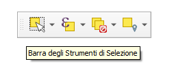
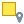
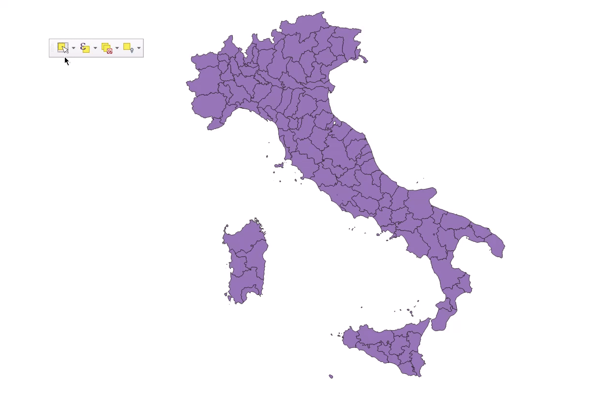
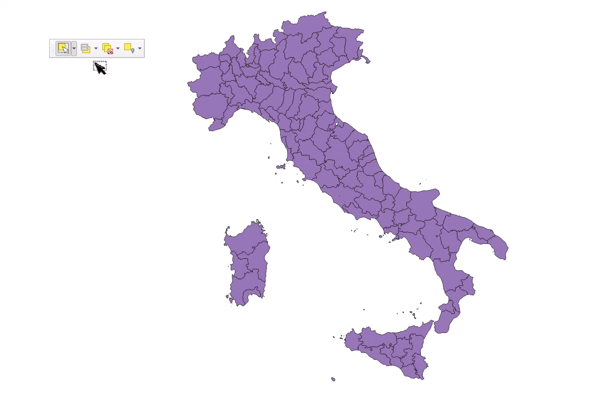

---
hide:
  # - navigation
  # - toc
title: Selezione per espressioni
description: Come effetture le selezioni e in particolare usando il motore delle espressioni
---

# Barra degli strumenti di selezione

[DOCS QGIS](https://docs.qgis.org/3.34/it/docs/user_manual/introduction/general_tools.html#interacting-with-features)

La _Barra degli Strumenti di Selezione_ è attivabile dal menu **Visualizza | Barra degli Strumenti**, per impostazione predefinita è già attiva:

{.center-img .img-30}

-  la prima icona ci permette di selezionare, in vario modo, e usando il mouse, le geometrie nella mapcanvas;
-  la seconda permette di selezionare, in vario modo, usando dei valori o tramite espressione;
-  la terza permette di deselezionare gli elementi da tutti i layer o solo per il layer attivo;
-  il quarto permette di selezionare gli elementi per posizione o entro una distanza;

## Esempi selezione

=== "seleziona tramite mouse"

    {.center-img .img-70}

=== "seleziona per valore o espressione"

    {.center-img .img-90}

=== "seleziona per posizione o entro una distanza"

    {.center-img .img-70}

## fare esempi pratici su QGIS

- per aggiungere o sottrarre alla selezione;
- per selezionare elementi tra layer sovrapposti;
- ecc...

{!includes/disclaimer.md!}
