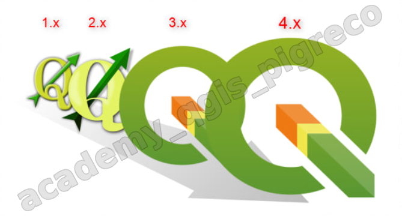

---
hide:
  # - navigation
  # - toc
title: Stampe in serie
description: Stampe in serie con il compositore di stampe
---

# Atlanti

## Atlante con grafici

### Introduzione

Realizzare un **atlante** utilizzando come layer di copertura il vattore **regioni ISTAT** messo in relazione (1:m) con il vettore delle **province ISTAT**. Il **layout** deve contenere/visualizzare: 

- una mappa delle province della regione corrente,
- un grafico (bar plot), legato alla regione corrente, che visualizzi un parametro a scelta delle province,
- tabella attributi delle province relative alla regione corrente,
- una panoramica,
- altri oggetti utili alla comprensione dell'atlante. (a seguire il risultato atteso - gif animata)

{.center-img .img-90}

### Cosa occorre

Per realizzare l'atlante descritto sopra occorre, oltre a [**QGIS**](https:/qgis.org/it/site/), il plugin [**DataPlotly**](https:/plugins.qgis.org/plugins/DataPlotly/) che va installato (menu Plugins | Gestisci ed Installa Plugin...), i **CONFINI DELLE UNITÀ AMMINISTRATIVE A FINI STATISTICI AL 1° GENNAIO 2020**: <https:/www.istat.it/it/archivio/222527>

### Suggerimento

Creare un nuovo geopackage e importare i due shapefile `Reg01012020_g_WGS84` e `ProvCM01012020_g_WGS84` inoltre salvare il rpogetto QGIS dentro lo stesso geopackage. (Io userò il geopackage `materiale_didatticoFULL.gpkg`)

### Iniziamo

#### Importare dati

Importare in QGIS i due layer `Reg01012020_g_WGS84` e `ProvCM01012020_g_WGS84`

{.center-img .img-90}

#### Creare relazione 

Creare relazione 1:m tra i due layer

{.center-img .img-90}

#### Aggiungere viste

Aggiungo due viste per utilizzarle successivamente nell'atlante: **regioni**, **province**

{.center-img .img-90}

#### Nuovo Layout di stampa

Creo nuovo layout (Ctrl + P) e lo chiamo `atlante con grafici`

{.center-img .img-90}

By default la pagina è A4 orizzontale

##### Aggiungere mappe

1. Aggiungo la prima mappa e la chiama regioni;
2. aggiungo una seconda mappa e la chiama panoramica;
3. una terza mappa e la chiama province;

per rinominare un oggetto mappa doppio clic sul nome, nel pannello Oggetti.

{.center-img .img-90}

##### Definire Atlante

1. dal Pannello _Atlante_

{.center-img .img-70}

2. dal Pannello _Prorietà dell'Oggetto_ (mappa `regioni`)

{.center-img .img-90}

stessa cosa va fatta per la mappa `province`, in modo da avere due mappe legate allo stesso atlante:

{.center-img .img-90}

##### Impostare la Panoramica

Imposto la **Panoramica** della mappa `regioni`

{.center-img .img-90}

adattare l'estensione della mappa (panoramica) al riquadro utilizzando l'icona  e la rotellina del mouse con ctrl premuto.

{.center-img .img-90}

##### Anteprima Atlante

Attivare anteprima atlante per verificare che tutto sia ben impostato, cliccare sull'icona 

{.center-img .img-90}

##### Associare Viste alle mappa

Associare le **viste** create alla mappa `regioni` e `province`:

{.center-img .img-90}

{.center-img .img-90}

##### Grafico Bar Plot

Aggiungere grafico utilizzando l'icona  (occorre installare il Plugin DataPlotly) tracciando un rettangolo:

{.center-img .img-90}

cliccare su (4) `Setup Selected Plot` per accedere al setup del grafico:

{.center-img .img-90}

al punto (3) inserire questa espressione:

```py
contains(@atlas_geometry,point_on_surface($geometry))
```

{.center-img .img-90}

##### Tabella Attributi Province

Per aggiungere una tabella utilizzare l'icona  e disegnare un rettangolo:

{.center-img .img-90}

##### Etichetta Atlante

Per aggiungere una etichetta utilizzare l'icona  e, tramite espressione, aggiungere il campo che contiene il nome della Regione corrente:

{.center-img .img-90}

##### Etichetta statica

Per aggiungere una etichetta utilizzare l'icona  e digitare `Regioni e Province Italiane`:

{.center-img .img-90}

Aggiungere in basso a destra una etichetta con scritto: **Realizzato con QGIS**.

##### Immagine

Aggiungere una immagine utilizzando l'icona  e traciando un rettangolo:

{.center-img .img-90}

#### Sistemare

Dopo aver aggiunto tutti gli oggetti, occorre sistemare il tutto, per esempio: centrare e formattare meglio le etichette; sistemare meglio le varie mappe; formattare meglio la tabella attributi ecc...

##### Guide orizzontali e verticali

Ecco una prima sistemata con l'aggiunta di guide

{.center-img .img-90}

##### Formattare testo etichette

Formattare il testo delle etichette: dimensione, colore e allineamento

{.center-img .img-90}

##### Tabella Attributi

Formattazione tabella: tipo carattere, colore, dimensione, numero campi ec...

{.center-img .img-90}

dalle proprietà `Attributi` è possibile: riordinare i campi, rinominarli, eliminarli, aggiungerli ecc...

{.center-img .img-90}

edito l'**Aspetto** della tabella:

{.center-img .img-90}

##### Grafico

Configurare le varie opzioni del grafico

{.center-img .img-90}

##### Mappe

###### panoramica

La mappa `panoramica` Bloccare Layer e stile in modo da non modificare la visualizzazione della panoramica, questo perché il layer verrà successivamente modificato utilòizzando una tematizzazione tramite regola:

{.center-img .img-90}

###### regioni

Per visualizzare solo la regione corrente (e non le altre confinanti) un modo è quello di tematizzare il layer usando questo filtro nella regola:

```py
"den_reg"  =  @atlas_pagename 
```

{.center-img .img-70}

ecco cosa accade nel layout:

{.center-img .img-90}

###### province

Per visualizzare solo le province della regione corrente (e non le altre confinanti) un modo è quello di tematizzare il layer usando questo filtro nella regola:

```py
contains(@atlas_geometry,point_on_surface($geometry))
```

{.center-img .img-70}

ecco cosa accade nel layout:

{.center-img .img-90}

##### Numero pagina Atlante

Aggingere numero pagina e il totale delle pagine (sono due variabili):

{.center-img .img-90}

### Esportazione

Per esportare il PDF singolo della pagina corrente, pigiare l'icona :

{.center-img .img-90}

per esportare file singolo PDF dell'atlante:

{.center-img .img-90}

per esportare tanti file PDF quanti sono le pagine dell'atlante, togliere la spunta all'opzione `Esporta file singolo se possibile` e configurare `Espressione del nome di file in uscita` usando anche il costruttore di espressioni:

{.center-img .img-90}

{.center-img .img-90}

{.center-img .img-90}

per maggiori dettagli, la guida ufficiale di QGIS:<br> <https:/docs.qgis.org/testing/en/docs/user_manual/print_composer/create_output.html#export-as-pdf>

### Avanzato

#### Generatore di geometrie

Visualizzare, aumentando lo spessore linea, il confine della regione corrente nella mappa `province`, questo si realizza tramite il `generatore di geometrie`:

{.center-img .img-90}

risultato:

{.center-img .img-90}

#### Colore Bar Plot

Modificare colore delle barre del grafico Bar Plot:

```py
array_foreach(generate_series( 0, 1.01, 1/9 ),  ramp_color( 'Spectral', @element))
```

{.center-img .img-90}

#### Colori categorizzati Bar Plot

È possibile tematizzare il layer delle Province con il metodo `Categorizzato` e associare un colore per ogni `Provincia`, questi colori possono essere usati anche nelle barre del Bar Plot; il processo è un po' lungo ma si puo' fare. Solo un piccolo cenno: occorre creare un nuovo campo e popolarlo con i colori (es: RGB) da utilizzare sia nella categorizzazione che nel grafico.

{!includes/disclaimer.md!}