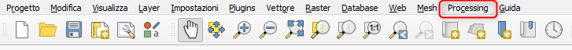
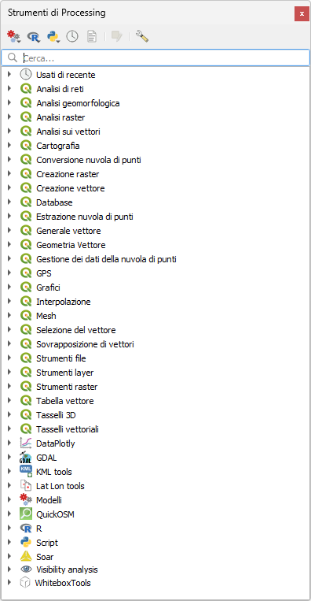
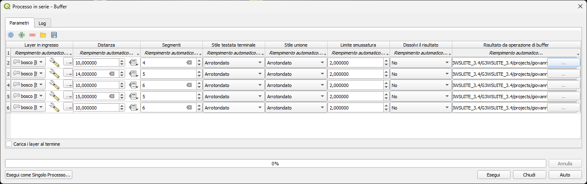
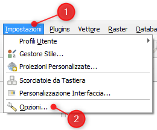
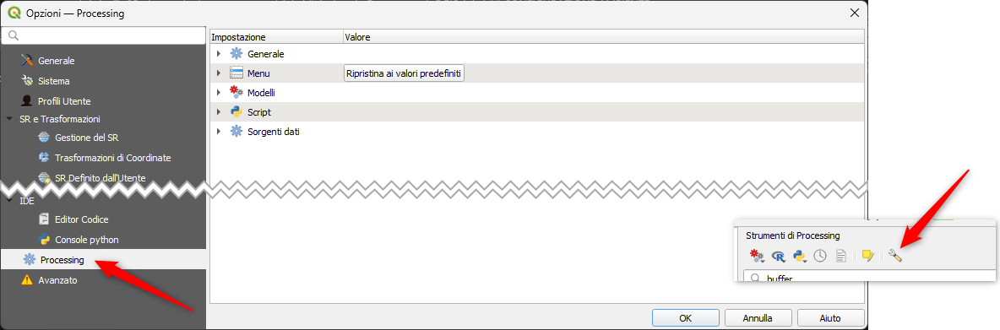
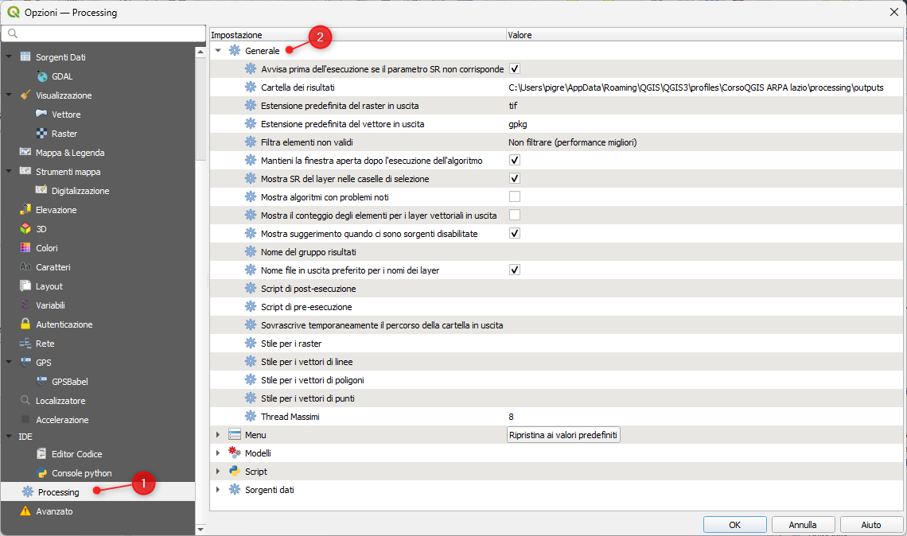
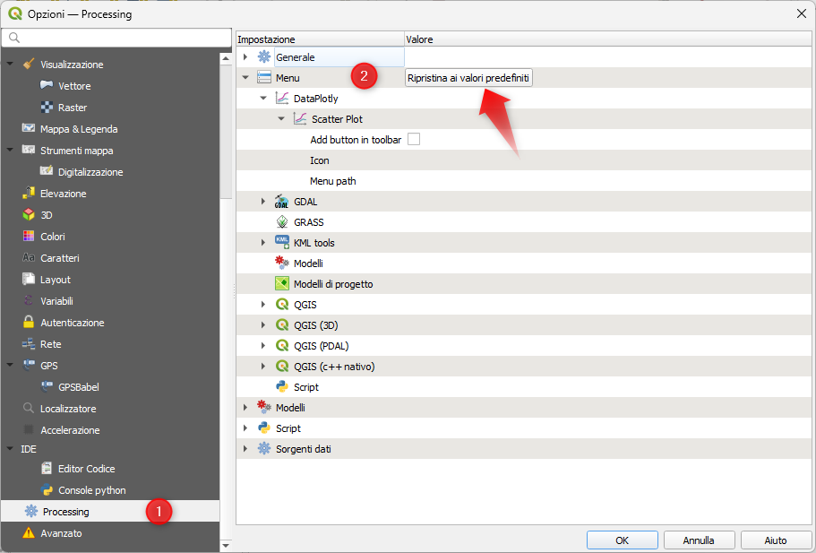
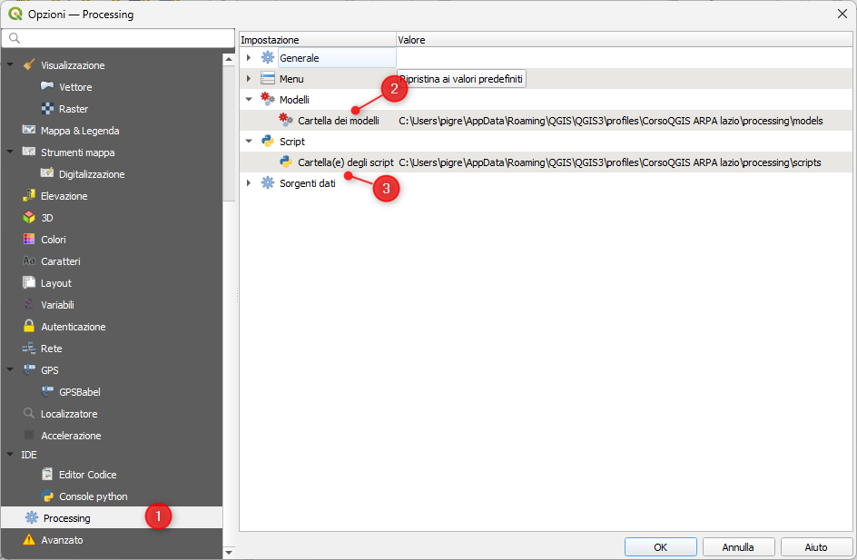
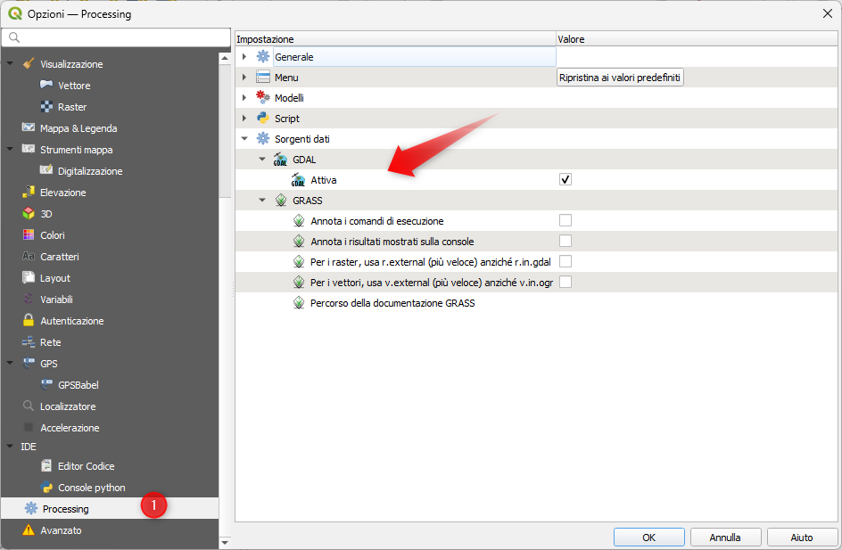

---
hide:
  # - navigation
  # - toc
title: Introduzione
description: Introduzione all'ambiente di processing QGIS
---

# Introduzione

## Introduzione

Questo capitolo introduce l’ambiente di processing QGIS, un ambiente di elaborazione di dati geografici grazie al quale è possibile usare algoritmi nativi di QGIS e algoritmi di terze parti. In questo modo le attività di analisi spaziale saranno molto più produttive e facile da realizzare.

Processing è installato di default ma devi attivarlo (è un plugin core):

1. Vai al menu Plugins | Gestisci ed Installa plugins…
2. Fai clic sulla scheda Installati sulla sinistra;
3. Seleziona la casella accanto alla voce  _**Processing**_
4. Chiudi la finestra di dialogo.

Il menu **Processing** è ora disponibile nella barra dei menu in alto. Utile per raggiungere i componenti principali di questo framework.

{.center-img .img-80}

**Ci sono quattro elementi di base nella GUI del framework**, che vengono utilizzati per eseguire algoritmi per scopi diversi. La scelta di uno strumento o di un altro dipende dal tipo di analisi che deve essere eseguita e dalle caratteristiche particolari di ogni utente e progetto. Tutti (eccetto l’interfaccia di elaborazione batch, che viene richiamata dalla casella degli strumenti o dalla finestra di dialogo per l’esecuzione degli algoritmi, come vedremo) sono accessibili dalla voce di menu Processing.

### Il Toolbox

L’elemento principale della GUI, è usato per eseguire un singolo algoritmo o per eseguire un processo batch basato su quell’algoritmo:

{.center-img .img-30}

{.center-img .img-50}

### Il modellatore grafico

Il Modellatore Grafico: Diversi algoritmi possono essere combinati graficamente utilizzando il modellatore per definire un flusso di lavoro, creando un singolo processo che coinvolge diversi sottoprocessi:

{.center-img .img-90}

### Lo storico

Il gestore dello Storico: Tutte le azioni eseguite utilizzando uno qualsiasi degli elementi summenzionati sono memorizzate in un file di cronologia e possono essere in seguito facilmente riprodotti utilizzando il gestore della cronologia:

{.center-img .img-70}

### Esecuzione in serie

L’interfaccia Esecuzione batch: Questa interfaccia permette di eseguire processi batch e automatizzare l’esecuzione di un singolo algoritmo su più insiemi di dati:

{.center-img .img-90}

Nelle sezioni seguenti rivedremo in dettaglio ciascuno di questi elementi.

## CONFIGURAZIONE

Il menu _Impostazioni | Opzioni - Processing (scheda Impostazioni | Opzioni |_  Processing) ti consente di configurare il funzionamento degli algoritmi. I parametri di configurazione sono strutturati in blocchi separati che si possono selezionare sul lato sinistro della finestra di dialogo.

{.center-img .img-40}

{.center-img .img-90}

### Generale

La sezione **Generale** contiene le impostazioni predefinite per controllare il comportamento della finestra di dialogo dell’algoritmo e dei parametri di input e output. Alcune impostazioni possono tuttavia essere sovrascritte durante l’esecuzione dell’algoritmo, ad esempio per selezionare i parametri di input.

{.center-img .img-90}

[DOC QGIS](https://docs.qgis.org/3.28/it/docs/user_manual/processing/configuration.html#general)

### Menu

La sezione  **Menu** controlla se un algoritmo, uno script o un modello (incorporato o fornito da plugin) deve essere reso disponibile attraverso un menu o una barra degli strumenti dedicata (insieme al Processing Toolbox). Per ogni voce di ciascun fornitore, puoi:

{.center-img .img-90}

1. **Add button in toolbar**, rendendolo disponibile nella barra degli strumenti Algoritmi di Processing;
2. assegnare una **Icona** all’algoritmo;
3. impostare un **Menu path**: l’algoritmo sarà quindi disponibile attraverso un menu esistente o personalizzato, ad esempio Vect&or/MyTopAlgorithms.

Riavvia QGIS per applicare le impostazioni. In qualsiasi momento, puoi attivare _Ripristina ai valori predefiniti_ alle tue modifiche.

### Modelli e script

Nei blocchi  Modelli e  script, puoi impostare una cartella predefinita in cui memorizzare e cercare rispettivamente i modelli e gli script.

{.center-img .img-90}

### Sorgente dati

Trovi anche un blocco per gli algoritmi delle  _Sorgenti dati_. Questo è il luogo in cui i provider installati espongono le loro impostazioni. Ad esempio, i provider integrati contengono una voce **Attiva** che puoi usare per far apparire o meno i loro algoritmi nella casella degli strumenti. Alcuni fornitori di algoritmi hanno le proprie voci di configurazione.

{.center-img .img-90}

## Riferimento

[DOCS QGIS](https://docs.qgis.org/3.28/it/docs/user_manual/processing/intro.html#introduction)

{!includes/disclaimer.md!}