---
hide:
  # - navigation
  # - toc
title: Toolbox
description: Strumenti di processing
---

# Toolbox

## Processing

Il **Processing** è il componente principale della GUI di Processing. Mostra l’elenco di tutti gli algoritmi disponibili raggruppati in diversi blocchi chiamati **Sorgenti dati**, **Modelli** e **Script** personalizzati che puoi aggiungere per estendere l’insieme degli strumenti. Quindi **Processing** è il punto di accesso per eseguirli, sia come singolo processo che come un processo batch (in serie) che coinvolge diverse esecuzioni dello stesso algoritmo su diversi insiemi in ingresso.

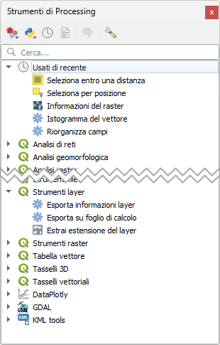{.center-img .img-50}

Le Sorgenti dati possono essere (de)attivate in Processing Inpostazioni. Per impostazione predefinita, solo le sorgenti dati che non si basano su applicazioni di terze parti (cioè quelli che richiedono solo strumenti QGIS per essere eseguiti) sono attivi.

Nella parte superiore della finestra di dialogo degli strumenti di processing, ci sono una serie di strumenti per:

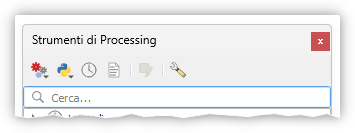{.center-img .img-40}

* lavorare con  Modelli: _Crea Nuovo Modello…_, _Apri Modello Esistente…_ e _Aggiungi Modello agli Strumenti…_;
* lavorare con  Scripts: _Crea Nuovo Script…_, _Crea Nuovo Script da Modello…_, _Apri Script Esistente…_ e _Aggiungi Script agli Strumenti…_;
* aprire il pannello  Storico;
* aprire il pannello  Visualizzatore Risultati;
* attivare la casella degli strumenti alla _**in-place modification**_ mode usando il pulsante  Modifica funzioni in loco: vengono visualizzati solo gli algoritmi che sono adatti ad essere eseguiti sul layer attivo senza generare un nuovo layer;
* apri la finestra di dialogo options .

Sotto questa barra degli strumenti c’è una casella  **Cerca…** per aiutarti a trovare facilmente gli strumenti che ti servono. Puoi inserire qualsiasi parola o frase nella casella di testo. Nota che, mentre digiti, il numero di algoritmi, modelli o script nella casella degli strumenti si riduce solo a quelli che contengono il testo che hai inserito nei loro nomi o parole chiave.

**NB:** alcuni algoritmi potrebbero essere presenti in vari provider, per esempio se cerchiamo `Buffer`:

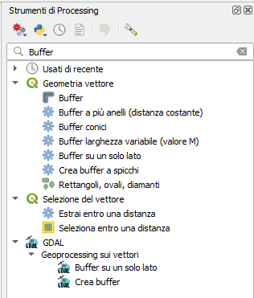{.center-img .img-50}

!!! Note
    Per eseguire uno strumento, basta fare doppio clic sul suo nome nella casella degli strumenti.

## Configurazione algoritmo

Una volta fatto doppio clic sul nome dell’algoritmo da eseguire, viene mostrata una finestra di dialogo simile a quella della figura sotto (in questo caso, la finestra di dialogo corrisponde all’algoritmo Buffer):

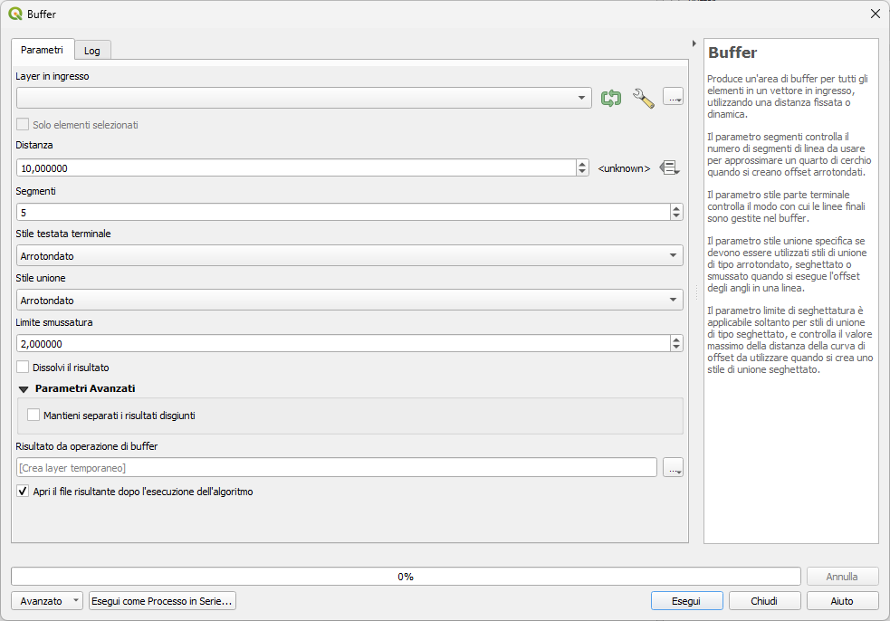{.center-img .img-90}

La finestra di dialogo mostra due schede (_Parametri_ e _Log_) sulla parte sinistra, la descrizione dell’algoritmo sulla destra e una serie di pulsanti in basso.

## Tipologia parametro

La scheda **Parametri** è usata per impostare i valori in ingresso di cui l’algoritmo ha bisogno per essere eseguito. Mostra un elenco di valori in ingresso e parametri di configurazione da impostare. Naturalmente ha un contenuto diverso, a seconda dei requisiti dell’algoritmo da eseguire, e viene creato automaticamente in base a tali requisiti.

Anche se il numero e tipo dei parametri dipende dal tipo di algoritmo, la struttura di base è simile per tutti. I parametri che si trovano nella tabella possono essere di uno dei seguenti tipi.

### Layer vettoriale

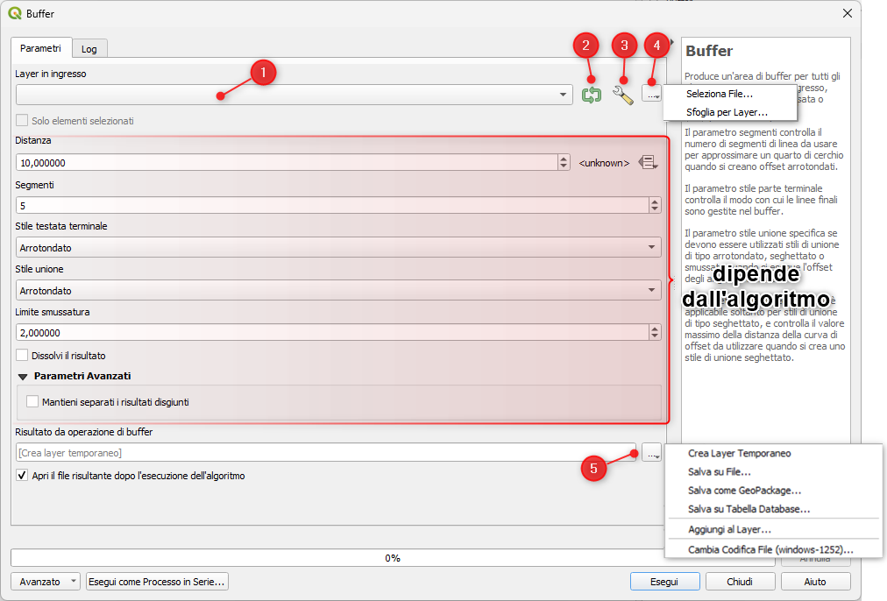{.center-img .img-90}

1. Menu a tendina con l'elenco dei vettori caricati nel Pannello dei Layer (_Per impostazione predefinita, il widget del layer mostra il SR del layer insieme al suo nome. Se non desideri vedere queste informazioni aggiuntive, puoi disabilitare questa funzionalità nella finestra di impostazioni processing, deselezionando l’opzione menuselection:Generale –> Mostra SR del layer nelle caselle di selezione_);
2. se attivato permette di iterare sul layer in ingresso, creando un risultato separato per ogni elemento del layer;
3. Opzioni avanzate:
    1. Filtra elementi non validi:
        1. Usa Predefinito;
        2. Non Filtrare;
        3. Salta (Ignora);
        4. Ferma esecuzione;
    2. Limita elementi processati;
    3. Filtro elemento;
4. Seleziona ingresso:
      1. Seleziona File...;
      2. Sfoglia per Layer...;
5. Risultato:
      1. Crea Layer Temporaneo;
      2. Salva su File...;
      3. Salva come GeoPackage...;
      4. Salva su Tabella Database...;
      5. Aggiungi al Layer...;
      6. Cambia Codifica File (windows-1252)...

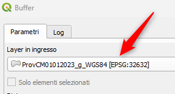{.center-img .img-50}

È anche possibile limitare l’esecuzione dell’algoritmo sul layer vettoriale per **Solo elementi selezionati**:

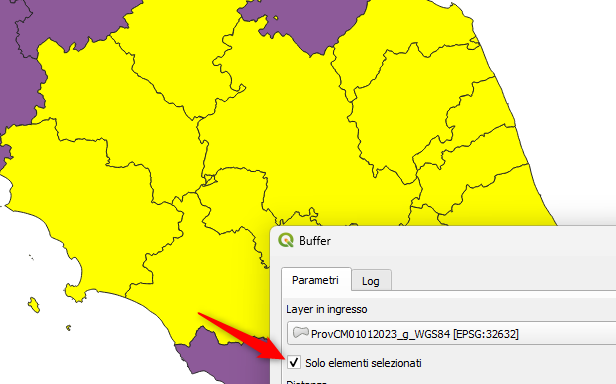{.center-img .img-70}

### Semplice tabella

Una tabella, da selezionare da un elenco di tutte quelle disponibili in QGIS. Le tabelle non spaziali vengono caricate in QGIS come layer vettoriali e utilizzano il stesso widget;

### Layer Raster

Un layer raster, da selezionare da un elenco di tutti i layer raster disponibili in QGIS. Il selettore contiene anche un pulsante … sul lato destro, per consentirti di selezionare nomi file che rappresentano layer attualmente non caricati in QGIS.

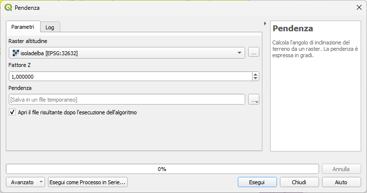{.center-img .img-90}

### Opzione

Una opzione, per scegliere da una lista di selezione di opzioni possibili.

### Valore numerico

Un valore numerico, da introdurre in una casella di rotazione. In alcuni contesti (quando il parametro si applica al layer dell’elemento e non a quello del layer), troverai al suo fianco un pulsante  **Sovrascrittura definita dai dat**i, che ti permette di aprire il _**Costruttore di Espressioni**_ e inserire un’espressione matematica per generare valori variabili per il parametro. Alcune variabili utili relative ai dati caricati in QGIS possono essere aggiunte alla tua espressione, così puoi selezionare un valore derivato da una qualsiasi di queste variabili, come la dimensione della cella di un livello o la coordinata più a nord di un altro.

### Intervallo

Un intervallo, con valori minimi e massimi da introdurre in due caselle di testo.

### Stringa di testo

Una stringa di testo, da introdurre in una casella di testo.

### Campo

Un campo, da scegliere tra la tabella degli attributi di un layer vettoriale o una singola tabella selezionata in un altro parametro.

### Sistema di riferimento delle coordinate

Un sistema di riferimento delle coordinate. Puoi selezionarlo tra quelli usati di recente dall’elenco a discesa o dalla finestra di dialogo CRS selection che appare quando clicchi sul pulsante a destra.

### Estensione

Una estensione, una casella di testo che definisce un rettangolo attraverso le coordinate degli angoli nel formato `xmin`, `xmax`, `ymin`, `ymax`. Premi il pulsante  Imposta all’estensione corrente della mappa per utilizzare l’estensione della tela della mappa. Facendo clic sulla freccia sul lato destro del selettore di valori, apparirà un menu a comparsa che offre le seguenti opzioni:

* **Calcolo dal laye**r ►: riempie la casella di testo con le coordinate del perimetro di delimitazione di un layer da selezionare tra quelli caricati.
* **Calcolo dalla mappa di layout** ►: riempie la casella di testo con le coordinate di un elemento della mappa selezionato da un layout del progetto corrente.
* **Calcolo da segnalibro** ►: riempie la casella di testo con le coordinate di un segnalibro salvato.
*  **Usa l’estensione corrente della mappa**
* **Disegna nell’Area di mappa**: la finestra dei parametri si nasconderà, così potrete cliccare e trascinare sulla mappa. Una volta definito il rettangolo di estensione, riapparirà la finestra di dialogo, contenente i valori dell’estensione nella casella di testo.

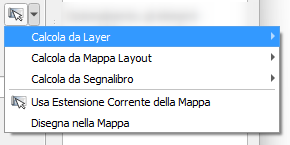{.center-img .img-50}

### Lista di elementi

Una **lista di elementi** (sia layer raster che vettoriali, tabelle, campi) da selezionare. Clicca sul pulsante … a sinistra dell’opzione per vedere una finestra di dialogo come la seguente. La selezione multipla è consentita e quando la finestra di dialogo viene chiusa, il numero di elementi selezionati viene visualizzato nel widget della casella di testo dei parametri.

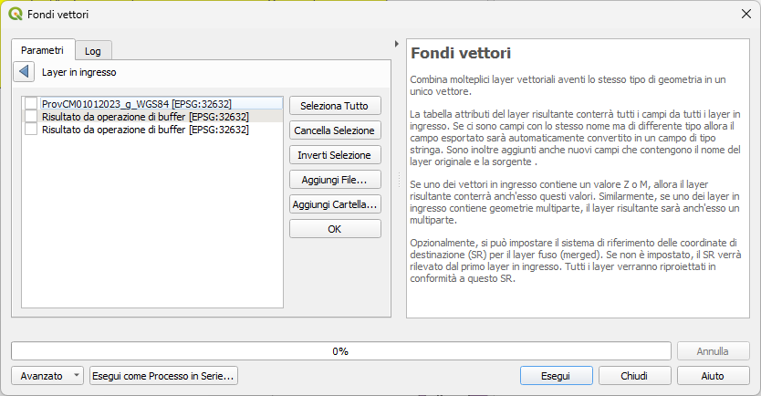{.center-img .img-90}

### Piccola Tabella

Una **piccola tabella** che può essere modificata dall’utente.

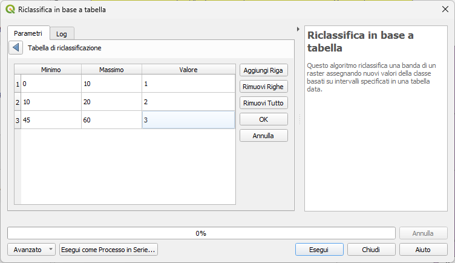{.center-img .img-90}

## Log esecuzione

Oltre alla scheda **Parametri**, esiste un’altra scheda denominata **Log**. Le informazioni fornite dall’algoritmo durante la sua esecuzione vengono scritte in questa scheda, consentendo di seguire l’esecuzione e di conoscere e avere maggiori dettagli sull’algoritmo durante la sua esecuzione. Le informazioni sull’esecuzione dell’algoritmo sono riportate anche nel pannello Visualizza | Pannelli | Pannello Messaggi di log.

Si noti che non tutti gli algoritmi scrivono informazioni nella scheda Log, e molti di essi potrebbero essere eseguiti in modo silente senza produrre alcun risultato oltre ai file finali. Controlla il pannello Messaggi di Log in questo caso.

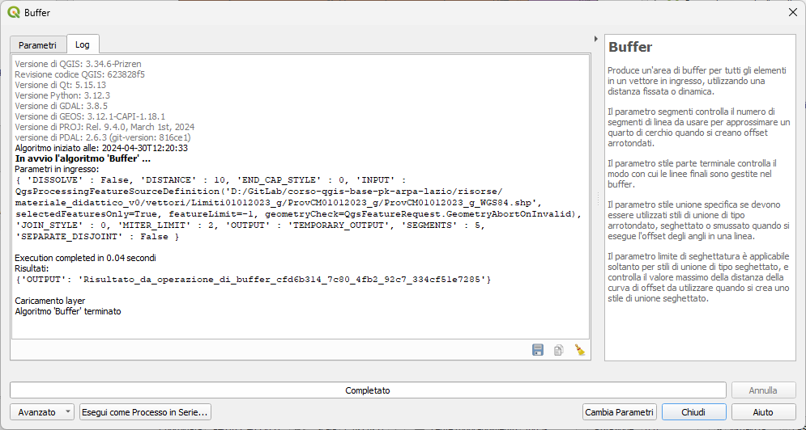{.center-img .img-90}

In fondo alla scheda **Log** troverai i pulsanti per  _**Salva Log su File**_,  _**Copia Log negli Appunti**_ e  _**Ripulisci Log**_. Queste sono particolarmente utili quando hai spuntato l’opzione _**Mantieni la finestra aperta dopo l’esecuzione dell’algoritmo**_ nelle opzioni Generale di Processing.

## Altri strumenti

Sul lato destro della finestra di dialogo troverai una breve descrizione dell’algoritmo, che ti aiuterà a capire il suo scopo e le sue regole di base. Se tale descrizione non è disponibile, il pannello di descrizione non verrà mostrato.

Per un file di aiuto più dettagliato, che potrebbe includere la descrizione di ogni parametro usato, o esempi, troverai un pulsante Aiuto in fondo alla finestra di dialogo che ti porterà al Processing algorithms documentation o alla documentazione del provider (per alcuni provider di terze parti).

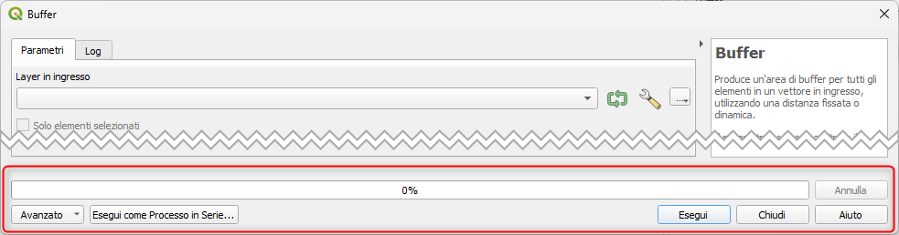{.center-img .img-90}

Il menu **Avanzato** –> fornisce funzioni per riutilizzare la configurazione definita nella finestra di dialogo senza eseguire l’algoritmo:

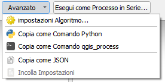{.center-img .img-95}

Quando l’esecuzione di un algoritmo termina (con successo o meno), viene visualizzato un nuovo pulsante _**Cambia Parametri**_ finché la scheda Log è attiva:

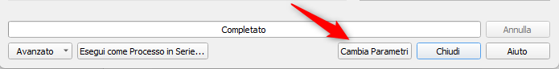{.center-img .img-70}

## Nota sulle Proiezioni

!!! Note
    L’esecuzione dell’algoritmo di processing viene sempre eseguita nel sistema di riferimento delle coordinate del layer in ingresso (SR). A causa delle funzionalità di riproiezione on-the-fly di QGIS, anche se due layer potrebbero sembrare sovrapporsi e combaciare, questo potrebbe non essere vero se le loro coordinate originali sono usate senza riproiettarle su un sistema di coordinate comune. Ogni volta che si usa più di un layer come input per un QGIS native algorithm, sia vettoriale che raster, _**i layer saranno tutti riproiettati per corrispondere al sistema di riferimento delle coordinate del primo layer in ingresso**_.

Questo è comunque meno vero per la maggior parte delle applicazioni esterne i cui algoritmi sono mostrati attraverso il framework di processing, poiché presuppongono che tutti i layer siano già in un sistema di coordinate comune e pronti per essere analizzati.

Per impostazione predefinita, la finestra di dialogo dei parametri mostrerà una descrizione del SR di ogni layer insieme al suo nome, rendendo facile selezionare i layer che condividono lo stesso SR da usare come layer in ingresso. Se non vuoi vedere queste informazioni aggiuntive, puoi disabilitare questa funzionalità nella finestra di dialogo delle impostazioni di Processing, deselezionando l’opzione Mostra SR del layer nelle caselle di selezione.

Se cerchi di eseguire un algoritmo usando come input due o più layer con SR non corrispondenti, verrà mostrato un messaggio di avvertimento. Questo avviene grazie all’opzione Avvisa prima di eseguire se i SR dei layer non corrispondono

Potrai comunque eseguire l’algoritmo, ma sappi che nella maggior parte dei casi ciò produrrà cattivi risultati, come ad esempio layer di uscita inconsistenti, proprio perché questi non sono sovrapposti.

## Log di Processing

La finestra di dialogo della cronologia contiene solo le chiamate di esecuzione, ma non le informazioni prodotte dall’algoritmo quando viene eseguito. Queste informazioni sono scritte nel log di QGIS (Visualizza | Pannelli | Messaggi di Log).

{!includes/disclaimer.md!}