---
hide:
  # - navigation
  # - toc
title: Modellatore grafico
description: Modellatore grafico
---

# Modellatore grafico

Il **modellatore grafico** consente di creare modelli complessi utilizzando un’interfaccia semplice e facile da usare. Quando si lavora con un GIS, la maggior parte delle operazioni di analisi non sono isolate, ma fanno parte di una catena di operazioni. Utilizzando del modellatore, questa catena di operazioni può essere racchiusa in un unico processo, che può essere eseguito in un secondo momento con una serie diversa di input. Indipendentemente dal numero di passaggi e di algoritmi diversi, un modello viene eseguito come un singolo algoritmo, risparmiando tempo e fatica.

Il modellatore può essere aperto dal menu Processing (Processing | Progettazione modello...).

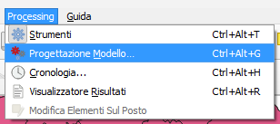{.center-img .img-50}

## Interfaccia

Nella parte superiore della finestra di dialogo, diversi menu e la barra degli strumenti Navigazione danno accesso a una serie di strumenti.

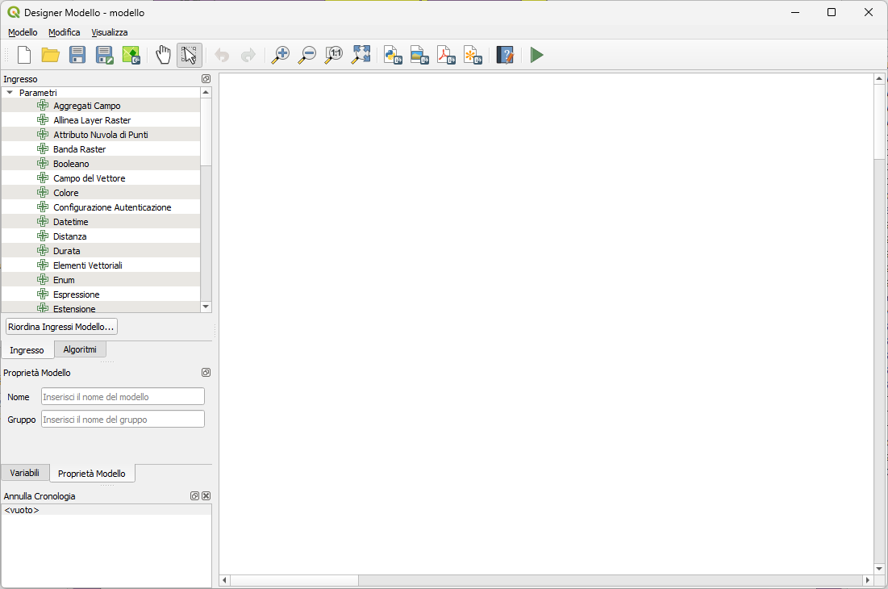{.center-img .img-90}

Nella sua parte principale, il modellatore dispone di una area di lavoro in cui è possibile costruire la struttura del modello e il flusso di lavoro che rappresenta.

## Creare un modello

La creazione di un modello comporta due passi fondamentali:

1. **Definizione degli input necessari**. Questi input saranno aggiunti alla finestra dei parametri, in modo che l’utente possa impostare i loro valori quando esegue il modello. Il modello stesso è un algoritmo, quindi la finestra dei parametri viene generata automaticamente come per tutti gli algoritmi disponibili nel framework Processing;
2. **Definizione del flusso di lavoro**. Utilizzando i dati in ingresso del modello, il flusso di lavoro viene definito aggiungendo algoritmi e selezionando come utilizzano gli input definiti o gli output generati da altri algoritmi nel modello.

### Definizione dei dati in ingresso

Il primo passo è definire gli ingressi per il modello. Si trovano nel pannello **Ingresso** sul lato sinistro della finestra del modellatore. Passando con il mouse sopra gli ingressi viene visualizzato un suggerimento con informazioni aggiuntive. Per un elenco completo dei parametri disponibili nel modellatore e la loro corrispondenza per lo scripting, leggere [Tipi di dati in ingresso e in uscita degli Algoritmi di Processing](https://docs.qgis.org/3.34/it/docs/user_manual/processing/parameters.html#processing-algs-input-output).

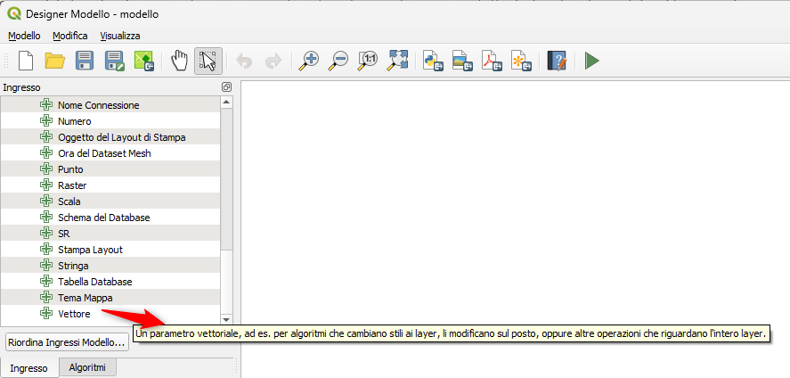{.center-img .img-90}

Quando si fa doppio clic su un elemento, viene mostrata una finestra di dialogo che permette di definire le sue caratteristiche. A seconda del parametro, la finestra di dialogo conterrà almeno un elemento (la descrizione, che è ciò che l’utente vedrà quando esegue il modello). Per esempio, quando si aggiunge un valore numerico, come si può vedere nella prossima figura, oltre alla descrizione del parametro, si deve impostare un valore predefinito e la gamma dei valori validi.

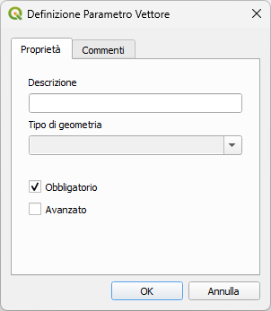{.center-img .img-50}

Puoi definire l’input come obbligatorio per il tuo modello selezionando l’opzione  Obbligatorio e selezionando Avanzato puoi impostare l’input all’interno della sezione Avanzato`. Questo è particolarmente utile quando il modello ha molti parametri e alcuni di essi non sono semplici, ma vuoi in ogni caso sceglierli.

Per ogni input aggiunto, un nuovo elemento viene aggiunto all’area grafica del modellatore.

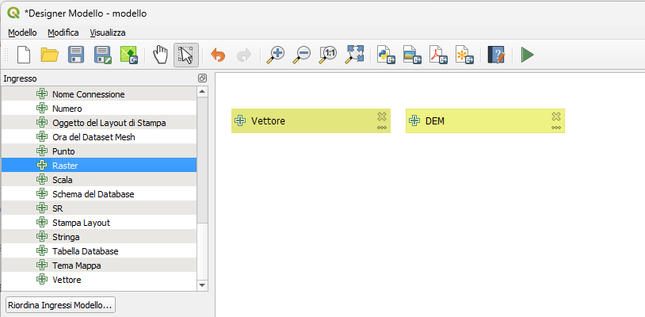{.center-img .img-90}

Puoi anche aggiungere degli input trascinando il tipo di input dalla lista e facendolo cadere nella posizione in cui vuoi che sia nell’area grafica del modellatore. Se vuoi cambiare un parametro di un input esistente, basta fare doppio clic su di esso, e la sua stessa finestra di dialogo apparirà.

Quando utilizzi un modello all’interno di un altro modello, gli input e gli output necessari vengono visualizzati nell’area di disegno.

### Definizione flusso operativo

Nel seguente esempio aggiungeremo due input e due algoritmi. Lo scopo del modello è quello di copiare i valori di elevazione da un layer raster DEM a un vettore lineare usando l’algoritmo **Drape**, e poi calcolare l’ascesa totale del layer di linee usando l’algoritmo **Climb Along Line**.

Nella scheda di Ingresso, scegli i due input come _Vettore_ per la linea e _Raster_ per il DEM. Ora siamo pronti ad aggiungere gli algoritmi al flusso di lavoro.

Gli algoritmi possono essere trovati nel pannello **Algoritmi**, raggruppati nello stesso modo in cui sono nella casella degli strumenti di Processing.

Per aggiungere un algoritmo a un modello, fai doppio clic sul suo nome o trascinalo, proprio come per gli input. Come per gli input è possibile cambiare la descrizione dell’algoritmo e aggiungere un commento. Quando si aggiunge un algoritmo, apparirà una finestra di esecuzione, con un contenuto simile a quello che si trova nel pannello di esecuzione che viene mostrato quando si esegue l’algoritmo dalla barra degli strumenti. L’immagine seguente mostra entrambe le finestre di dialogo dell’algoritmo _**Drappeggia (Imposta il valore Z da raster)**_ e _**Salita lungo la linea**_:

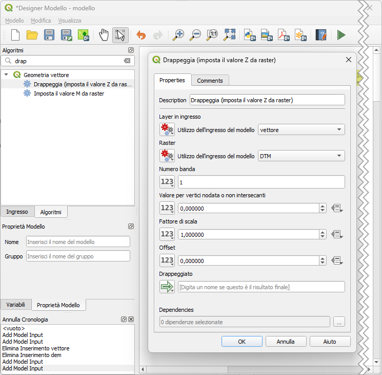{.center-img .img-90}

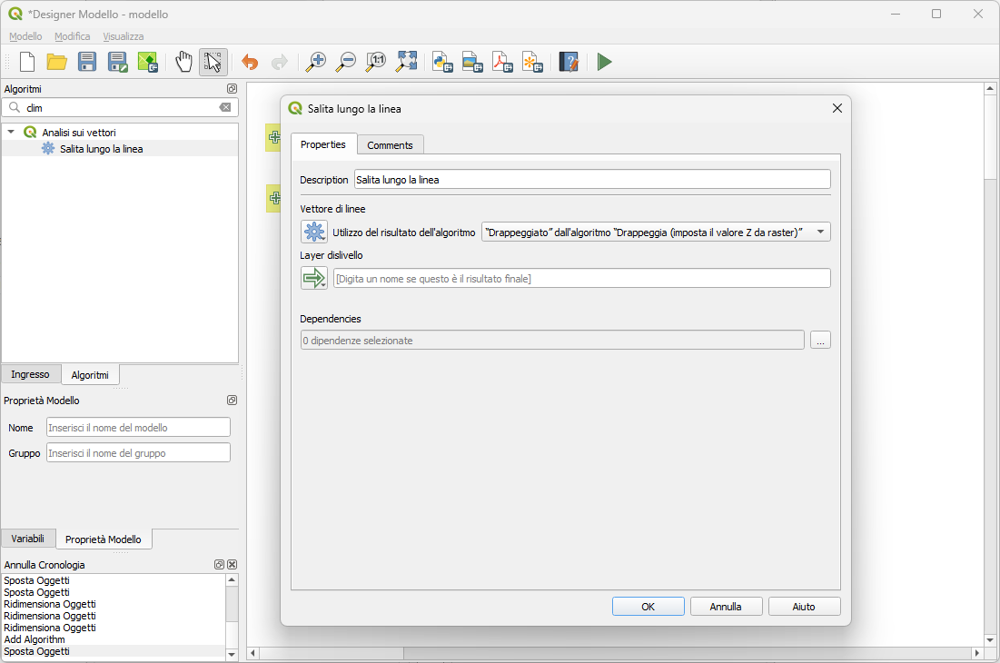{.center-img .img-90}

Ogni parametro ha un menu a discesa accanto che consente di controllare come verrà utilizzato durante il flusso di lavoro:

* 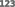 **Valore**: consente di assegnare un valore statico al parametro. A seconda del tipo di parametro, il widget consente di inserire un numero (5.0), una stringa (mytext), di selezionare i(il) layer caricati nel progetto QGIS o in una cartella, di selezionare elementi da un elenco, …
*  **Valore precalcolato**: apre la finestra di dialogo Expression Builder e ti consente di definire un’espressione per riempire il parametro. Gli input del modello e alcune altre statistiche del layer sono disponibili come variabili e sono elencati nella parte superiore della finestra di dialogo Cerca del costruttore di espressioni. L’espressione viene valutata una volta prima dell’esecuzione dell’algoritmo figlio e utilizzata durante l’esecuzione di tale algoritmo.
*  **Input del modello**: consente di utilizzare un input aggiunto al modello come parametro. Una volta cliccata, questa opzione elenca tutti gli input adatti al parametro.
*  **Algoritmo di output**: consente di utilizzare l’output di un altro algoritmo come input dell’algoritmo corrente. Come per gli input del modello, questa opzione elenca tutti gli input adatti per il parametro.
* Anche il parametro di uscita presenta le opzioni di cui sopra nel menu a discesa:
    * aggiungere output statici per gli algoritmi figli, ad esempio salvando sempre l’output di un algoritmo figlio in un geopackage o in un layer postgres predefinito

    * utilizzare valori di output basati su un’espressione per gli algoritmi figli, ad esempio generando un nome di file automatico basato sulla data odierna e salvando gli output in tale file

    * utilizzare un input del modello, ad esempio l’input del modello File/Folder, per specificare un file o una cartella di output.

    * utilizzare l’output di un altro algoritmo, ad esempio l’output dell’algoritmo Create directory (da Modeler tools)

    * un’opzione aggiuntiva  **Model Output** rende disponibile l’output dell’algoritmo nel modello. Se un layer generato dall’algoritmo deve essere usato solo come input per un altro algoritmo, non modificare questa casella di testo.

!!! Note
      Si può scegliere un parametro aggiuntivo, chiamato **Dependencies**, che non è disponibile quando si richiama l’algoritmo dalla casella degli strumenti. Questo parametro consente di definire l’ordine di esecuzione degli algoritmi, definendo esplicitamente un algoritmo come genitore di quello corrente. In questo modo, l’algoritmo genitore verrà eseguito prima di quello corrente.

Gli elementi possono essere trascinati in una posizione diversa dell’area di disegno usando lo strumento  Seleziona/Sposta elemento. Ciò è utile per rendere più chiara e intuitiva la struttura del modello. Puoi anche ridimensionare gli elementi, agendo sul loro bordo. Ciò è particolarmente utile se la descrizione dell’input o dell’algoritmo è lunga. Con l’opzione View ► Enable snapping selezionata, il ridimensionamento o lo spostamento degli elementi può essere vincolato a una griglia virtuale, per una progettazione dell’algoritmo più strutturata visivamente.

Con lo strumento Modifica | Aggiungi casella di gruppo, è possibile aggiungere una contenitore trascinabile all’area di disegno. Questa funzione è molto utile nei modelli di grandi dimensioni per raggruppare elementi correlati nell’area di disegno del modellatore e per mantenere pulito il flusso di lavoro. Ad esempio, potremmo raggruppare tutti gli input dell’esempio:

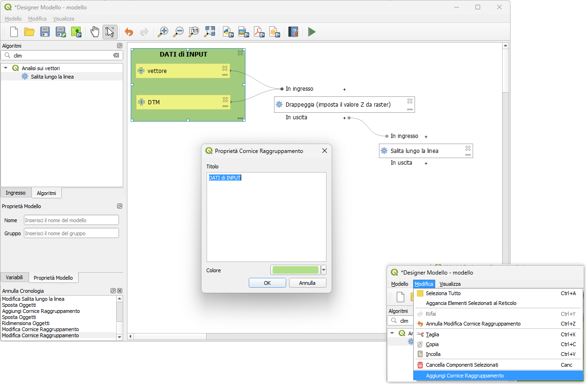{.center-img .img-90}

Per cambiare l’ordine degli input e come sono elencati nella finestra di dialogo principale del modello. In fondo al pannello Input troverai il pulsante Riordina Ingressi Modelli... e cliccando su di esso si apre una nuova finestra di dialogo che ti permette di cambiare l’ordine degli input:

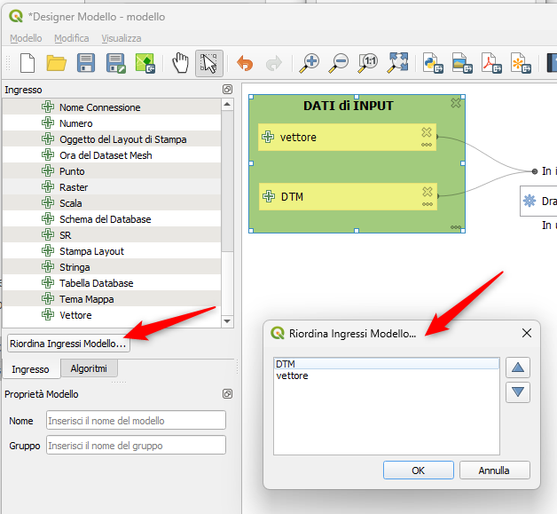{.center-img .img-70}

È possibile aggiungere **commenti** agli input o agli algoritmi presenti nel modellatore. Ciò può essere fatto accedendo alla scheda Commento dell’elemento o facendo clic con il pulsante destro del mouse. Nella stessa scheda è possibile impostare manualmente un colore per i commenti dei singoli modelli. I commenti sono visibili solo nell’area di disegno del modellatore e non nella finestra di dialogo finale dell’algoritmo; possono essere nascosti disattivando dal menu Visualizza | Mostra Commenti:

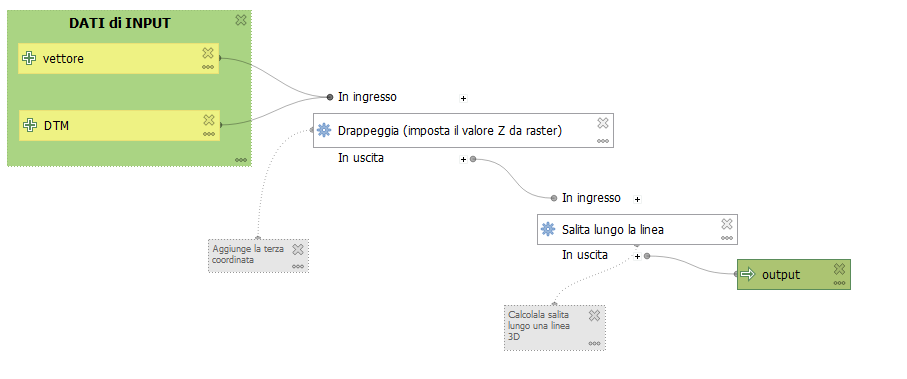{.center-img .img-90}

Per eseguire l’algoritmo in qualsiasi momento facendo clic sul pulsante  Esegui modello. Quando si usa l’editor per eseguire un modello, qualsiasi valore non predefinito viene salvato negli input. Ciò significa che eseguendo il modello in un secondo momento dall’editor, la finestra di dialogo sarà precompilata con quei valori in ogni esecuzione successiva.

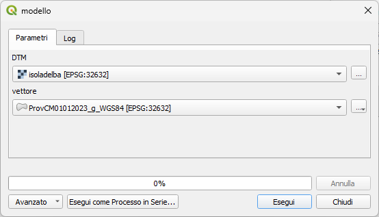{.center-img .img-70}

### Documentare modello

È possibile documentare il modello e questo può essere fatto dal modellatore stesso. Cliccando sul pulsante  **Guida Modifica Modello**, apparirà una finestra di dialogo come quella mostrata di seguito.

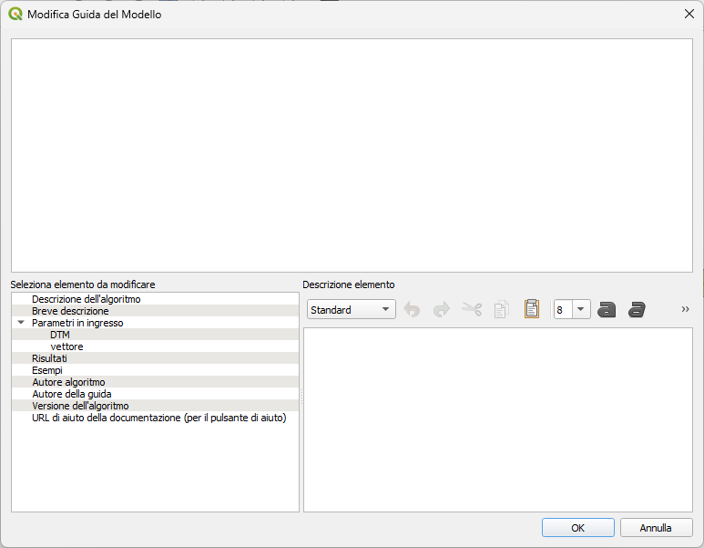{.center-img .img-90}

La guida del modello è salvata come parte del modello stesso.

## Salvataggio e caricamento di modelli

### Salvare modelli

Usa il pulsante  **Salva modello** per salvare il modello corrente e il pulsante  **Apri modello** per aprire un modello precedentemente salvato. I modelli sono salvati con l’estensione `.model3`.

Prima di salvare un modello, devi inserire un _nome_ e un _gruppo_ per esso nelle caselle di testo nella parte superiore della finestra:

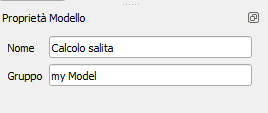{.center-img .img-40}

I modelli salvati nella cartella models (la cartella predefinita quando viene richiesto un nome di file per salvare il modello `C:\Users\nomeUtente\AppData\Roaming\QGIS\QGIS3\profiles\CorsoQGIS ARPA lazio\processing\models`) appariranno nella casella degli strumenti nel ramo corrispondente. Quando la barra degli strumenti viene attivata, cerca nella cartella models i file con estensione .model3 e carica i modelli contenuti. Poiché un modello è esso stesso un algoritmo, può essere aggiunto alla barra degli strumenti proprio come qualsiasi altro algoritmo.

I modelli possono anche essere salvati all’interno del file di progetto usando il pulsante  **Salva modello nel progetto**. I modelli salvati con questo metodo non saranno scritti come file `.model3` su disco ma saranno _incorporati_ nel file di progetto.

I modelli di progetto sono disponibili nel menu  **Modelli di progetto** della casella degli strumenti e nella voce di menu Progetto | Modelli.

I modelli caricati dalla cartella models appaiono non solo nella casella degli strumenti, ma anche nell’albero degli algoritmi nella scheda Algoritmi della finestra del modellatore. Ciò significa che si può incorporare un modello come parte di un modello più grande, proprio come altri algoritmi.

I modelli appariranno nel pannello Browser e possono essere eseguiti da lì.

### Esportare modello con script Python

Gli algoritmi di Processing possono essere chiamati dalla console Python di QGIS, e nuovi algoritmi di Processing possono essere creati usando Python. Un modo veloce per creare un tale script Python è quello di creare un modello e poi esportarlo come file Python.

Per farlo, clicca su  **Esporta come Algoritmo Scrip…** nell’area grafica del modellatore o clicca col tasto destro sul nome del modello nella barra degli strumenti di Processing e scegli  **Esporta Modello come Algoritmo Python….**

### Esportare un modello come immagine

Un modello può anche essere esportato come immagine, SVG o PDF (per scopi illustrativi) cliccando su  **Esporta come immagine**,  **Esporta come PDF** o  **Esporta come SVG**.

È possibile anche aggiornare i modelli.

{!includes/disclaimer.md!}