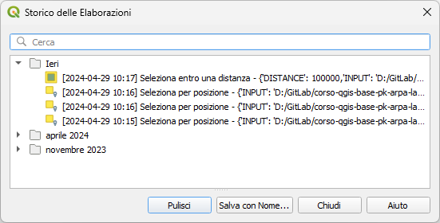
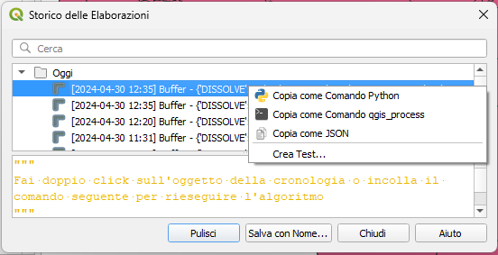

---
hide:
  # - navigation
  # - toc
title: Storico
description: La cronologia di Processing
---

# Storico

Ogni volta che si esegue un algoritmo, le informazioni sul processo vengono memorizzate nel gestore della cronologia. La data e l’ora dell’esecuzione vengono salvate, insieme ai parametri utilizzati, rendendo facile tracciare e controllare tutto il lavoro che è stato sviluppato utilizzando il framework Processing, e riprodurlo.

{.center-img .img-70}

Le informazioni sul processo vengono mantenute come espressione di riga di comando, anche se l’algoritmo è stato lanciato dal toolbox. Questo lo rende utile per coloro che stanno imparando ad usare l’interfaccia a riga di comando, poiché possono chiamare un algoritmo usando il toolbox e poi controllare l' history manager per vedere come potrebbe essere chiamato dalla riga di comando.

{.center-img .img-70}

* **Copia come Comando Python**: consente di copiare facilmente l’equivalente PyQGIS command eseguito dalla finestra di dialogo. È come il codice visualizzato sotto l’elenco dei comandi.
* **Copia come Comando qgis_process**: consente di generare facilmente il comando [qgis_process](https://docs.qgis.org/3.28/it/docs/user_manual/processing/standalone.html#processing-standalone), comprese le impostazioni dell’ambiente, come le unità di distanza, le unità di area, l’ellissoide e qualsiasi valore di parametro complicato, come gli output del GeoPackage con layer specifici.
* **Copia come JSON**: tutte le impostazioni del comando vengono copiate in un formato `JSON`, pronto per essere elaborato da qgis_process. Questo è un modo comodo per vedere il formato previsto dei comandi, anche per parametri complessi (come i parametri di interpolazione TIN). Puoi memorizzarli facilmente e ripristinarli in seguito incollando i valori in una finestra di dialogo dell’algoritmo.
* **Crea Test…** usando l’algoritmo e i parametri in questione, seguendo le istruzioni contenute nel file Processing README.

{!includes/disclaimer.md!}