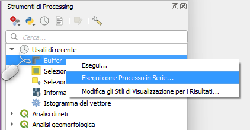
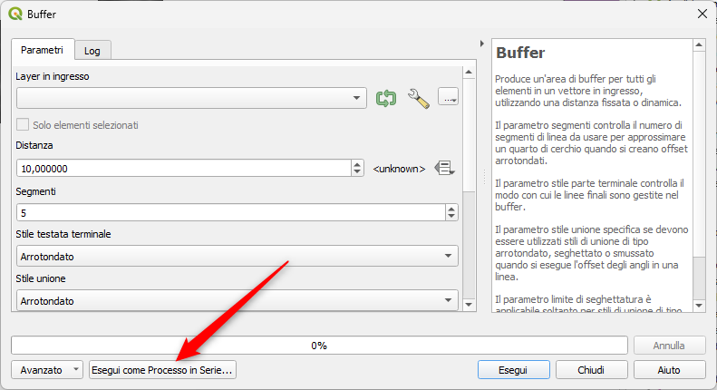
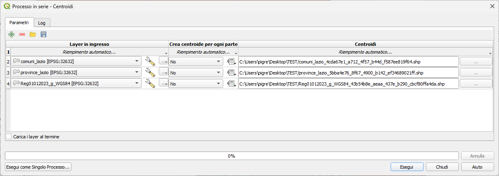
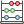
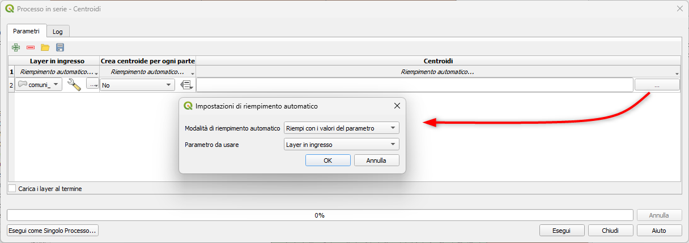
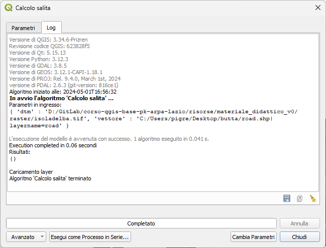

---
hide:
  # - navigation
  # - toc
title: Esecuzione in serie
description: Processi in serie
---

# Introduzione

Puoi eseguire come processi in serie tutti gli algoritmi (compresi i modelli). Questo significa che puoi eseguire ogni algoritmo usando non solo un singolo input, ma anche più di uno. Questa funzionalità è particolarmente utile quando hai bisogno di processare grandi quantità di dati; non dovrai più eseguire l’algoritmo singolarmente ogni volta.

Per eseguire un algoritmo come un processo in serie, selezionarlo e col pulsante di destra del mouse scegliere la voce _**Esegui come Processo in Serie…**_ dal menu che apparirà:


{.center-img .img-70}


Se la finestra di dialogo di esecuzione dell’algoritmo è aperta, puoi anche avviare l’interfaccia di processamento in serie da lì, facendo clic sul pulsante _**Esegui come Processo in Serie …**_:


{.center-img .img-90}


## Tabella dei parametri

L’esecuzione di un processo in serie è simile all’esecuzione singola di un algoritmo. I valori dei parametri devono essere definiti, ma in questo caso non basta un singolo valore per ogni parametro, bensì un insieme di valori, uno per ogni volta che l’algoritmo deve essere eseguito. I valori vengono introdotti utilizzando una tabella come quella mostrata di seguito, dove ogni riga rappresenta un’iterazione e le colonne i parametri dell’algoritmo:


{.center-img .img-90}


Dalla barra degli strumenti superiore puoi:

*  **Attivare modalità avanzata**: Disponibile solo quando l’algoritmo ha parametri contrassegnati come avanzati, questo pulsante consente di mostrare o nascondere tali parametri nella finestra di dialogo batch;
*  **Aggiungi riga**: aggiunge una nuova voce di elaborazione per la configurazione.
*  **Rimuovi riga(e)**: rimuove le righe selezionate dalla tabella. La selezione delle righe avviene facendo clic sul numero a sinistra e consente keyboard combination per la selezione multipla.
*  **Apri** un file di configurazione per l’elaborazione in serie
*   **Salva** la configurazione dell’elaborazione in serie in un file `.JSON` che può essere eseguito in seguito.

Per impostazione predefinita, la tabella contiene solo due righe:

* La prima riga visualizza in ogni cella un menu a discesa Riempimento automatico… ► con opzioni per riempire rapidamente le celle sottostanti. Le opzioni disponibili dipendono dal tipo di parametro;
* La seconda riga (così come quelle successive) rappresenta una singola esecuzione dell’algoritmo e ogni cella contiene il valore di uno dei parametri. È simile alla finestra di dialogo dei parametri che si visualizza quando si esegue un algoritmo dalla casella degli strumenti, ma con una disposizione diversa.

## Compilazione della tabella dei parametri

Per la maggior parte dei parametri, l’impostazione del valore è banale.

Per automatizzare la definizione del processo in serie ed evitare di riempire la tabella cella per cella, si può premere il menu **Riempimento automatico…** di un parametro e selezionare una delle seguenti opzioni per sostituire i valori nella colonna:

* **Riempimento in basso** prenderà l’input per il primo processo e lo inserirà per tutti gli altri processi;
*  **Calcola per Espressione…** consente di creare una nuova espressione QGIS da utilizzare per aggiornare tutti i valori esistenti in quella colonna. I valori dei parametri esistenti (compresi quelli di altre colonne) possono essere utilizzati all’interno dell’espressione tramite variabili. Ad esempio, l’impostazione del numero di segmenti in base alla distanza di buffer di ciascun layer:
```py
CASE WHEN @DISTANCE > 20 THEN 12 ELSE 8 END
```
* **Aggiungi Valori per Espressione… **aggiunge nuove righe usando i valori di un’espressione che restituisce un array (al contrario di Calcolo per Espressione…, che funziona solo sulle righe esistenti). Il caso d’uso previsto è quello di consentire il popolamento della finestra di dialogo in serie utilizzando serie numeriche complesse. Ad esempio, l’aggiunta di righe per un buffer batch usando l’espressione `generate_series(100, 1000, 50)` per il parametro della distanza produce nuove righe con i valori 100, 150, 200, …. 1000;
* Quando si imposta un parametro file o layer, sono disponibili più opzioni:
    * **Aggiungere file da modello…**: aggiunge nuove righe alla tabella per i file corrispondenti a un modello di file in una cartella da Cercare in. Ad esempio, `*.shp` aggiungerà all’elenco tutti i file `SHP` della cartella. Selezionare checkbox Ricerca ricorsiva per sfogliare anche le sottocartelle;
    * **Seleziona file…** individuate nel disco fisso;
    * **Aggiungi tutti i file da una cartella…**;
    * **Seleziona da Layer aperti…** nel progetto attivo;

Il parametro dei dati in uscita presenta le stesse funzionalità dell’esecuzione dell’algoritmo come processo singolo. A seconda dell’algoritmo, il risultato può essere:

* **saltato**, se la cella viene lasciata vuota;
* **salvato come layer temporaneo**: riempi la cella con TEMPORARY_OUTPUT e ricordati di spuntare la casella di controllo  Carica i layer al termine;
* **salvato come file semplice** (`.SHP`, `.GPKG`, `.XML`, `.PDF`, `.JPG`,…) il cui percorso può essere impostato con le opzioni Riempimento automatico esposte in precedenza. Ad esempio, utilizza _Calcola per Espressione…_ per impostare i nomi dei file di output su espressioni complesse come:
```py
'/home/me/stuff/buffer_' || left(@INPUT, 30) || '_' || @DISTANCE || '.shp'
```
Puoi anche digitare direttamente il percorso del file o utilizzare la finestra di dialogo di selezione dei file che appare facendo clic sul pulsante `…`. Una volta che hai selezionato il file, viene visualizzata una nuova finestra di dialogo per consentire il completamento automatico di altre celle nella stessa colonna (stesso parametro).


{.center-img .img-90}


Se si seleziona il valore predefinito (Non riempire automaticamente), il nome del file selezionato verrà inserito nella cella selezionata della tabella dei parametri. Se si seleziona una delle altre opzioni, tutte le celle sotto quella selezionata saranno riempite automaticamente in base a un criterio definito:

* **Compila con numeri**: aggiunge in modo incrementale un numero al nome del file;
* **Compila con i valori dei parametri**: puoi selezionare un parametro il cui valore nella stessa riga viene aggiunto al nome del file. Ciò è particolarmente utile per denominare gli oggetti di dati in uscita in base a quelli in entrata;

* **salvato come layer all’interno di un database**:

```
# Indica un layer all'interno di un file GeoPackage
ogr:dbname='C:/Path/To/Geopackage.gpkg' table="New_Table" (geom)

# Utilizzare "Calcola per espressione" per eseguire l'output su diversi livelli in un GeoPackage
'ogr:dbname=\'' || @project_folder || '/Buffers.gpkg\' table="' || @INPUT || '_' || @DISTANCE || '" (geom)'
```

## Esecuzione di un processo in serie

Per eseguire il processo in serie una volta che hai introdotto tutti i valori necessari, fai clic su **Esegui**. Il pannello Log si attiva e visualizza i dettagli e le fasi del processo di esecuzione. L’avanzamento del processo in serie globale sarà mostrato nella barra di avanzamento nella parte inferiore della finestra di dialogo.


{.center-img .img-90}


{!includes/disclaimer.md!}