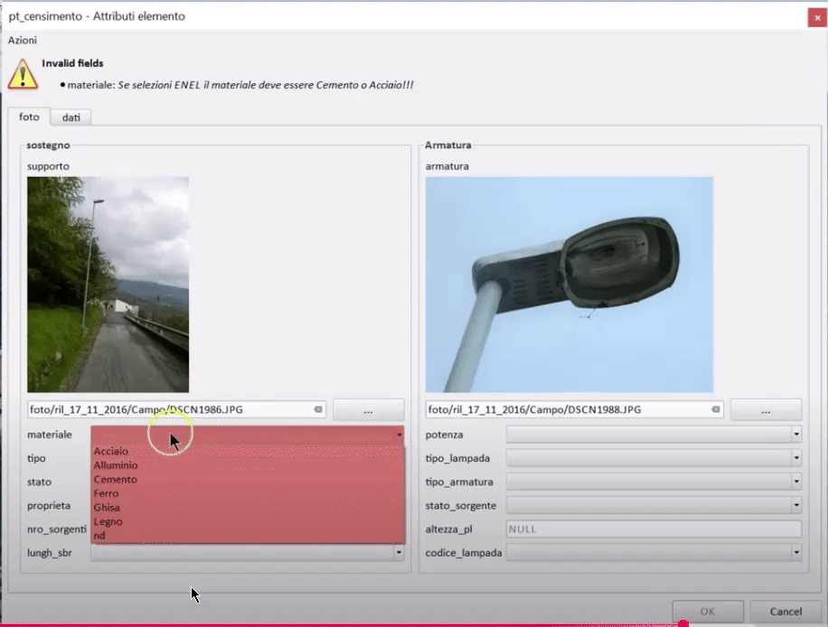

# Moduli Data Entry

I moduli data entry in QGIS permettono di creare interfacce personalizzate per l'inserimento e la modifica dei dati geografici, semplificando il processo di acquisizione dati sul campo o in ufficio.

## Che cosa sono i moduli data entry

I moduli data entry sono interfacce grafiche personalizzate che sostituiscono la tradizionale finestra di inserimento attributi di QGIS. Permettono di:

- Creare form più intuitivi e user-friendly
- Organizzare i campi in gruppi logici
- Implementare controlli di validazione
- Gestire relazioni tra tabelle
- Automatizzare l'inserimento di alcuni valori

## Configurazione di un modulo

### Accesso alle impostazioni

1. Fare clic destro sul layer nel pannello dei layer
2. Selezionare **Proprietà**
3. Andare alla scheda **Form degli attributi**

### Tipi di widget

QGIS offre diversi tipi di widget per i campi:

- **Editor di testo**: per campi testuali liberi
- **Casella di controllo**: per valori booleani
- **Elenco valori**: per valori predefiniti
- **Intervallo**: per valori numerici con slider
- **Data/ora**: per campi temporali
- **File**: per allegati
- **Foto**: per immagini georeferenziate

### Organizzazione in schede e gruppi

È possibile organizzare i campi in:

- **Schede**: per raggruppare campi correlati
- **Gruppi**: per sottocategorie all'interno delle schede
- **Colonne**: per layout multi-colonna

## Funzionalità avanzate

### Espressioni di default

Si possono definire valori predefiniti utilizzando il motore delle espressioni:

```sql
-- Data corrente
now()

-- Utente corrente
@user_full_name

-- Calcoli geometrici
$area
```

### Vincoli sui campi

È possibile impostare:

- **Non nullo**: campo obbligatorio
- **Unico**: valore univoco nel layer
- **Espressioni personalizzate**: validazioni complesse

### Relazioni e widget relazione

Per gestire relazioni one-to-many:

1. Definire la relazione nel progetto
2. Configurare il widget "Relazione" nel form padre
3. Personalizzare il form della tabella figlia

## Esempi pratici

### Modulo per rilievi urbani

Configurazione per un layer di punti di interesse:

- **Scheda Generale**: nome, tipologia, indirizzo
- **Scheda Dettagli**: descrizione, note, operatore
- **Scheda Media**: foto, documenti allegati

### Modulo per ispezioni

Per controlli periodici su infrastrutture:

- Campi obbligatori con validazione
- Elenchi a tendina per stati predefiniti
- Calcolo automatico della data di prossima ispezione

## Best practices

1. **Semplicità**: non sovraccaricare il form
2. **Logica**: raggruppare campi correlati
3. **Validazione**: implementare controlli appropriati
4. **Test**: verificare l'usabilità con gli utenti finali
5. **Documentazione**: fornire istruzioni chiare



- [drill-down](https://hfcqgis.opendatasicilia.it/esempi/drilldown_form_multiple/)

## Plugin utili

- **QField**: per moduli su dispositivi mobili
- **Input**: applicazione mobile per QGIS

I moduli data entry ben progettati migliorano significativamente l'efficienza e la qualità dell'acquisizione dati, riducendo errori e tempi di inserimento.

{!includes/disclaimer.md!}