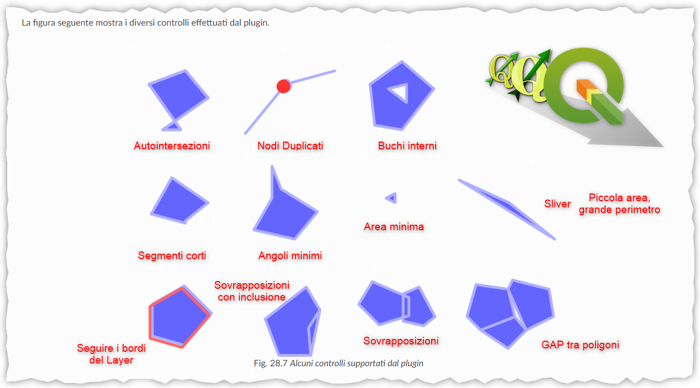

# Controllo Topologico

Il controllo topologico in QGIS permette di identificare e correggere errori geometrici nei dati vettoriali, garantendo la qualità e l'integrità spaziale dei dataset geografici.

## Che cos'è la topologia

La topologia descrive le relazioni spaziali tra le geometrie, definendo regole che i dati geografici devono rispettare per essere considerati validi. Gli errori topologici più comuni includono:

- **Gap**: spazi vuoti tra poligoni adiacenti
- **Overlap**: sovrapposizioni tra geometrie
- **Sliver**: poligoni molto sottili e allungati
- **Self-intersection**: geometrie che si intersecano con se stesse
- **Duplicate**: geometrie duplicate

## Plugin Topology Checker

{.center-img .img-60}

### Installazione e attivazione

1. Andare su **Plugin → Gestisci e installa plugin**
2. Cercare "Topology Checker"
3. Installare e attivare il plugin

### Configurazione delle regole

Il plugin permette di definire regole topologiche specifiche:

#### Regole per layer singoli

- **Must not have gaps**: i poligoni non devono avere spazi vuoti
- **Must not overlap**: i poligoni non devono sovrapporsi
- **Must not have invalid geometries**: le geometrie devono essere valide
- **Must not have multipart geometries**: non devono esserci geometrie multipart

#### Regole tra layer diversi

- **Must not overlap with**: un layer non deve sovrapporsi a un altro
- **Must be covered by**: un layer deve essere completamente contenuto in un altro
- **Must cover**: un layer deve coprire completamente un altro

### Esecuzione del controllo

1. Aprire il pannello **Topology Checker**
2. Configurare le regole desiderate
3. Fare clic su **Validate All**
4. Analizzare i risultati nella tabella degli errori

## Strumenti nativi di QGIS

### Check Validity (Processing)

Lo strumento **Check Validity** nel Processing Toolbox:

1. Apri **Processing → Toolbox**
2. Cerca "Check validity"
3. Seleziona il layer da controllare
4. Specifica il metodo di validazione (GEOS, QGIS, OGR)

### Fix Geometries

Per correggere automaticamente alcune geometrie non valide:

1. **Processing → Toolbox**
2. Cerca "Fix geometries"
3. Applica al layer con problemi

## Correzione manuale degli errori

### Strumenti di editing

- **Node Tool**: per spostare vertici singoli
- **Add Ring**: per aggiungere anelli interni
- **Delete Ring**: per rimuovere anelli
- **Reshape Features**: per ridisegnare parti di geometrie

### Tecniche di correzione

#### Per gap (spazi vuoti)

1. Selezionare le geometrie adiacenti
2. Utilizzare **Merge Features** per unirle
3. Oppure estendere manualmente i confini

#### Per overlap (sovrapposizioni)

1. Utilizzare **Split Features** per dividere
2. **Difference** per sottrarre l'area sovrapposta
3. **Union** per unire geometrie sovrapposte

#### Per sliver

1. Identificare poligoni con area molto piccola
2. Utilizzare il **Field Calculator** per calcolare area/perimetro ratio
3. Unire i sliver ai poligoni adiacenti più grandi

## Processing algorithms per la topologia

### Dissolve

Unisce geometrie adiacenti con attributi uguali:

```
Vector geometry → Dissolve
```

### Buffer (distance 0)

Risolve piccoli errori topologici:

```
Vector geometry → Buffer
Distance: 0
```

### Snap geometries

Allinea vertici vicini:

```
Vector geometry → Snap geometries to layer
```

## Best practices

### Prevenzione

1. **Impostare tolleranza di snap** appropriata durante l'editing
2. **Utilizzare strumenti CAD** per geometrie precise
3. **Validare frequentemente** durante l'editing

### Workflow di controllo

1. **Check validity** iniziale
2. **Fix geometries** automatico
3. **Topology checker** con regole specifiche  
4. **Correzione manuale** errori residui
5. **Validazione finale**

### Documentazione

- Registrare le regole topologiche applicate
- Documentare le correzioni effettuate
- Mantenere log degli errori risolti

## Plugin avanzati

- **GRASS Topology**: algoritmi avanzati per pulizia topologica
- **Geometry Checker**: controlli geometrici estesi
- **Topology Rule**: definizione regole complesse

Il controllo topologico è fondamentale per garantire la qualità dei dati geografici e il corretto funzionamento delle analisi spaziali successive.

## Fonti

- [DOC QGIS - geometry-checker-plugin](https://docs.qgis.org/testing/en/docs/user_manual/plugins/core_plugins/plugins_geometry_checker.html#geometry-checker-plugin)
- [Blog post](https://pigrecoinfinito.com/2023/04/03/geometry-checker-plugin-di-qgis/)

{!includes/disclaimer.md!}