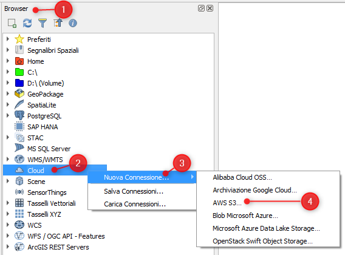
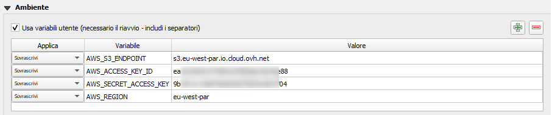
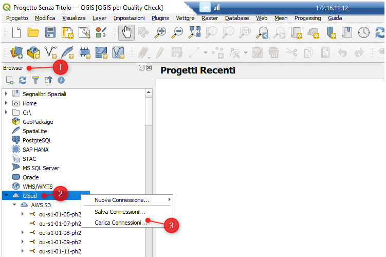
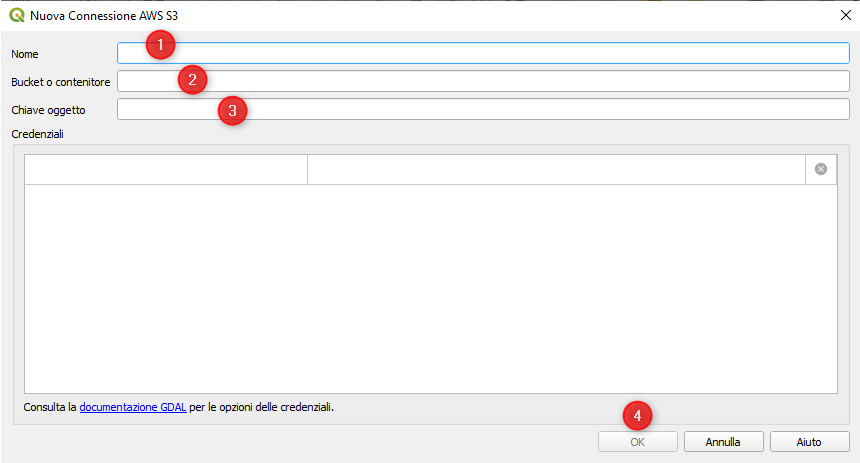

# Cloud AWS S3

Il Browser Panel di QGIS serve a connettere QGIS con il nostro PC o risorse online; tra i vari collegamenti disponibili in QGIS c'è il Cloud e in particolare risorse che seguono il Protocollo AWS S3.

{.center-img .img-60}

## Configurazione dell'accesso S3

- Impostazioni | Opzioni | Sistema --> Ambiente

{.center-img .img-60}

```
AWS_ACCESS_KEY_ID=la_tua_access_key
AWS_SECRET_ACCESS_KEY=la_tua_secret_key
AWS_S3_ENDPOINT=s3.gra.io.cloud.ovh.net
AWS_REGION=eu-west-pr
```

PS: questa configurazione è salvata nel file QGIS.ini presente nella cartella QGIS del profilo usato.

## Collegamento a Bucket S3

{.center-img .img-60}

1. Dal Browser Panel
2. Tasto destro mouse su Cloud
3. Nuova Connessione ...| AWS S3 (si aprirà la finestra di sotto)

{.center-img .img-60}

1. scrivere un nome qualunque (consigliato nome della cartella del Bucket)
2. nome cartella ricevuta da eGeos;
3. nome del file da caricare

{!includes/disclaimer.md!}