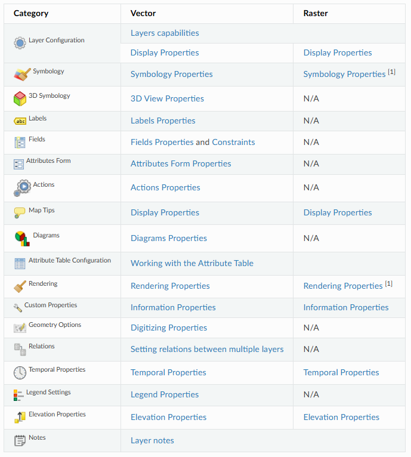
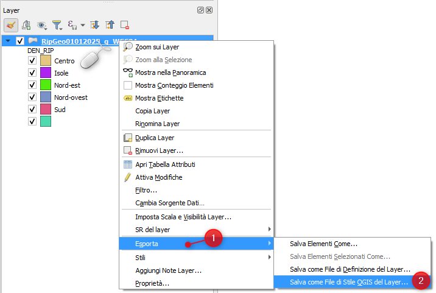
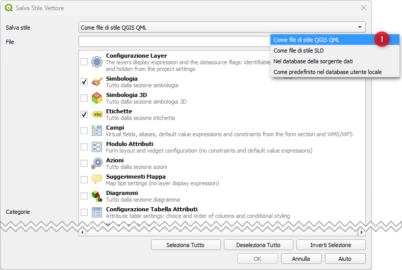
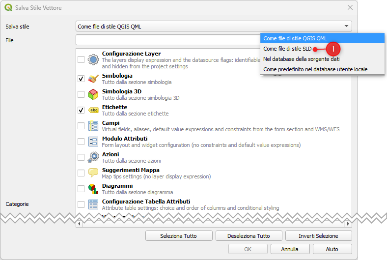
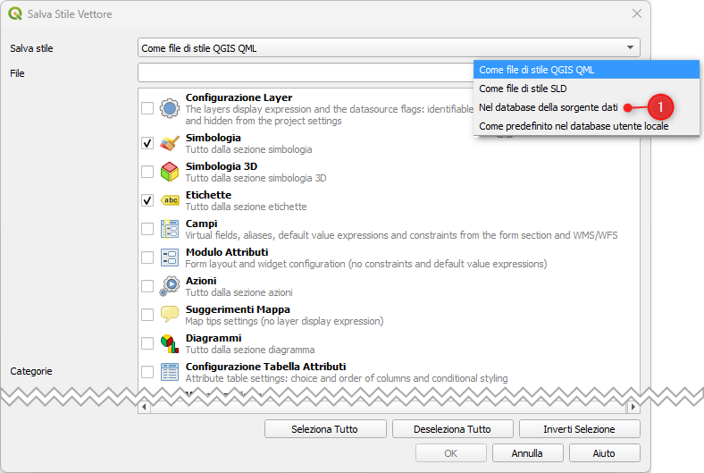
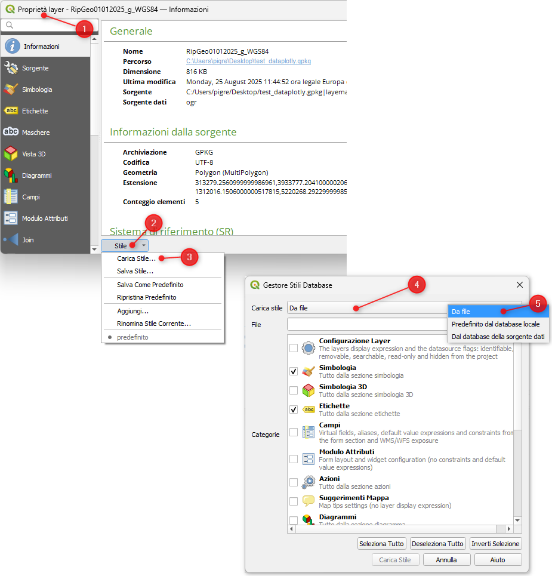
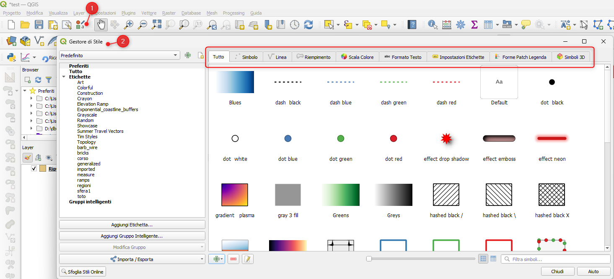

# Stili QML e SLD

La gestione degli stili in QGIS può avvenire attraverso diversi formati, principalmente QML (QGIS Markup Language) e SLD (Styled Layer Descriptor). Questi formati permettono di salvare, condividere e riutilizzare le configurazioni di visualizzazione dei layer.

## Formati di stile supportati

### QML (QGIS Markup Language)

- **Formato nativo**: specifico per QGIS
- **Funzionalità complete**: supporta tutte le caratteristiche QGIS
- **Estensione**: `.qml`
- **Uso**: condivisione all'interno dell'ecosistema QGIS

{.center-img .img-50}

### SLD (Styled Layer Descriptor)

- **Standard OGC**: formato interoperabile
- **Compatibilità**: funziona con GeoServer, MapServer, etc.
- **Estensione**: `.sld`
- **Uso**: condivisione tra diversi software GIS

## Salvare stili da layer

{.center-img .img-50}

### Esportazione QML

1. Fare clic destro sul layer
2. **Proprietà → Simbologia**
3. **Style → Save Style → QGIS Layer Style File (.qml)**
4. Specificare nome e percorso del file

{.center-img .img-50}

### Esportazione SLD

1. Nelle proprietà del layer
2. **Style → Save Style → SLD File (.sld)**
3. Scegliere versione SLD (1.0 o 1.1)

{.center-img .img-50}

### Salvataggio in database

Per PostgreSQL/PostGIS:

1. **Style → Save Style → In database**
2. Specificare nome dello stile
3. Lo stile sarà associato alla tabella

{.center-img .img-50}

## Caricare stili esistenti

### Caricamento da file

1. **Proprietà layer → Simbologia**
2. **Style → Load Style**
3. Selezionare file QML o SLD
4. **Load Style**

{.center-img .img-60}

### Caricamento da database

1. **Style → Load Style → From database**
2. Selezionare stile salvato
3. **Load Style**

## Gestione Style Manager

### Categorie disponibili

- **Symbols**: simboli per punti, linee, poligoni
- **Color ramps**: rampe di colore
- **Text formats**: formati testo per etichette
- **Label settings**: configurazioni etichettatura
- **Legend patch shapes**: forme personalizzate legenda

{.center-img .img-60}

## Stili per diversi tipi di layer

### Layer vettoriali

#### Simboli semplici
```xml
<!-- Esempio QML per poligoni -->
<qgis version="3.40">
  <renderer-v2 type="singleSymbol">
    <symbols>
      <symbol name="0" type="fill">
        <layer class="SimpleFill">
          <prop k="color" v="255,127,0,255"/>
          <prop k="outline_color" v="35,35,35,255"/>
        </layer>
      </symbol>
    </symbols>
  </renderer-v2>
</qgis>
```

#### Simboli graduati
```xml
<!-- Renderer basato su classi -->
<renderer-v2 type="graduatedSymbol">
  <attr>popolazione</attr>
  <ranges>
    <range lower="0" upper="1000" symbol="0"/>
    <range lower="1000" upper="5000" symbol="1"/>
  </ranges>
</renderer-v2>
```

### Layer raster

#### Pseudo-colore
```xml
<rasterrenderer type="singlebandpseudocolor">
  <rasterTransparency/>
  <rastershader>
    <colorrampshader>
      <item value="0" color="#d7191c"/>
      <item value="50" color="#fdae61"/>
      <item value="100" color="#2c7bb6"/>
    </colorrampshader>
  </rastershader>
</rasterrenderer>
```

## Conversione tra formati

### QML → SLD

Limitazioni nella conversione:
- Non tutte le funzionalità QML sono supportate in SLD
- Alcuni effetti grafici potrebbero andare persi
- Espressioni complesse non convertibili

Per salvare lo stili di un layer (vettoriale o raster) in formato SLD
### SLD → QML

Processo più semplice:
- SLD è più limitato di QML
- Conversione generalmente senza perdite

La gestione efficace degli stili QML e SLD è fondamentale per mantenere coerenza visuale nei progetti e facilitare la collaborazione tra utenti e organizzazioni.

## Fonti

- [DOC QGIS:Gestione degli stili personalizzati](https://docs.qgis.org/3.40/en/docs/user_manual/introduction/general_tools.html#managing-custom-styles)
- [Plugin SLD4raster](https://plugins.qgis.org/plugins/SLD4raster/)


{!includes/disclaimer.md!}