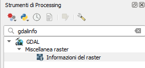
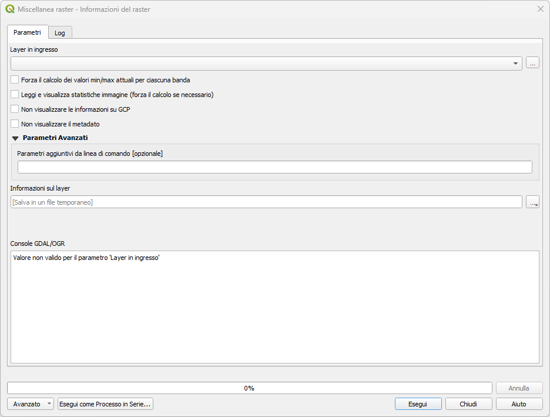

# gdalinfo da Processing

GDAL (Geospatial Data Abstraction Library) è una libreria fondamentale per la gestione dei dati geografici. Il comando `gdalinfo` fornisce informazioni dettagliate sui dataset raster ed è accessibile direttamente dal Processing Toolbox di QGIS.

## Che cos'è gdalinfo

`gdalinfo` è un utility GDAL che estrae e visualizza metadati completi di file raster, incluse:

- **Informazioni geometriche**: dimensioni, sistema di riferimento, trasformazioni
- **Struttura dati**: numero bande, tipo di dato, valori NoData
- **Metadati**: informazioni del sensore, data acquisizione, elaborazioni
- **Statistiche**: minimo, massimo, media, deviazione standard per banda
- **Piramidi**: presenza di overview/piramidi

## Accesso tramite Processing

### Localizzazione strumento

{.center-img .img-40}

1. Aprire **Processing → Toolbox**
2. Espandere **GDAL → Raster miscellaneous**
3. Cercare **gdalinfo**

### Interfaccia Processing

{.center-img .img-70}

Lo strumento presenta questi parametri:

- **Layer in Ingresso**: layer raster da analizzare
- **Force computation of min/max**: calcolo statistiche complete
- **Read and display image structure metadata**: metadati struttura
- **Suppress GCP info**: omettere punti di controllo
- **Output**: file di testo con risultati

## Esecuzione e interpretazione risultati

### Esecuzione base

1. Selezionare il layer raster
2. Specificare file di output (opzionale)
3. **Run**

### Interpretazione output

#### Informazioni generali
```
Driver: GTiff/GeoTIFF
Files: /path/to/raster.tif
Size is 1024, 1024
```

#### Sistema di riferimento
```
Coordinate System is:
PROJCRS["WGS 84 / UTM zone 32N",
    BASEGEOGCRS["WGS 84",
        ...
    ],
    CONVERSION["UTM zone 32N",
        ...
    ]
```

#### Trasformazione georeferenziazione
```
GeoTransform =
  (500000.0, 10.0, 0.0, 5000000.0, 0.0, -10.0)
```

Dove:
- `500000.0`: coordinata X angolo superiore sinistro
- `10.0`: risoluzione pixel X
- `0.0`: rotazione asse X
- `5000000.0`: coordinata Y angolo superiore sinistro
- `0.0`: rotazione asse Y
- `-10.0`: risoluzione pixel Y (negativa)

#### Informazioni bande
```
Band 1 Block=1024x1 Type=Float32, ColorInterp=Gray
  NoData Value=-9999
  Metadata:
    STATISTICS_MAXIMUM=1247.8
    STATISTICS_MEAN=456.23
    STATISTICS_MINIMUM=12.1
    STATISTICS_STDDEV=234.56
```

## Parametri avanzati

### Force computation of min/max

Calcola statistiche complete per ogni banda:
```
-stats
```

### Read metadata

Visualizza metadati estesi:
```
-mm -stats -hist
```

### Suppress GCP info

Omette informazioni sui Ground Control Points:
```
-nogcp
```

## Utilizzi pratici

### Controllo qualità dati

Prima di elaborare dati raster:

1. **Verifica georeferenziazione**: sistema coordinate corretto
2. **Controllo dimensioni**: risoluzione appropriata
3. **Analisi valori**: range dati ragionevole
4. **NoData check**: gestione valori mancanti

### Debugging problemi

Quando i raster non si visualizzano correttamente:

- **Projection mismatch**: sistemi coordinate diversi
- **Data corruption**: valori anomali o fuori range
- **Format issues**: problemi nel formato file

gdalinfo (ogrinfo per i vettori) è strumento essenziale per diagnostica e controllo qualità dei dati raster in qualsiasi workflow GIS professionale.

{!includes/disclaimer.md!}