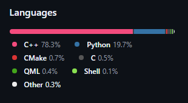
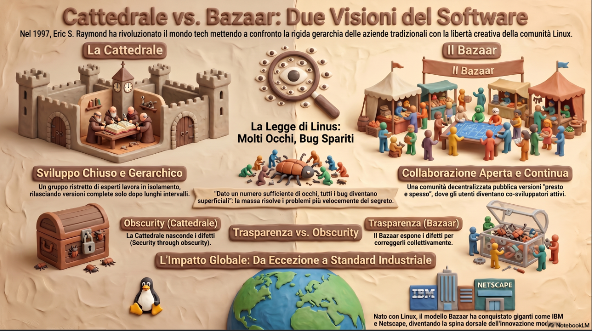
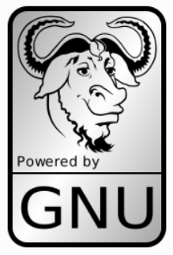
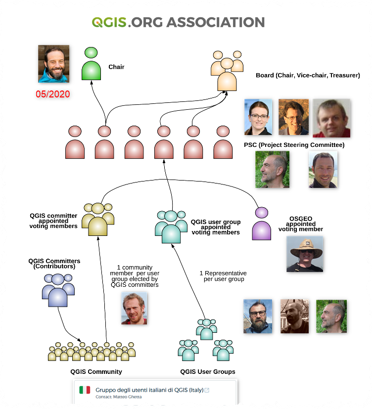
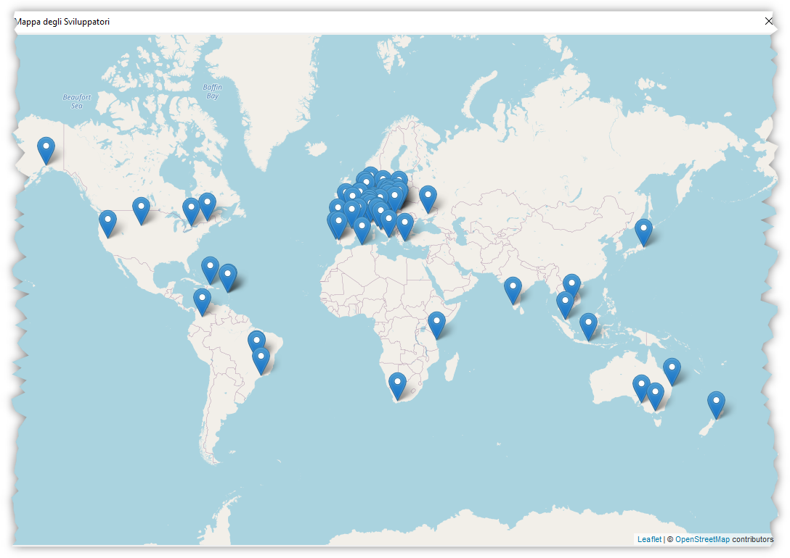
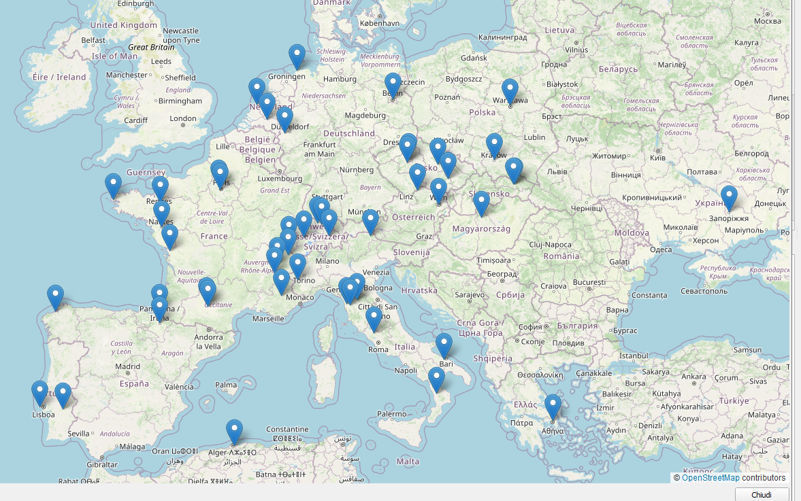
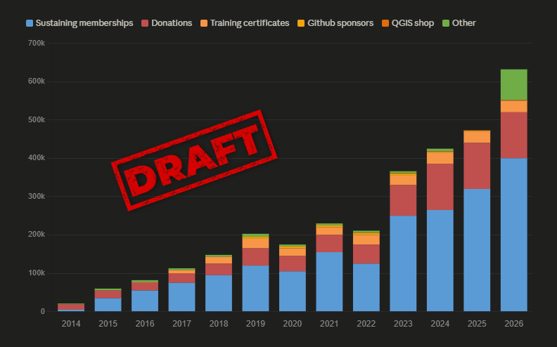

---
hide:
  # - navigation
  # - toc
title: Breve Introduzione
description: Breve Introduzione a QGIS 3.x
---

# Breve Introduzione a QGIS 3

!!! info "Benvenuti nel mondo di QGIS! :fontawesome-solid-earth-europe:"
    Scopriamo insieme uno dei GIS Open Source più potenti e utilizzati al mondo, dalle sue origini fino alle funzionalità più avanzate.

## :fontawesome-solid-timeline: Storia ed Evoluzione di QGIS

**QGIS** ha una storia affascinante di crescita e innovazione continua. Dalla sua nascita come semplice visualizzatore fino a diventare una piattaforma GIS completa.

-   :fontawesome-solid-seedling: **2002 - Gli Inizi**

    ---

    Nasce come visualizzatore di dati PostGIS, creato da Gary Sherman

-   :fontawesome-solid-handshake: **2007 - OSGeo**

    ---

    Entra ufficialmente in [OSGeo](https://www.osgeo.org/) come progetto incubato

-   :fontawesome-solid-rocket: **2009 - Versione 1.0**

    ---

    Prima release stabile con interfaccia utente completa

-   :fontawesome-solid-star: **2013 - Versione 2.0**

    ---

    Introduce il browser dei dati e miglioramenti significativi

-   :fontawesome-solid-trophy: **2018 - Versione 3.0**

    ---

    Completa riscrittura con Python 3 e Qt5

-   :fontawesome-solid-forward: **2026 - Versione 4.0**

    ---

    Prossima release con Qt6 e nuove funzionalità ([info](https://blog.qgis.org/2025/04/17/qgis-is-moving-to-qt6-and-launching-qgis-4-0/))

{.center-img .img-60}

!!! tip "Approfondimento"
    Per saperne di più sulla storia di QGIS: [Wikipedia QGIS](https://it.wikipedia.org/wiki/QGIS)

## :fontawesome-solid-globe: GIS - Geographic Information System

!!! question "Che cos'è un GIS?"
    Il **Geographic Information System** (GIS) è un sistema informativo computerizzato che permette la gestione completa di informazioni geografiche.

Il GIS combina **dati geografici** e **attributi** per creare un sistema potente di analisi territoriale.

### :fontawesome-solid-gears: Funzioni Principali del GIS

=== ":fontawesome-solid-download: Acquisizione"

    * Importazione di dati da diverse fonti
    * Scanner, GPS, sensori remoti
    * Database esistenti e servizi web

=== ":fontawesome-solid-database: Gestione"

    * Archiviazione in database spaziali
    * Organizzazione gerarchica dei layer
    * Controllo qualità e validazione

=== ":fontawesome-solid-chart-line: Analisi"

    * Analisi spaziale e geostatistica
    * Overlay e buffer analysis
    * Modellazione territoriale

=== ":fontawesome-solid-eye: Visualizzazione"

    * Mappe tematiche e cartografia
    * Rappresentazioni 2D e 3D
    * Animazioni temporali

=== ":fontawesome-solid-share-nodes: Condivisione"

    * Web mapping e servizi OGC
    * Atlanti digitali e report
    * Piattaforme collaborative

!!! example "Applicazioni Pratiche"
    **Urbanistica** • **Ambiente** • **Agricoltura** • **Trasporti** • **Emergenze** • **Archeologia** • **Marketing territoriale**

## :fontawesome-brands-linux: QGIS - Il GIS Desktop Open Source e Libero

{.center-img .img-80}

!!! success "QGIS in Breve"
    **Quantum GIS (QGIS)** è la piattaforma GIS Desktop open-source più utilizzata al mondo per la gestione completa di dati geografici.

### :fontawesome-solid-star: Caratteristiche Principali

-   :fontawesome-solid-screwdriver-wrench: **Funzionalità Complete**

    ---

    **Gestione** • **Visualizzazione** • **Modifica** • **Analisi** • **Stampa**

    Tutto quello che serve per lavorare con i dati geografici

-   :fontawesome-solid-desktop: **Multipiattaforma**

    ---

    :fontawesome-brands-linux: **Linux** • :fontawesome-brands-apple: **macOS** • :fontawesome-brands-windows: **Windows**

    Supporta tutti i principali sistemi operativi

-   :fontawesome-solid-database: **Formati Universali**

    ---

    **Vettori** • **Raster** • **Database** • **Servizi Web**

    Compatibilità con centinaia di formati

-   :fontawesome-solid-puzzle-piece: **Estensibilità**

    ---

    **Plugin C++** • **Plugin Python** • **Personalizzazioni**

    Funzionalità espandibili all'infinito

-   :fontawesome-solid-users: **Community Driven**

    ---

    **Sviluppatori volontari** • **Release ogni 4 mesi** • **Aggiornamenti mensili**

    Sviluppo attivo e continuo

-   :fontawesome-solid-language: **Multilingua**

    ---

    **40+ lingue supportate** • **Interfaccia localizzata** • **Documentazione tradotta**

    Accessibile a utenti globali

### :fontawesome-solid-code: Dettagli Tecnici

!!! info "Architettura"
    * **Linguaggio core**: C++ per performance ottimali
    * **Interfaccia grafica**: Qt framework per cross-platform
    * **Licenza**: GNU Public License (GPL)
    * **Prossimo upgrade**: Qt 6 con QGIS 4.0 (febbraio 2026)

{.center-img .img-60}

## :fontawesome-solid-code-branch: Open Source - La Forza della Collaborazione

{.center-img .img-80}

!!! abstract "Cos'è l'Open Source?"
    Il termine **open source** (sorgente aperta) indica un modello di sviluppo software dove il **codice sorgente è pubblicamente accessibile**, permettendo studio, modifiche e miglioramenti collaborativi.

### :fontawesome-solid-heart: I Vantaggi dell'Open Source

-   :fontawesome-solid-eye: **Trasparenza**

    ---

    Il codice è visibile e verificabile da tutti

    Nessuna "scatola nera" o funzionalità nascoste

-   :fontawesome-solid-users-gear: **Collaborazione Globale**

    ---

    Sviluppatori da tutto il mondo contribuiscono

    Miglioramenti continui e innovazione rapida

-   :fontawesome-solid-shield-halved: **Sicurezza**

    ---

    Bug e vulnerabilità individuati rapidamente

    Community attiva nel testing e debugging

-   :fontawesome-solid-coins: **Economicità**

    ---

    Software gratuito e senza costi di licenza

    Investimento nelle competenze, non nelle licenze

-   :fontawesome-solid-wrench: **Personalizzazione**

    ---

    Modificabile secondo le proprie esigenze

    Nessuna dipendenza da vendor specifici

-   :fontawesome-solid-graduation-cap: **Apprendimento**

    ---

    Opportunità educative e formative

    Accesso alle migliori pratiche di programmazione

## :fontawesome-solid-scale-balanced: GNU General Public License (GPL)

{.center-img .img-40}

{.center-img .img-40}

!!! note "La Licenza che Garantisce la Libertà"
    La **GNU GPL** è una licenza **copyleft** creata da Richard Stallman nel 1989. A differenza di altre licenze, **garantisce che il software rimanga sempre libero**, preservando le quattro libertà fondamentali anche nelle versioni derivative.

### :fontawesome-solid-key: Le Quattro Libertà Fondamentali

-   :fontawesome-solid-play: **Libertà 0 - Esecuzione**

    ---

    **Usare il programma come si desidera**

    Per qualsiasi scopo, senza restrizioni d'uso

-   :fontawesome-solid-magnifying-glass: **Libertà 1 - Studio**

    ---

    **Studiare e modificare il programma**

    Accesso completo al codice sorgente

-   :fontawesome-solid-share: **Libertà 2 - Distribuzione**

    ---

    **Ridistribuire copie liberamente**

    Aiutare altri condividendo il software

-   :fontawesome-solid-upload: **Libertà 3 - Miglioramento**

    ---

    **Distribuire versioni migliorate**

    Benefici per tutta la comunità

!!! warning "Copyleft: La Protezione della Libertà"
    Il **copyleft** è l'opposto del copyright: invece di limitare, **protegge la libertà** garantendo che ogni versione derivata mantenga le stesse libertà dell'originale.

## :fontawesome-solid-layer-group: L'Ecosistema GIS Open Source

!!! info "OSGeo Live"
    Scopri tutti i software GIS open source su [OSGeo Live](https://live.osgeo.org/en/presentation.html#/) - una distribuzione completa con oltre 50 applicazioni geospaziali.

### :fontawesome-solid-star: I Principali GIS Desktop Open Source

-   :fontawesome-solid-seedling: **GRASS GIS**

    ---

    Sistema di analisi geografica potentissimo

    Specializzato in elaborazioni raster avanzate

    [Sito ufficiale :fontawesome-solid-arrow-up-right-from-square:](https://grass.osgeo.org/){target="_blank"}

-   :fontawesome-solid-mountain: **SAGA GIS**

    ---

    System for Automated Geoscientific Analyses

    Eccellente per analisi geomorfologiche

    [Sito ufficiale :fontawesome-solid-arrow-up-right-from-square:](http://www.saga-gis.org/){target="_blank"}

-   :fontawesome-solid-map: **gvSIG Desktop**

    ---

    GIS completo sviluppato in Java

    Forte supporto per CAD e topologia

    [Sito ufficiale :fontawesome-solid-arrow-up-right-from-square:](http://www.gvsig.com/it/prodotti/gvsig-desktop){target="_blank"}

-   :fontawesome-solid-chart-area: **uDIG**

    ---

    User-friendly Desktop Internet GIS

    Ottimo per servizi web e database

    [Sito ufficiale :fontawesome-solid-arrow-up-right-from-square:](http://udig.refractions.net/){target="_blank"}

-   :fontawesome-solid-vector-square: **OpenJUMP GIS**

    ---

    GIS Java con interfaccia intuitiva

    Ideale per editing vettoriale

    [Sito ufficiale :fontawesome-solid-arrow-up-right-from-square:](http://www.openjump.org/){target="_blank"}

!!! tip "Complementarità"
    Ogni GIS ha i suoi punti di forza. Molti professionisti usano **QGIS come piattaforma principale** integrandolo con altri software per analisi specifiche.

## :fontawesome-solid-earth-americas: La Community Globale QGIS

La forza di QGIS risiede nella sua **community globale** di sviluppatori, contributori e utenti che collaborano per migliorare continuamente il software.

{.center-img .img-80}

[Organizzazione QGIS :fontawesome-solid-arrow-up-right-from-square:](https://www.qgis.org/community/organisation/){target="_blank"}

### :fontawesome-solid-users: Sviluppatori nel Mondo

{.center-img .img-80}

!!! success "Community Internazionale"
    QGIS beneficia del contributo di **sviluppatori da tutti i continenti**, creando un software veramente globale e inclusivo.

### :fontawesome-solid-location-dot: Sviluppatori in Europa

{.center-img .img-80}

!!! info "L'Europa come Hub di Sviluppo"
    L'Europa rappresenta uno dei **principali centri di sviluppo QGIS**, con contributi significativi da Germania, Svizzera, Francia, Italia e altri paesi.

### :fontawesome-solid-code: I Principali Sviluppatori QGIS

[Contributi individuali :fontawesome-solid-arrow-up-right-from-square:](https://www.qgis.org/community/contributors/individuals/)

-   {.center-img .img-20}

    **Gary Sherman**

    ---

    **Fondatore di QGIS** (2002)

    Creatore originale del progetto, visionario dell'ecosistema QGIS

    [:fontawesome-brands-linkedin: LinkedIn](https://www.linkedin.com/in/gary-sherman-76940271/){target="_blank"}

-   {.center-img .img-20}

    **Tim Sutton**

    ---

    **Lead Developer & Community Manager**

    Guida tecnica e coordinamento della community internazionale

    [:fontawesome-brands-github: GitHub](https://github.com/timlinux){target="_blank"}

-   {.center-img .img-20}

    **Matthias Kuhn**

    ---

    **Core Developer & OPENGIS.ch**

    Specialista in database, editing e performance

    [:fontawesome-brands-github: GitHub](https://github.com/m-kuhn){target="_blank"}

-   {.center-img .img-20}

    **Nyall Dawson**

    ---

    **Senior Developer & North Road**

    Esperto in cartografia, simbolizzazione e processing

    [:fontawesome-brands-github: GitHub](https://github.com/nyalldawson){target="_blank"}

-   {.center-img .img-20}

    **Martin Dobias**

    ---

    **Rendering Engine Expert**

    Architetto del motore di rendering e visualizzazione 3D

    [:fontawesome-brands-github: GitHub](https://github.com/wonder-sk){target="_blank"}

-   {.center-img .img-20}

    **Jürgen Fischer (jef)**

    ---

    **Release Manager & Infrastructure**

    Coordinatore delle release e gestione infrastruttura tecnica

    [:fontawesome-brands-github: GitHub](https://github.com/jef-n){target="_blank"}

-   {.center-img .img-20}

    **Alessandro Pasotti (elpaso)**

    ---

    **Server & Web Services Expert**

    Specialista QGIS Server, servizi web OGC e architetture enterprise

    [:fontawesome-brands-github: GitHub](https://github.com/elpaso){target="_blank"}

-   {.center-img .img-20}

    **Victor Olaya**

    ---

    **Processing Framework Creator**

    Creatore del framework Processing e algoritmi di analisi spaziale

    [:fontawesome-brands-github: GitHub](https://github.com/volaya){target="_blank"}

-   {.center-img .img-20}

    **Anita Graser**

    ---

    **Spatial Analysis & Data Visualization Expert**

    Esperta in analisi spaziale, visualizzazione dati e mobilità

    [:fontawesome-brands-github: GitHub](https://github.com/anitagraser){target="_blank"}

!!! success "Team Internazionale"
    Oltre ai core developer, QGIS beneficia del contributo di **centinaia di sviluppatori** da tutto il mondo che contribuiscono regolarmente al codice, alla documentazione e alle traduzioni.
    
    [Scopri tutti i contributori :fontawesome-solid-arrow-up-right-from-square:](https://www.qgis.org/community/contributors/){target="_blank"}

### :fontawesome-solid-handshake: Come Contribuire

-   :fontawesome-solid-code: **Sviluppo**

    ---

    Contributi al codice core, plugin, documentazione

-   :fontawesome-solid-bug: **Testing & Bug Report**

    ---

    Segnalazione bug e test delle release candidate

-   :fontawesome-solid-language: **Traduzioni**

    ---

    Localizzazione interfaccia e documentazione

-   :fontawesome-solid-euro-sign: **Finanziamenti**

    ---

    Donazioni e sponsorizzazioni per lo sviluppo

-   :fontawesome-solid-graduation-cap: **Educazione**

    ---

    Corsi, tutorial, materiali didattici

-   :fontawesome-solid-comments: **Supporto Community**

    ---

    Aiuto negli forum e nelle mailing list

---

## :fontawesome-solid-chart-line: Google Trends

!!! info "Cos'è Google Trends?"
    **Google Trends** è uno strumento gratuito di Google che analizza la **popolarità delle ricerche** effettuate dagli utenti nel motore di ricerca. I grafici mostrano **quanto spesso** un termine viene cercato rispetto al volume totale delle ricerche in un periodo e area geografica specifici.

!!! warning "Attenzione: Non Misura la Qualità"
    I dati mostrano solo la **frequenza delle ricerche**, non:
    
    * ✗ La qualità del software
    * ✗ Il numero effettivo di utenti
    * ✗ L'uso professionale vs amatoriale
    * ✗ La soddisfazione degli utenti

!!! tip "Cosa Significano i Valori"
    * **100** = massimo interesse relativo nel periodo
    * **50** = metà dell'interesse rispetto al picco
    * **0** = volume di ricerca insufficiente

### :fontawesome-solid-globe: Analisi Comparativa Software GIS

Confrontiamo l'interesse di ricerca tra i principali software GIS negli **ultimi 10 anni (2016-2026)**:

- **QGIS** - Free e Open Source
- **ArcGIS PRO** - _Proprietario_
- **GeoMedia** - _Proprietario_
- **Global Mapper** - _Proprietario_

### Mondo

### Italia

## Evoluzione finanziaria

{.center-img .img-80}

fonte:<https://qgis.org/community/foundation/finance/>

{!includes/disclaimer.md!}
