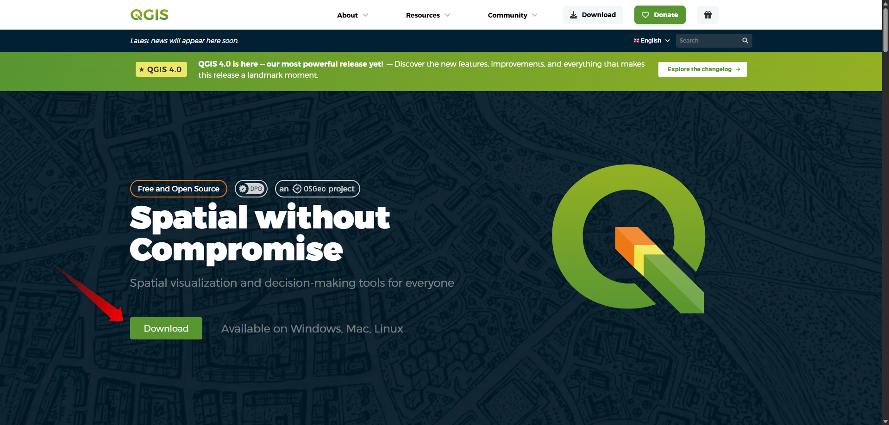
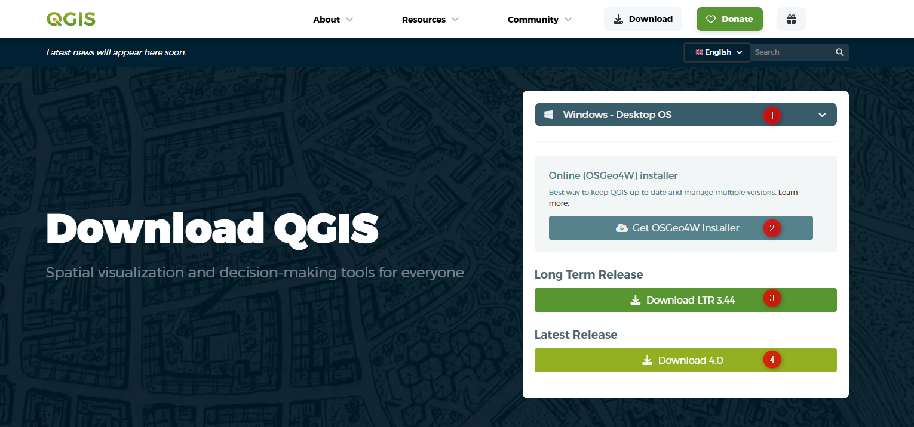
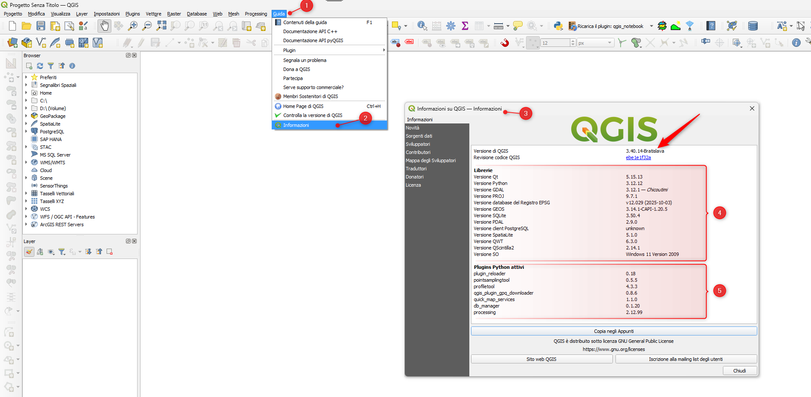
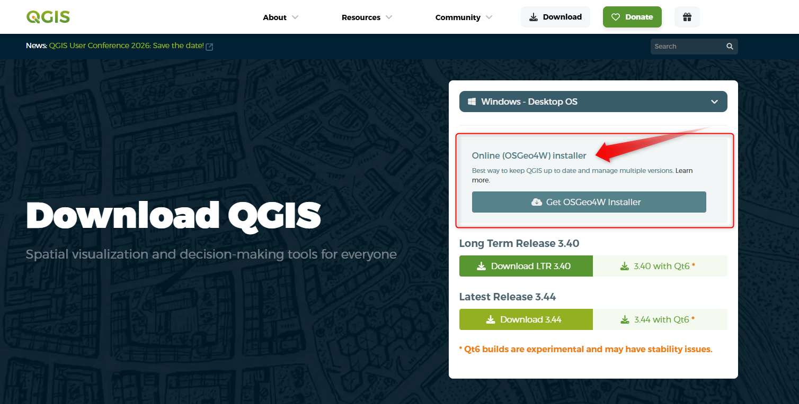

---
hide:
  # - navigation
  # - toc
title: Installazione
description: Installazione di QGIS 3.x
---

# Installazione di QGIS 3

## Introduzione

Per installare **QGIS** in ambiente _Windows_ è possibile seguire due vie:

1. Versione `Stand-alone installer` (_`*.MSI`_);
2. Versione `Network Installer avanzata` (_OSGeo4W64 v2_);

### PRO avanzata

È semplice aggiornare e passare alle nuove versioni

### CONTRO standalone

Non è possibile aggiornare e occorre disinstallare e reinstallare le nuove versioni.

## Versione Stand-alone installer

[sito](https://qgis.org/it/site/) per il download file eseguibile - `https://qgis.org/it/site/`

{.center-img .img-80}

### scaricare la versione di interessa

{.center-img .img-80}

1. al punto (1) è possibile scegliere il sistema operativo (Win, macOS, Linux. ecc...); 
2. al punto (2) è possibile scaricare un piccolo eseguibile per la versione avanzata;
3. al punto (3) è possibile scaricare l'eseguibile (`*.msi`) per la versione stand-alone a lungo termine (LTR) con Qt5;
4.  al punto (4) è possibile scaricare l'eseguibile (`*.msi`) per la nuova versione corrente stand-alone con Qt6.

## Come installare la stand-alone in Windows

Per installare la versione stand-alone di QGIS su Windows 11, seguire questi passaggi:

1. Aprire il file scaricato e avviare l'installazione;
2. Seguire la procedura guidata di installazione:
  - Accettare i termini di licenza;
  - Scegliere la cartella di destinazione (o lasciare quella predefinita);
  - Confermare l'installazione;
3. Attendere il completamento dell'installazione;
4. Al termine, avviare QGIS dal menu Start o dal collegamento sul desktop, apparirà lo splashscreen.

{.center-img .img-50}

!!! note "Nota importante"
    Per aggiornare QGIS con la versione stand-alone sarà necessario disinstallare la versione precedente e reinstallare quella nuova.

## Grid di proiezione

A partire da aprile 2026, gli installatori di QGIS non includeranno più i [grid di proiezione](https://qgis.org/resources/installation-guide/#offline-standalone-installers), riducendo così le dimensioni dei file scaricabili (*.msi). Quando necessario, QGIS chiederà automaticamente di scaricare i grid richiesti.

### Informazioni versione

{.center-img .img-80}

1. Menu Guida;
2. Informazioni;
3. Pannello Informazione versione QGIS, Librerie e Plugin installati:
4. Librerie;
5. Plugin.

##  Versione Network Installer

**Installazione avanzata** [OSGeo4W Network Installer](https://pigrecoinfinito.wordpress.com/2018/10/31/qgis-osgeo4w-network-installer/) (per evitare successive installazioni)

{.center-img .img-80}

## Per altri sistemi operativi

=== "Scarica per macOS"

    Seguire le indicazioni qui risportate

    <https://qgis.org/it/site/forusers/download.html>

=== "Scarica per Linux"

    Seguire le indicazioni qui risportate

    <https://qgis.org/it/site/forusers/download.html>

---

## Installazione per Linux e MacOS

[spatialthoughts.com](https://courses.spatialthoughts.com/install-qgis-ltr.html)

## Slide GeoBreak

 Per chi volesse approfondire l'argomento:

<https://docs.google.com/presentation/d/e/2PACX-1vS2yLaIdI5a-PAnnxJKUOUVW70ro2wppuW2tp7RAfHgDsCIsGozNGoJ7_7lvp2HRcZYoMvGFTT_4Cws/pub?start=false&loop=false&delayms=3000&slide=id.p>

{!includes/disclaimer.md!}
