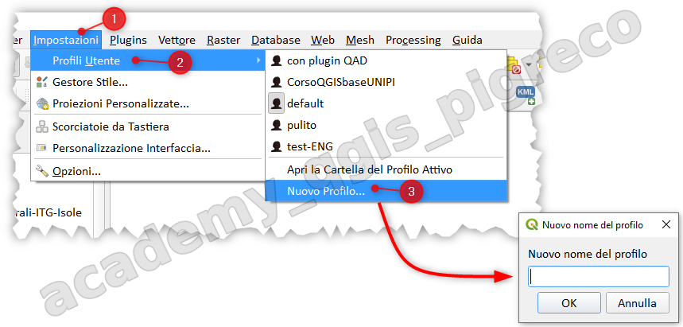

---
hide:
  # - navigation
  # - toc
title: Profili utente in QGIS
description: Gestione dei profili utente in QGIS
---

# Profili utente in QGIS

## Introduzione

Un **profilo utente** è una configurazione unificata di QGIS che permette di memorizzare in una singola cartella tutte le impostazioni personalizzate dell'applicazione. Questa funzionalità consente di avere diverse configurazioni di QGIS per scopi diversi, senza dover reinstallare o riconfigurare l'applicazione ogni volta.

## Cosa contiene un profilo

Ogni profilo utente memorizza:

* **Impostazioni generali**: proiezioni locali, impostazioni di autenticazione, tavolozze di colori, scorciatoie da tastiera, ecc.
* **Configurazione GUI**: personalizzazioni dell'interfaccia grafica e layout dei pannelli
* **File reticolo**: file di aiuto PROJ installati per la trasformazione dei dati
* **Plugin**: tutti i plugin installati e le loro specifiche configurazioni
* **Modelli di progetto**: template personalizzati e cronologia dei progetti aperti
* **Processing**: impostazioni degli strumenti di elaborazione, log, script personalizzati e modelli grafici

## Profilo predefinito

Per impostazione predefinita, un'installazione QGIS contiene _un solo profilo utente_ denominato **default**. Questo profilo viene utilizzato automaticamente all'avvio di QGIS se non ne viene specificato un altro.

## Gestione dei profili

### Creare un nuovo profilo

Per creare un nuovo profilo utente:

1. Aprire il menu **Impostazioni** dalla barra dei menu
2. Selezionare **Profili utente**
3. Scegliere **Nuovo profilo...**
4. Assegnare un nome significativo al profilo (es. "Corso", "Lavoro", "Test")
5. Il nuovo profilo verrà creato con le impostazioni predefinite di QGIS

{.center-img .img-70}

### Passare tra profili

È possibile passare da un profilo all'altro in qualsiasi momento:

1. Menu **Impostazioni** > **Profili utente**
2. Selezionare il profilo desiderato dall'elenco
3. QGIS si riavvierà automaticamente con il profilo selezionato

## Casi d'uso dei profili

### Profilo pulito per verifica bug :octicons-bug-16:

Quando incontri uno strano comportamento con alcune funzioni in QGIS, crea un nuovo profilo utente ed esegui nuovamente i comandi. A volte, i bug sono correlati ad alcune "sporcizie" sul profilo utente corrente e la creazione di un nuovo profilo utente può correggerli quando si riavvia QGIS con il nuovo profilo (pulito).

!!! tip "Suggerimento per il debug"
    Prima di segnalare un bug, è buona prassi verificare se il problema si presenta anche in un profilo pulito. Questo aiuta a determinare se il problema è effettivo o legato alla configurazione specifica.

## Conclusioni

I profili utente sono uno strumento potente per gestire diverse configurazioni di QGIS in modo efficiente. Permettono di mantenere ambienti di lavoro separati e organizzati, facilitando sia l'uso quotidiano che la risoluzione di problemi.

{!includes/disclaimer.md!}
