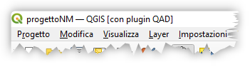
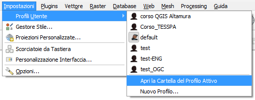
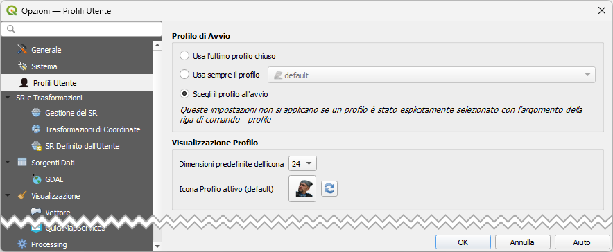
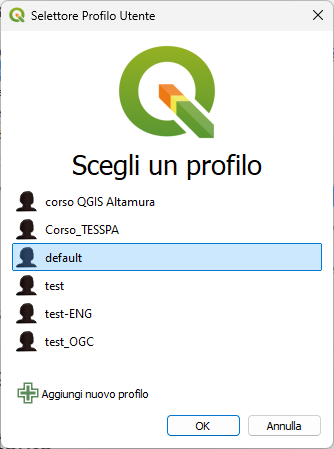

---
hide:
  # - navigation
  # - toc
title: Profili utente in QGIS
description: Gestione dei profili utente in QGIS
---

# Profili utente in QGIS

## Introduzione

Un **profilo utente** è una configurazione unificata di QGIS che permette di memorizzare in una singola cartella tutte le impostazioni personalizzate dell'applicazione. Questa funzionalità consente di avere diverse configurazioni di QGIS per scopi diversi, senza dover reinstallare o riconfigurare l'applicazione ogni volta.

## Cosa contiene un profilo

Ogni profilo utente memorizza:

* **Impostazioni generali**: proiezioni locali, impostazioni di autenticazione, tavolozze di colori, scorciatoie da tastiera, ecc.
* **Configurazione GUI**: personalizzazioni dell'interfaccia grafica e layout dei pannelli
* **File reticolo**: file di aiuto PROJ installati per la trasformazione dei dati
* **Plugin**: tutti i plugin installati e le loro specifiche configurazioni
* **Modelli di progetto**: template personalizzati e cronologia dei progetti aperti
* **Processing**: impostazioni degli strumenti di elaborazione, log, script personalizzati e modelli grafici

## Profilo predefinito

Per impostazione predefinita, un'installazione QGIS contiene _un solo profilo utente_ denominato **default**. Questo profilo viene utilizzato automaticamente all'avvio di QGIS se non ne viene specificato un altro.

## Gestione dei profili

### Creare un nuovo profilo

Per creare un nuovo profilo utente:

1. Aprire il menu **Impostazioni** dalla barra dei menu
2. Selezionare **Profili utente**
3. Scegliere **Nuovo profilo...**
4. Assegnare un nome significativo al profilo (es. "Corso", "Lavoro", "Test")
5. Il nuovo profilo verrà creato con le impostazioni predefinite di QGIS

{.center-img .img-70}

### Passare tra profili

È possibile passare da un profilo all'altro in qualsiasi momento:

1. Menu **Impostazioni** > **Profili utente**
2. Selezionare il profilo desiderato dall'elenco
3. QGIS si riavvierà automaticamente con il profilo selezionato

### Identificare il profilo attivo

Quando sono presenti più profili, il nome del profilo attualmente attivo è indicato nella **barra del titolo** dell'applicazione tra parentesi quadre.

{.center-img .img-50}

Se non viene modificato, il profilo dell'ultima sessione chiusa di QGIS verrà utilizzato nelle successive sessioni.

## Casi d'uso dei profili

### Separare ambienti di lavoro

I profili sono utili per mantenere separate diverse configurazioni di lavoro:

* **Profilo didattico**: con plugin e impostazioni specifiche per l'insegnamento
* **Profilo professionale**: configurato per attività lavorative quotidiane
* **Profilo sviluppo**: per testare nuovi plugin o funzionalità sperimentali

### Profilo pulito per verifica bug :octicons-bug-16:

Quando incontri uno strano comportamento con alcune funzioni in QGIS, crea un nuovo profilo utente ed esegui nuovamente i comandi. A volte, i bug sono correlati ad alcune "sporcizie" sul profilo utente corrente e la creazione di un nuovo profilo utente può correggerli quando si riavvia QGIS con il nuovo profilo (pulito).

!!! tip "Suggerimento per il debug"
    Prima di segnalare un bug, è buona prassi verificare se il problema si presenta anche in un profilo pulito. Questo aiuta a determinare se il problema è effettivo o legato alla configurazione specifica.

### Profili per corsi e formazione

Quando si seguono corsi o si partecipa a workshop, è consigliabile creare un profilo dedicato. In questo modo:

* Si evita di "sporcare" il profilo di lavoro principale
* Si possono installare plugin specifici per il corso
* È facile ripristinare le impostazioni originali al termine del corso

## Gestione avanzata

### Cartella del profilo

Ogni profilo è memorizzato in una cartella specifica nel sistema. Per accedere alla cartella del profilo attivo:

1. Menu **Impostazioni** > **Profili utente**
2. Selezionare **Apri cartella del profilo attivo**

{.center-img .img-60}

Questo apre la cartella nel file manager del sistema operativo, permettendo di:

* Effettuare backup manuali
* Copiare configurazioni tra computer diversi
* Esaminare i file di configurazione

### Selettore Profilo Utente

È possibile configurare il Selettore del Profilo utente per farlo visualizzare all'avvio di QGIS:

1. Menu **Impostazioni** > **Profili utente**
2. Selezionare _Scegli Profilo all'avvio_;

{.center-img .img-80}

{.center-img .img-30}

### Eliminare un profilo

Per rimuovere un profilo non più necessario occorre agire manualmente, oppure installare un Plugin (_Profile Manager_) creato appositamente per gestire i Plugin.

## Best practices

### Quando usare i profili

* **Testing di nuove funzionalità**: crea un profilo di test per provare nuove versioni o plugin sperimentali
* **Formazione**: mantieni un profilo dedicato per seguire corsi o tutorial
* **Troubleshooting**: usa profili puliti per diagnosticare problemi
* **Progetti specifici**: configura profili personalizzati per progetti con requisiti particolari

### Manutenzione dei profili

* Pulisci periodicamente i profili non utilizzati per liberare spazio su disco
* Effettua backup dei profili importanti
* Documenta le personalizzazioni effettuate in ciascun profilo per riferimento futuro

## Conclusioni

I profili utente sono uno strumento potente per gestire diverse configurazioni di QGIS in modo efficiente. Permettono di mantenere ambienti di lavoro separati e organizzati, facilitando sia l'uso quotidiano che la risoluzione di problemi.

{!includes/disclaimer.md!}
