---
hide:
  # - navigation
  # - toc
title: Interfaccia
description: Interfaccia di QGIS 3.x
---

# Interfaccia utente GUI e Impostazioni

## Introduzione

Come tutti i Software GIS, anche **QGIS** ha una interfaccia caratterizzata da: 

1. TOC (Pannello dei Layer);
2. Browser;
3. Map canvas;
4. Barre degli strumenti;
5. Pannelli.

## Interfaccia

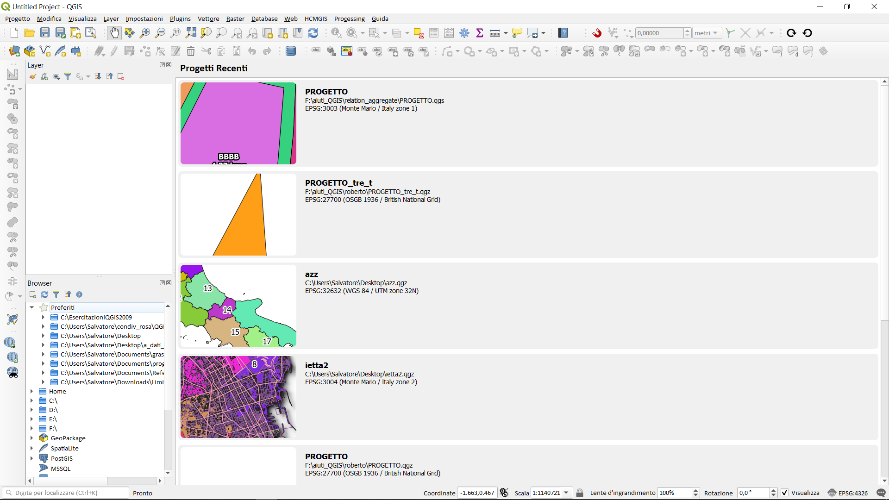{.center-img .img-70}

interfaccia si presenta, all'avvio, con i Progetti recenti (è personalizzabile)

### Aree interfaccia

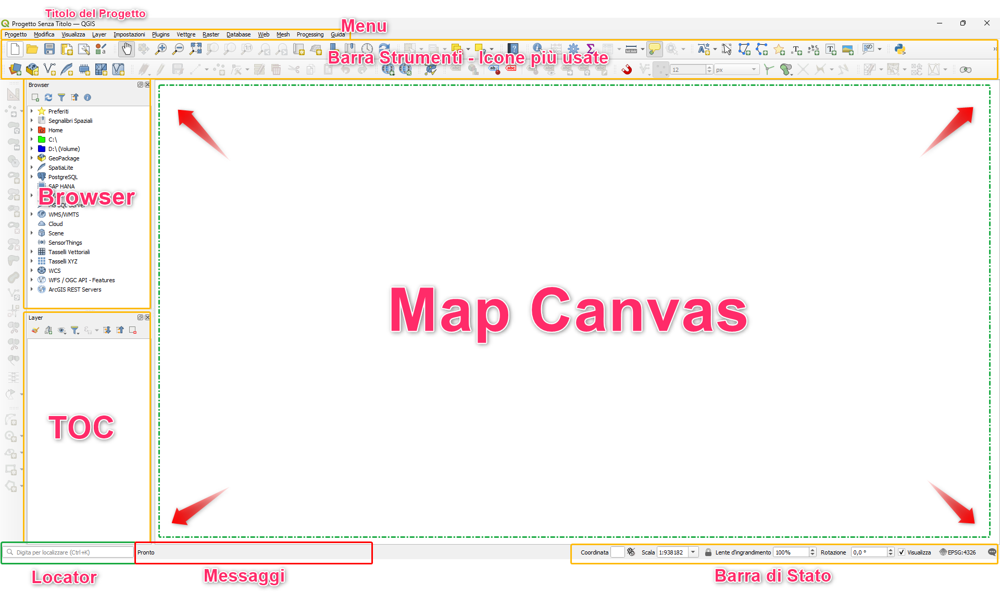{.center-img .img-90}

L'interfaccia è **personalizzabile** e i vari pannelli possono essere spostati, nella configurazione di default troviamo:

1. menu;
2. barra degli strumenti, con le icone più usate;
3. TOC: pannello layer;
4. browser;
5. map canvas;
6. locator;
7. barra di stato.

## Menu contestuale

### Pannello dei Layer

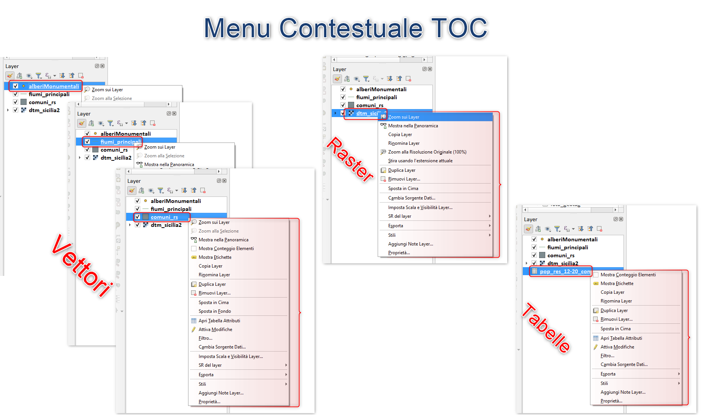{.center-img .img-70}

### Map Canvas

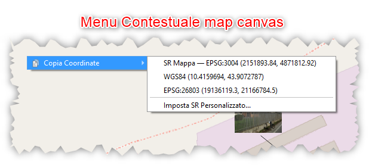{.center-img .img-50}

### Pannello Browser

In questo caso il menu contestuale dipende dal tipo di oggetto selezionato: Cartella, Preferiti, provider ecc, sotto alcuni esempi:

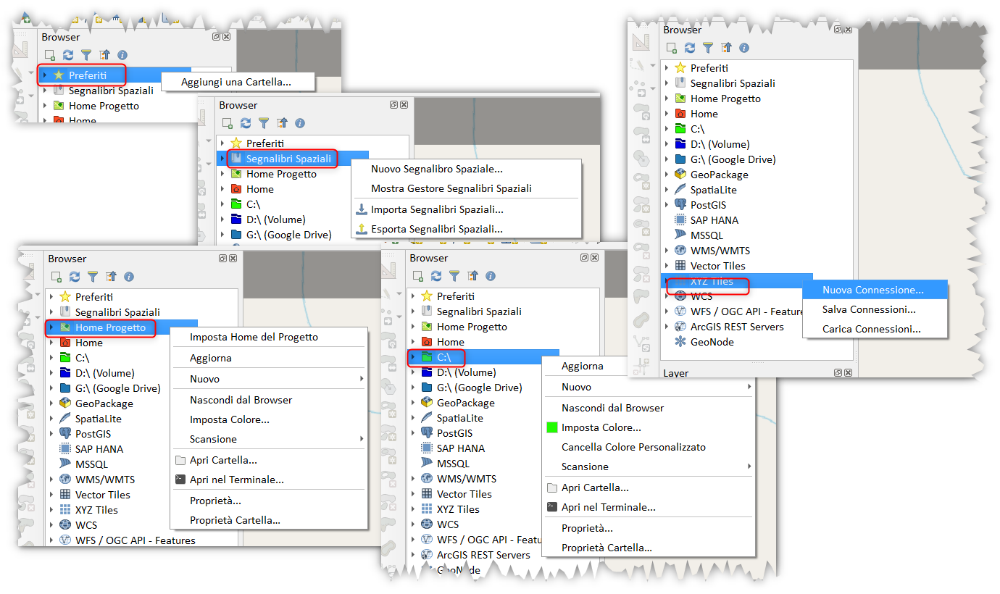{.center-img .img-70}

## Informazioni elementi

Per interrogare/identificare gli elementi presenti nella map canvas si utilizza lo strumento `Informazioni elementi`  presente nella barra degli strumenti.

QGIS offre diversi modi per identificare gli elementi utilizzando lo strumento `Informazioni elementi` : 

- **clic sinistro del mouse**: _**Informazioni elementi**_ in base alla modalità di selezione e alla maschera di selezione impostata nel pannello Identifica risultati;
- **clic con il pulsante destro del mouse** con _**Informazioni elementi**_ come modalità di selezione impostata nel pannello _Identifica risultati_, recupera tutte gli elementi catturate da tutti i livelli visibili. Si apre un menu contestuale, che consente all'utente di scegliere con maggiore precisione le funzioni da identificare o l'azione da eseguire su di esse;
- **clic con il pulsante destro del mouse** con _**Informazioni elementi**_ per poligono come modalità di selezione nel pannello Identifica risultati, identifica gli elementi che si sovrappongono al poligono esistente scelto, in base alla maschera di selezione impostata nel pannello Identifica risultati

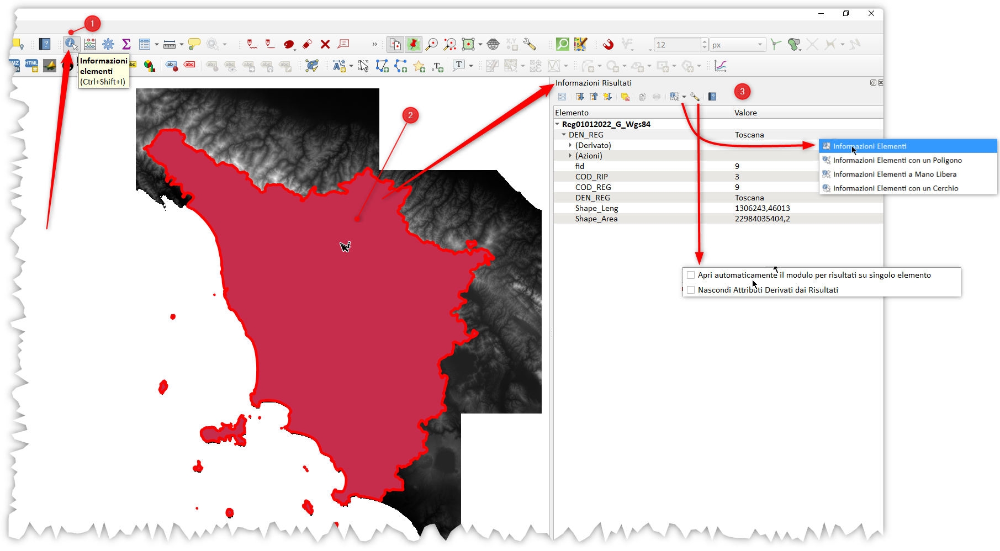{.center-img .img-70}

## Icone

### Pannello Browser

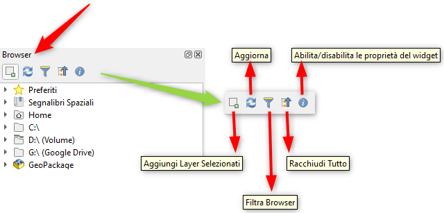{.center-img .img-70}

### Pannello Layer

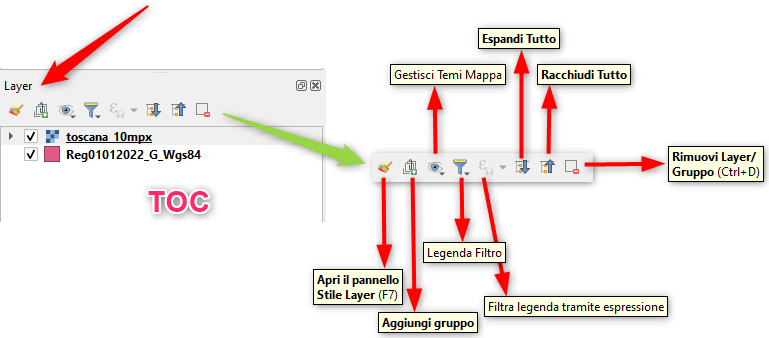{.center-img .img-70}

<https://docs.qgis.org/testing/en/docs/user_manual/introduction/general_tools.html?#identify>

## Proprietà e Impostazioni

QGIS è un software GIS complesso e per gestire/configurare tutta questa complessità ci sono tre livelli di IMPOSTAZIONI: generali, di progetto, di layer; vediamo dove sono e cosa contengono.

### Impostazioni generali

Le Impostazioni generali permettono di configurare l'ambiente di lavoro QGIS in senso generale, ovvero configurare le opzioni per la lingua della GUI, percorsi a varie risorse; SR; Sorgenti Dati; Visualizzazione; Mappa e Legenda ecc... e sono raggiungibili dal menu `Impostazioni | Opzioni`:

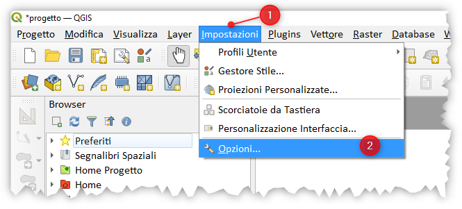{.center-img .img-50}

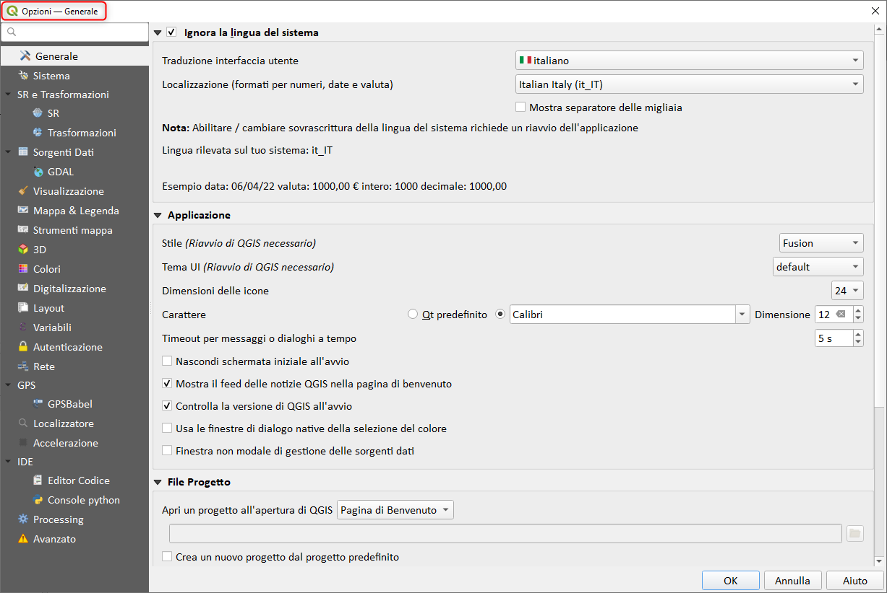{.center-img .img-70}

### Impostazioni di Progetto

Le impostazioni di Progetto sono anche dette **Proprietà di Progetto** e sono raggiungibili dal menu `Progetto | Proprietà`:

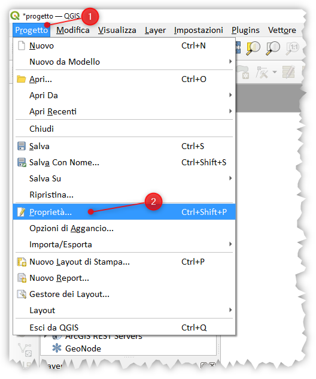{.center-img .img-40}

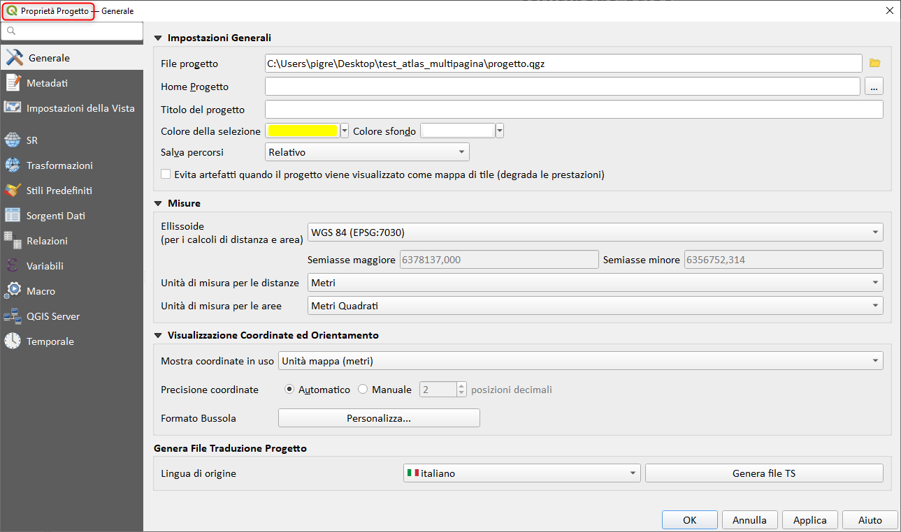{.center-img .img-70}

queste proprietà sono legate al file di Progetto di QGIS: queste permettono di impostare o conoscere le proprietà del progetto come il percorso; i metadati; SR; Trtasformazioni; Stili; Relazioni; Variabili; ecc... (queste impostazioni prevalgono su tutte le altre).

### Impostazioni Layer

Le impostazioni layer sono anche dette **Proprietà del layer** ed sono raggiungibile dal `menu contestuale (tasto destro mouse sul layer) | Proprietà`, queste di conoscere o impostare tutte le proprietà del layer selezionato come Simbologia, Etichettatura, Diagrammi, Join, Moduli Legenda ecc...

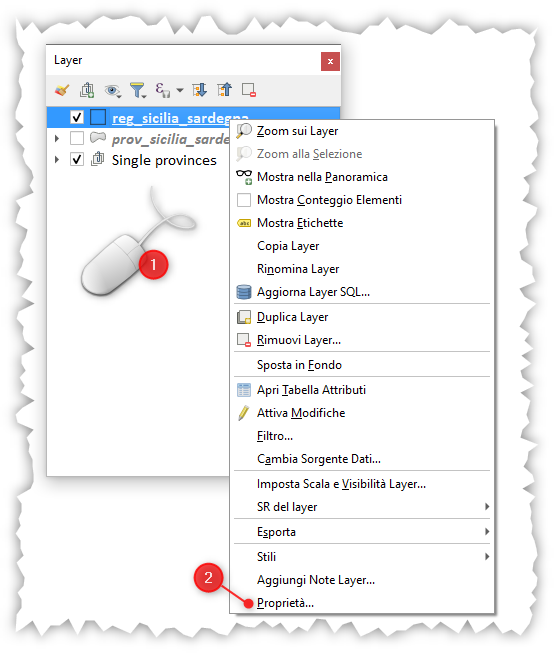{.center-img .img-40}

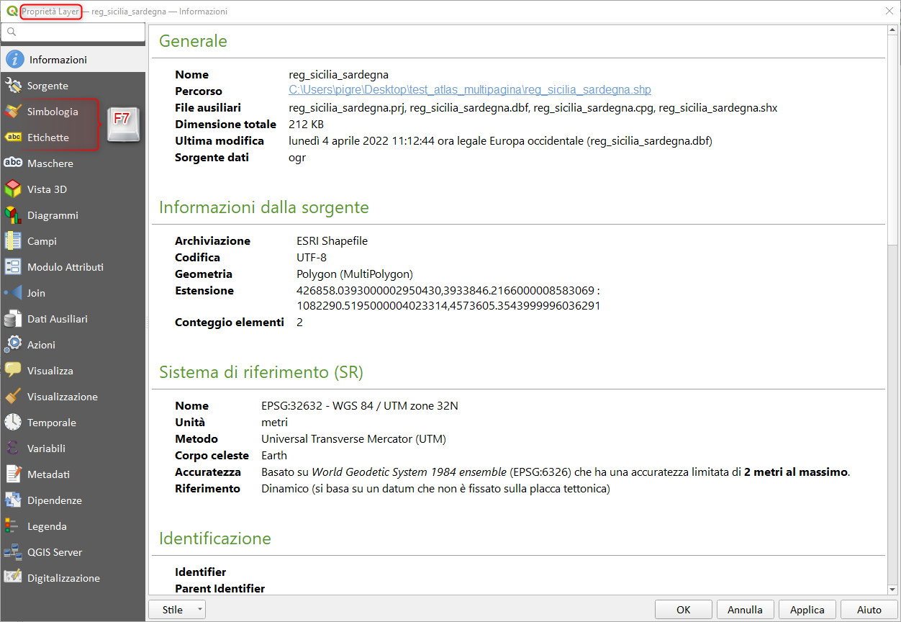{.center-img .img-70}

### Conclusioni

Se devessi impostare caratteristiche generali (quindi non relativo al mio Progetto corrente e non ai Layer caricati) dovrei utilizzare le Impostazioni Generiche; se devessi impostare le caratteristico di un determinato progetto devrei utilizzare le Proprietà di Progetto; infine, per impostare le proprietà di un singolo layer, Proprietà layer.

## Pannello strumenti di processing

`CTRL+ALT+T`

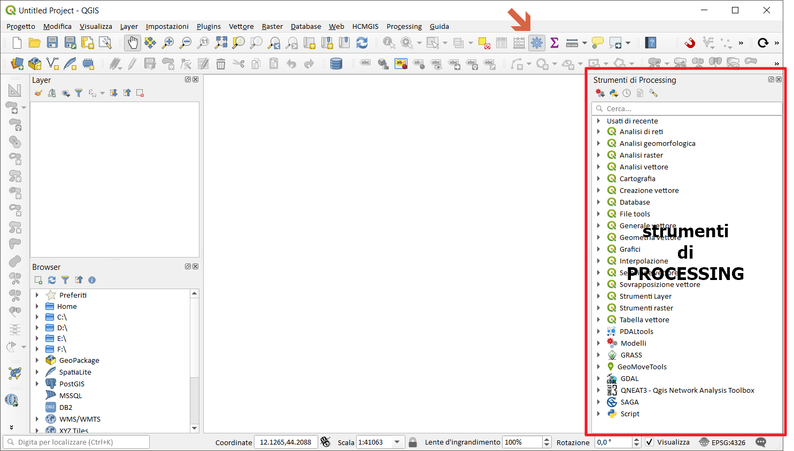{.center-img .img-70}

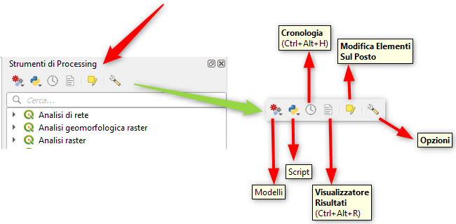{.center-img .img-70}

geo-algoritmo:

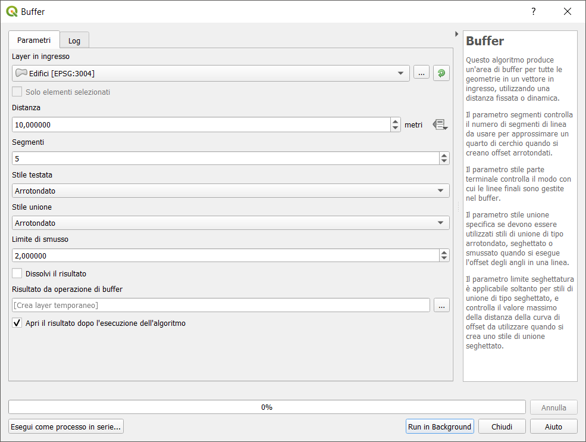{.center-img .img-70}

{!includes/disclaimer.md!}
