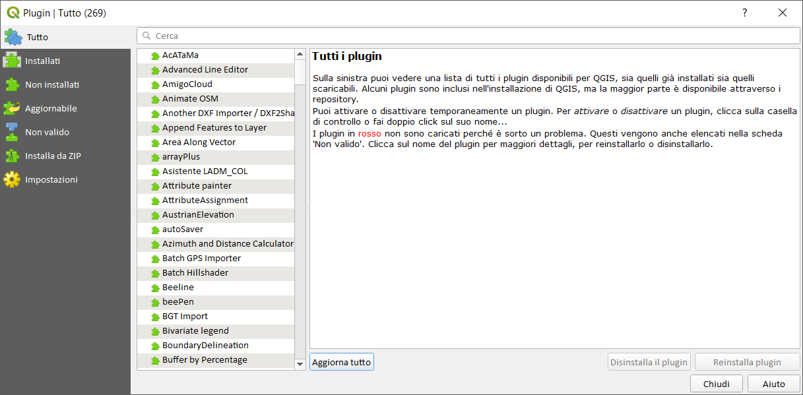
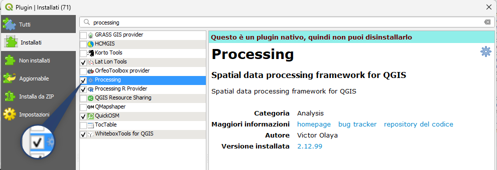
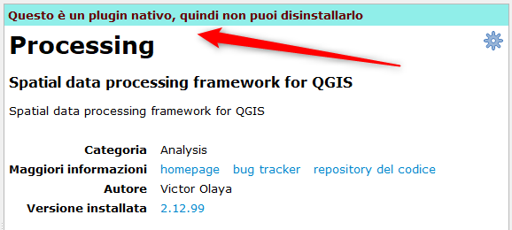
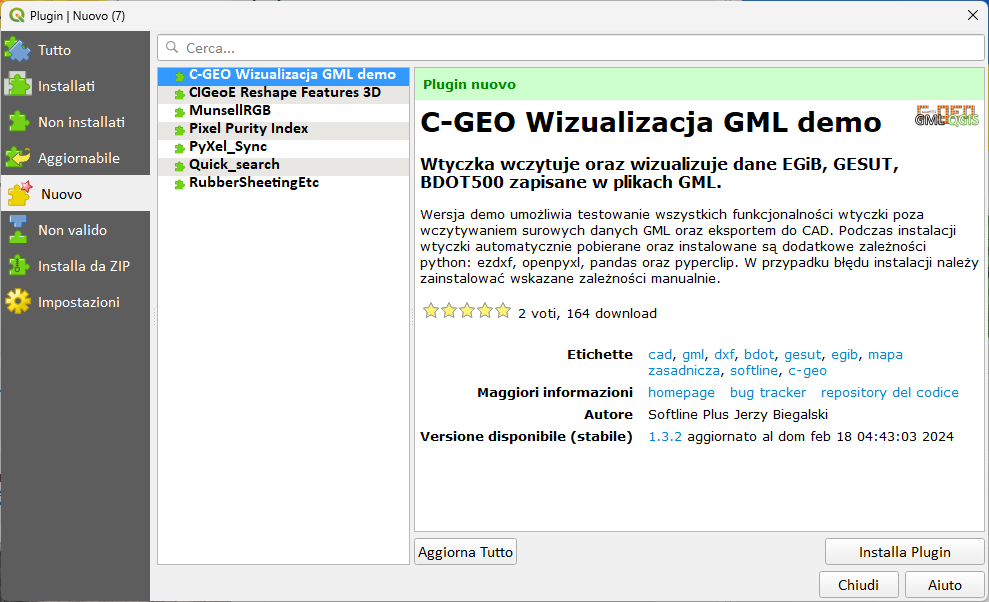
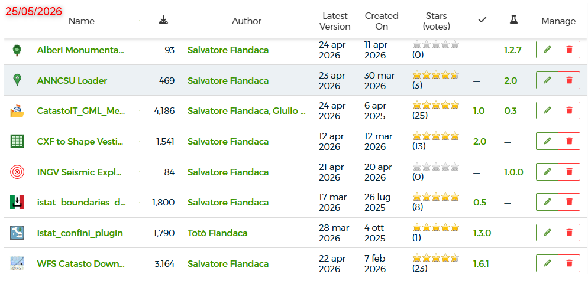

---
hide:
  # - navigation
  # - toc
title: Plugin
description: Plugin
---

# Gestione dei plugin

## Introduzione

I plugin sono estensioni software che aggiungono funzionalità a QGIS, permettendo agli utenti di personalizzare e ampliare le capacità del software in base alle proprie esigenze.

## **Caratteristiche principali**

1. Tipi di plugin:
   
    - Ufficiali: sviluppati e mantenuti dal team QGIS;
    - Comunitari: creati da sviluppatori indipendenti;
    - Core: integrati direttamente nel software QGIS;

2. Gestione dei plugin:
   
    - Interfaccia grafica per l'installazione, l'aggiornamento e la rimozione;
    - Repository online per la distribuzione dei plugin;

3. Varietà di funzionalità:
   
    - Analisi spaziale avanzata;
    - Elaborazione di immagini;
    - Connessione a servizi web;
    - Strumenti di visualizzazione;
    - Automazione di processi;
    - Interfacce con altri software;

4. Sviluppo:
   
    - Possibilità per gli utenti di creare propri plugin;
    - Supporto per linguaggi di programmazione come Python;

5. Compatibilità:
   
    - Versioni specifiche per diverse release di QGIS;
    - Informazioni sulla stabilità e compatibilità disponibili;

6. Comunità attiva:
   
    - Continuo sviluppo e aggiornamento dei plugin;
    - Forum e canali di supporto per gli utenti;

7. Personalizzazione:
   
    - Molti plugin offrono opzioni di configurazione;
    - Possibilità di adattare i plugin alle esigenze specifiche;

8. Categorie comuni di plugin:
   
    - Analisi di reti;
    - Telerilevamento;
    - Topografia;
    - Conversione di dati;
    - Cartografia e layout di stampa;

9.  Sperimentazione:
    
    - Possibilità di testare nuove funzionalità prima dell'integrazione nel core di QGIS;

10. Licenze dei plugin:

     - Varietà di licenze: I plugin di QGIS possono essere rilasciati sotto diverse licenze open source, come GPL, MIT, BSD, o altre.
     - Conformità con QGIS: La maggior parte dei plugin segue licenze compatibili con la licenza GPL di QGIS.
     - Trasparenza: Le informazioni sulla licenza sono generalmente disponibili nella documentazione del plugin o nel repository.
     - Libertà di utilizzo: La natura open source della maggior parte dei plugin permette agli utenti di utilizzarli, modificarli e redistribuirli liberamente, nel rispetto dei termini della licenza.
     - Contributi della comunità: Le licenze open source incoraggiano la collaborazione e il miglioramento continuo dei plugin da parte della comunità.
     - Verifica delle licenze: Gli utenti possono e dovrebbero verificare la licenza di un plugin prima dell'uso, specialmente in contesti commerciali o per progetti sensibili.
     - Plugin proprietari: Esistono anche alcuni plugin proprietari o a pagamento, ma sono meno comuni e devono essere chiaramente identificati come tali.

Questa varietà di licenze riflette la natura open e collaborativa dell'ecosistema QGIS, garantendo al contempo che gli sviluppatori possano scegliere il modello di distribuzione più adatto alle loro esigenze e a quelle degli utenti.

## Gestione e Installa Plugin

**Menu**: Plugins → Gestisci ed installa plugin...

{.center-img .img-70}

1. **Tutto**;
    - contiene l'elenco di tutti i plugin presenti nel [repository ufficile](https://plugins.qgis.org/plugins/);
2. **Installati**;
    - contiene un elenco dei plugin installati nel PC;
3. **Aggiornabile**;
    - contiene una lista di plugin da aggiornare;
4. **Nuovo**:
    - contine la lista dei nuovi plugin
5. **Non valido**;
    - contiene una lista di plugin non validi per vari motivi;
6. **Installa da ZIP**;
    - maschera che permette di installare un plugin zippato e quindi non necessariamente presente nel repository ufficile;
7. **Impostazioni**;
    - maschera delle impostazioni del gestore plugin.

### Osservazioni

I plugin della versione 2.x NON funzionano per la versione 3.x in quanto sono cambiate le API e Python e quindi non saranno presenti nelle scheramte di sopra; se un plugin è particolarmente utile è possibile supportare il 'porting', verso al 3.x, contattando direttamente lo sviluppatore autore del plugin o anche altri.

### Plugin Core

I plugin particolarmente utili diventano plugin core (nativo), ovvero sono promossi dentro il core di QGIS e vengono installati al momento dell'installazione di QGIS, alcune volte devono solo essere attivati e non possono essere disinstallati.

{.center-img .img-70}

Esempi di plugin core:

- Processing;
- DB manager;
- Validatore topologico;
- Validatore Geometria;
- GRASS GIS;
- SAGA GIS (fino a QGIS 3.28 LTR);
- MetaSearch Catalog Client;
- OTB;

{.center-img .img-50}

### Plugin varie

Ci sono alcune voci visibili solo quando sono presenti:

- Aggiornamenti
- Nuovi
- Non valido

{.center-img .img-70}

## I 10 Plugin QGIS Più Scaricati

L'ecosistema dei **plugin QGIS** è una delle caratteristiche più potenti del software, con oltre **2.550 plugin approvati** nel repository ufficiale. I plugin permettono di estendere le funzionalità base di QGIS con strumenti specializzati per ogni esigenza.

Ecco i plugin più popolari scaricati dalla community internazionale (al 13/09/2025):

-   :fontawesome-solid-map: **QuickMapServices**

    ---

    **9.095.876 download**

    Accesso rapido a mappe di base e geoservizi (Google, Bing, OSM)

    [:fontawesome-solid-arrow-up-right-from-square: Plugin Repository](https://plugins.qgis.org/plugins/quick_map_services/){target="_blank"}

-   :fontawesome-solid-download: **QuickOSM**

    ---

    **2.362.747 download**

    Download dati OSM tramite Overpass API con query personalizzabili

    [:fontawesome-solid-arrow-up-right-from-square: Plugin Repository](https://plugins.qgis.org/plugins/QuickOSM/){target="_blank"}

-   :fontawesome-solid-satellite: **Semi-Automatic Classification Plugin**

    ---

    **2.345.023 download**

    Classificazione supervisionata di immagini satellitari e telerilevamento

    [:fontawesome-solid-arrow-up-right-from-square: Plugin Repository](https://plugins.qgis.org/plugins/SemiAutomaticClassificationPlugin/){target="_blank"}

-   :fontawesome-solid-globe: **HCMGIS**

    ---

    **1.707.017 download**

    Basemap, download OpenData, convertitori batch, proiezioni VN-2000

    [:fontawesome-solid-arrow-up-right-from-square: Plugin Repository](https://plugins.qgis.org/plugins/HCMGIS/){target="_blank"}

-   :fontawesome-solid-vector-square: **mmqgis**

    ---

    **1.567.075 download**

    Collezione di strumenti per operazioni sui layer vettoriali

    [:fontawesome-solid-arrow-up-right-from-square: Plugin Repository](https://plugins.qgis.org/plugins/mmqgis/){target="_blank"}

-   :fontawesome-solid-crosshairs: **Lat Lon Tools**

    ---

    **1.525.447 download**

    Strumenti per catturare e navigare verso coordinate (DMS, UTM, MGRS, Geohash)

    [:fontawesome-solid-arrow-up-right-from-square: Plugin Repository](https://plugins.qgis.org/plugins/latlontools/){target="_blank"}

-   :fontawesome-solid-chart-line: **Profile tool**

    ---

    **1.425.230 download**

    Creazione di profili altimetrici del terreno lungo linee

    [:fontawesome-solid-arrow-up-right-from-square: Plugin Repository](https://plugins.qgis.org/plugins/profiletool/){target="_blank"}

-   :fontawesome-solid-code: **qgis2web**

    ---

    **1.360.088 download**

    Export progetti QGIS in webmap (OpenLayers, Leaflet, Mapbox GL JS)

    [:fontawesome-solid-arrow-up-right-from-square: Plugin Repository](https://plugins.qgis.org/plugins/qgis2web/){target="_blank"}

-   :fontawesome-solid-cube: **Qgis2threejs**

    ---

    **1.228.173 download**

    Visualizzazione 3D e export web con tecnologia three.js

    [:fontawesome-solid-arrow-up-right-from-square: Plugin Repository](https://plugins.qgis.org/plugins/Qgis2threejs/){target="_blank"}

-   :fontawesome-solid-mobile: **QField Sync**

    ---

    **1.007.637 download**

    Sincronizzazione progetti con QField per rilievi mobile

    [:fontawesome-solid-arrow-up-right-from-square: Plugin Repository](https://plugins.qgis.org/plugins/qfieldsync/){target="_blank"}

!!! info "Categorie Plugin Popolari"
    I plugin più scaricati appartengono principalmente a queste categorie:

    - **Basemap e servizi web**: QuickMapServices, HCMGIS
    - **Acquisizione dati**: QuickOSM, QField Sync
    - **Analisi specialistiche**: Semi-Automatic Classification, Profile tool
    - **Strumenti vettoriali**: mmqgis, Lat Lon Tools
    - **Export e visualizzazione web**: qgis2web, Qgis2threejs

!!! tip "Repository Ufficiale"
    Tutti i plugin sono disponibili nel **Repository Ufficiale QGIS**: [plugins.qgis.org](https://plugins.qgis.org/){target="_blank"}

    La ricerca e l'installazione avvengono direttamente da QGIS tramite **Plugins → Gestisci ed installa plugin...**

## Vibe Coding e Sviluppo di Plugin QGIS

Il **Vibe Coding** è una tecnica innovativa di programmazione supportata da modelli linguistici di grandi dimensioni (LLM) che sta trasformando il modo di sviluppare software, inclusi i plugin QGIS. Invece di scrivere manualmente il codice, il programmatore formula una descrizione dettagliata dei requisiti in linguaggio naturale, che viene poi utilizzata come prompt per un assistente AI specializzato nella codifica.

### Come funziona il Vibe Coding

1. **Descrizione del problema**: L'utente descrive ciò che vuole realizzare in poche frasi chiare e dettagliate
2. **Generazione del codice**: L'agente AI genera il codice sorgente basandosi sulla descrizione fornita
3. **Revisione e iterazione**: Il programmatore verifica il codice generato, lo testa e richiede miglioramenti all'agente

### Applicazione ai Plugin QGIS

Il Vibe Coding rende lo sviluppo di plugin QGIS più accessibile anche a programmatori non esperti:

- **Prototipazione rapida**: È possibile creare prototipi di plugin in tempi molto ridotti
- **Codice basato su best practices**: Gli LLM ottimizzati per la codifica tendono a generare codice seguendo le convenzioni QGIS
- **Riduzione della curva di apprendimento**: Programmatori amatoriali possono sviluppare plugin complessi con meno esperienza tradizionale
- **Supporto multilingue**: Facilitazione dello sviluppo di plugin che supportano più lingue (italiano, inglese, ecc.)

### Vantaggi

- **Velocità di sviluppo**: Eliminazione di molti compiti ripetitivi e standard
- **Accessibilità**: Chiunque possa descrivere un problema può potenzialmente creare un plugin
- **Qualità del codice**: Se ben guidato, l'AI può generare codice pulito e manutenibile
- **Innovazione accelerata**: Nuove funzionalità e plugin possono essere realizzate più rapidamente

### Limitazioni e Considerazioni Critiche

- **Manutenibilità**: Il codice generato potrebbe essere meno documentato rispetto a codice scritto manualmente
- **Sicurezza**: Rischio di vulnerabilità se il prompt non specifica adeguatamente i controlli di validazione e sicurezza
- **Responsabilità**: Chi utilizza il plugin rimane responsabile della qualità e della correttezza del codice
- **Dipendenze da terze parti**: Necessita di accesso a servizi di AI affidabili e continuativi
- **Testing**: Richiede comunque una verifica approfondita e test completi prima della pubblicazione

### Best Practices per il Vibe Coding di Plugin QGIS

- Fornire descrizioni dettagliate che includono il nome del plugin, le funzionalità principali e il comportamento atteso
- Specificare esplicitamente i requisiti di sicurezza e validazione dei dati
- Includere riferimenti alla documentazione QGIS e alle API Python
- Testare il plugin in ambienti diversi e con dataset variegati
- Documentare accuratamente il codice e i passaggi di generazione
- Sottoporre il plugin a security review prima della pubblicazione nel repository ufficiale

### Strumenti per il Vibe Coding su QGIS

Attualmente, è possibile utilizzare assistenti AI generici (come ChatGPT, Claude, Gemini) oppure tool specializzati per descrivere i requisiti di un plugin QGIS. Alcuni approcci comuni includono:

- Utilizzare prompt dettagliati che descrivono la struttura di un plugin QGIS (metadata.txt, `__init__.py`, classi principali)
- Fornire esempi di plugin QGIS esistenti come riferimento
- Iterare sul codice generato fino a ottenere il risultato desiderato

!!! warning "Considerazioni di Sicurezza"
    Quando si utilizza il Vibe Coding per sviluppare plugin QGIS, è fondamentale:
    
    - **Verificare sempre il codice generato** prima di utilizzarlo in produzione
    - **Eseguire controlli di sicurezza** specifici per rilevare vulnerabilità comuni
    - **Validare i dati in input** esplicitamente nel prompt
    - **Testare approfonditamente** il plugin con diversi scenari e dataset
    - **Documentare il processo** di generazione e le modifiche apportate al codice originale

Il Vibe Coding rappresenta una frontiera interessante nello sviluppo di software geospaziale, ma deve essere utilizzato consapevolmente, mantenendo standard elevati di qualità, sicurezza e manutenibilità.

{.center-img .img-80}

{!includes/disclaimer.md!}
