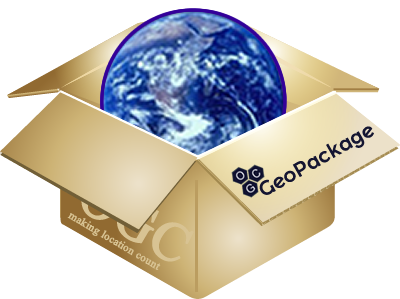
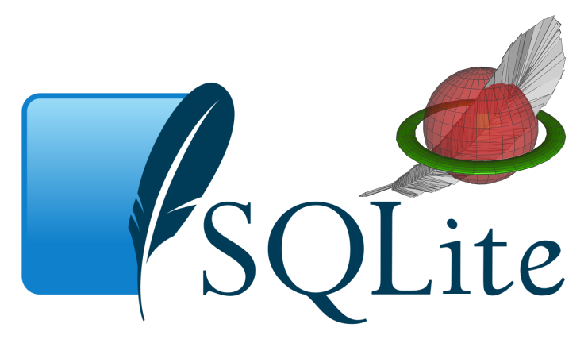

mkdoc---
hide:
  # - navigation
  # - toc
title: Formati di dato geografici
description: Confronto tra i principali formati di dato geografici utilizzati in QGIS
---

# Formati di dato geografici

## Introduzione

Nei sistemi GIS, la scelta del formato di dato è fondamentale per l'efficienza, la compatibilità e la gestione dei dati geografici. QGIS supporta moltissimi formati, ma alcuni sono particolarmente importanti da conoscere per le loro caratteristiche specifiche.

In questa lezione analizzeremo i principali formati di dato geografici:

- **Shapefile** - il formato classico
- **GeoPackage** - lo standard moderno
- **SQLite/SpatiaLite** - il database leggero
- **PostGIS** - il database enterprise

## Shapefile

{.center-img .img-10}

### Caratteristiche principali

Lo **Shapefile** (shp) è un formato proprietario sviluppato da ESRI, ma diventato uno standard de facto nell'ambito GIS.

**Struttura del formato:**

- È composto da **almeno 3 file obbligatori**:
    - `.shp` - geometrie
    - `.shx` - indice delle geometrie  
    - `.dbf` - tabella degli attributi
- **File opzionali comuni**:
    - `.prj` - sistema di coordinate
    - `.cpg` - codifica dei caratteri
    - `.qpj` - proiezione in formato QGIS

### Vantaggi

- **Massima compatibilità** con tutti i software GIS
- **Semplicità** di gestione e trasferimento
- **Supporto universale** - leggibile praticamente ovunque
- **Velocità** di lettura per dataset di dimensioni moderate
- **Formato aperto** - specifiche pubbliche disponibili

### Svantaggi

- **Limitazioni severe**:
    - Nomi dei campi massimo 10 caratteri
    - Dimensione file massima 2 GB per file
    - Solo un tipo di geometria per shapefile
    - Non supporta date/time complessi
- **Gestione file multipli** - facile perdere componenti
- **Codifica caratteri** può creare problemi con caratteri speciali
- **Nessun supporto per relazioni** tra tabelle
- **Non supporta geometrie 3D native**

### Quando usarlo
- Scambio dati con software diversi
- Dataset semplici e di dimensioni contenute  
- Compatibilità con software legacy
- Distribuzione pubblica di dati

## GeoPackage

{.center-img .img-20}

### Caratteristiche principali

Il **GeoPackage** (gpkg) è uno standard OGC basato su SQLite, progettato come evoluzione moderna dello Shapefile.

**Struttura del formato:**

- **Singolo file** contenente tutto
- Basato su **SQLite** - database SQL completo
- **Standard OGC** - specifiche aperte e standardizzate

### Vantaggi

- **Singolo file** - impossibile perdere componenti
- **Nessuna limitazione** sui nomi dei campi
- **Supporto completo** per tutti i tipi di dato SQL
- **Multiple geometrie** nello stesso file
- **Geometrie miste** (punti, linee, poligoni insieme)
- **Metadati integrati** nel formato
- **Supporto raster e vettoriale** insieme
- **Relazioni tra tabelle**
- **Indici spaziali** automatici
- **Transazioni ACID*** (atomicità, coerenza, isolamento, durabilità)

### Svantaggi

- **Compatibilità limitata** con software più vecchi
- **Dimensioni del file** possono crescere rapidamente
- **Monoutente** per la scrittura
- Possibili **problemi di corruzione** se non chiuso correttamente

### Quando usarlo
- Progetti QGIS moderni
- Dataset complessi con più tipologie di geometrie
- Quando serve gestire raster e vettori insieme
- Archiviazione di progetti completi
- Condivisione di dati con metadati ricchi

## SQLite/SpatiaLite*

{.center-img .img-20}

### Caratteristiche principali

**SQLite** è un database SQL leggero, **SpatiaLite** è la sua estensione spaziale che aggiunge funzionalità GIS complete.

**Struttura del formato:**

- **Database SQL completo** in un singolo file
- **Estensione SpatiaLite** per funzioni spaziali
- **Compatibilità SQL standard**

### Vantaggi

- **Database SQL completo** con tutte le funzionalità
- **Funzioni spaziali avanzate** (buffer, intersezioni, analisi, ecc.)
- **Query complesse** con JOIN, subquery, funzioni aggregate
- **Viste (VIEW)** per query predefinite
- **Triggers** per automazione
- **Indices personalizzabili** per ottimizzazione
- **Transazioni ACID***
- **Singolo file** portabile

### Svantaggi

- **Richiede conoscenze SQL** per sfruttarlo al meglio
- **Monoutente** per la scrittura
- **Compatibilità software** - non tutti i GIS supportano SpatiaLite
- Potenziali **problemi di performance** con dataset molto grandi

### Quando usarlo

- Analisi complesse che richiedono SQL
- Dataset che beneficiano di query avanzate
- Progetti dove serve automazione (trigger)
- Quando si ha familiarità con SQL

### Esempio di query SQL

Ecco un semplice esempio di come si può utilizzare SQL in SpatiaLite per analisi spaziali:

```sql
-- Trova tutti i comuni con area maggiore di 100 km²
SELECT nome, ST_Area(geom)/1000000 as area_km2
FROM comuni 
WHERE ST_Area(geom) > 100000000
ORDER BY area_km2 DESC;

-- Buffer di 500 metri intorno alle scuole
SELECT nome, ST_Buffer(geom, 500) as buffer_geom
FROM scuole;

-- Contare quanti punti di interesse sono dentro ogni comune
SELECT c.nome, COUNT(p.id) as num_poi
FROM comuni c
LEFT JOIN punti_interesse p ON ST_Within(p.geom, c.geom)
GROUP BY c.nome;
```

Queste query mostrano la potenza di SQL per analisi che sarebbero complesse da fare manualmente!

## PostGIS

{.center-img .img-30}

### Caratteristiche principali

**PostgreSQL** è un potente database relazionale, **PostGIS** la sua estensione spaziale che lo trasforma nel database GIS più avanzato disponibile.

**Architettura:**

- **Database server** separato (client/server)
- **Multiutente e multiprocesso**
- **Estensione PostGIS** per funzioni spaziali avanzate

### Vantaggi

- **Accesso multiutente simultaneo** - più utenti possono modificare contemporaneamente
- **Performance eccellenti** anche su dataset di milioni di record  
- **Funzioni spaziali avanzatissime** - il set più completo disponibile
- **Replication e backup** professionali
- **Sicurezza avanzata** - controllo accessi granulare
- **Scalabilità orizzontale** possibile
- **Standard SQL completo** + estensioni
- **Integrazione con web services** ottimale
- **Supporto per dati 3D e 4D**
- **Topologia avanzata**

### Svantaggi

- **Complessità di installazione e gestione**
- **Richiede server dedicato** o servizio cloud
- **Costi di gestione** (amministrazione, backup, sicurezza)
- **Curva di apprendimento ripida**
- **Richiede connessione di rete** sempre attiva

### Quando usarlo

- **Progetti enterprise** con più utenti
- **Dataset molto grandi** (milioni di record)
- **Applicazioni web** che servono dati GIS
- **Necessità di accesso simultaneo** in modifica
- **Workflow complessi** di geoprocessing
- **Integrazione con altre applicazioni aziendali**

### Esempio di query SQL avanzate

PostGIS offre il set più completo di funzioni spaziali disponibili. Ecco alcuni esempi:

```sql
-- Analisi di prossimità: trova le scuole entro 1 km dalle stazioni metro
SELECT s.nome, m.nome_stazione, ST_Distance(s.geom, m.geom) as distanza
FROM scuole s, metro_stazioni m
WHERE ST_DWithin(s.geom, m.geom, 1000)
ORDER BY distanza;

-- Creazione di griglie esagonali per analisi territoriale
SELECT ST_HexagonGrid(1000, ST_Envelope(geom)) as hex_geom
FROM limiti_comunale 
WHERE comune = 'Roma';

-- Calcolo dell'indice di compattezza dei poligoni
SELECT nome, 
       ST_Area(geom) as area,
       ST_Perimeter(geom) as perimetro,
       (4 * PI() * ST_Area(geom)) / POWER(ST_Perimeter(geom), 2) as compattezza
FROM province
WHERE compattezza > 0.5;

-- Query spaziali con finestre temporali
SELECT edificio_id, COUNT(*) as eventi_sismici
FROM sensori_sismici 
WHERE ST_Within(posizione, ST_Buffer(edificio_geom, 100))
  AND timestamp > NOW() - INTERVAL '30 days'
GROUP BY edificio_id;
```

Questi esempi mostrano funzioni avanzate come griglie esagonali, analisi di prossimità e query spazio-temporali!

## Confronto riassuntivo

| Caratteristica | Shapefile | GeoPackage | SpatiaLite | PostGIS |
|---|---|---|---|---|
| **Complessità gestione** | ⭐ | ⭐ | ⭐⭐⭐ | ⭐⭐⭐⭐⭐ |
| **Compatibilità software** | ⭐⭐⭐⭐⭐ | ⭐⭐⭐⭐ | ⭐⭐ | ⭐⭐⭐⭐ |
| **Limite dimensioni** | 2GB per file | Nessuno | Nessuno | Nessuno |
| **Multi-utente** | No | No | No | Sì |
| **Funzioni SQL** | No | ⭐⭐ | ⭐⭐⭐⭐⭐ | ⭐⭐⭐⭐⭐ |
| **Geometrie miste** | No | Sì | Sì | Sì |
| **Metadati integrati** | ⭐ | ⭐⭐⭐⭐⭐ | ⭐⭐⭐⭐⭐ | ⭐⭐⭐⭐⭐ |
| **Performance grandi dataset** | ⭐⭐⭐ | ⭐⭐⭐⭐ | ⭐⭐⭐⭐ | ⭐⭐⭐⭐⭐ |
| **Facilità trasferimento** | ⭐⭐⭐ | ⭐⭐⭐⭐⭐ | ⭐⭐⭐⭐⭐ | ⭐ |

## Raccomandazioni pratiche

### Per principianti
Iniziare con **Shapefile** per la compatibilità, poi passare a **GeoPackage** per progetti più complessi.

### Per progetti semplici
**GeoPackage** è quasi sempre la scelta migliore per progetti moderni monoutente.

### Per analisi complesse
**SpatiaLite** quando serve SQL ma si rimane monoutente, **PostGIS** per necessità enterprise.

### Per condivisione dati
**Shapefile** per la massima compatibilità, **GeoPackage** per dati ricchi e complessi.

### Per applicazioni web
**PostGIS** è spesso la scelta obbligata per performance e scalabilità.

## Esempi pratici in QGIS

### Caricamento dati
Tutti questi formati si caricano in QGIS tramite:

- **Browser Panel** - drag & drop
- **Gestore sorgenti dati** - Layer > Aggiungi layer
- **DB Manager** - per database (SpatiaLite, PostGIS)

### Conversione tra formati
QGIS permette facilmente di convertire tra formati:

1. Tasto destro sul layer → **Esporta** → **Salva elementi come...**
2. Scegliere il formato di destinazione
3. Configurare le opzioni specifiche;
4. Oppure semplicemente con il **Draf&Drop** (prendi da un formato e lo trascini dentro una ltro formato)

### Suggerimento
Sperimentare con dataset di prova per comprendere le differenze pratiche tra i formati!

----

## Approfondimenti

### Transazioni ACID*

Le **Transazioni ACID** sono un insieme di proprietà che garantiscono l'affidabilità delle operazioni nei database. ACID è un acronimo che sta per:

#### **A - Atomicità (Atomicity)**
Una transazione è "tutto o niente": 

- O tutte le operazioni vengono completate con successo
- O nessuna viene applicata (rollback completo)
- **Esempio GIS**: Se stai aggiornando 1000 geometrie, o si aggiornano tutte o nessuna

#### **C - Coerenza (Consistency)**  
Il database rimane sempre in uno stato valido:

- Tutte le regole e vincoli vengono rispettati
- I dati mantengono la loro integrità
- **Esempio GIS**: Non puoi avere un poligono senza area o coordinate non valide

#### **I - Isolamento (Isolation)**
Le transazioni concorrenti non si interferiscono:

- Ogni transazione "vede" il database come se fosse l'unica in esecuzione  
- Previene conflitti tra operazioni simultanee
- **Esempio GIS**: Due utenti che modificano layer diversi non si disturbano a vicenda

#### **D - Durabilità (Durability)**
Una volta completata, la transazione è permanente:

- I dati vengono scritti fisicamente sul disco
- Resistono a crash di sistema o interruzioni di corrente
- **Esempio GIS**: Le tue modifiche ai layer sono al sicuro anche se QGIS si blocca

#### **Vantaggi pratici in QGIS**

- **Sicurezza dei dati** - nessuna perdita per crash improvvisi
- **Integrità** - i tuoi layer non si corrompono  
- **Operazioni complesse** - puoi fare modifiche massive in sicurezza
- **Annullamento garantito** - se qualcosa va storto, si torna indietro completamente

Ecco perché GeoPackage e PostGIS sono più affidabili dello Shapefile per progetti importanti!

### Il creatore di SpatiaLite*

{.center-img .img-20}

Il "papà" di **SpatiaLite** è **Alessandro Furieri**, sviluppatore italiano che ha creato questa estensione spaziale per SQLite nel 2008.

**Alessandro Furieri** è:

- **Sviluppatore software** specializzato in tecnologie GIS
- **Contributor attivo** della comunità open source geospaziale
- **Creatore e maintainer principale** di SpatiaLite dal 2008
- **Membro** dell'Open Source Geospatial Foundation (OSGeo)

**Il suo contributo:**

- Ha sviluppato SpatiaLite per portare le funzionalità spaziali avanzate in un database leggero come SQLite
- Ha creato un ecosistema di strumenti correlati (spatialite-gui, spatialite-tools, etc.)
- Ha reso possibile avere un database GIS completo in un singolo file, democratizzando l'accesso alle tecnologie geospaziali

SpatiaLite è diventato uno dei componenti fondamentali dell'ecosistema GIS open source, utilizzato anche internamente da QGIS per gestire molte operazioni sui dati spaziali.

{!includes/disclaimer.md!}