---
hide:
  # - navigation
  # - toc
title: Vettori
description: Vettori
---

# I dati geografici vettoriali

## Vestizione

Per **tematizzare** ed **etichettare** i layer vettoriali è necessario accedere alle **Proprietà** del layer:

1. selezionare il layer (nel pannello dei Layer - TOC);

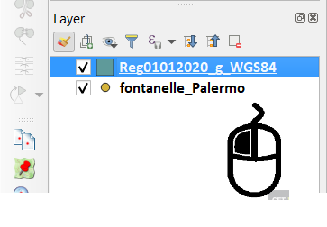{.center-img .img-40}

2. tasto destro con il mouse → Propietà

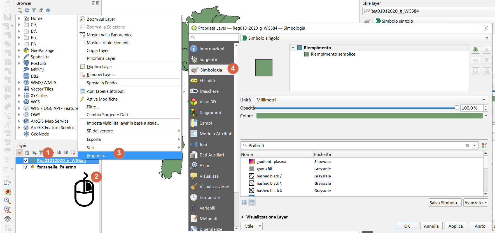{.center-img .img-70}

**Simbologia**

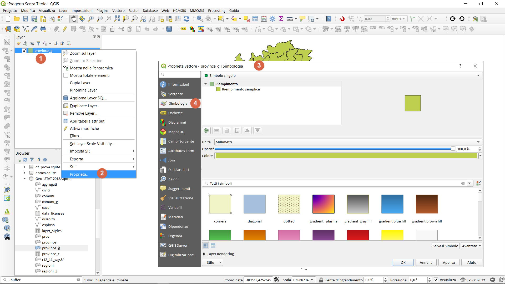{.center-img .img-70}

**Etichette**

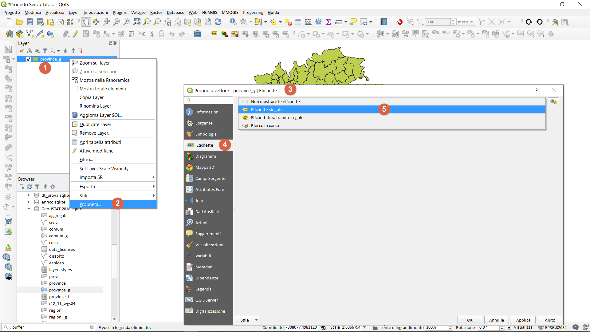{.center-img .img-70}

oppure utilizzare il tasto funzione `F7` (dopo aver selezionato il layer nella TOC):

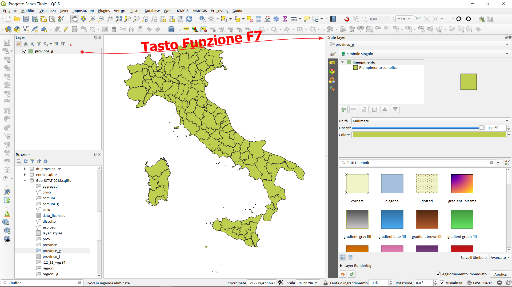{.center-img .img-50}

### Tematizzazione

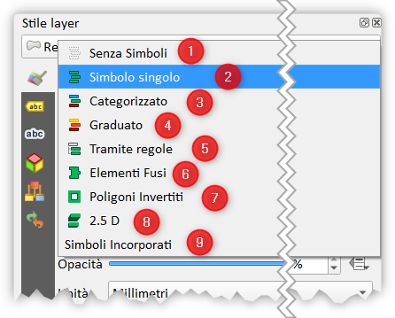{.center-img .img-50}

#### Poligoni 

9 modalità differenti:

1. **Senza simboli**: non visualizza nulla;
2. **Simbolo Singolo**: unico simbolo per tutti;
3. **Categorizzato**: vari simboli per categoria;
4. **Graduato**: sibologia graduata per valori numerici;
5. **Tramite regola**: per tematizzare usando regole;
6. **Elementi Fusi** : per tematizzare fondendo gli elementi tramite un attributo;
7. **Poligoni invertiti**: permette di tematizzare invertendo il poligono;
8. **2.5 D**: fa una assonometria;
9. **Simboli Incorporati**: il tema deriva da dati incorporati al livello. 

#### Linee

non ci saranno i Poligono Invertiti e 2,5D:

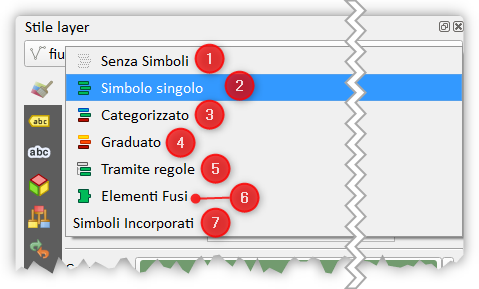{.center-img .img-50}

#### Punti

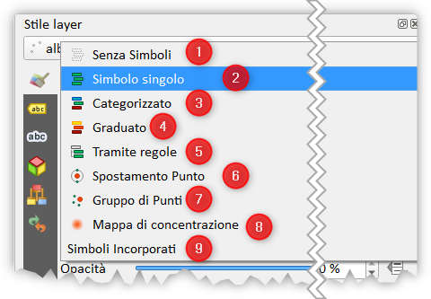{.center-img .img-50}

1. **Senza simboli**: non visualizza nulla;
2. **Simbolo Singolo**: unico simbolo per tutti;
3. **Categorizzato**: vari simboli per categoria;
4. **Graduato**: sibologia graduata per valori numerici;
5. **Tramite regola**: per tematizzare usando regole;
6. **Spostamento punto**: per spostare più punti sovrapposti;
7. **Gruppi di punti**: per raggruppare i punti in funzione della scala;
8. **Mappa di concentrazione**: per realizzare le Heatmap;
9. **Simboli Incorporati**: il tema deriva da dati incorporati al livello. 

## Etichettatura

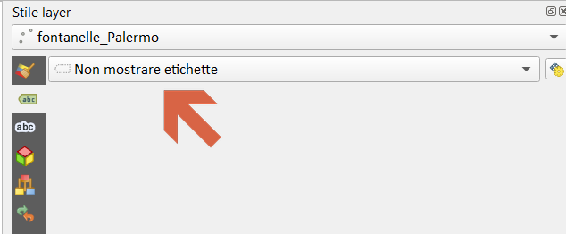{.center-img .img-50}

Di default le etichette sono **spente**, cioè non mostrate.

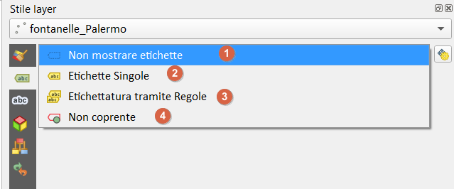{.center-img .img-50}

1. Non mostrare etichette;
2. Etichetta singola: attiva le etichette
3. Etichettatura tramite regole: attiva le etichette tramite una regola;
4. Non coprente: permette di impostare un vettore come un ostacolo per le etichette di altri vettori senza che vengano visualizzate le relative etichette.

### Configurazione etichette

Ci sono 9 tab di configurazione e per ognuna decine di opzioni, rende l'atichettatura molto complessa e potente:

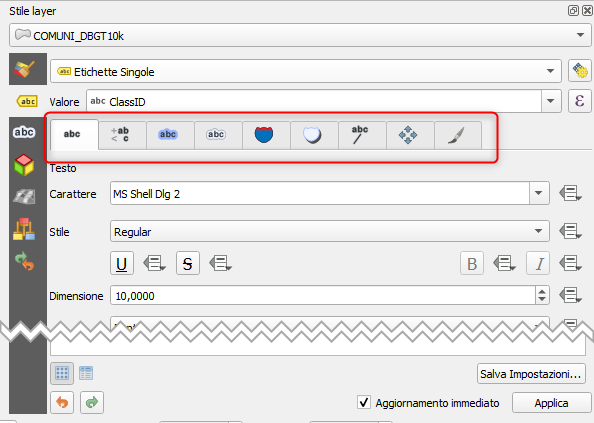{.center-img .img-70}

[Etichette miste in HTML](https://north-road.com/2022/09/09/mixed-format-labels-in-qgis-coming-soon/)

## Esercitazione

Creare una mappa coropletica, ed etichettarla (vedi esercitazioni)

## Gestore di stile

Il Gestore di Stile  è il luogo in cui è possibile gestire e creare elementi di stile generici. Si tratta di simboli, scale di colori, formati di testo o impostazioni di etichette che possono essere utilizzate per tenatizzare elementi, livelli o layout di stampa. Vengono memorizzati nel database `symbology-style.db` sotto il profilo utente attivo e condivisi con tutti i file di progetto aperti con quel profilo. Gli elementi di stile possono anche essere condivisi con altri grazie alle funzionalità di esportazione/importazione della finestra di dialogo Gestione stili.

Per accedere al gestore di stile:
- Barra del Progetto, icona Gestore Stile ;
- Dal Menu Impostazioni | Gestore Stile... ;
- Da proprietà del layer

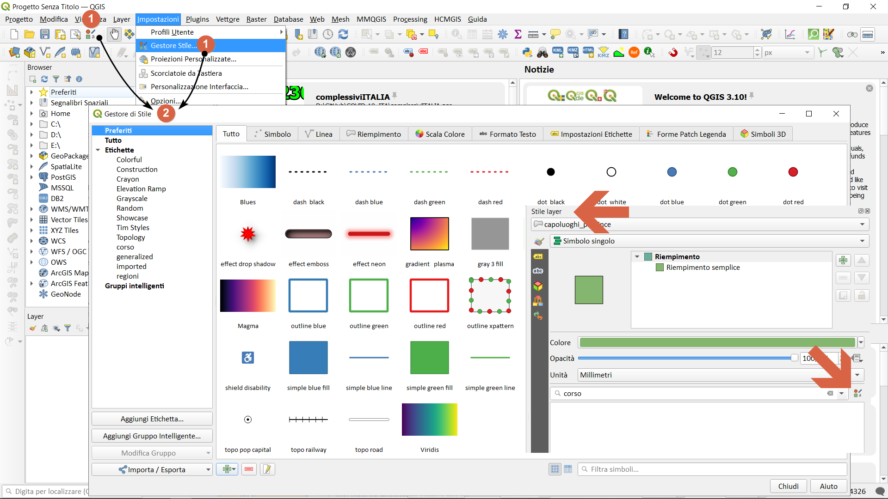{.center-img .img-70}

#### Importare stili

Nel [repository ufficiale di QGIS](https://plugins.qgis.org/styles/) sono presenti molti stili che possono essere utilizzati nei nostri progetti:

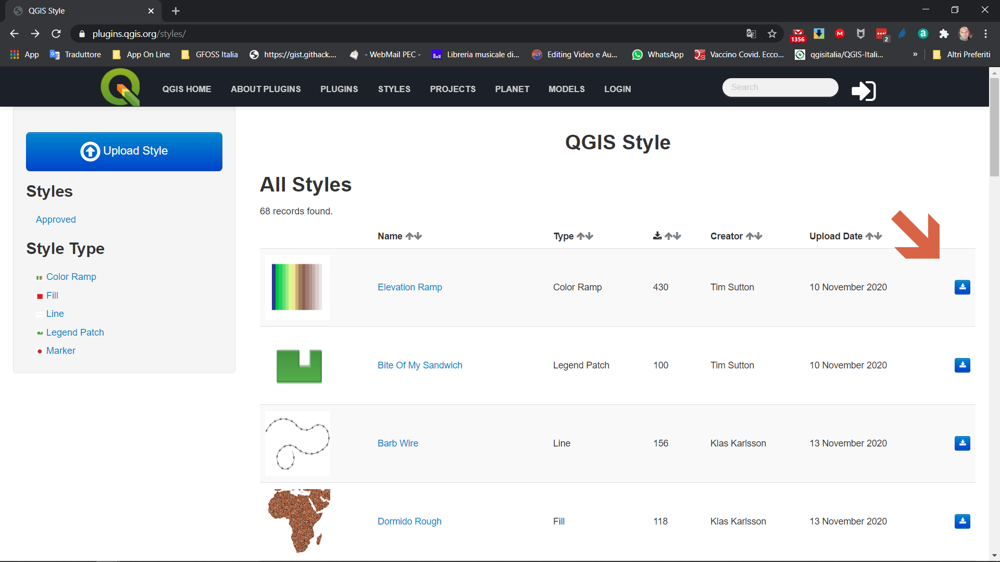{.center-img .img-60}

basta scaricare il file zippato, unzipparlo e aggiungerlo alla nostra libreria:

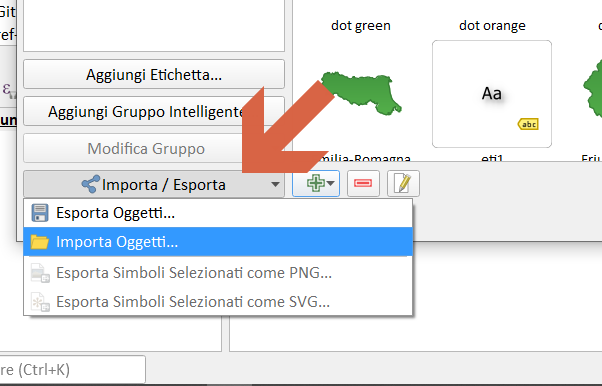{.center-img .img-50}

1. importa da file;
2. pigiare sui `...` e cercare il file `*.xml`;
3. `Selezionare Tutto` o solo quelli che vogliamo;
4. cliccare su `Importa`;

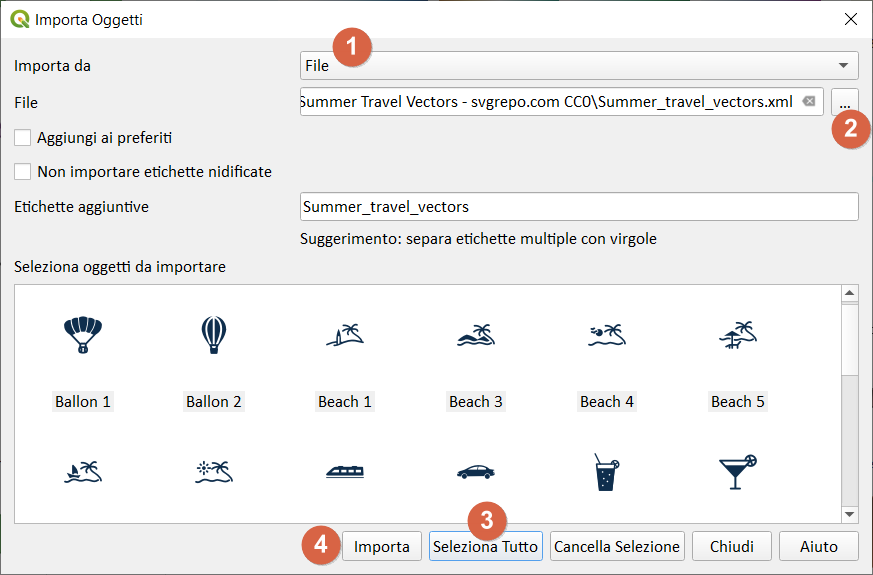{.center-img .img-70}

 dopo `Importa`:

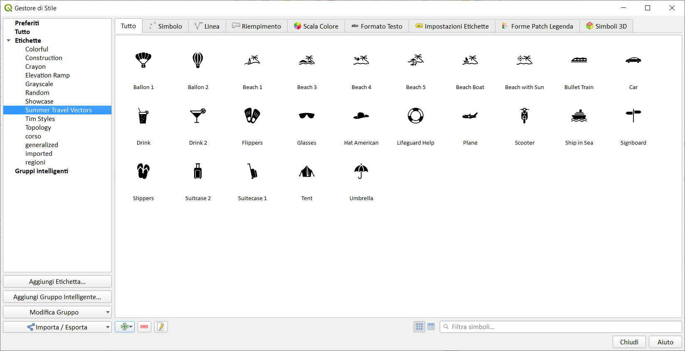{.center-img .img-70}

### Salvare stile predefinito

Quando tematizziomo un layer, abbiamo la possibilità di salvare il tema realizzato come `predefinito`, ovvero lo stile viene associato a quel layer e ogni volta che lo carichiamo lo visualizziamo già tematizzato. Per salvare uno stile:

1. da Proprietà layer, `Stile`;
2. Apri Pannello Stile Layer (F7);

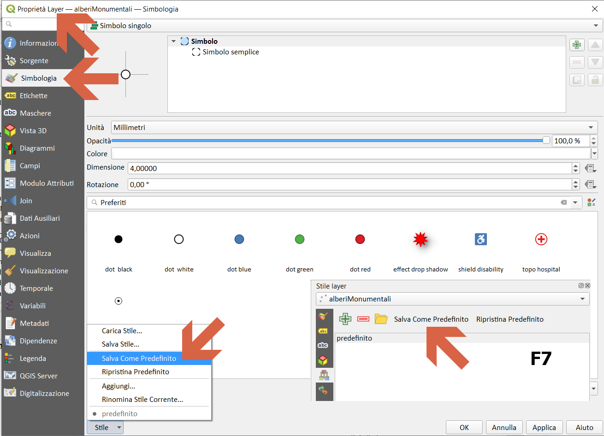{.center-img .img-60}

- Per shapefile, viene creato un file (`.qml`) con stesso nome e estensione `*.qml`;
- per geopackage, abbiamo la possibilità di salvarlo nel database stesso:

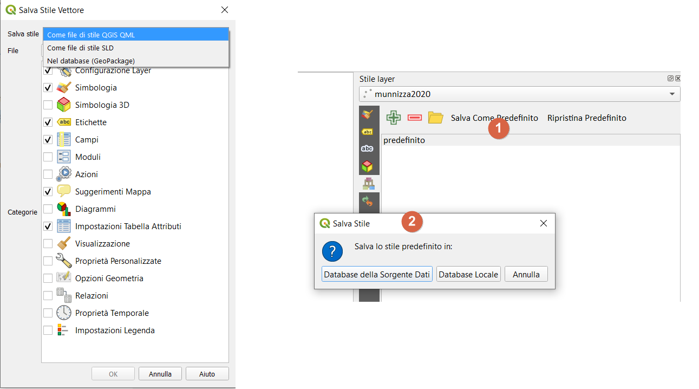{.center-img .img-70}

- Database sorgente dati → salva lo stile dentro il database del geopackage;
- Database locale → crea un file `*.qml` con stesso nome del geopackage;

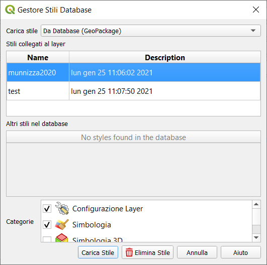{.center-img .img-50}

{!includes/disclaimer.md!}
