---
hide:
  # - navigation
  # - toc
title: Vettori
description: Vettori
---

# I dati geografici vettoriali

## Tabelle degli attributi

[HfcQGIS](http://hfcqgis.opendatasicilia.it/it/latest/calcolatore_campi/tab_attributi.html)

La tabella attributi (F6) è una tabella che contiene i dati alfanumerici (attributi) dello strato vettoriale e rappresenta una delle differenze fondamentali tra un vettore CAD e uno GIS.

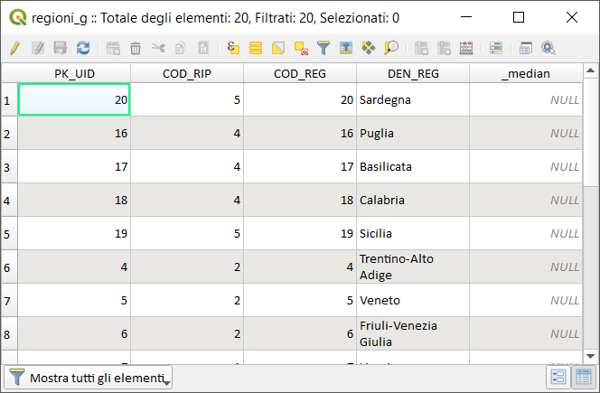{.center-img .img-50}

Negli shapefile la tabella attributi è rappresentato dal file `.dbf` che è uno dei tre file fondamentali che caratterizzano lo shapefile `(.shp, .shx, .dbf)`, la mancanza di uno di questi rende inutilizzabile lo strato.

Una tabella è caratterizzata da righe (rosso) e colonne (verde), le righe rappresentano i record (nello specifico una feature), le colonne (o campi) rappresentano gli attributi:

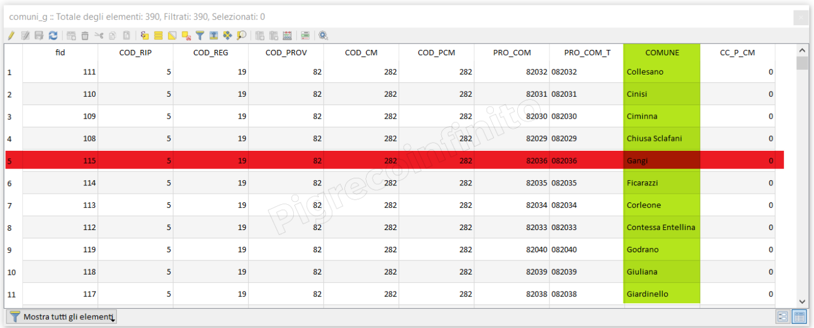{.center-img .img-70}

... continua in [HfcQGIS](http://hfcqgis.opendatasicilia.it/it/latest/calcolatore_campi/tab_attributi.html)

### Importazione di dati tabellari

formato CSV – CSVT (opzionale)

Il modo corretto per importare i file CSV in QGIS è tramite il _Gestore della Sorgente Dati_ - `CTRL+L`

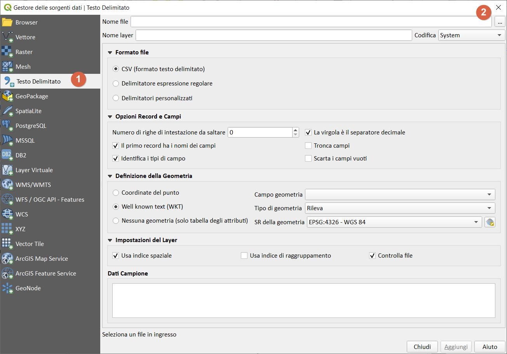{.center-img .img-70}

Il comma-separated values (abbreviato in CSV) è un formato di file basato su file di testo utilizzato per l'importazione ed esportazione (ad esempio da fogli elettronici o database) di una tabella di dati.

Esempio:

```
ID, area,  nome, data
1 , 23.54, edificio1, 2018-11-11
```

Il file CSVT è un file di testo, opzionale, che può accompagnare il file CSV per definire la tipologia dei campi.

Esempio:
```
Integer, Real, String, datetime
```

Può accadere, con campi di tipo Real, che cambi la formattazione in Excel o LibreCalc dovuto al separatore di migliaia o decimali, per rimediare occorre:

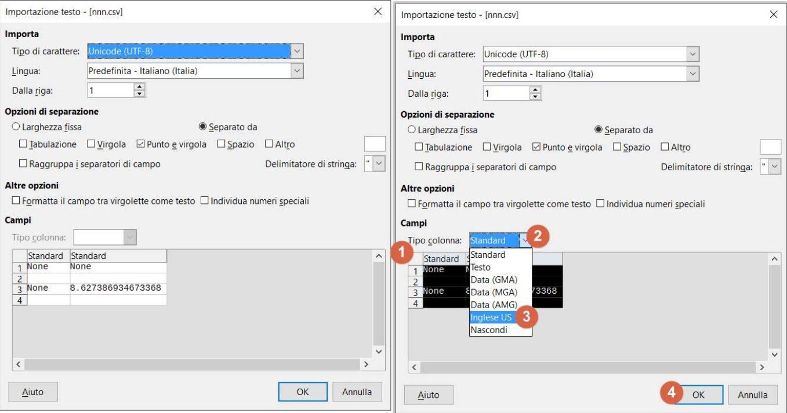{.center-img .img-70}

### Cenni sul calcolatore di campi

[HfcQGIS](http://hfcqgis.opendatasicilia.it/it/latest/calcolatore_campi/index.html)

Il pulsante `pallottoliere`  nella tabella degli attributi consente di eseguire calcoli sulla base di valori di attributo esistenti o funzioni definite, ad esempio, per calcolare la lunghezza o l’area delle caratteristiche geometriche. I risultati possono essere scritti in un nuovo campo di attributo, un campo virtuale, oppure possono essere utilizzati per aggiornare i valori in un campo esistente.

field calc rapido:

{.center-img .img-70}

field calc completo:

{.center-img .img-70}

## Join e relazioni

### Join

I dataset che utilizziamo nel nostro lavoro potrebbero essere incompleti oppure vogliamo semplicemente ampliarli con altri dati (es: csv, xls, ods ecc..) tramite una semplice ‘unione‘ di tabelle sfruttando un campo correlato. Questa operazione è conosciuta come _Join tabellare_: vediamo come funziona in QGIS.

schema logico SQL Join:

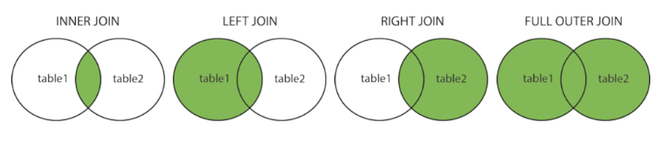{.center-img .img-70}

QGIS utilizza LEFT JOIN per fare la JOIN tabellare.

Da proprietà layer, scheda Join:

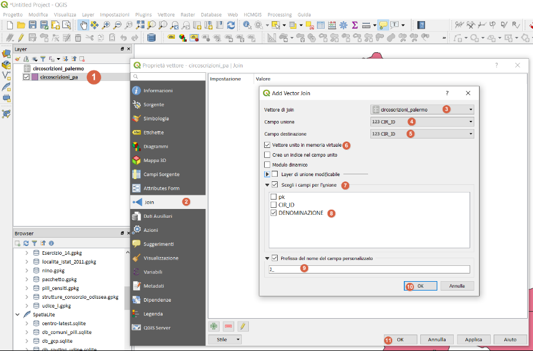{.center-img .img-70}

### Relazioni

Le _Relazioni_ vengono utilizzate ogniqualvolta nasce la necessità di dover mettere in relazione due tabelle, una con `n` record e un’altra con `m` record (con `n` < `m`) cioè il classico esempio della relazione uno a molti, relazione ‘padre’ → ‘figlio’.

Le relazioni sono molto usate in QGIS, sia tra shapefile che tra semplici tabelle o shapefile e semplici tabelle o vettori PostGIS; vengono usate anche negli Atlas (Atlanti) nel compositore di stampe.

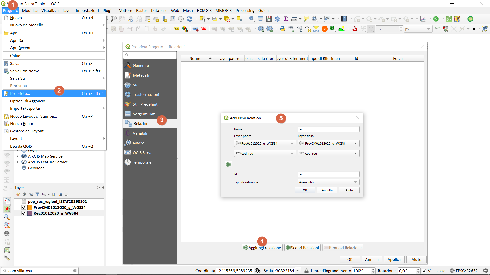{.center-img .img-70}

Per visualizzare le tabelle in relazione occorre utilizzare la modalità `modulo`

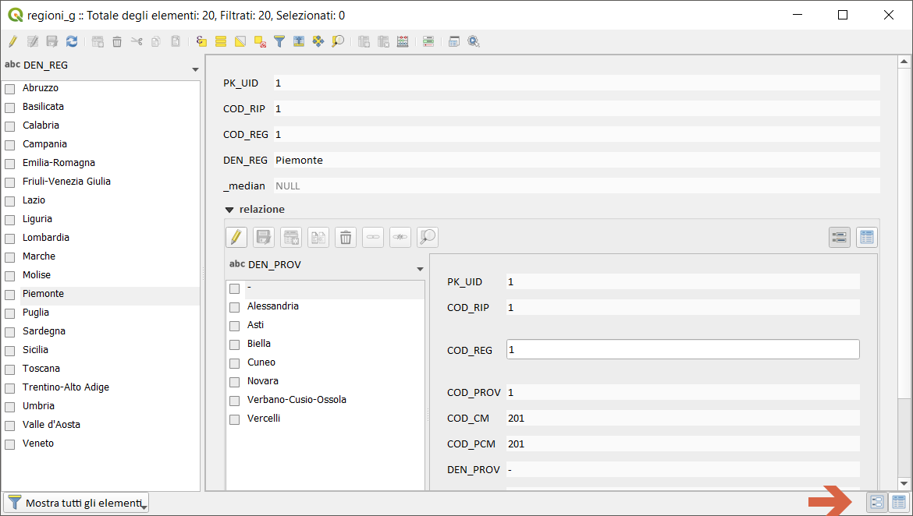{.center-img .img-70}

### Unisci attributi 

secondo il valore di un campo

Questo [algoritmo](https://docs.qgis.org/3.34/en/docs/user_manual/processing_algs/qgis/vectorgeneral.html#qgisjoinattributestable) di processing permette di realizzare direttamente (_e permanentemente_) l'unione degli attributi per i due casi possibili (_Join_ e _Relazioni_) :

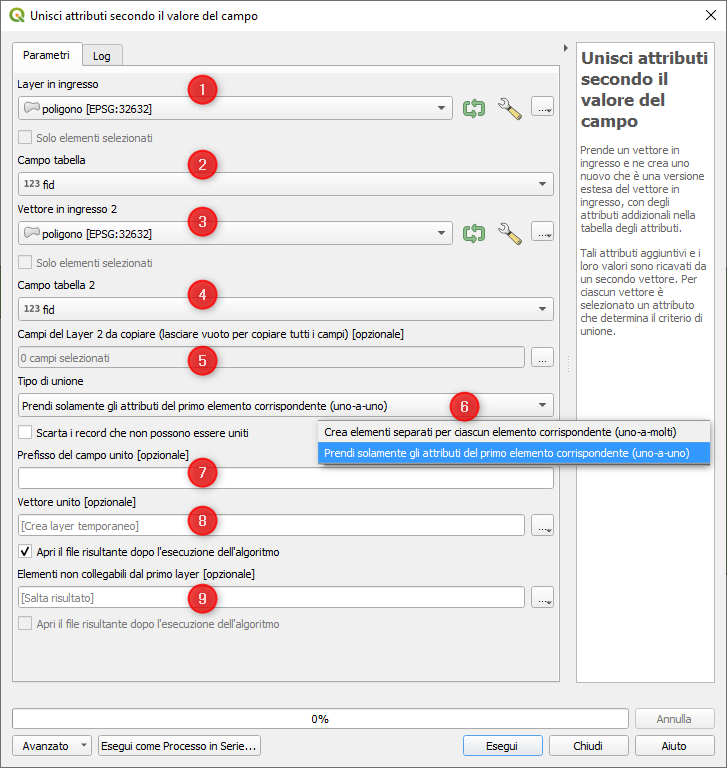{.center-img .img-50}

1. _Layer in ingresso_ o layer di sinistra;
2. _Campo tabelle_ è l'attributo correlato del layer di sinistra;
3. _Vettore in ingresso 2_ è il layer di destra (da cui prendere gli attributi);
4. _Campo tabelle 2_ è l'attributo correlato del layer di destra;
5. _Campi del layer 2 da copiare_, permette di selezionare gli attributi da unire alla tabella di sinistra;
6. _Tipo di unione_, classico JOIN tabellare 1:1 oppure tipica relazione 1:m;
7. _Prefisso del campo unito_, permette di aggiungere un prefisso al nome degli attributi uniti in modo da distinguerli facilmente da quelli non uniti (per esempio `j_`);
8. _Vettore unito_, output completo del layer unito;
9. _Elementi non collegabili dal primo layer_, output completo dove memorizza i dati che non possono essere uniti.

OSSERVAZIONI:

1. Crea sempre un nuovo layer;
2. Potrebbe creare layer topologicamente non corretti soprattutto per 1:m;

### Spatial join

Lo _**spatial join**_ è una comunissima operazione in ambito GIS che permette di trasferire attributi da un layer ad un altro in base alle loro _relazioni spaziali_ (interseca, contiene,tocca, ecc...), questa operazione viene usata spesso per rispondere alla domanda: quali geometrie sono più vicine ad altre?

Lo spatial join in QGIS:

1. tramite strumenti di processing:
    1. [Unisci attributi per posizione](https://docs.qgis.org/3.34/en/docs/user_manual/processing_algs/qgis/vectorgeneral.html#qgisjoinattributesbylocation);
    2. [Unisci attributi per posizione (riepilogo)](https://docs.qgis.org/3.34/en/docs/user_manual/processing_algs/qgis/vectorgeneral.html#qgisjoinbylocationsummary);
    3. [Unisci attributi dal vettore più vicino](https://docs.qgis.org/3.34/en/docs/user_manual/processing_algs/qgis/vectorgeneral.html#qgisjoinbynearest);
   
2. tramite espressioni:
    1. funzioni overlay_*
   
3. tramite query spaziali SQL;
4. tramite selezione per posizione o per vicinanza:
    1. Seleziona per posizione;
    2. Seleziona entro una distanza (> QGIS 3.28);

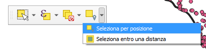{.center-img .img-50}

### Esercitazione

usando i vari metodi:

1. Creare una **join** tabellare tra il vettore `ProvCM01012025_g_WGS84.shp`  e la tabella `pop_res_prov_2023`;
2. Creare una **relazione di progetto** tra il vettore `ProvCM01012025_g_WGS84.shp` e il vettore `Com01012025_g_WGS84.shp`;
3. Usando gli strumenti di processing (Unisci attributi secondo il valore di un campo);
4. vedi esercitazione sullo spatial join.

## Azioni

Le azioni in QGIS sono una funzionalità potente che ti permette di aggiungere interattività alle tue mappe. In pratica, le azioni consentono di eseguire determinate operazioni o comandi quando si clicca su un elemento specifico della mappa. Questo apre un mondo di possibilità per personalizzare la tua esperienza con QGIS e creare mappe dinamiche.

Le azioni vengono definite a livello di Layer, ovvero, dalle proprietà del layer:

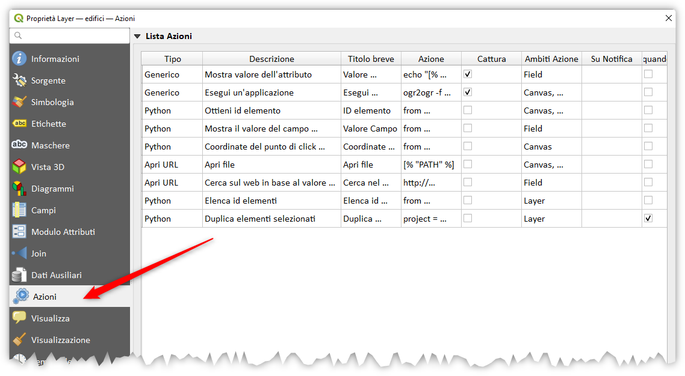{.center-img .img-70}

e possono essere di vario tipo:

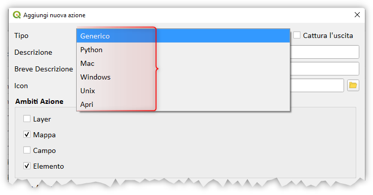{.center-img .img-50}

e di vario ambito:

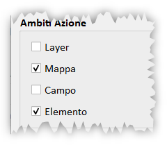{.center-img .img-30}

esempi su QGIS.

## Suggerimento mappa

Il suggerimento mappa in QGIS è uno strumento che permette di visualizzare informazioni dettagliate su un elemento specifico della mappa semplicemente passandoci sopra con il mouse. Quando il cursore si trova su un punto, una linea o un poligono, compare una piccola finestra pop-up che mostra i dati associati a quell'elemento.

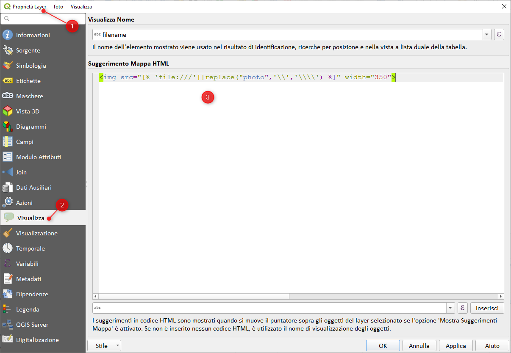{.center-img .img-70}

```

```

NB: mai usare `\` ma `/` nei percorsi dei file; oppure occorre raddoppiarli `\\`

esempio per aprire un PDF: (azione Generico o Windows)

```
"C:\Program Files\Tracker Software\PDF Viewer\PDFXCview.exe" "[% @project_folder||'/'||"nomePDF"%]"
```

per chi usa Adobe Acrobat:

```
"C:\Program Files\Adobe\Acrobat DC\Acrobat\Acrobat.exe" "[% @project_folder||'/'||"nomePDF"%]"
```


{!includes/disclaimer.md!}
