---
hide:
  # - navigation
  # - toc
title: Vettori
description: Vettori
---

# I dati geografici vettoriali

## Digitalizzazione dei vettori

Ogni volta che dobbiamo creare un nuovo vettore, dobbiamo rispondere (mentalmente) a queste domande:

1. che tipo di vettore voglio disegnare? (punti, linea o poligono);
2. in che area del Mondo? (meglio aree di livello regionale, per i Fusi e fasce);
3. che sistema di rappresentazione (geografico e proiettato)?
4. scelta EPSG tra i disponibili.
5. formato GIS (shp, gpkg, sqlite, kml, ecc...)

### Creare vettore

Esempio di risposta:

1. Poligono;
2. Puglia;
3. proiettato;
4. sono disponibili: **3004**, **32633**, **23033**, 25833, 3065, 6708 e 6875
5. shapefile

| NOME                              |  DATUM  |       PROIEZIONE        |   EPSG    | unità | Note              |
| --------------------------------- | :-----: | :---------------------: | :-------: | :---: | ----------------- |
| Monte Mario/Italy Zone 2 (fuso E) | Roma 40 | Gauss-Boaga – Fuso: Est | **3004**  |   m   |
| ED50/UTM zone 33N                 |  ED50   |     UTM – Zona: 33N     | **23033** |   m   |
| WGS84/UTM zone 33N                |  WGS84  |     UTM – Zona: 33N     | **32633** |   m   |
| ETRS89/UTM zone 33N               | ETRS89  |     UTM – Zona: 33N     |   25833   |   m   |
| IGM95/UTM zone 33N                |  IGM95  |     UTM – Zona: 33N     |   3065    |   m   |
| RDN2008/UTM zone 33N (N-E)        |  IGM95  |     UTM – Zona: 33N     |   6708    |   m   | Per Enti Pubblici |
| RDN2008/Italy zone (N-E)          |  IGM95  |    Italy zone (N-E)     |   6875    |   m   | Per Enti Pubblici |

<https://epsg.io/?q=Italy>

dal menu Layer | Crea Vettore | Nuovo Layer Shapefile:

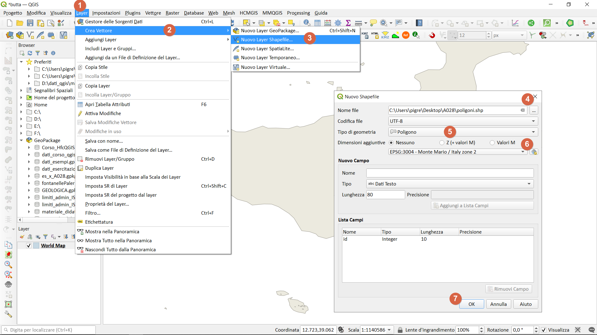{.center-img .img-70}

### Strumenti CAD

Vettorializzazione avanzata di tipo CAD

#### Introduzione

Questa barra contiene molti strumenti base per l'editing degli elementi vettoriali.

QGIS 3.22

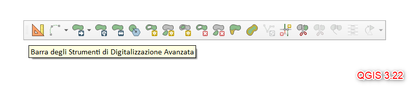{.center-img .img-70}

La _Barra degli strumenti di Digitalizzazione Avanzata_ è attivabile dal menu _Visualizza_ (1) | _Barra degli Strumenti_ (2) | _Barra degli strumenti di Digitalizzazione Avanzata_ (3)

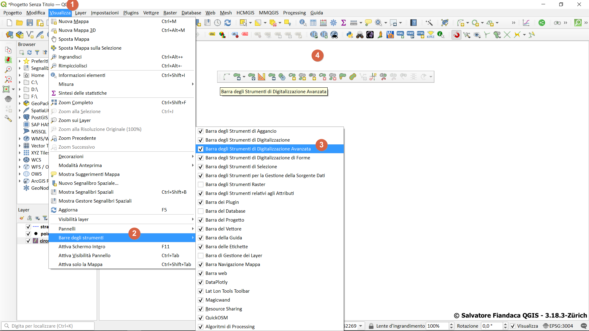{.center-img .img-70}

alcuni strumenti potrebbero essere `disattivati` (in grigetto) in quanto dipendono dal tipo di geometria (punto, Multi-linea o Multi-poligono) oppure dipende dalla selezione di elementi.

#### Barra

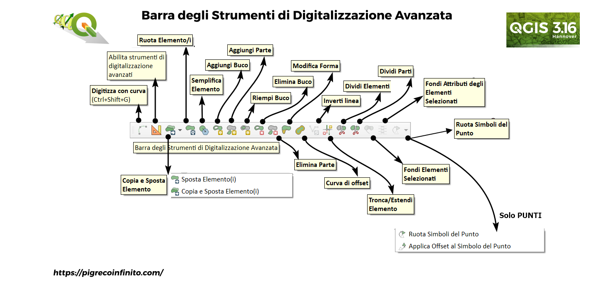{.center-img .img-70}

#### Strumenti

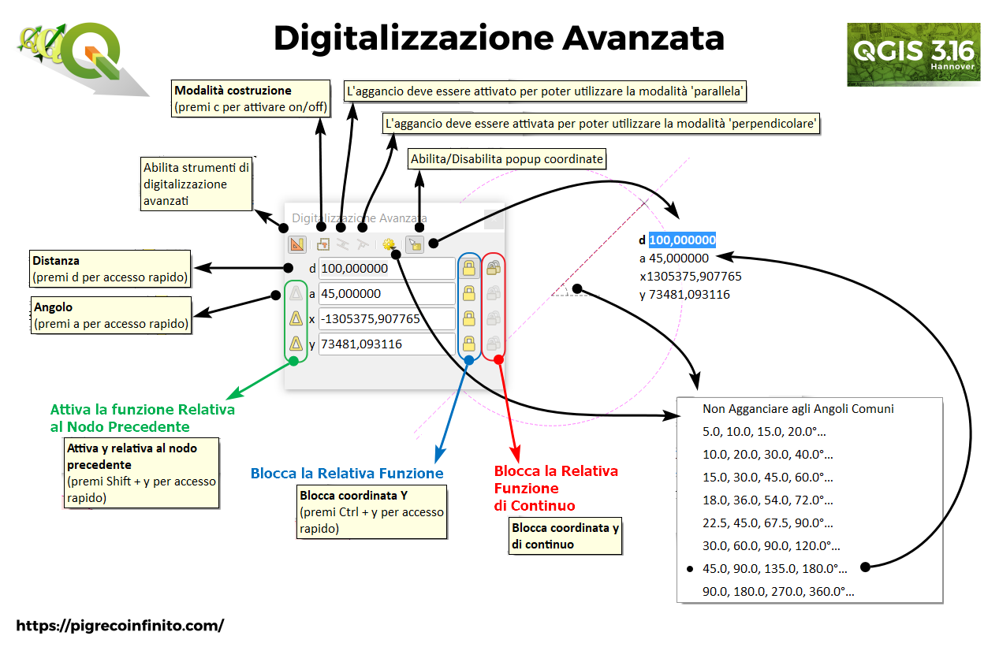{.center-img .img-70}

In [QGIS 3.22](https://changelog.qgis.org/en/qgis/version/3.22/#advanceddigitizing-add-zm-support) sono stati introdotti `z/m`

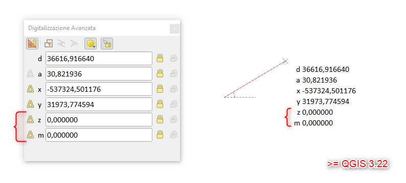{.center-img .img-70}

#### Digitalizzazione avanzata

La digitalizzazione avanzata ci permette di disegnare in modo preciso potendo definire:

1. lunghezza segmenti;
2. angoli;
3. parallelismo e ortogonalità;
4. disegno tramite costruzioni;

| Lettera | Descrizione                                 | `Ctrl +`               | `Shift +`                                  |
| :-----: | ------------------------------------------- | ---------------------- | ------------------------------------------ |
|    d    | Imposta Distanza                            | Blocca Distanza        | -                                          |
|    a    | Imposta Angolo                              | Blocca Angolo          | Attiva angolo riferito all'ultimo segmento |
|    x    | Imposta la coordinata X                     | Blocca la Coordinata X | Sposta la posizione X all'ultimo vertice   |
|    y    | Imposta la coordinata Y                     | Blocca la Coordinata Y | Sposta la posizione Y all'ultimo vertice   |
|    z    | Imposta la coordinata Z                     | Blocca la Coordinata Z | Sposta la posizione Z all'ultimo vertice   |
|    m    | Imposta la misura M                         | Blocca la Coordinata M | Sposta la posizione M all'ultimo vertice   |
|    c    | Attiva Modalità Costruzione                 | -                      | -                                          |
|    p    | Attiva modalità Perpendicolare e Parallella | -                      | -                                          |

#### Barra degli Strumenti di Digitalizzazione Avanzata

Questi strumenti ci permettono di modificare i nostri disegni:

1. copiare, spostare e ruotare;
2. semplificare;
3. dividere;
4. invertire le linee;
5. fondere geometrie o attributi;
6. ruotare somboli punti;
7. ecc...

{.center-img .img-90}

| icona                                                                                                                                   | azione                                                 | descrizione                                                                  | esempio |
| --------------------------------------------------------------------------------------------------------------------------------------- | ------------------------------------------------------ | ---------------------------------------------------------------------------- | ------- |
| {.center-img .img-50}                                                                                                               | Abilita strumenti CAD                                  | Lo strumento è attivabile **solo** per layer proiettati                      |
| 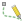{.center-img .img-50}                                                                                          | Abilita la modalità digitalizzazione a mano libera (R) | Lo strumento è attivabile **solo** per layer Lineari e poligonali            |
| {.center-img .img-50} {.center-img .img-50} {.center-img .img-50} | Copia e Sposta Elementi                                | Lo strumento è valido per tutti i tipi di geometria: Punti, linee e poligoni |
| {.center-img .img-50}                                                                                              | Ruota Elementi/i                                       | Lo strumento è valido per tutti i tipi di geometria: Punti, linee e poligoni |
| {.center-img .img-50}                                                                                               | Scala Elementi/i                                       | `Ctrl + clic` per impostare il punto base                                    |
| {.center-img .img-50}                                                                                                   | Semplifica Elemento                                    | Lo strumento è valido solo per: linee e poligoni                             |
| {.center-img .img-50}                                                                                                    | Aggiungi Buco                                          | Lo strumento è valido solo per poligoni                                      |
| 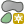{.center-img .img-50}                                                                                                    | Aggiungi Parte                                         | Lo strumento è valido solo per poligoni e linee                              |
| {.center-img .img-50}                                                                                                   | Riempi Buco                                            | Lo strumento è valido solo per poligoni - usa `Shift + clic`                 |
| {.center-img .img-50}                                                                                                 | Elimina Buco                                           | Lo strumento è valido solo per poligoni                                      |
| 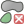{.center-img .img-50}                                                                                                 | Elimina Parte                                          | Lo strumento è valido solo per poligoni e linee                              |
| 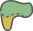{.center-img .img-50}                                                                                                    | Modifica Forma                                         | Lo strumento è valido solo per poligoni e linee                              |
| {.center-img .img-50}                                                                                                | Curva di Offset                                        | Lo strumento è valido solo per poligoni e linee                              |
| {.center-img .img-50}                                                                                                | Inverti Linea                                          | Lo strumento è valido solo per linee                                         |
| 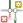{.center-img .img-50}                                                                                                 | Tronca/Estendi Elemento                                | Lo strumento è valido solo per poligoni e linee                              |
| 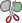{.center-img .img-50}                                                                                              | Dividi Elementi                                        | Lo strumento è valido solo per poligoni e linee                              |
| 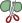{.center-img .img-50}                                                                                                 | Dividi Parti                                           | Lo strumento è valido solo per poligoni e linee                              |
| {.center-img .img-50}                                                                                              | Fondi Elementi Selezionati                             | Lo strumento è valido solo per poligoni e linee                              |
| 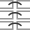{.center-img .img-50}                                                                                     | Fondi Attributi Elementi Selezionati                   | Lo strumento è valido solo per poligoni e linee                              |
| {.center-img .img-50}                                                                                         | Ruota Simboli del Punto                                | Lo strumento è valido solo per Punti                                         |

In **QGIS 3.22** è stata introdotta la possibilità di convertire una qualsiasi geometria da linea a curva, basta selezionare il vertice con lo strumento Vertice e pigiare la lettera `O`.

Per editare un vettore occorre selezionare il relativo layer nella TOC e attivare la modifica, matita

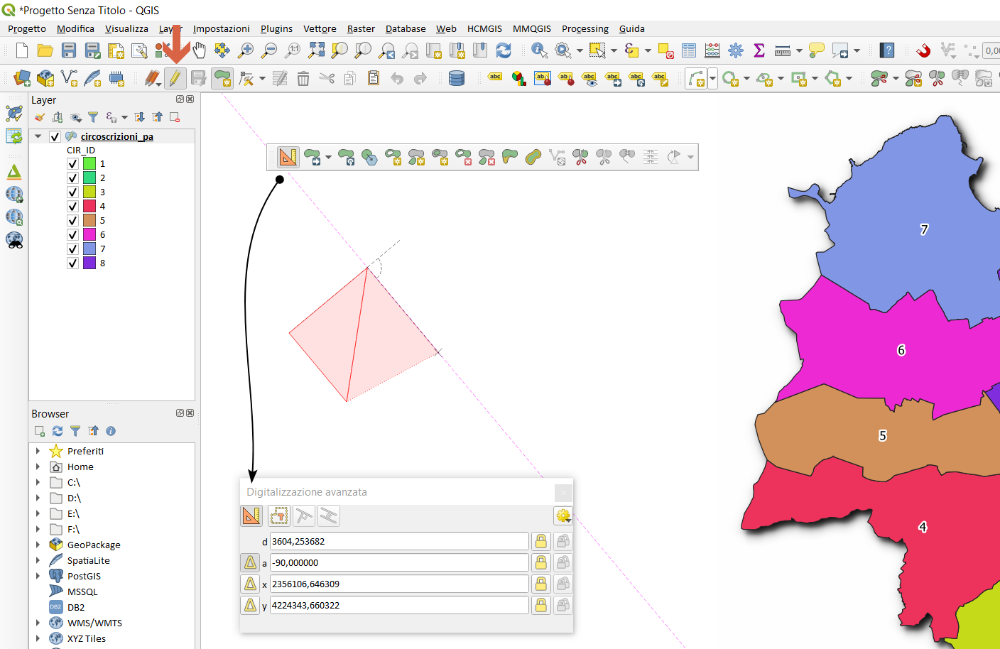{.center-img .img-70}

---

#### Esercitazione disegno

Usando la mappa di base **OSM Standard** (dal plugin QMS), centrare la map canvas su _ITIS Leonardo Da Vinci Pisa_ (scala 1.700). Creare un layer temporaneo di tipo poligonale con EPSG 3857 e digitalizzare gli edifici presenti.

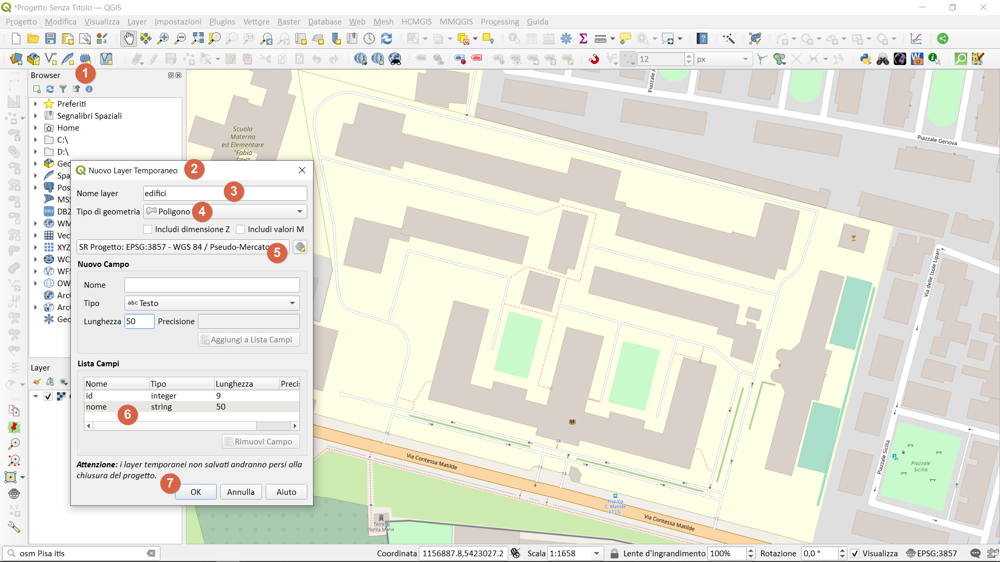{.center-img .img-50}

#### Riferimenti utili

- Aggancio : <https://docs.qgis.org/3.16/en/docs/user_manual/working_with_vector/editing_geometry_attributes.html#enable-snapping-on-intersections>
- digitizing toolbar : <https://pigrecoinfinito.com/2019/07/26/qgis-shape-digitizing-toolbar/>
- guida QGIS: <https://docs.qgis.org/3.16/it/docs/user_manual/working_with_vector/editing_geometry_attributes.html?highlight=offset#editing>

- <https://docs.qgis.org/3.4/pdf/it/QGIS-3.4-UserGuide-it.pdf>
- <https://docs.qgis.org/3.10/it/docs/user_manual/working_with_vector/editing_geometry_attributes.html?highlight=strumento%20vertice#basic-operations>

{!includes/disclaimer.md!}
