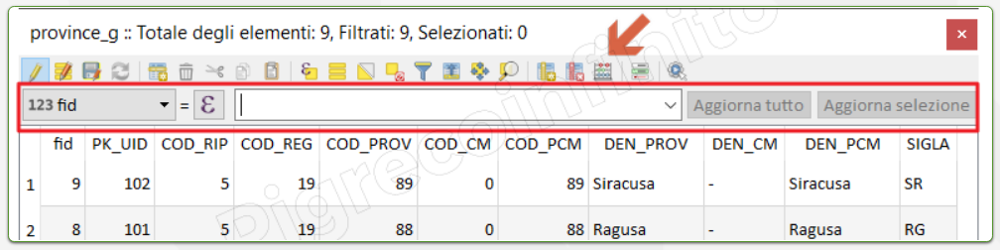
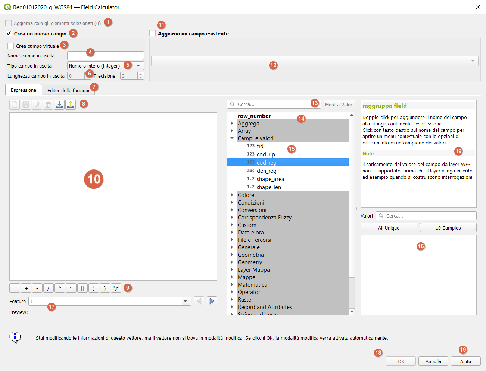
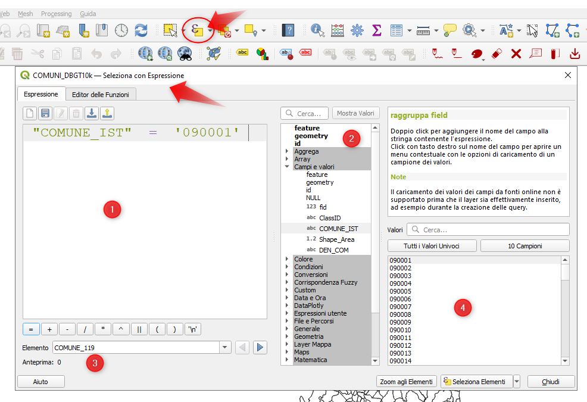

---
hide:
  # - navigation
  # - toc
title: Field Calc
description: Motore delle Espressioni
---

# I dati geografici vettoriali

## Cenni sul Motore delle Espressioni

[HfcQGIS](http://hfcqgis.opendatasicilia.it/it/latest/calcolatore_campi/index.html)

### Field Calc

Il pulsante `pallottoliere`  nella tabella degli attributi consente di eseguire calcoli sulla base di valori di attributo esistenti o funzioni definite, ad esempio, per calcolare la lunghezza o l’area delle caratteristiche geometriche. I risultati possono essere scritti in un nuovo campo di attributo, un campo virtuale, oppure possono essere utilizzati per aggiornare i valori in un campo esistente.

field calc rapido:

{.center-img .img-50}

field calc completo:

{.center-img .img-50}


#### Introduzione

Il Calcolatore di campi è uno strumento essenziale di QGIS che permette di:

- Creare nuovi campi
- Aggiornare campi esistenti
- Eseguire calcoli su attributi
- Manipolare dati attraverso espressioni

#### Accesso al Calcolatore

1. Aprire la tabella degli attributi del layer
2. Cliccare sull'icona del calcolatore di campi (abaco) 
3. Alternativa: tasto destro sul layer → Apri calcolatore di campi

#### Interfaccia principale

=== "Sezione Creazione campo"

    - Nome del campo di output
    - Tipo di campo (Testo, Numero intero, Decimale, Data, ecc.)
    - Lunghezza del campo
    - Precisione (per numeri decimali)

=== "Editor espressioni"

    - Area per scrivere le formule
    - Anteprima del risultato
    - Messaggi di errore

=== "Lista funzioni"
    - Funzioni raggruppate per categoria
    - Operatori
    - Campi disponibili

---

#### Tipi di campo principali

=== "Text (String)"

    - Lunghezza: numero massimo di caratteri
    - Esempio: nomi, descrizioni

=== "Whole number (Integer)"

    - Numeri interi
    - Esempio: conteggi, codici

=== "Decimal number (Real)"

    - Numeri con decimali
    - Precisione: numero di decimali
    - Esempio: misure, calcoli

=== "Date"

    - Formato data
    - Esempio: date eventi, scadenze

---

#### Esempi pratici di calcolo

=== "Calcoli matematici base"
    ```
    -- Area in ettari partendo da metri quadri
    "area_m²" / 10000

    -- Perimetro in kilometri
    $length / 1000
    ```

=== "Manipolazione testo"
    ```
    -- Unione di due campi
    "nome" || ' ' || "cognome"

    -- Conversione in maiuscolo
    upper("nome_campo")
    ```

=== "Calcoli con date"

    ```
    -- Età di un edificio
    year(now()) - "anno_costruzione"

    -- Formattazione data
    format_date("data_campo",'dd/MM/yyyy')
    ```

=== "Condizioni (CASE)"

    ```
    CASE
      WHEN "popolazione" > 100000 THEN 'Grande'
      WHEN "popolazione" > 50000 THEN 'Media'
      ELSE 'Piccola'
    END
    ```

#### Funzioni utili

=== "Geometria"

      - `$area`: area dell'elemento
      - `$length`: lunghezza dell'elemento
      - `$perimeter`: perimetro dell'elemento
      - `$x`: coordinata X del centroide
      - `$y`: coordinata Y del centroide

=== "Stringhe"

      - `concat()`: unisce stringhe
      - `left()`: primi n caratteri
      - `right()`: ultimi n caratteri
      - `substr()`: estrae sottostringhe
      - `regexp_replace()`: sostituisce usando espressioni regolari

=== "Matematiche"

      - `round()`: arrotondamento
      - `ceil()`: arrotonda per eccesso
      - `floor()`: arrotonda per difetto
      - `abs()`: valore assoluto

=== "Data/Ora"

      - `now()`: data e ora corrente
      - `age()`: calcola intervallo tra date
      - `day()`: estrae il giorno
      - `month()`: estrae il mese
      - `year()`: estrae l'anno

---

#### Esercizi pratici

=== "Calcolo densità popolazione"

    ```
    "popolazione" / ($area/1000000)
    ```

=== "Creazione codice identificativo"

    ```
    'ID_' || "cod_provincia" || '_' || "cod_comune"
    ```

=== "Classificazione per superficie"

    ```
    CASE
      WHEN $area > 1000000 THEN 'XL'
      WHEN $area > 500000 THEN 'L'
      WHEN $area > 100000 THEN 'M'
      ELSE 'S'
    END
    ```
---

#### Suggerimenti e best practices

1. Verificare sempre il tipo di campo appropriato
2. Usare l'anteprima prima di applicare i calcoli
3. Fare backup dei dati prima di modifiche massive
4. Considerare la precisione necessaria per i decimali
5. Documentare le formule complesse con commenti

#### Problemi comuni e soluzioni

=== "Errori di tipo"

    - Verificare la compatibilità dei tipi di dati
    - Usare funzioni di conversione quando necessario

=== "Errori di sintassi"

    - Controllare parentesi
    - Verificare operatori
    - Usare l'anteprima

=== "Errori di lunghezza campo"

    - Impostare lunghezza adeguata
    - Considerare casi estremi

---

### Selezione per Espressione

#### Introduzione
La funzione "Seleziona per espressione" è uno strumento potente di QGIS che permette di selezionare elementi in un layer utilizzando espressioni logiche e matematiche. Si trova nella barra degli strumenti principale o premendo `Ctrl+F3`.

{.center-img .img-70}

#### Interfaccia

1. **Editor espressioni**: Area dove si scrive l'espressione
2. **Lista funzioni**: Elenco delle funzioni disponibili raggruppate per categorie
3. **Anteprima**: Mostra un'anteprima del risultato dell'espressione
4. **Valori**: Lista dei valori disponibili nel campo selezionato

#### Operatori principali

- **Confronto**: `=`, `!=`, `>`, `<`, `>=`, `<=`
- **Logici**: `AND`, `OR`, `NOT`
- **Aritmetici**: `+, -, *, /, %`
- **Stringhe**: `||, LIKE, ILIKE`

#### Esempi pratici

=== "Selezione per valore esatto"
    ```
    "nome_campo" = 'valore'
    ```
    Esempio: `"popolazione" = 1000`

=== "con intervallo numerico"
    ```
    "campo_numerico" >= 100 AND "campo_numerico" <= 500
    ```
    Esempio: `"altitudine" >= 200 AND "altitudine" <= 1000`

=== "con testo parziale"
    ```
    "nome_campo" LIKE '%testo%'
    ```
    Esempio: `"nome_comune" LIKE 'San%'`

=== "con multiple condizioni"
    ```
    "campo1" = 'valore1' OR ("campo2" >= 100 AND "campo2" <= 500)
    ```

---

## Funzioni utili

=== "geometria"

    - `$area`: area dell'elemento
    - `$length`: lunghezza dell'elemento
    - `within()`: verifica se una geometria è contenuta in un'altra

=== "stringa"

    - `lower()`: converte in minuscolo
    - `upper()`: converte in maiuscolo
    - `substr()`: estrae una sottostringa

=== "data""

    - `year()`: estrae l'anno
    - `month()`: estrae il mese
    - `day()`: estrae il giorno


{!includes/disclaimer.md!}
