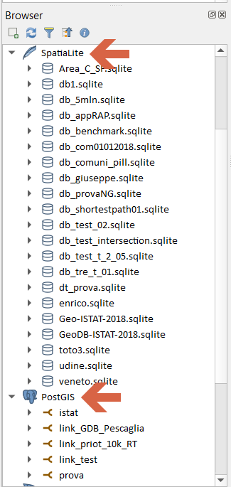
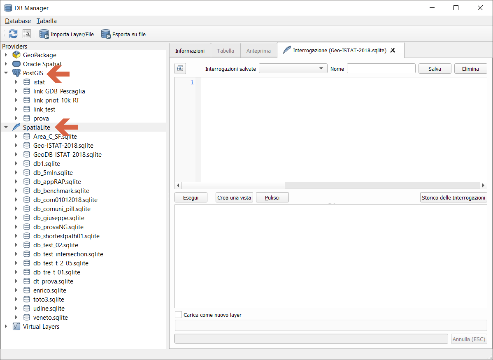
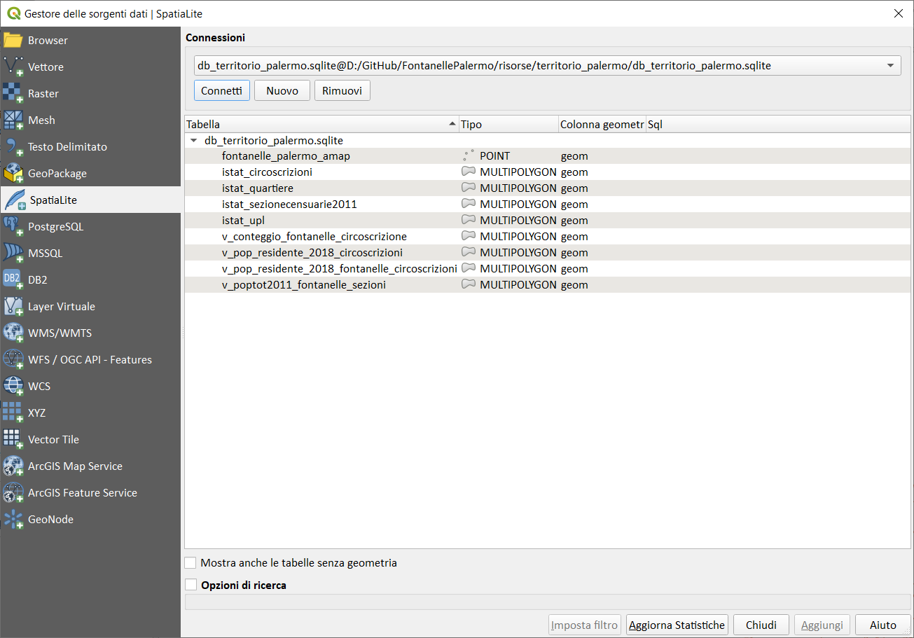
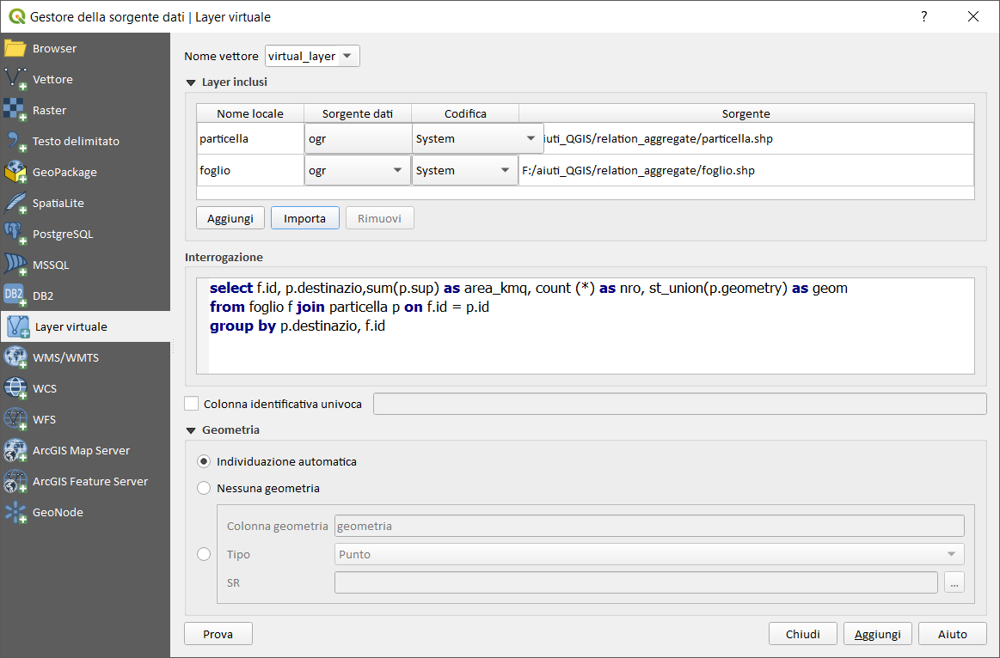

---
hide:
  # - navigation
  # - toc
title: I geodatabase e QGIS
description: I geodatabase e QGIS
---

# I geodatabase e QGIS

## Introduzione

QGIS offre un ampio supporto per i geodatabase, che sono sistemi di gestione di dati spaziali progettati per archiviare, indicizzare e gestire informazioni geografiche. 

Caratteristiche principali:

1. Supporto per diversi tipi di geodatabase:
    - PostGIS (basato su PostgreSQL);
    - SpatiaLite (basato su SQLite);
    - GeoPackage;
    - File Geodatabase di ESRI;

2. Connessione ai geodatabase:
    - Interfaccia grafica per la connessione e la gestione delle connessioni;
    - Supporto per autenticazione e connessioni sicure;

3. Funzionalità:
    - Archiviazione efficiente di grandi quantità di dati spaziali;
    - Supporto per indici spaziali per query più veloci;
    - Gestione di relazioni tra dataset;
    - Supporto per topologia;

4. Operazioni sui dati:
    - Lettura e scrittura di dati vettoriali e raster;
    - Esecuzione di query SQL direttamente in QGIS;
    - Editing concorrente dei dati;

5. Integrazione con gli strumenti di QGIS:
    - Analisi spaziale;
    - Geoprocessing;
    - Visualizzazione e stilizzazione;

6. Vantaggi:
    - Centralizzazione dei dati;
    - Miglior gestione di grandi volumi di dati;
    - Supporto multi-utente;
    - Integrità dei dati e controllo delle versioni (per alcuni geodatabase);

7. Compatibilità:
    - Interoperabilità con altri software GIS;
    - Supporto per standard OGC;

8. Performance:
    - Ottimizzazione delle query spaziali;
    - Caching per migliorare le prestazioni;

L'utilizzo dei geodatabase in QGIS permette una gestione più efficiente e robusta dei dati geospaziali, specialmente per progetti di grandi dimensioni o che richiedono accesso multiutente. Sono particolarmente utili in ambiti come la pianificazione urbana, la gestione ambientale, e in generale in tutti i contesti dove è necessario gestire grandi quantità di dati spaziali in modo strutturato.

## GeoDatabase

I due più famosi - rilasciati con licenza libera - utilizzati in QGIS sono:

1. **PostgreSQL/PostGIS** - è un completo DBMS ad oggetti, estensione spaziale è PostGIS - architettura client/server - multiutente;
2. **SQLite/SpatiaLite** - è una libreria software scritta in linguaggio C che implementa un DBMS SQL, estensione spaziale è SpatiaLite - semplice file - monoutente;

### PostgreSQL/PostGIS

{.center-img .img-40}

### SQLite/SpatiaLite

{.center-img .img-40}

Entrambi utilizzano il linguaggio SQL (Structured Query Language) e hanno, quasi identiche, funzioni spaziali.

Spatialite è utilizzato anche nel core di QGIS per esempio per gestire i codici EPSG oppure per i segnaposto.

## Come usarli in QGIS

1. tramite il Browser Panel;

{.center-img .img-30}

2. tramite il DBmanager;

{.center-img .img-70}

3. tramite il Gestore delle Sorgenti dati:

{.center-img .img-70}

## Virtual layer

È un tipo speciale di vettore consente di definire un layer come il risultato di un’interrogazione avanzata, utilizzando il linguaggio SQL su tutti i vettori che QGIS è in grado di aprire. Questi layer sono chiamati layer virtuali: non caricano dati propri e possono essere visti come una visualizzazione di altri layer.

{.center-img .img-70}

## Esempi di Query SQL

### Query per PostgreSQL/PostGIS

#### Query di base per geometrie

```sql
-- Selezionare tutte le features con la geometria
SELECT gid, nome, ST_AsText(geom)
FROM mia_tabella;

-- Calcolare l'area di un poligono (in metri quadri se SR metrico)
SELECT nome, ST_Area(geom) as area_mq
FROM poligoni_comunali;

-- Calcolare il perimetro di un poligono
SELECT nome, ST_Perimeter(geom) as perimetro_m
FROM province;
```

#### Query spaziali avanzate

```sql
-- Buffer di 1000 metri attorno a un punto
SELECT nome, ST_Buffer(geom, 1000) as buffer_geom
FROM punti_interesse;

-- Intersezione tra due layer
SELECT p1.nome as comune, p2.nome as provincia
FROM comuni p1, province p2
WHERE ST_Intersects(p1.geom, p2.geom);

-- Trovare i punti dentro un raggio di 5km da un punto specifico
SELECT nome, ST_Distance(geom, ST_MakePoint(12.4924, 41.8902)) as distanza
FROM edifici
WHERE ST_DWithin(geom, ST_MakePoint(12.4924, 41.8902), 5000);

-- Unione di geometrie (dissolve)
SELECT ST_Union(geom) as geom_unita
FROM regioni
WHERE macro_area = 'Nord';
```

#### Query con trasformazioni di coordinate

```sql
-- Trasformare da WGS84 (4326) a UTM 33N (32633)
SELECT nome, ST_Transform(geom, 32633) as geom_utm
FROM punti_wgs84;

-- Calcolare area in ettari per poligoni in coordinate geografiche
SELECT nome,
       ST_Area(ST_Transform(geom, 32633)) / 10000 as area_ettari
FROM appezzamenti_agricoli;
```

### Query per SQLite/SpatiaLite

#### Query di base per geometrie

```sql
-- Selezionare tutte le features con la geometria
SELECT rowid, nome, AsText(geometry)
FROM mia_tabella;

-- Calcolare l'area di un poligono
SELECT nome, Area(geometry) as area_mq
FROM poligoni_comunali;

-- Calcolare il perimetro di un poligono
SELECT nome, Perimeter(geometry) as perimetro_m
FROM province;
```

#### Query spaziali avanzate

```sql
-- Buffer di 1000 metri attorno a un punto
SELECT nome, Buffer(geometry, 1000) as buffer_geom
FROM punti_interesse;

-- Intersezione tra due layer
SELECT p1.nome as comune, p2.nome as provincia
FROM comuni p1, province p2
WHERE Intersects(p1.geometry, p2.geometry) = 1;

-- Trovare i punti dentro un raggio di 5km da un punto specifico
SELECT nome, Distance(geometry, MakePoint(12.4924, 41.8902)) as distanza
FROM edifici
WHERE Distance(geometry, MakePoint(12.4924, 41.8902)) <= 5000;

-- Unione di geometrie
SELECT UnaryUnion(Collect(geometry)) as geom_unita
FROM regioni
WHERE macro_area = 'Nord';
```

#### Query con trasformazioni di coordinate

```sql
-- Trasformare da WGS84 (4326) a UTM 33N (32633)
SELECT nome, Transform(geometry, 32633) as geom_utm
FROM punti_wgs84;

-- Calcolare area in ettari per poligoni
SELECT nome,
       Area(Transform(geometry, 32633)) / 10000 as area_ettari
FROM appezzamenti_agricoli;
```

### Query comuni per entrambi i sistemi

#### Analisi topologiche

```sql
-- PostGIS
SELECT a.nome, b.nome
FROM layer_a a, layer_b b
WHERE ST_Touches(a.geom, b.geom);

-- SpatiaLite
SELECT a.nome, b.nome
FROM layer_a a, layer_b b
WHERE Touches(a.geometry, b.geometry) = 1;
```

#### Query con aggregazioni

```sql
-- PostGIS - Contare elementi per categoria
SELECT categoria, COUNT(*) as numero_elementi,
       ST_Union(geom) as geometria_unita
FROM elementi_territoriali
GROUP BY categoria;

-- SpatiaLite - Contare elementi per categoria
SELECT categoria, COUNT(*) as numero_elementi,
       UnaryUnion(Collect(geometry)) as geometria_unita
FROM elementi_territoriali
GROUP BY categoria;
```

#### Query con condizioni spaziali e alfanumeriche

```sql
-- PostGIS - Edifici residenziali in un comune specifico
SELECT e.id, e.tipo, e.superficie
FROM edifici e, comuni c
WHERE e.tipo = 'residenziale'
  AND c.nome = 'Milano'
  AND ST_Within(e.geom, c.geom);

-- SpatiaLite - Edifici residenziali in un comune specifico
SELECT e.rowid, e.tipo, e.superficie
FROM edifici e, comuni c
WHERE e.tipo = 'residenziale'
  AND c.nome = 'Milano'
  AND Within(e.geometry, c.geometry) = 1;
```

!!! tip "Suggerimento"
    Le query SQL possono essere eseguite direttamente in QGIS tramite:

    - **DB Manager**: Plugin → Database → DB Manager
    - **Virtual Layers**: Layer → Aggiungi layer → Aggiungi/Modifica layer virtuale
    - **Provider di espressioni**: Nel calcolatore di campi utilizzando le funzioni SQL

!!! warning "Attenzione"
    - In PostGIS le funzioni spaziali iniziano con `ST_` (Spatial Type)
    - In SpatiaLite le funzioni spaziali non hanno prefisso
    - Le performance dipendono dalla presenza di indici spaziali appropriati
    - Sempre verificare il sistema di coordinate di riferimento prima di calcoli metrici


{!includes/disclaimer.md!}
