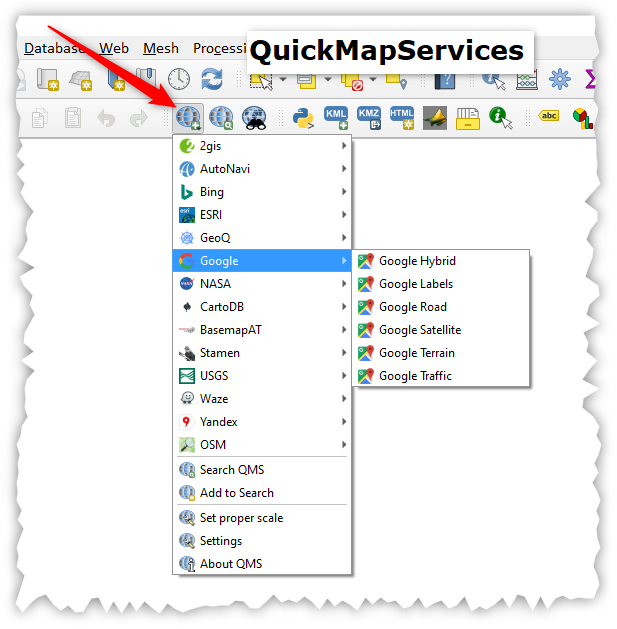
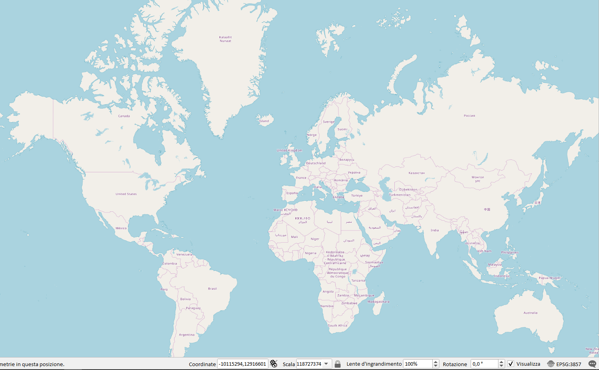
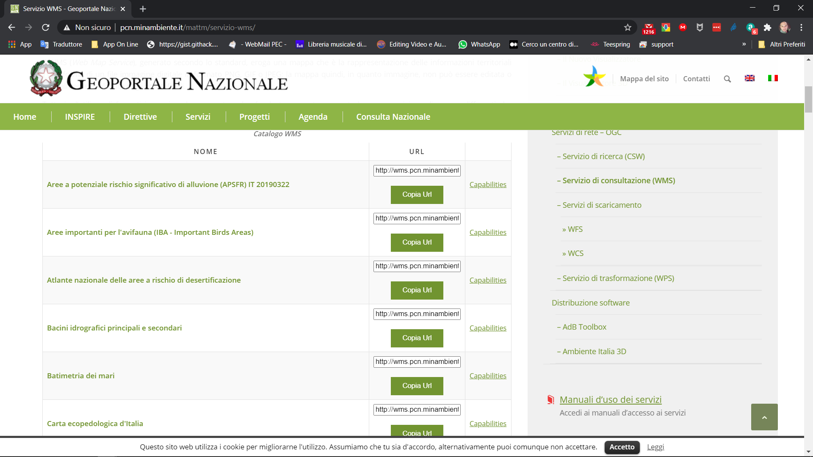
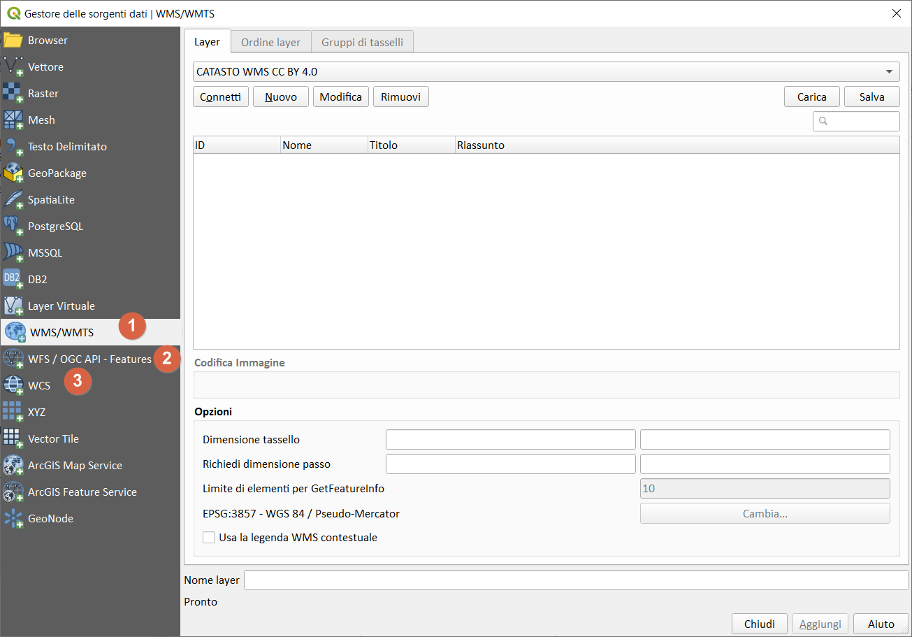
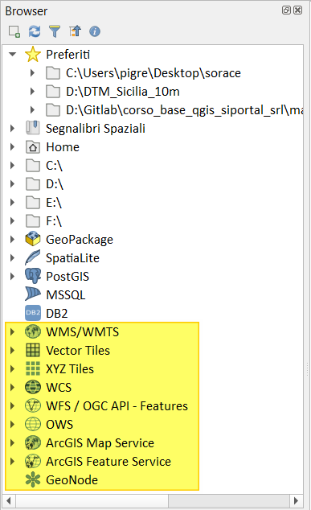
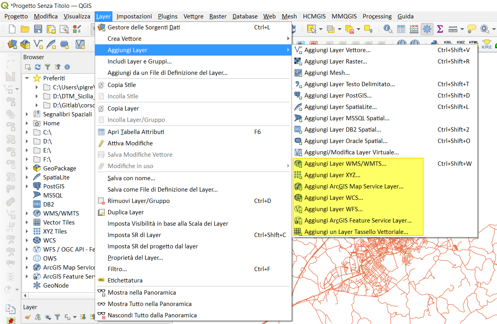
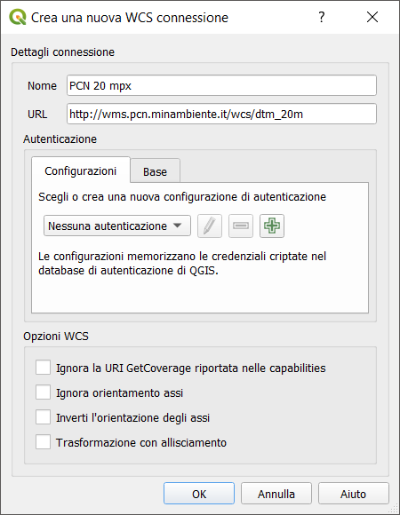
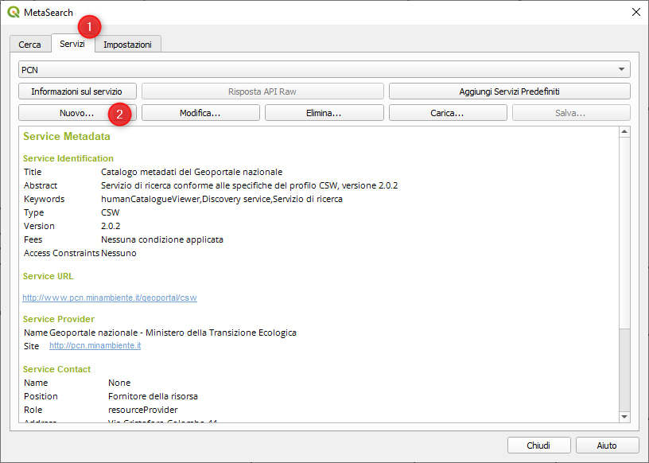
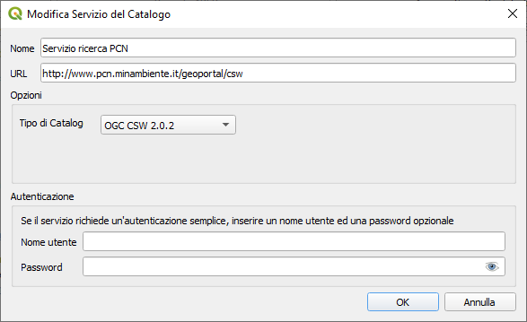
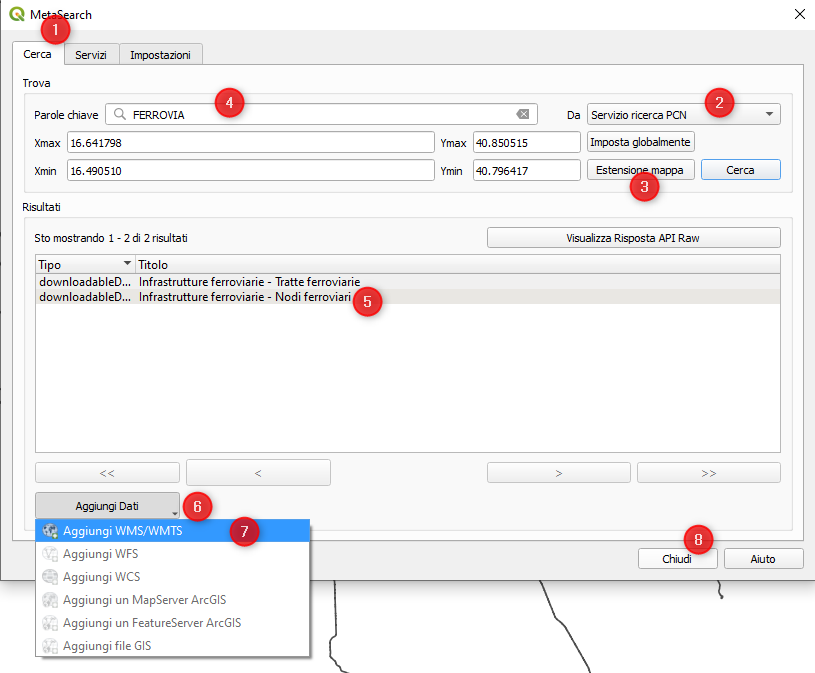

---
hide:
  # - navigation
  # - toc
title: Caricare dati dal Web
description: Caricare dati dal Web
---

# Caricare dati dal WEB

## Introduzione

QGIS offre un robusto supporto per l'utilizzo e la creazione di servizi web geospaziali, permettendo agli utenti di accedere, visualizzare e condividere dati geografici attraverso Internet.

Principali caratteristiche dei servizi web in QGIS:

1. Supporto per standard OGC:
   
    - WMS (Web Map Service): per visualizzare mappe raster
    - WFS (Web Feature Service): per accedere e modificare dati vettoriali
    - WCS (Web Coverage Service): per accedere a dati raster
    - WMTS (Web Map Tile Service): per mappe tiled ad alte prestazioni

2. Connessione a servizi esterni:
   
    - Facile aggiunta di layer da servizi web remoti
    - Supporto per autenticazione e connessioni sicure

3. Creazione di servizi web:
   
    - QGIS Server: permette di pubblicare progetti QGIS come servizi web
    - Integrazione con GeoServer per servizi web avanzati

4. XYZ Tiles:
   
    - Supporto per servizi di tile come OpenStreetMap, Google Maps, ecc.

5. Geocoding e routing:
   
    - Integrazione con servizi di geocoding e routing online

6. API di QGIS:
   
    - Possibilità di creare plugin che interagiscono con servizi web

7. Protocolli supportati:
   
    - HTTP/HTTPS
    - REST
    - SOAP (per alcuni servizi legacy)

8. Caching:
   
    - Memorizzazione locale dei dati per migliorare le prestazioni

9.  Metadati e Cataloghi:
    
    - Supporto per servizi di catalogo come CSW (Catalog Service for the Web)

10. Servizi di elaborazione:
    
     - WPS (Web Processing Service) per l'elaborazione remota di dati geospaziali

L'utilizzo dei servizi web in QGIS permette di:

- Accedere a vasti repository di dati geospaziali;
- Collaborare su progetti condivisi;
- Creare applicazioni web mapping;
- Integrare dati da fonti diverse in tempo reale;

Questi servizi sono fondamentali per la condivisione di dati e l'interoperabilità tra sistemi GIS.

**QGIS** può connettersi a risorse WEB in vari modi:

1. tramite plugin (es: [QuickMapServices](https://plugins.qgis.org/plugins/quick_map_services/));
2. tramite servizi **OGC**: L'Open Geospatial Consortium (**OGC**) è un'organizzazione internazionale che raggruppa di più di 500 organizzazioni commerciali, governative, non profit e di ricerca in tutto il mondo. I suoi membri sviluppano e implementano _standard_ per contenuti e servizi geospaziali, elaborazione e scambio di dati GIS. Ulteriori informazioni possono essere trovate su <https://www.opengeospatial.org/>

Servizi **OGC** più usati in **QGIS**:

* **WMS** - Web Map Service ( client WMS / WMTS )
* **WMTS** - Web Map Tile Service ( client WMS / WMTS )
* **WFS** - Web Feature Service ( client WFS e WFS-T )
* **WCS** - Servizio di copertura Web ( client WCS )
* **CSW** - Servizio catalogo per il Web

## Plugin QuickMapServices

Per utilizzare le mappe di sfondo è possibile usare plugin o i Tile XYZ, il plugin più famoso ed utilizzato è **QuickMapServices**:

{.center-img .img-50}

la basemap **OpenStreetMap** (OSM) è la mappa creata dagli utenti

{.center-img .img-70}

va sempre citata la fonte scrivendo: `OpenStreetMap Contributors`

## Servizi OGC

### Web Map Service (WMS)

Un Servizio di Consultazione consente “di eseguire almeno le seguenti operazioni: **visualizzazione**, **navigazione**, variazione della scala di visualizzazione (zoom in e zoom out), variazione della porzione di territorio inquadrata (pan), sovrapposizione dei set di dati territoriali consultabili e visualizzazione delle informazioni contenute nelle legende e qualsivoglia contenuto pertinente dei metadati” (raster)

### Web Feature Service (WFS)

Un Servizio di Scaricamento o Download “permette di scaricare copie di set di dati territoriali o di una parte di essi in formato vettoriale (es: fiumi principali italiani);

### Web Coverage Service (WCS)

Un Servizio di Scaricamento o Download “permette di scaricare copie di set di dati territoriali o di una parte di essi in formato raster (es: DTM);

### Il PNC

In questo periodo funziona male anche perché stanno pensando di chiuderlo.

Il [Portale]( http://www.pcn.minambiente.it) (Portale Nazionale Cartografico) mette a disposizione molti link per i servizi:

* [servizio OGC - WMS](http://www.pcn.minambiente.it/mattm/servizio-wms/) → consultazione
* [servizio OGC - WFS](http://www.pcn.minambiente.it/mattm/servizio-di-scaricamento-wfs/) → anche download - vettori
* [servizio OGC - WCS](http://www.pcn.minambiente.it/mattm/servizio-di-scaricamento-wcs/) → anche download - raster

{.center-img .img-70}

## Come usarli in QGIS

- Tramite il Gestore delle sorgenti dati:

{.center-img .img-70}

- Tramite il Browser Panel:

{.center-img .img-30}

- Tramite Menu Layer → Aggiungi layer:

{.center-img .img-70}

in tutti questi casi dobbiamo inserire un nome, scelto da noi, e l'URL del servizio, ecco un esempio:

http://wms.pcn.minambiente.it/ogc?map=/ms_ogc/WMS_v1.3/raster/DTM_20M.map

{.center-img .img-50}

## WMS Catasto AdE

```
https://wms.cartografia.agenziaentrate.gov.it/inspire/wms/ows01.php
```

## Client Catalogo MetaSearch

Un Servizio di Ricerca consente “di cercare i set di dati territoriali e i servizi ad essi relativi in base al contenuto dei metadati corrispondenti e di visualizzare il contenuto dei metadati” (Direttiva 2007/2/CE).

- Plugin QGIS: <https://docs.qgis.org/3.22/it/docs/user_manual/plugins/core_plugins/plugins_metasearch.html#metasearch-catalog-client>

- <http://www.pcn.minambiente.it/geoportal/csw>

{.center-img .img-70}

{.center-img .img-70}

{.center-img .img-70}

**MAGGIORI INFO:** <https://docs.qgis.org/3.16/en/docs/user_manual/working_with_ogc/ogc_client_support.html#working-with-ogc-iso-protocols>


{!includes/disclaimer.md!}
