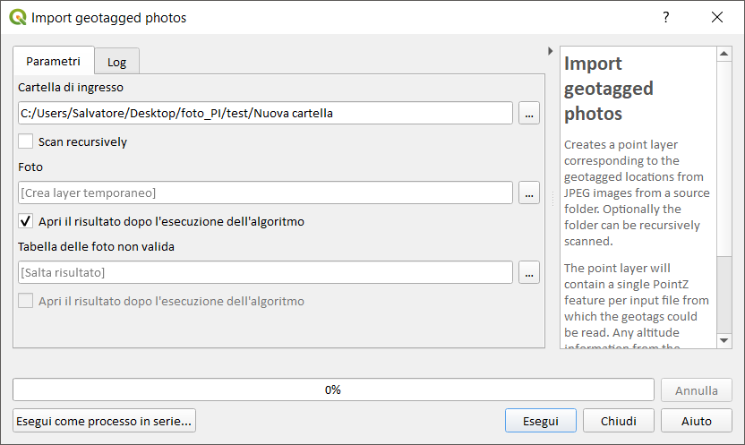
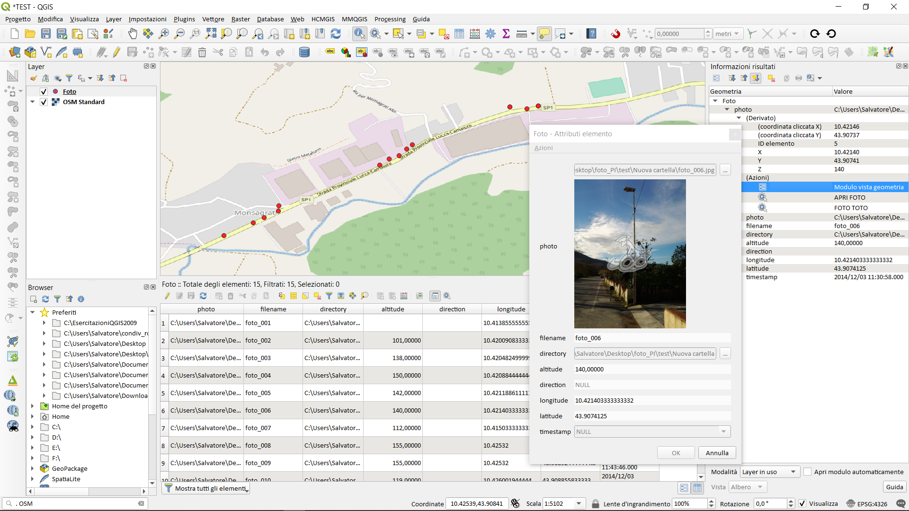
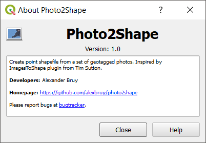
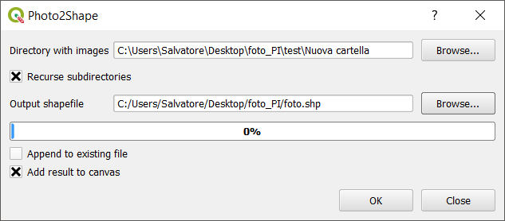
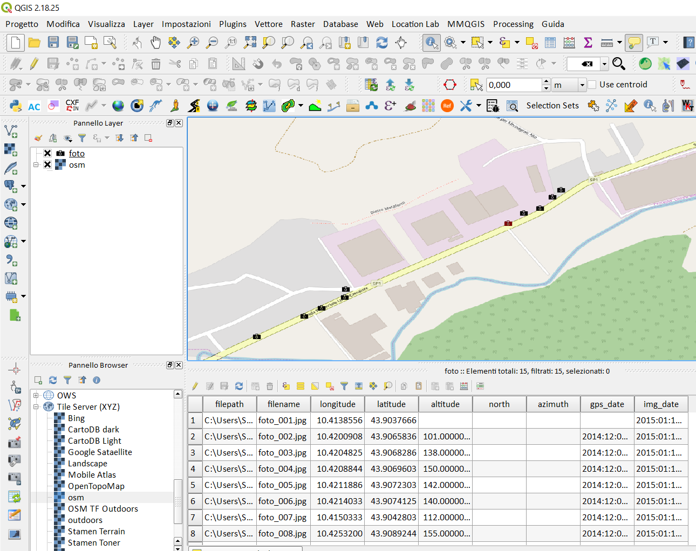

---
hide:
  # - navigation
  # - toc
title: Gestione di foto georeferenziate
description: Gestione di foto georeferenziate
---

# Gestione di foto georeferenziate

## Introduzione

Le moderne fotocamere digitali o gli smartphone sono dotati di _GPS integrato_ che permette di associare il _geotag_ in ogni foto, questo permette di aggiungere, nei metadati delle foto, le coordinate geografiche (latitudine e longitudine) del punto in cui si è scattata la foto.

## Import geotagged photos

 A partire dalla`>= QGIS 3.2` è presente negli strumenti di Processing.

In **QGIS 3.16** è presente un geo-algoritmo (_Import geotagged photos_) che permette di importare le foto con geotag all'interno del programma tramite una serie di punti con quota Z e EPSG 4326:

finestra impostazioni geo-algoritmo

{.center-img .img-70}

risultato:

{.center-img .img-70}

## Plugin Photo2Shape

`QGIS 2.x` → `QGIS 3.x`

È un plugin che permette di importare, in QGIS, le foto con geotag 

{.center-img .img-60}

finestra impostazioni plugin:

{.center-img .img-70}

1. richiede la cartella che contiene le foto;
2. nome dello shapefile di output;

risultato:

{.center-img .img-70}

{!includes/disclaimer.md!}
