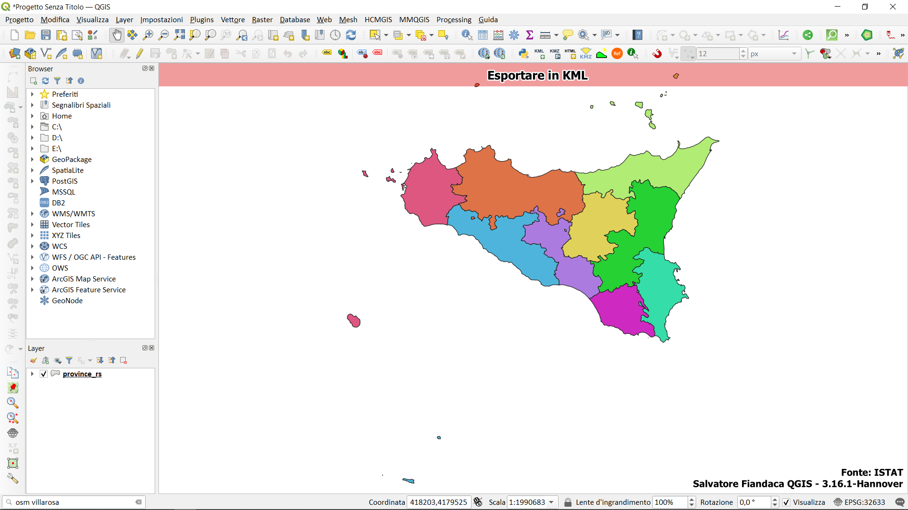
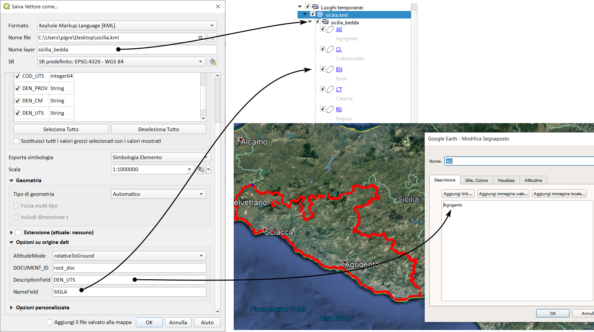
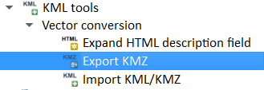
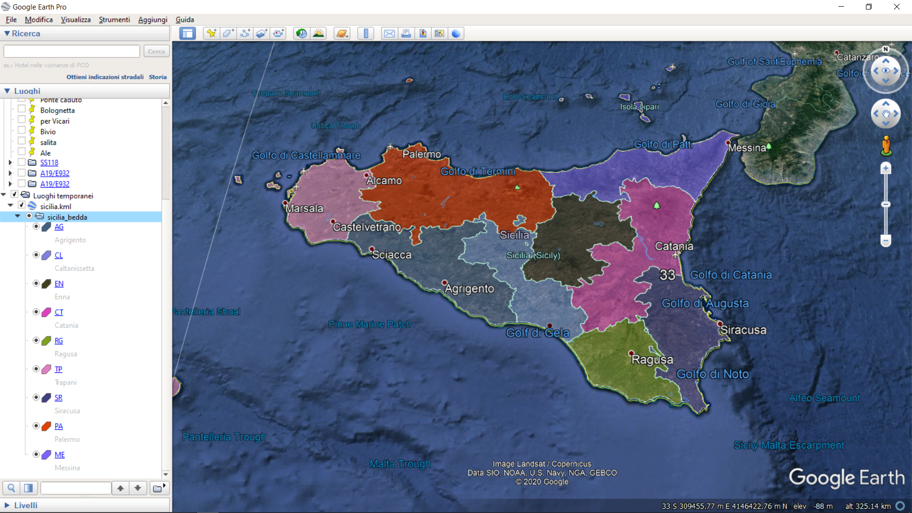

---
hide:
  # - navigation
  # - toc
title: Esportazione dati per Google Earth
description: Esportazione dati per Google Earth
---

# Esportazione dati per Google Earth

## Introduzione

Il formato `kml/kmz` è tipico di **Google Earth** ed ha unico SR che è **EPSG:4326**. QGIS lo legge e può esportare in kml in modo nativo o tramite plugin dedicati. 

### Esempio

esportiamo la sicilia con le sue province:

{.center-img .img-70}

- esporto in kml usando comando nativo:

{.center-img .img-70}
 

- oppure, usando il Plugin `KML tools` dal Processing:

{.center-img .img-50}

visualizzo in Goolge Earth:

{.center-img .img-70}

con tutta la tabella attributi.

## Riferimenti

<https://www.loc.gov/preservation/digital/formats/fdd/fdd000340.shtml>

{!includes/disclaimer.md!}
