---
hide:
  # - navigation
  # - toc
title: I dati geografici raster
description: I dati geografici raster
---

# I dati geografici raster

## Analisi base Raster 

Come per i vettori anche per raster esiste una analisi raster, esistono dei tools specifici ma in generale è possibile fare geoprocessing, ma non è argomento del corso.

Esempio di tematizzazione di un DTM (Digital Terrain Model):

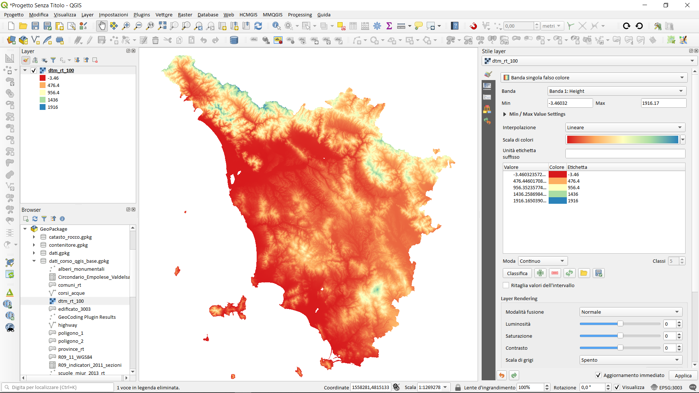{.center-img .img-70}

Esempio di calcolo delle pendenze:

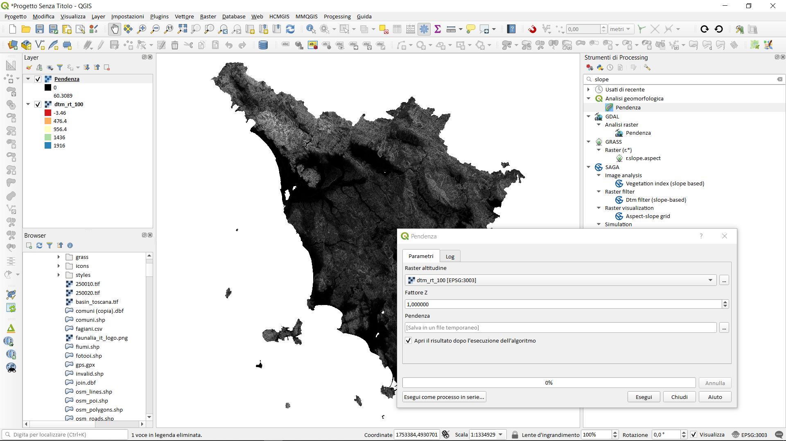{.center-img .img-70}

Esempio di calcolo delle curve di livello:

{.center-img .img-70}

## Calcolatore Raster

Il calcolatore raster permette di eseguire dei calcoli, e quindi delle analisi, su uno o più raster; i calcoli vengono eseguiti sfruttando i valori all'interno dei pixel.

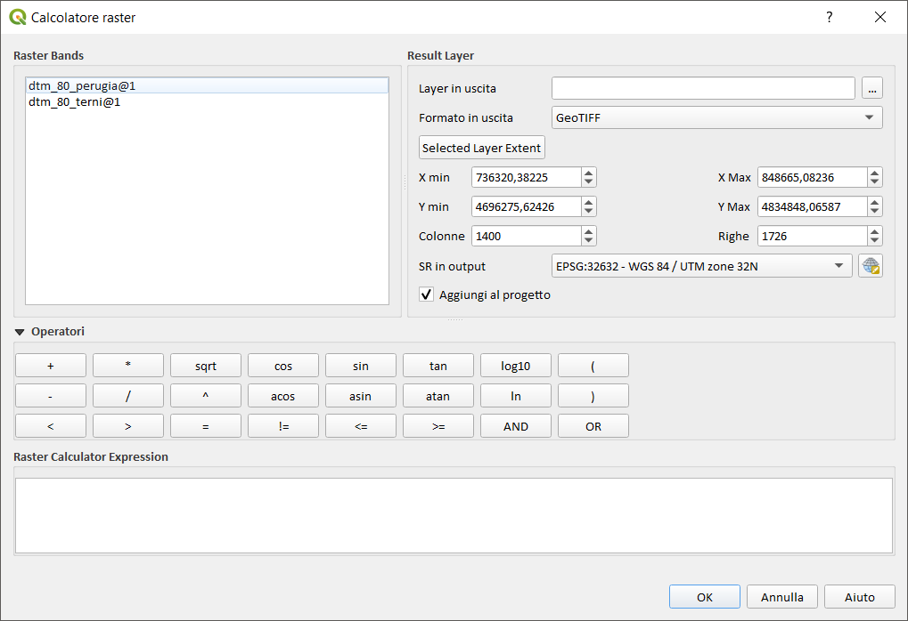{.center-img .img-70}

esempio per riclassificare la pendenza:

```
 ( "Pendenza@1" >=  0  AND "Pendenza@1" < 15 )* 1 +
 ( "Pendenza@1" >= 15  AND "Pendenza@1" < 30 )* 2 +
 ( "Pendenza@1" >= 30  AND "Pendenza@1" < 45 )* 3 +
 ( "Pendenza@1" >= 45  AND "Pendenza@1" < 71 )* 4
```

## Virtual Raster - Mosaico/catalogo

Questa funzione serve a creare un unico file (virtuale) quando si hanno molti raster distinti e quindi permette l'importazione di un solo file e facilita la tematizzazione.

27 raster DTM della Sicilia 10 m/px:

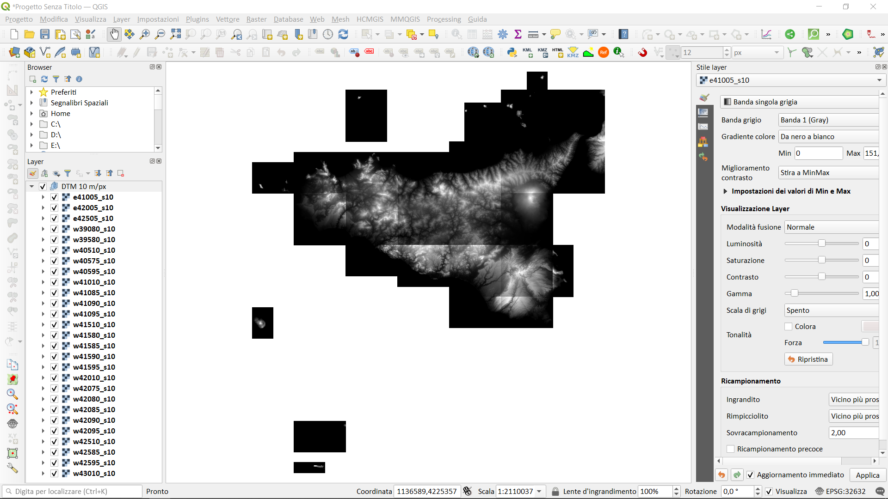{.center-img .img-70}

un solo raster virtuale del DTM:

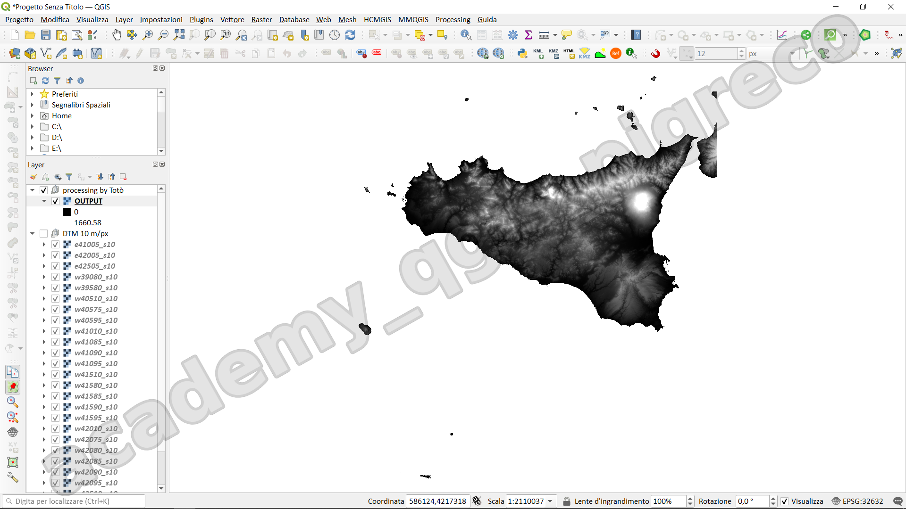{.center-img .img-70}

## Alcune Analisi Raster

### Pendenza

Calcola la pendenza di un layer raster di input. La pendenza è l'angolo di inclinazione del terreno ed è espressa in gradi.

Lo strumento Pendenza identifica la pendenza in ogni cella di una superficie raster. Più basso è il valore della pendenza, più piatto è il terreno; maggiore è il valore della pendenza, più ripido è il terreno.

Il raster della pendenza di output può essere calcolato in due tipi di unità, **gradi** o **percentuale**. La percentuale può essere compreso meglio se lo consideri come l'`rise` diviso per la `run`, moltiplicato per 100:

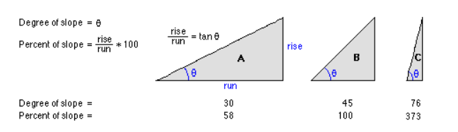{.center-img .img-70}

Nella figura seguente si vede a sinistra il layer DTM con l'elevazione del terreno mentre a destra la pendenza calcolata in gradi `pendenza`:

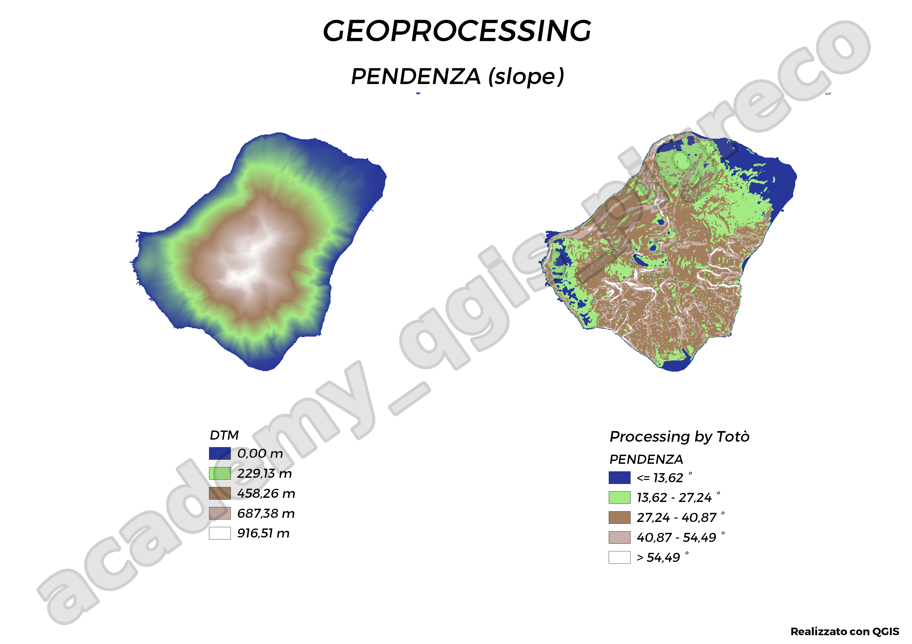{.center-img .img-70}

- algoritmo core QGIS:

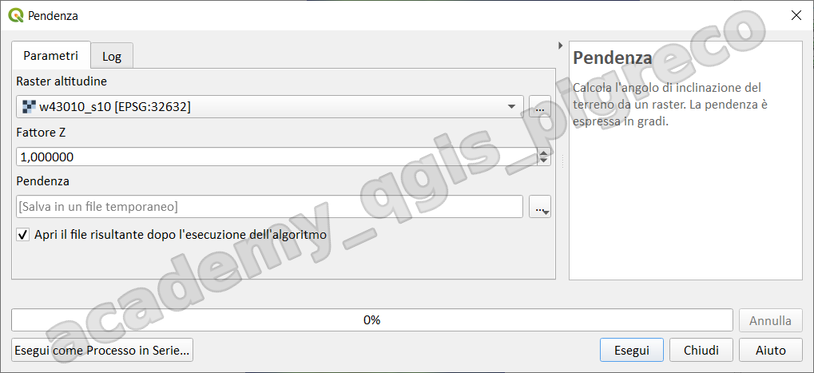{.center-img .img-50}

- algoritmo GDAL:

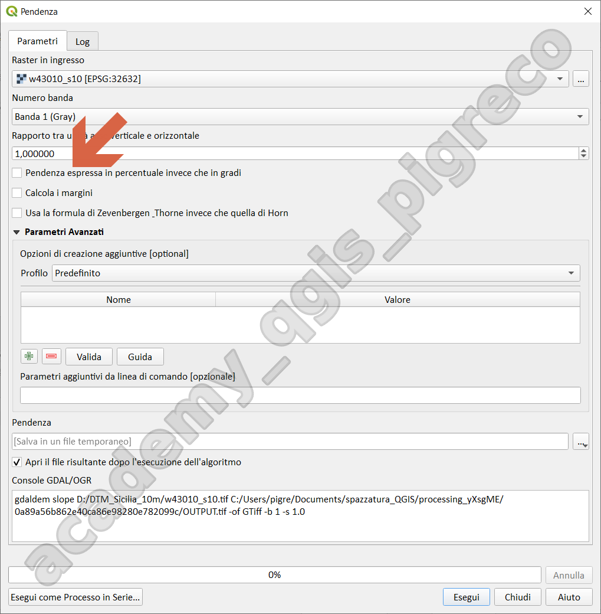{.center-img .img-50}

### Ombreggiatura

Calcola il layer raster delle ombreggiature dato un input Digital Terrain Model (DTM). L'ombreggiatura del livello viene calcolata in base alla posizione del sole: con la possibilità di modificare sia l'angolo orizzontale (azimut) che l'angolo verticale (elevazione del sole) del sole:

{.center-img .img-50}

Il livello delle ombreggiature contiene valori da 0 (ombra completa) a 255 (sole completo).

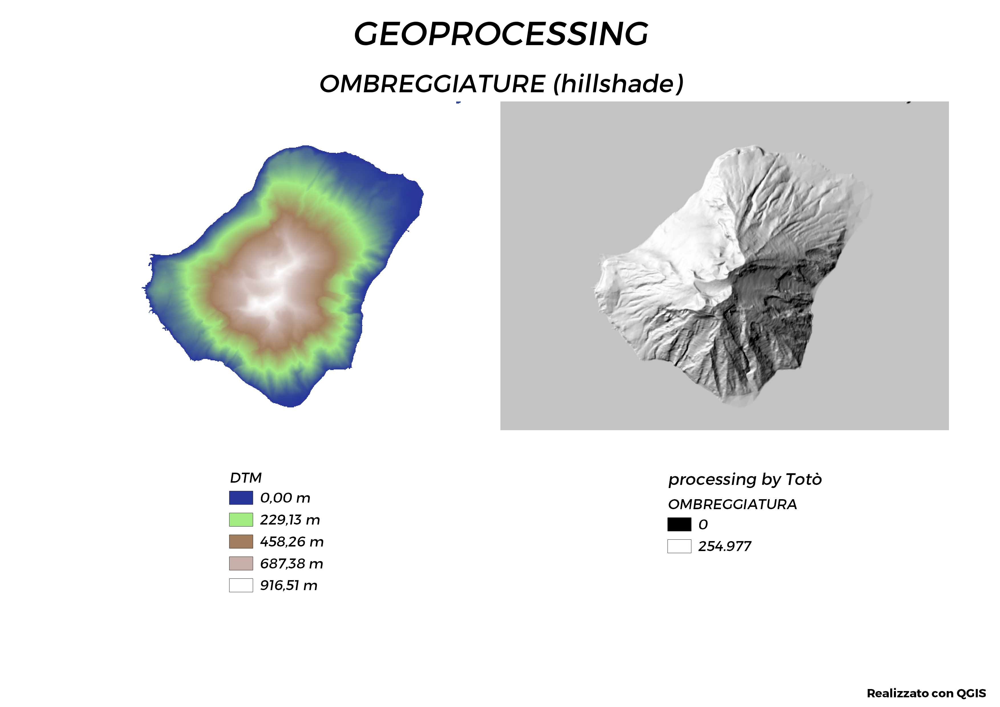{.center-img .img-50}

Usata molto per creare effetti realistici sulla tematizzazione dei DTM, come raster messo sotto il DTM in trasparenza per ottenere questo:

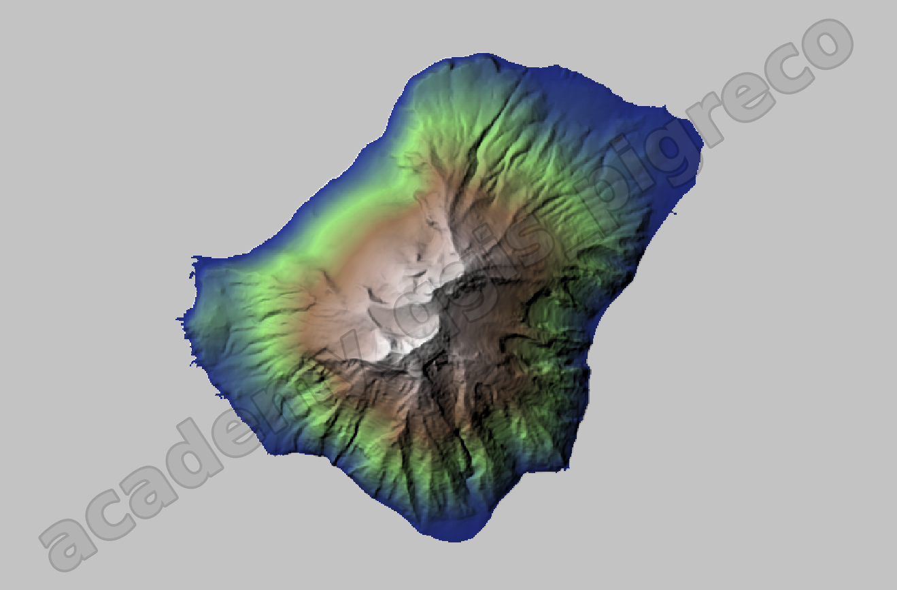{.center-img .img-50}

### Indice di asperità

Calcola la misurazione quantitativa dell'eterogeneità del terreno descritta da Riley et al. (1999). Viene calcolato per ogni posizione, riassumendo la variazione di elevazione all'interno della griglia di 3x3 pixel.

Ogni pixel contiene la differenza di elevazione tra una cella centrale e le 8 celle che la circondano.

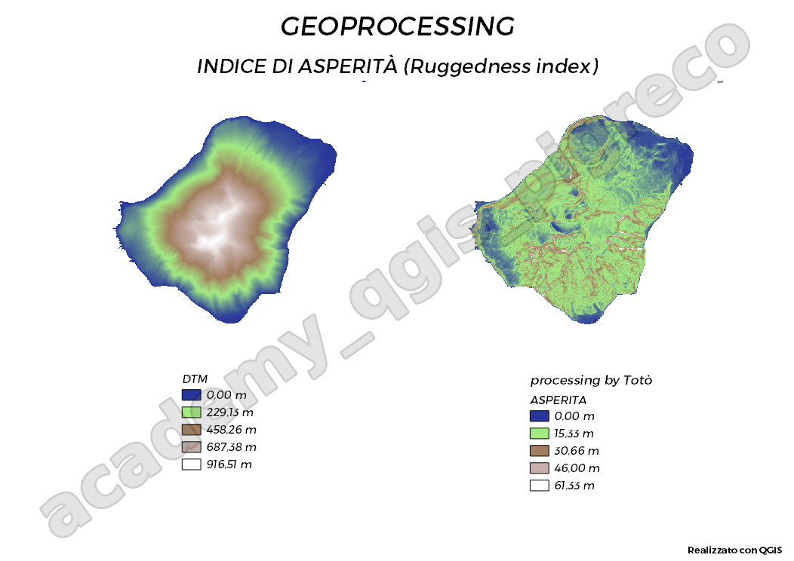{.center-img .img-50}

### Esposizone

Calcola l'esposizione del modello digitale del terreno in input. Il layer raster dell'esposizione finale contiene valori da 0 a 360 che esprimono la direzione della pendenza, partendo da nord (0°) e proseguendo in senso orario.

{.center-img .img-30}

<br>

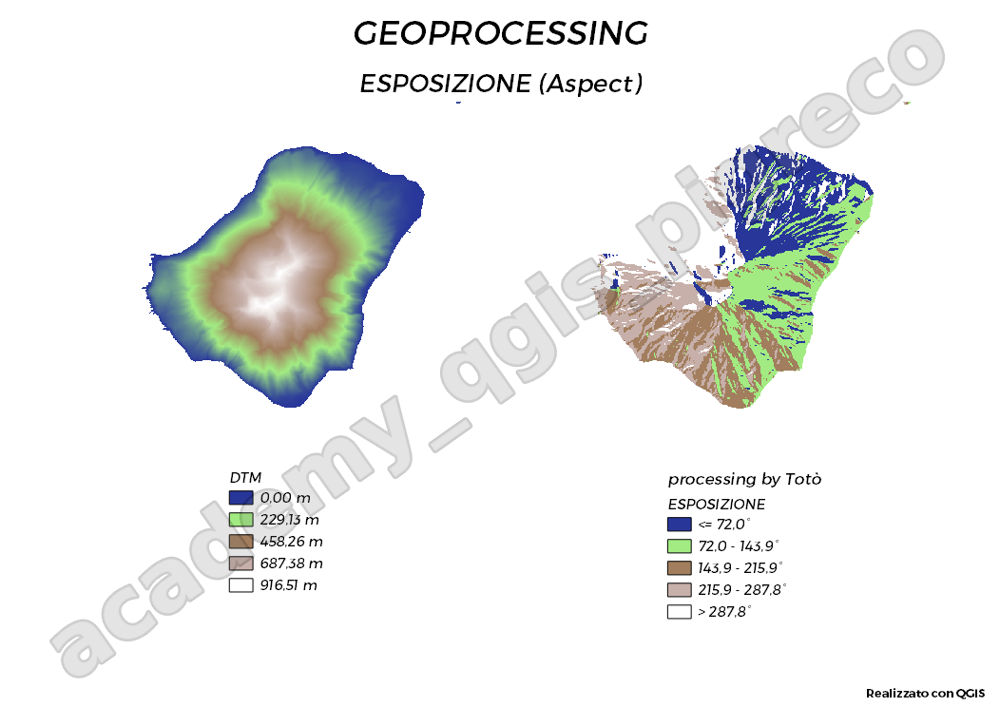{.center-img .img-70}

### Riclassificazione

#### Riclassifica con tabella

Riclassifica una banda raster assegnando nuovi valori di classe in base agli intervalli specificati in una tabella fissa.

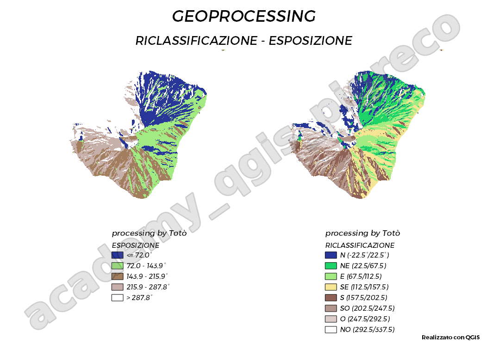{.center-img .img-70}

- algoritmo `riclassifica con tabella`

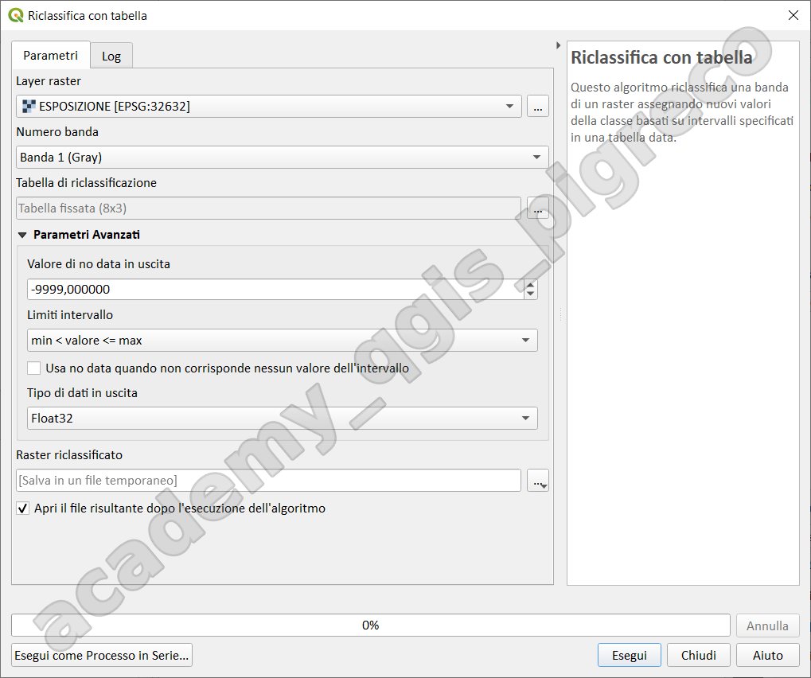{.center-img .img-50}

- tabella:

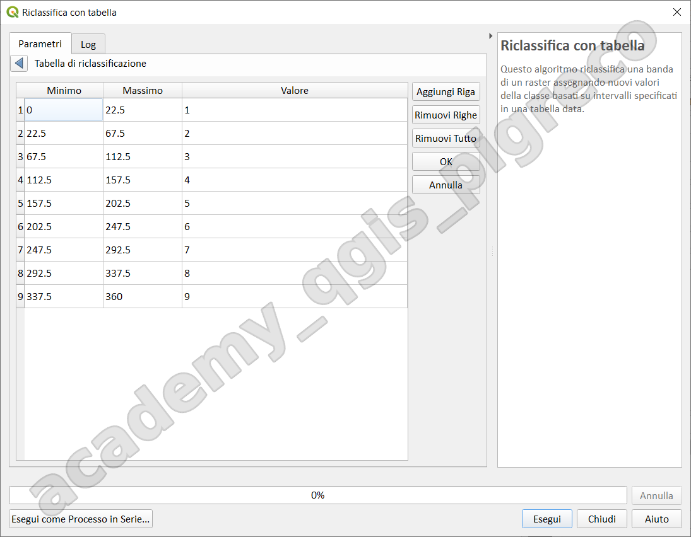{.center-img .img-50}

```
# File di Esportazione della Mappa Colore Generato da QGIS 
INTERPOLATION:INTERPOLATED
1,40,54,154,255,N
2,30,211,104,255,NE
3,162,235,130,255,E
4,246,229,149,255,SE
5,143,97,84,255,S
6,178,150,139,255,SO
7,219,205,202,255,O
8,255,255,255,255,NO
```

#### Riclassifica con layer

Riclassifica una banda raster assegnando nuovi valori di classe in base agli intervalli specificati in una tabella vettoriale.

- algoritmo `Riclassifica con layer`

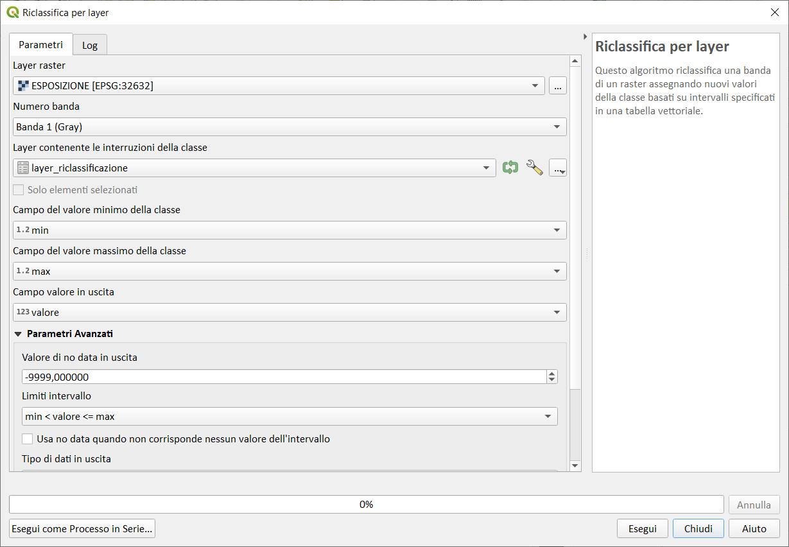{.center-img .img-50}

- log

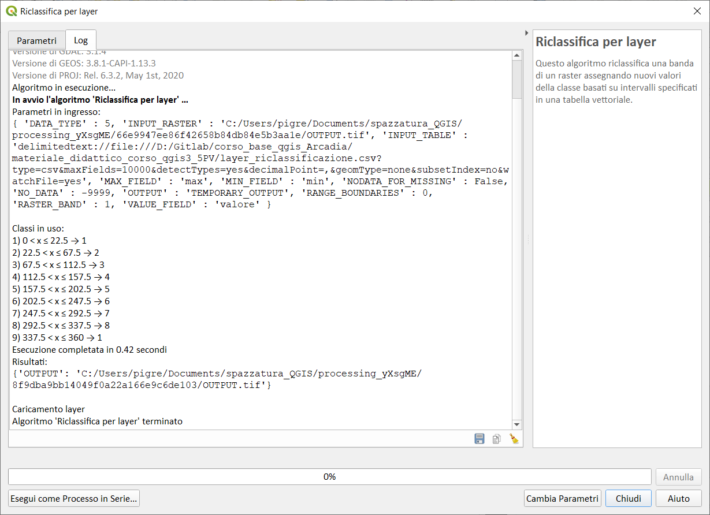{.center-img .img-50}


{!includes/disclaimer.md!}
