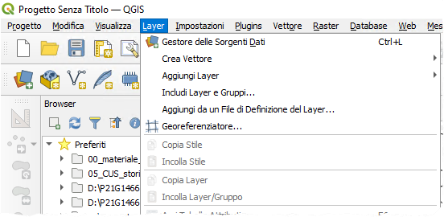
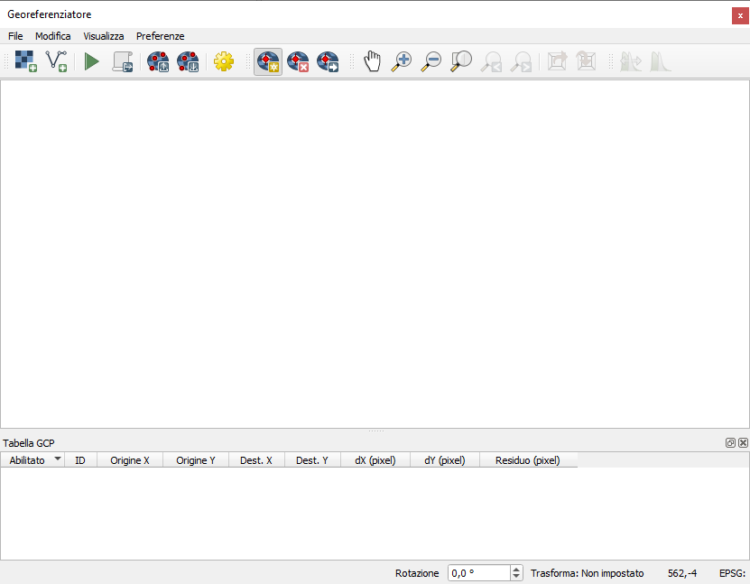
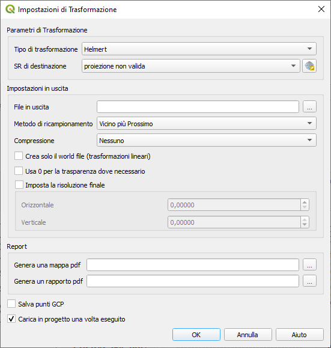
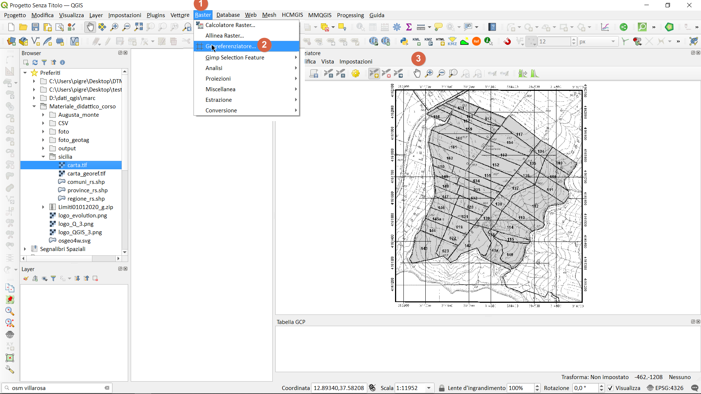
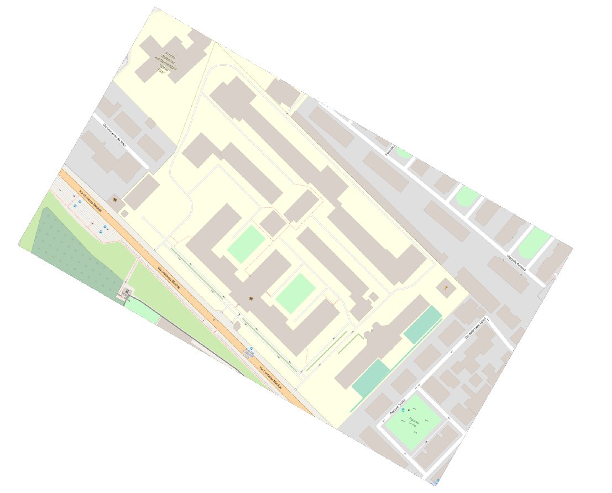

---
hide:
  # - navigation
  # - toc
title: Georeferenziatore
description: Georeferenziatore Raster e Vector
---

# Plugin Georeferenziatore

## Introduzione

Con il termine **georeferenziazione** ci si riferisce al processo mediante il quale si assegnano delle coordinate del mondo reale a ciascun pixel del raster. La georeferenziazione può essere riferita:

- raster senza coordinate visibili: ricerca delle coordinate facendo ricerche sul campo - raccogliendo con dispositivi GPS le coordinate di alcune geometrie facilmente identificabili nell’immagine o nelle carte.
- raster con coordinate visibili: per esempio carte digitalizzate con lo scanner, le coordinate sono presenti nella mappa stessa. 
Usando queste semplici coordinate o GCP (Ground Control Points) l’immagine viene deformata e adeguata al sistema di coordinate che abbiamo scelto.

## Georeferenziatore

È un plugin core, quindi lo troviamo già installato e raggiungibile dal menu `Layer`:

{.center-img .img-50}

### Interfaccia

{.center-img .img-50}

## Impostazioni

Dopo aver aggiunto i GCP all'immagine raster, è necessario definire le **impostazioni** di trasformazione per il processo di georeferenziazione.

{.center-img .img-50}

## Algoritmi di trasformazione disponibili

A seconda di quanti punti di controllo abbiamo catturato, possiamo utilizzare diversi algoritmi di trasformazione. La scelta dell'algoritmo di trasformazione dipende anche dal tipo e dalla qualità dei dati di input e dalla quantità di distorsione geometrica che si è disposti a introdurre nel risultato finale.

Attualmente sono disponibili i seguenti tipi di trasformazione :

* L' algoritmo **lineare** viene utilizzato per creare un file world ed è diverso dagli altri algoritmi, in quanto non trasforma effettivamente il raster. Consente il posizionamento (la traslazione) dell'immagine e la scalatura uniforme, ma nessuna rotazione o altre trasformazioni. È il più adatto se la tua immagine è una mappa raster di buona qualità, in un CRS noto, ma mancano solo le informazioni di georeferenziazione. **Sono necessari almeno 2 GCP**.

* La trasformazione di **Helmert** consente anche la rotazione. È particolarmente utile se il raster è una mappa locale di buona qualità o un'immagine aerea ortorettificata, ma non allineata con la direzione della griglia nel CRS. **Sono necessari almeno 2 GCP**.

* Gli algoritmi **Polinomiale 1-3** sono tra gli algoritmi più utilizzati introdotti per abbinare i punti di controllo a terra di origine e destinazione. L'algoritmo polinomiale più utilizzato è la trasformazione polinomiale del secondo ordine, che consente una certa curvatura. La trasformazione polinomiale del primo ordine (affine) preserva la collinearità e consente solo il ridimensionamento, la traslazione e la rotazione.

* L' algoritmo **Thin Plate Spline** (TPS) è un metodo di georeferenziazione più moderno , in grado di introdurre deformazioni locali nei dati. Questo algoritmo è utile quando vengono georeferenziati originali di qualità molto bassa.

* La trasformazione **proiettiva** è una rotazione lineare e una traslazione di coordinate.

## Procedura

1. Importare il raster da georiferire usando l'icona ;
2. alla richiesta del SR, cliccare su `Annulla`;
3. Aggiungere i GCP tramite l'icona ;
4. Settare le impostazioni usando l'icona ;
5. appena pronti, avvire la trasformazione con l'icona 

## Tipologia

Questo è valido sia per **Raster** che per **Vector**

=== "Coordinate note"

    - caso in cui sono note le coordinate dei punti

    {.center-img .img-70}

    [qui un video](https://www.youtube.com/watch?v=8nUefgHbbIQ)

=== "Senza coordinate"

    - caso in cui non sono note coordinate

    {.center-img .img-50}

## Errori comuni da evitare

- Utilizzo di troppi pochi punti di controllo;
- Distribuzione non uniforme dei GCP;
- Scelta errata del metodo di trasformazione;
- Ignorare il residuo;
- Non verificare il risultato finale;
- Utilizzare punti di controllo non permanenti;
- Trascurare la qualità dei dati di riferimento.

## Esercitazione

- **Raster**: Georiferire il raster presente nella cartella `Raster` del materiale didattico, l'EPSG è 23033;
- **Vector**: Georiferire il vettore presente nella cartella `vettore_da_georiferire` del materiale didattico, l'EPSG è 25833;

---

Riferimenti utili

-doc QGIS: <https://docs.qgis.org/3.16/en/docs/user_manual/working_with_raster/georeferencer.html?highlight=georeferencing>

{!includes/disclaimer.md!}
