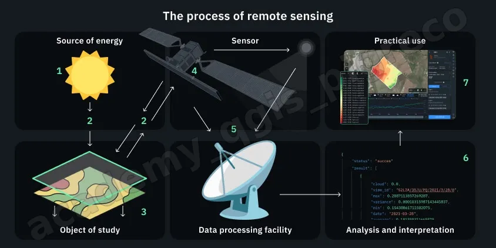

---
hide:
  # - navigation
  # - toc
title: Cenni Telerilevamento
description: Cenni Telerilevamento
---

# Telerilevamento

{.center-img .img-80}

## 🛰️ Cos’è il telerilevamento?

Il telerilevamento è la scienza – e un po’ l’arte – di ottenere informazioni su oggetti o fenomeni senza toccarli direttamente. Si basa su sensori montati su satelliti, aerei o droni che rilevano la luce riflessa o emessa dalla Terra. È usato per studiare ambienti, città, mari, ghiacciai e molto altro.

💡 Come funziona?

- Fonte di energia – generalmente il sole (radiazione solare);
- Interazione con l’atmosfera – la luce viene modificata dal passaggio attraverso l’aria;
- Interazione con il suolo o l’acqua – alcune lunghezze d’onda vengono riflettute, altri assorbite;
- Sensore cattura l’energia – un dispositivo misura la luce riflessa o emessa dal terreno;
- Processamento dati – i dati vengono inviati sulla Terra e trasformati in immagini;
- Interpretazione – si analizzano le immagini per derivare informazioni utili;
- Applicazione pratica – i risultati sono usati per monitorare l’ambiente, prevedere raccolti, gestire disastri ecc..

## 🎛️ Tipi di sensori

Ci sono due categorie principali :

- Passivi: usano fonti naturali (come il Sole); puliti da usare, ma dipendono dalla luce e dalle condizioni meteorologiche (es. Landsat, Sentinel).
- Attivi: inviano loro stessi un segnale (es. radar, LiDAR). Possono funzionare di giorno o di notte e sotto la pioggia.

## 📏 Caratteristiche dei dati

- **Risoluzione spaziale**: dimensione per pixel (es. 10 m, 30 m);
- **Risoluzione temporale**: ogni quanti giorni il sensore ripassa sullo stesso punto;
- **Risoluzione spettrale**: numero di bande/lunghezze d'onda catturate (visibile, IR, microonde…);
- **Risoluzione radiometrica**: quanti livelli di intensità può distinguere, misurata in bit;

## ✅ In sintesi

| Aspetto             | Spiegazione breve                              |
| ------------------- | ---------------------------------------------- |
| Cos'è               | Raccoglie info a distanza senza contatto       |
| Come funziona       | Usa radiazione, la cattura e la interpreta     |
| Tipi di sensori     | Passivi (luce), Attivi (radar, LiDAR)          |
| Tipi di risoluzioni | Spaziale, temporale, spettrale, radiometrica   |
| Applicazioni        | Ambiente, agricoltura, emergenze, città, clima |

Il telerilevamento (remote sensing) ci apre gli occhi sull'intero pianeta: da decine di metri di altitudine possiamo capire lo stato di salute dei campi, tracciare corsi d’acqua, monitorare foreste e intervenire in caso di disastro.

{!includes/disclaimer.md!}
