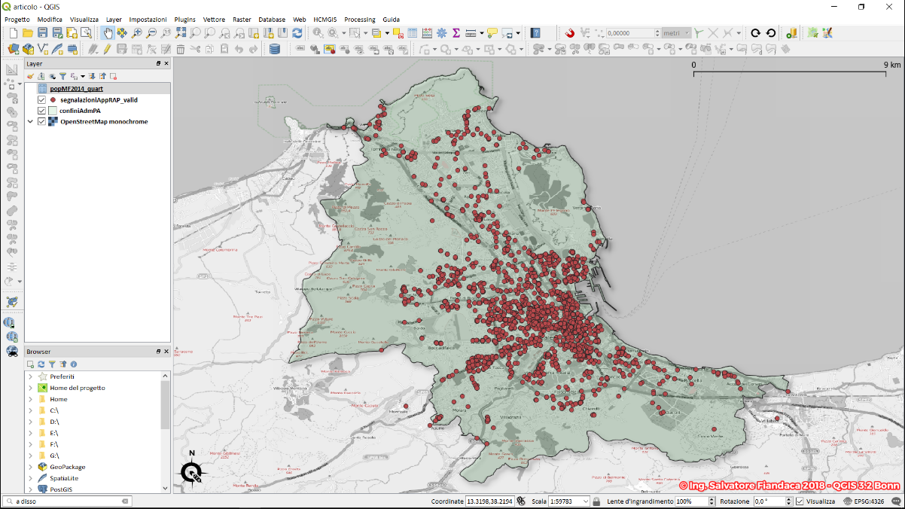
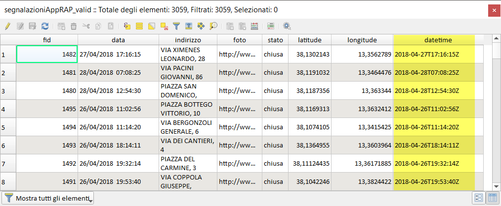
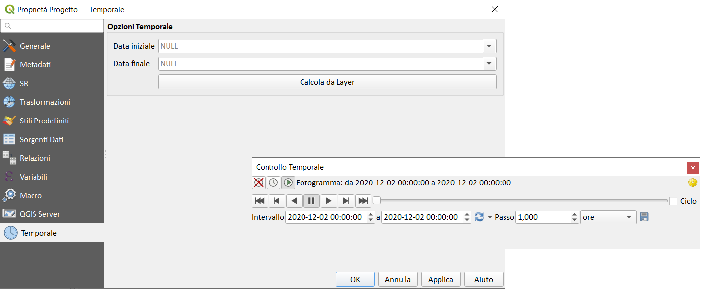
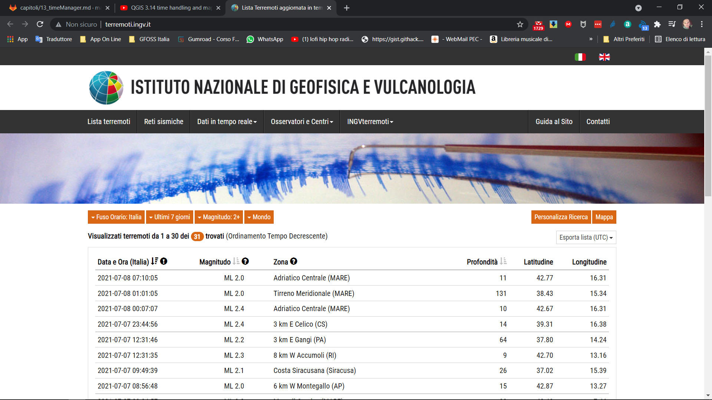
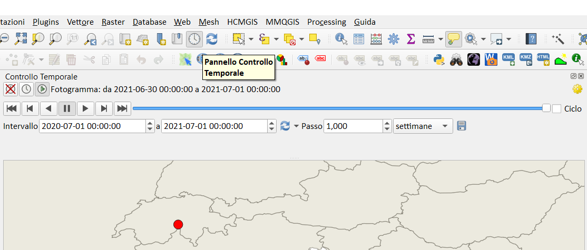
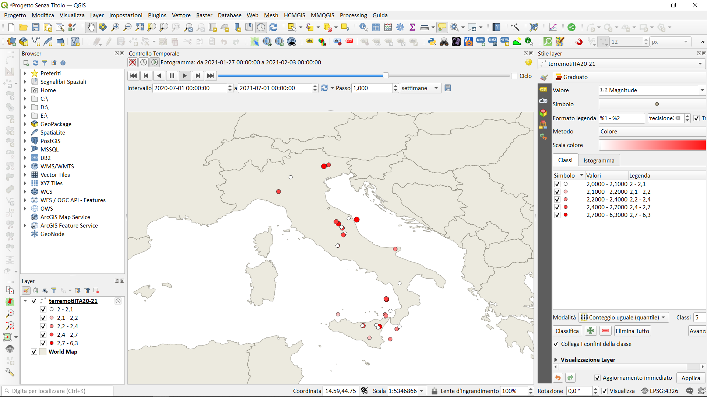
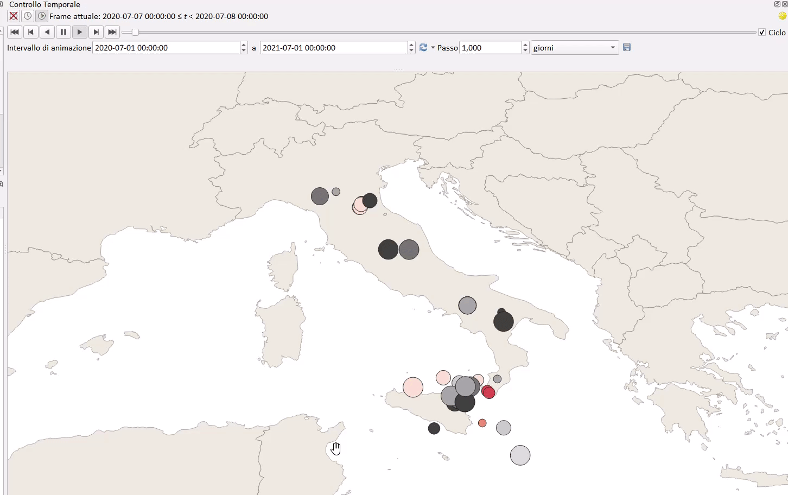

---
hide:
  # - navigation
  # - toc
title: Creazione di animazioni
description: Creazione di animazioni
---

# Creazione di animazioni

## Introduzione

Il Time Manager di QGIS consente di visualizzare e analizzare dati geospaziali con una componente temporale. Ecco le principali caratteristiche:

1. Permette di animare dati vettoriali e raster basati sul tempo
2. Consente di creare animazioni e video dei cambiamenti temporali nei dati
3. Offre controlli per riprodurre, mettere in pausa e navigare attraverso intervalli di tempo
4. Supporta diversi formati di data/ora
5. Permette di impostare la velocità e l'intervallo dell'animazione

Il Time Manager è particolarmente utile per:

- Visualizzare fenomeni che cambiano nel tempo (es. uso del suolo, crescita urbana)
- Analizzare serie temporali di dati ambientali o socioeconomici
- Creare presentazioni dinamiche di dati geospaziali

Per utilizzarlo, è necessario avere dati con un attributo temporale. Una volta configurato, potrai vedere come i tuoi dati cambiano nel tempo sulla mappa di QGIS.

## Temporale

La scheda Temporale viene utilizzata per impostare l'intervallo temporale del Progetto e aggiunge i controlli temporali a QGIS. Utilizzando questi controlli orari, è possibile animare le funzionalità vettoriali in base all'attributo time. È possibile creare animazioni direttamente nella map canvas ed esportare le relative immagini.

{.center-img .img-70}

Tabella attributi con un campo `datetime`

{.center-img .img-70}

Risultato usando una tematizzazione _Heatmap_

{.center-img .img-50}

{.center-img .img-70}

## Esercizio

Animare i dati sui terremoti in Italia da 01/07/2020 al 01/07/2021, dati scaricabili da ùl sito <http://terremoti.ingv.it/>. Il file è disponibile [qui](https://drive.google.com/file/d/1pSsttq796XztrXJXLXGr-sXMBI3AGYRc/view?usp=sharing).

{.center-img .img-70}

### Procedura

1. dalle proprietà del layer | Temporale | Attivarlo
2. dalla barra degli strumenti, attivare icona Pannello Controllo Temporale:

{.center-img .img-70}

{.center-img .img-70}

---

demo by Nyall Dawson:
<https://youtu.be/vgDg5cRwPRw>

{!includes/disclaimer.md!}
