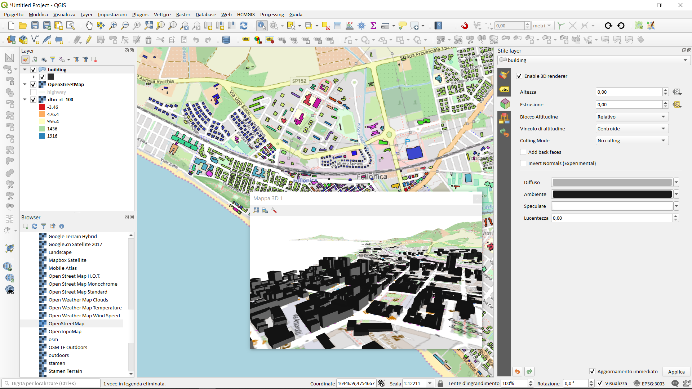
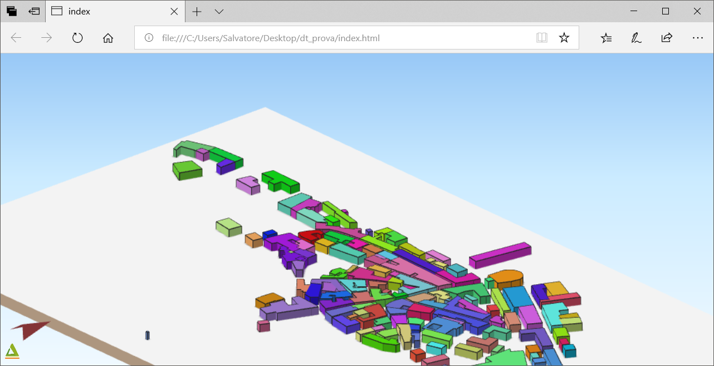
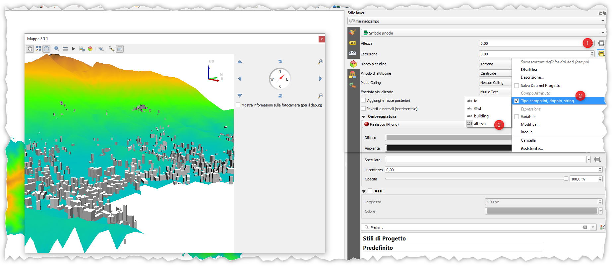
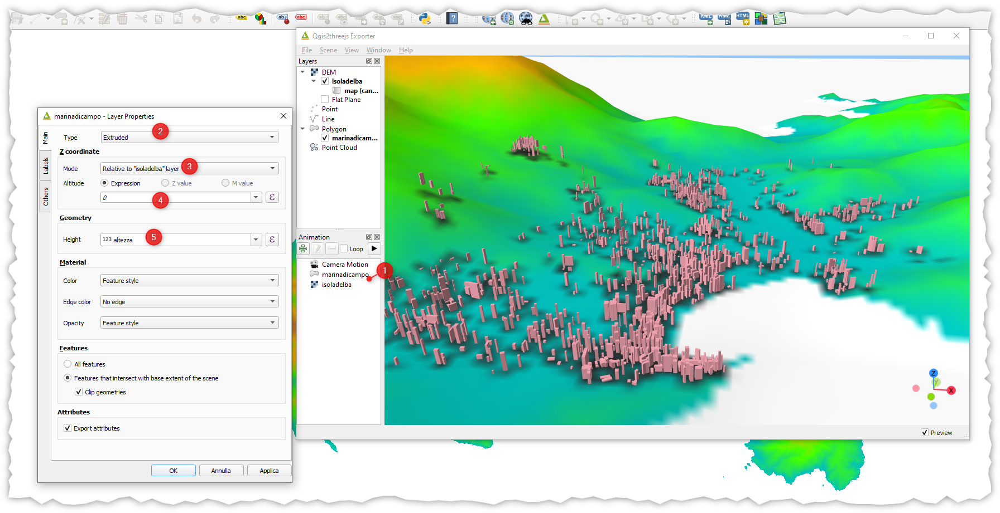

---
hide:
  # - navigation
  # - toc
title: Visualizzazione 3D nativa
description: Visualizzazione 3D nativa
---

# Visualizzazione 3D nativa

QGIS offre potenti capacità di visualizzazione e analisi 3D, permettendo agli utenti di creare, manipolare e visualizzare dati geospaziali in tre dimensioni. Queste funzionalità sono particolarmente utili per rappresentare il terreno, gli edifici e altri oggetti tridimensionali.
Caratteristiche principali del 3D in QGIS:

1. Mappa 3D: QGIS permette di trasformare una mappa 2D in una scena 3D interattiva.
2. Supporto per diversi tipi di dati:
   
    1. Modelli digitali del terreno (DTM)
    2. Dati vettoriali (punti, linee, poligoni)
    3. Mesh 3D
    4. Nuvole di punti
   
3. Estrusione di oggetti: È possibile estrudere oggetti 2D in 3D basandosi su attributi o valori fissi.
4. Texturizzazione: Supporta l'applicazione di texture su superfici 3D.
5. Illuminazione e ombreggiatura: Offre controlli per l'illuminazione della scena e la generazione di ombre.
6. Animazioni: Possibilità di creare animazioni della scena 3D.
7. Analisi: Strumenti per l'analisi in 3D, come il calcolo di volumi e profili.
8. Esportazione: Le scene 3D possono essere esportate in vari formati per l'uso in altre applicazioni.

Per utilizzare le funzionalità 3D in QGIS, generalmente si parte da una mappa 2D a cui si aggiunge l'informazione dell'altezza, sia attraverso un DTM per il terreno, sia attraverso attributi specifici per gli oggetti vettoriali.
Queste capacità 3D sono particolarmente utili in campi come l'urbanistica, la geologia, l'archeologia e la gestione ambientale, dove la comprensione della topografia e della forma tridimensionale degli oggetti è cruciale.

## Introduzione

`plugin QGIS2threejs`

Dalla vesrione 3.0 è possibile visualizzare - nativamente - layer 3D. Nelle versioni precedenti si utilizzava, invece, un plugin **QGIS2threejs**.

Per poter visualizzare un layer in 3D occorre un DTM oppure il vettore deve contenere geometria 3D, cioè contiene anche la coordinata z.

{.center-img .img-70}

## Plugin QGIS2threejs

{.center-img .img-70}

## QGIS 3D nativo

{.center-img .img-70}

nella cartella materiale didattico v1, trovate gli edifici.

{.center-img .img-70}

{!includes/disclaimer.md!}
