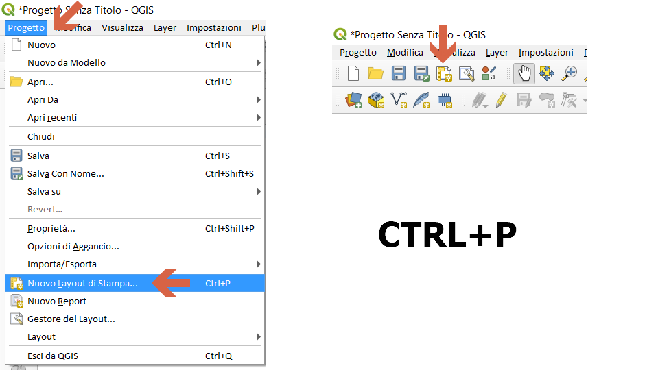
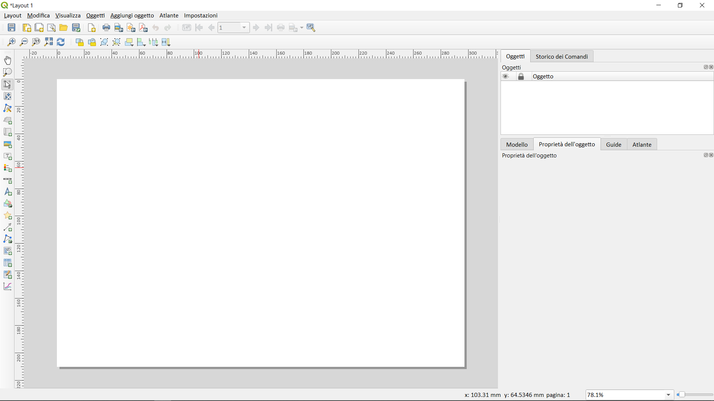
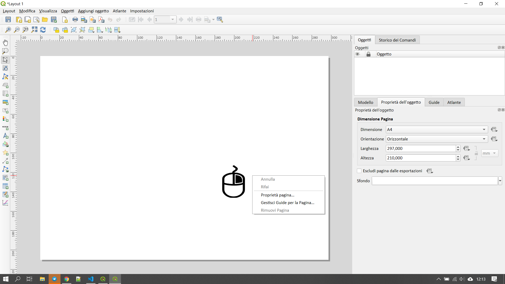

---
hide:
  # - navigation
  # - toc
title: Compositore di stampe
description: Compositore di stampe
---

# Compositore di stampe

## Layout di stampa

Il Layout di Stampa è l'ambiente di QGIS dedicato alla composizione di mappe professionali. Permette di:

- Organizzare elementi cartografici
- Creare output di alta qualità
- Personalizzare la presentazione dei dati

## Componenti Principali

=== "Interfaccia"

    ```
    - Barra degli strumenti
    - Area di lavoro
    - Pannelli delle proprietà
    - Gestione degli elementi
    ```

=== "Elementi Base"

    1. **Mappa**
        - Visualizzazione layer
        - Controllo scala
        - Estensione
       
    2. **Elementi Cartografici**
        - Legenda
        - Scala grafica
        - Nord geografico
        - Griglia di coordinate

    3. **Elementi Testuali**
        - Titolo
        - Sottotitoli
        - Etichette
        - Credits

---

## Workflow Base

=== "Creazione Nuovo Layout"

    ```
    Metodi di accesso:
    - Menu Progetto → Nuovo Layout di Stampa
    - Icona nella barra degli strumenti
    - Shortcut (Ctrl+P)
    ```

=== "Impostazioni Pagina"

    ```
    - Formato (A4, A3, personalizzato)
    - Orientamento
    - Risoluzione
    - Margini
    ```

=== "Inserimento Elementi"

    ```
    Sequenza consigliata:
    1. Inserimento mappa principale
    2. Aggiunta legenda
    3. Inserimento scala
    4. Aggiunta nord geografico
    5. Inserimento testi e titoli
    ```

## Gestione degli Elementi

=== "Mappa"

    ```
    Proprietà principali:
    - Scala
    - Rotazione
    - Estensione
    - Griglia
    - Livelli visibili
    ```

=== "Legenda"

    ```
    Personalizzazioni:
    - Layer visualizzati
    - Simbologia
    - Struttura
    - Stile testo
    ```

=== "Elementi di Scala"

    ```
    Tipi disponibili:
    - Scala numerica
    - Scala grafica
    - Stili personalizzabili
    ```

## Funzionalità Avanzate

=== "Gestione Stili"

      ```
      - Stili personalizzati
      - Template salvati
      - Importazione/esportazione stili
      ```

=== "Strumenti di Allineamento"

    ```
    - Guide
    - Griglie di allineamento
    - Snap agli elementi
    - Distribuzione oggetti
    ```

=== "Gestione Multi-pagina"

    ```
    - Layout su più pagine
    - Atlas
    - Report
    ```

## Best Practices

=== "Organizzazione"

    ```
    - Utilizzare griglie e guide
    - Mantenere coerenza visiva
    - Organizzare elementi logicamente
    ```

=== "Elementi Essenziali"

    ```
    Checklist base:
    □ Titolo chiaro
    □ Scala appropriata
    □ Legenda completa
    □ Riferimenti geografici
    □ Fonte dati
    □ Data di produzione
    ```

=== "Aspetti Tecnici"

    ```
    - Risoluzione appropriata
    - Formato file corretto
    - Test di stampa
    ```

## Esportazione

=== "Formati Disponibili"

    ```
    - PDF
    - Immagini (PNG, JPEG)
    - SVG
    ```

=== "Impostazioni Esportazione"

    ```
    - Risoluzione
    - Qualità
    - Opzioni specifiche per formato
    ```

=== "Controlli Pre-esportazione"

    ```
    □ Verifica testi
    □ Controllo scala
    □ Test anteprima
    □ Validazione elementi
    ```

---

## Primi step

=== "Nuovo layout"

    Menu Progetto → Nuovo Layout di stampa

    {.center-img .img-70}

=== "Interfaccia"

    Interfaccia compositore di stampe al primo avvio:

    {.center-img .img-80}

=== "Configurare pagina"

    per configurare le proprietà della pagina → tasto destro del mouse:

    {.center-img .img-80}

---


{!includes/disclaimer.md!}
