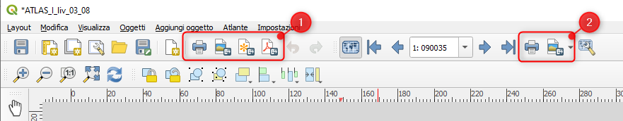
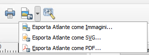
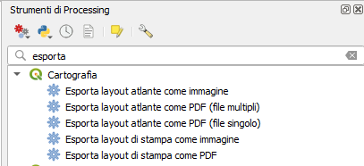

---
hide:
  # - navigation
  # - toc
title: Compositore di stampe
description: Compositore di stampe
---

# Compositore di stampe

## Stampe

### Introduzione

Il Print Layout può stampare per singolo layout o in serie se si tratta si un atlante, le icone da utilizzare sono diverse:

{.center-img .img-80}

1. per stampe singole;
2. per stampe in serie.

### Singolo layout

La stampa del singolo layout avviene usando le icone evidenziate nel primo riquadro in rosso, queste possono essere utilizzate anche nel caso fosse stato sviluppato un atlante.

È possibile stampare:

 1.  direttamente alla stampante fisica;
 2.  come immagine jpg o png;
 3.  come SVG;
 4.  come PDF.

### In serie

La stampa in serie di un layout avviene dopo aver definito un atlante e usando le icone evidenziate nel secondo riquadro in rosso, queste non possono essere utilizzate nel caso di semplice layout senza definizione di atlanti.

{.center-img .img-50}

1.  esporta come immagine jpg o png, per singola pagina, se un atlante ha 10 pagine, stampera 10 immagini;
2.  Esporta Atlante come SVG;
3.  Esporta Atlante come PDF, in questo caso è possibile definire se stamparlo in unico file multipagina oppure in enne file PDF.

## Processing

Ci soano alcuni algoritmi utili per la stampa che permettono di esportare interi atlanti o singole layout:

{.center-img .img-60}

{!includes/disclaimer.md!}
