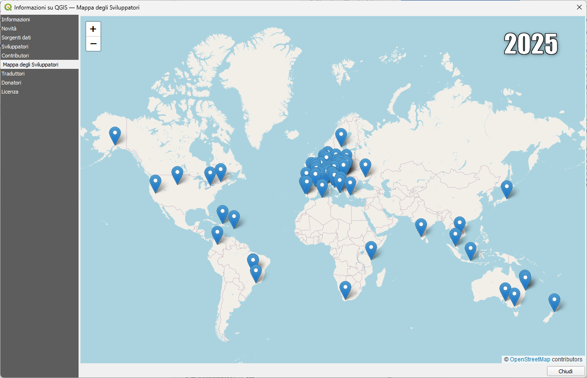
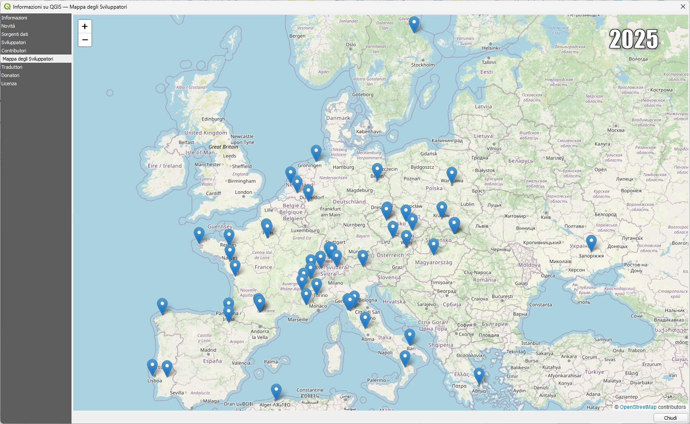

---
hide:
  # - navigation
  # - toc
title: Mailing List GFOSS e QGIS Italia, Gruppi
description: Mailing List GFOSS e QGIS Italia, Gruppi
---

# Mailing List GFOSS e QGIS Italia, Gruppi

## Introduzione

**QGIS** è un software GIS Desktop **Open Source** (OS) e **Libero** con licenza GNU, non è l'unico in questo settore ma è unico in quanto esiste _una vasta comunità_, a livello mondiale, che supporta il progetto.

Per i software OS la comunità è fondamentale in quanto garantisce la qualità del software (perché è sotto gli occhi di molti sviluppatori) e la durata nel tempo (sono molti gli sviluppatori e si alternano sempre).

## Mailing List

Esistono molte mailing list (ML), quella degli **sviluppatori** (QGIS-dev), quella del **PSC**, quella degli utenti gruppi nazionali ecc...; in Italia esistono due ML in cui si parla di **QGIS**:

* [GFOSS.it aps](https://discourse.osgeo.org/c/local-chapters/gfoss-it/33) (Geographic Free and Open Source Software);
* [QGIS-it-user](https://discourse.osgeo.org/c/qgis/qgis-it-user/47)(Gruppo degli utenti italiani di QGIS);

nella prima si parla di tutto il software OS e quindi anche di QGIS, nella secondo si parla solo di QGIS, e ci sono vari tipologie di utenti: sviluppatori, utenti esperti e semplici utenti alle prime armi. È il miglior luogo dove porre domande e quesiti.

## Gruppi e siti

e ci sono, inoltre:

- Pagina Facebook [QGIS Italia](https://www.facebook.com/qgis.it);
- Canale Telegram [QGIS Italia](https://t.me/qgisitalia);
- Gruppo Telegram [Italiano degli utenti di QGIS](https://t.me/qgis_it);
- Gruppo Telegram [Italiano dei traduttori di QGIS](https://t.me/qgis_it_traduzione)
- Canale Twitter di [QGIS Italia](https://twitter.com/qgisitalia);
- Sito Web [QGIS.it](http://qgis.it/);
- Sito Web [QGIS.org](https://www.qgis.org/it/site/);
- Gruppo LinkedIn [QGIS Italia](https://www.linkedin.com/groups/13738173/);

## Contribuire

Esistono vari modi per contribuire al progetto **QGIS**:

1. testing;
2. [traduzione](https://qgis.org/it/site/getinvolved/translate.html);
3. [codice](https://github.com/qgis/QGIS);
4. [segnalazione di bug](https://github.com/qgis/QGIS/issues);
5. [finanziario una tantum](https://qgis.org/it/site/getinvolved/donations.html);
6. [sponsor](https://qgis.org/it/site/about/sustaining_members.html).

Spesso si pensa che un software OS - cioè liberamente scaricabile dal web - non abbia bisogno di supporto ma è falso.

**La domanda da porre in questi casi è la seguente: vuoi la possibilità di scaricarlo sempre, che sia sempre aggiornato e nel tempo?? quindi, contribuisci in qualche modo!!!**

## Sviluppatori nel Mondo

{.center-img .img-70}

## Sviluppatori in Europa

{.center-img .img-70}

{!includes/disclaimer.md!}
