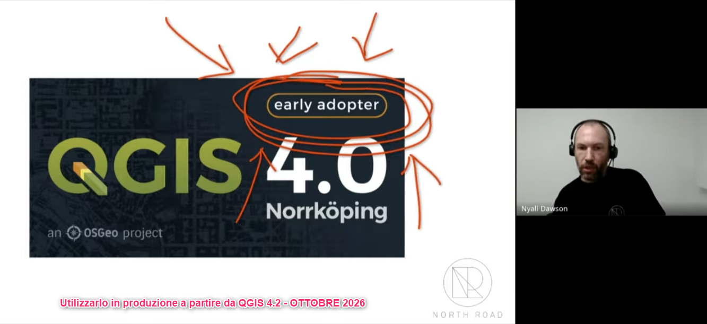
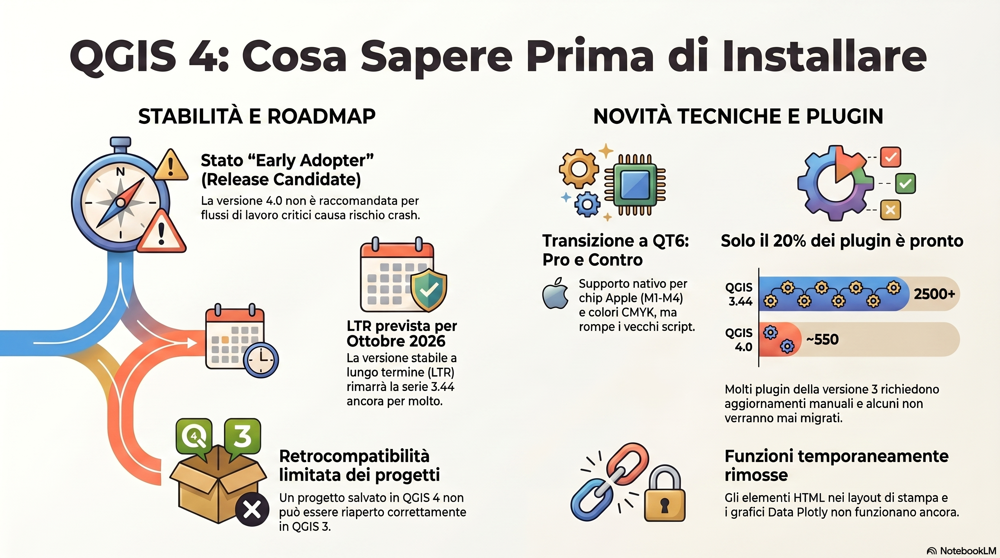

**Nyall Dawson**, uno dei principali sviluppatori del progetto QGIS, ha presentato le novità e le criticità relative al rilascio di QGIS 4, sottolineando che si tratta di un momento di transizione significativa per il software

Ecco una sintesi dei punti principali trattati nel suo intervento:

## Stato attuale di QGIS 4.0

- Early Adopter: QGIS 4.0 è ufficialmente classificato come una versione per "early adopters" (pionieri), il che significa che è essenzialmente una release candidate destinata al test e non ancora all'uso in ambienti di produzione critici
- Stabilità e bug: Dawson avverte della presenza di numerosi bug, inclusi problemi di crash e potenziale corruzione dei dati, motivo per cui non è ancora raccomandato per installazioni aziendali mission-critical
- Roadmap: La versione a lungo termine (LTR) rimane la 3.44. Il piano attuale prevede che la versione 4.2 diventi la prossima LTR intorno a ottobre, ma questa data sarà confermata solo dopo una valutazione della stabilità del software

## Cambiamenti tecnici e Plugin

- Passaggio a QT6: La motivazione principale per il salto alla versione 4 è stata la necessità di migrare dalla libreria QT5 (ormai a fine vita) alla QT6. Questo passaggio garantisce il supporto nativo per i processori Mac (M1, M2, M3, M4) e il supporto completo per i colori CMYK
- Aggiornamento dei Plugin: Tutti i plugin e gli script Python devono essere aggiornati per funzionare con le nuove API di QGIS 4. Attualmente, solo circa 500 plugin su oltre 2.500 sono pronti per la nuova versione, e Dawson stima che una parte significativa dei vecchi plugin potrebbe non essere mai convertita.
- Strumenti di migrazione: Esiste uno script per gli sviluppatori che automatizza circa il 90-95% del lavoro di migrazione dei plugin, mantenendo la compatibilità anche con QGIS 3
.
## Funzionalità mancanti e cambiamenti

- Funzioni temporaneamente disabilitate: A causa del passaggio a QT6, alcune funzioni di QGIS 3 non sono ancora disponibili nella 4.0, come gli elementi HTML nei layout di stampa (influenzando anche i grafici di Data Plotly), le annotazioni HTML e le scorciatoie della barra delle applicazioni di Windows
- Installatori e Griglie di Datum: Le griglie per le trasformazioni di coordinate non sono più incluse negli installer standard per ridurne le dimensioni; QGIS chiederà ora di scaricarle solo quando effettivamente necessarie
.
## Compatibilità dei progetti e Consigli

- Nessuna compatibilità retroattiva: Dawson lancia un serio avvertimento: un progetto salvato in QGIS 4 non può essere riaperto correttamente in QGIS 3. Sebbene QGIS 4 possa aprire i vecchi progetti, il salvataggio nella nuova versione renderà il file illeggibile o incompleto per le versioni precedenti. 
- Consigli per gli utenti: È possibile installare QGIS 4 accanto a QGIS 3 per effettuare test senza disinstallare la versione stabile. Gli amministratori GIS dovrebbero iniziare a testare i propri flussi di lavoro ora per essere pronti alla transizione definitiva verso ottobre.

## Sviluppi futuri (Visualizzazione 3D)

- Grazie a campagne di crowdfunding, la versione 4.2 introdurrà notevoli miglioramenti nella visualizzazione 3D, inclusi materiali fotorealistici, texture migliorate (normal maps, displacement maps) e una simbologia più curata, avvicinandosi alle capacità di software di rendering come Blender, pur rimanendo nell'ambito GIS.

<https://youtu.be/oWIqBHDeItA>