---
hide:
  # - navigation
  # - toc
title: Georeferenziatore Raster
description: Georeferenziatore Raster
---

# Georeferenziatore Raster

## Introduzione

In questa esercitazione georeferenzieremo due raster in modo da capire bene la differenza tra un raster con coordinate note e uno senza.

## Raster con coordinate note

In questo esempio georeferenzieremo un PDF che contiene informazioni su una Carta Tecnica 1:10000 di Stromboli:

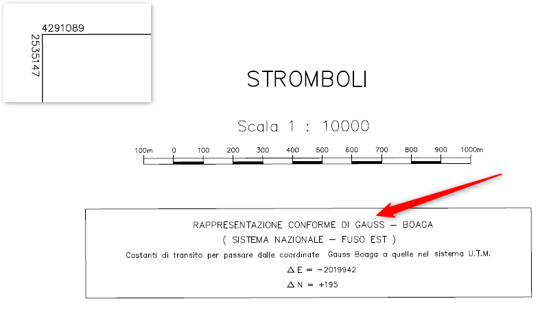{.center-img .img-60}

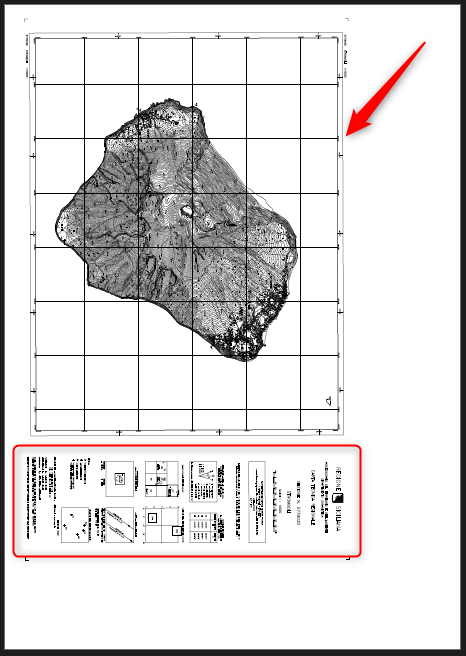{.center-img .img-40}

### Procedimento

1. Avviare QGIS e avviare il plugin Georeferenziatore (Menu Layer);
2. Configurare le Impostazioni  e caricare raster ;
3. tracciare 4 punti ;
4. avviare georeferenziatore e controllare i residui.
5. verificare se correttamente posizionata, caricando una mappa di sfondo.

=== "Step1"

    Carica raster

    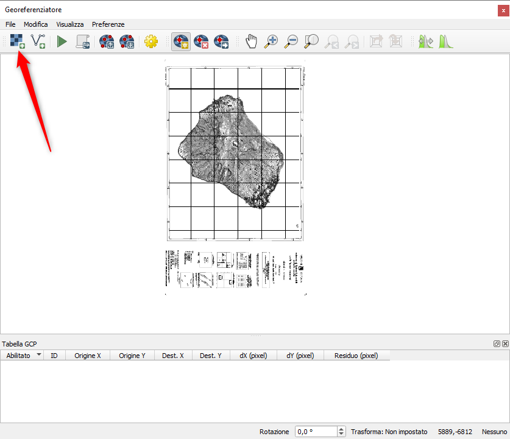{.center-img .img-50}

=== "Step2"

    configura

    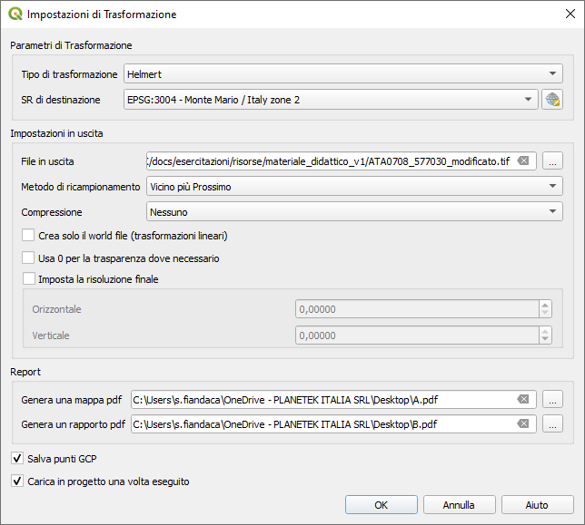{.center-img .img-50}

=== "Step3"

    Inserisci punti GCP

    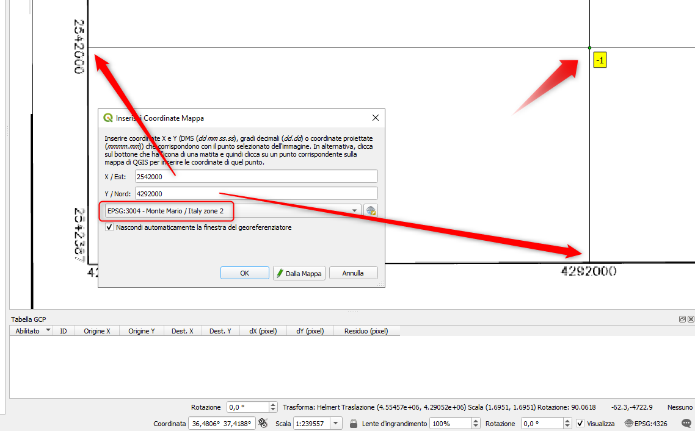{.center-img .img-50}
    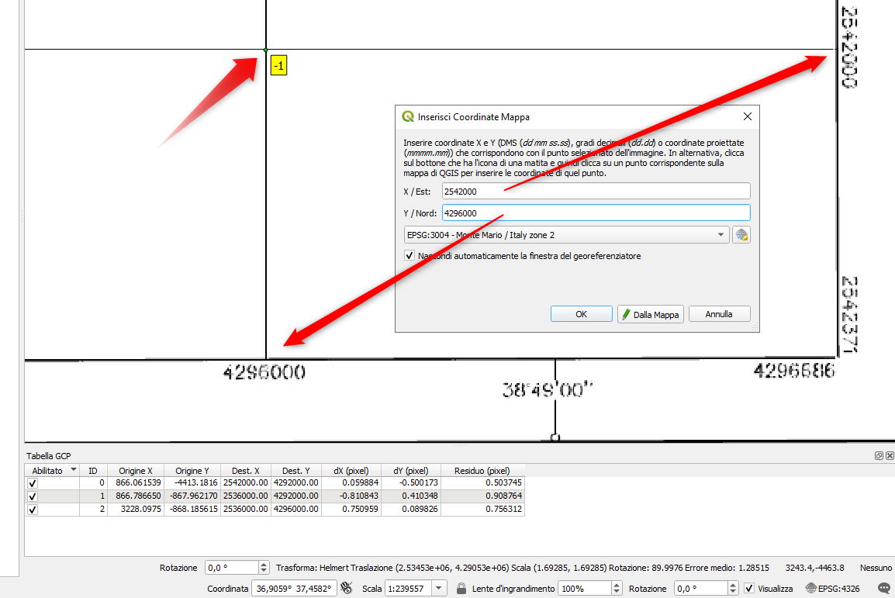{.center-img .img-50}

=== "Step4"

    Controlla i residui

    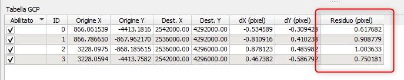{.center-img .img-70}

---

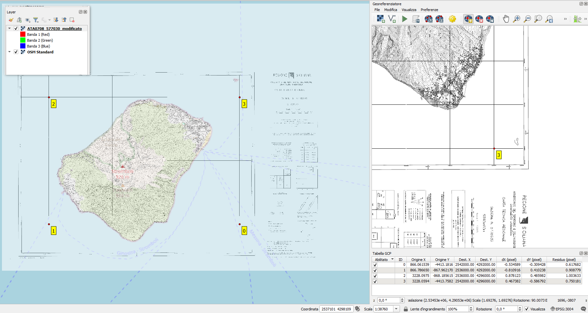{.center-img .img-80}

!!! Warning

    Nel caso i residui fossero troppo altri, cioè l'immagine georeferenziata non si sovrappone correttamente, è possibile spostare i punti (con le relative icone) o aggiungerne altri e riavviare il plugin!

## Raster senza coordinate note

### Procedimento

!!! Warning

    In questo caso è necessario conoscere il Sistema delle coordinate del raster di partenza, quello da georeferenziare, questo è fondamentale per poter utilizzare la corretta mappa di riferimento da cui acquisire le coordinate dei punti.

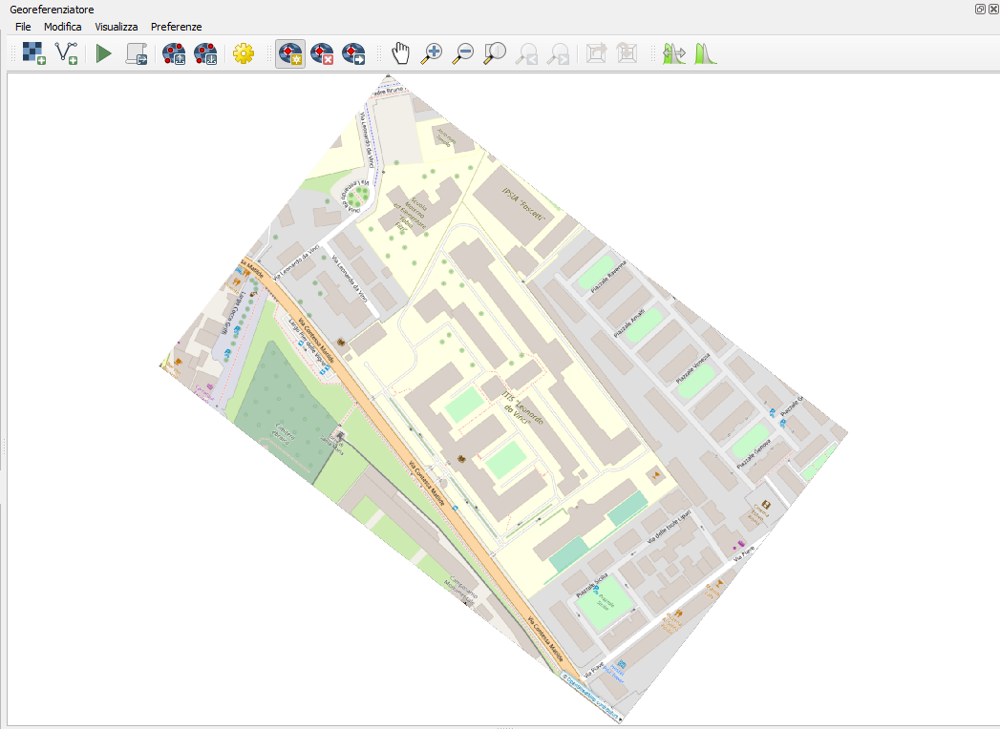{.center-img .img-70}

{.center-img .img-50}

L'immagine è un ritaglio modificato dell'area dell'**ITIS Leonardo Da Vinci di Pisa**, EPSG:3857

1. Avviare QGIS e avviare il plugin Georeferenziatore (Menu Layer); oppure, nel nostro caso, dal menu File | Resetta il Georeferenziatore;
2. Configurare le Impostazioni  e caricare raster ;
3. tracciare 4 punti ;
4. avviare georeferenziatore e controllare i residui.
5. verificare se correttamente posizionata, caricando una mappa di sfondo.

=== "Step1"

    Carica raster

    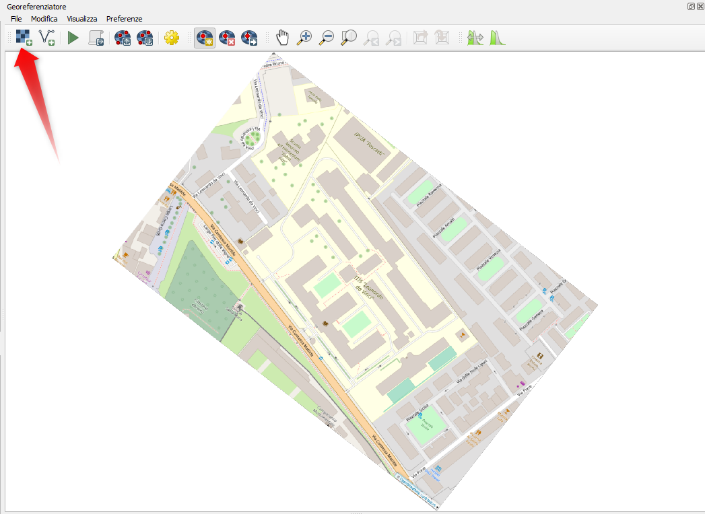{.center-img .img-50}

=== "Step2"

    configura

    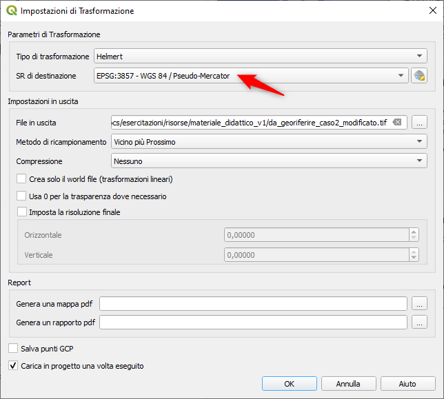{.center-img .img-50}

=== "Step3"

    Inserisci punti GCP

    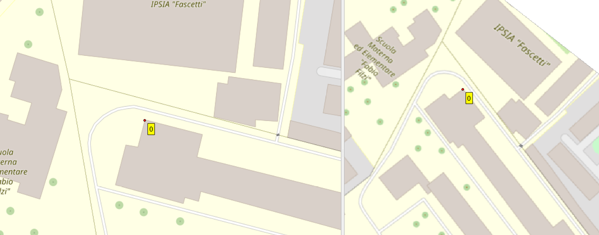{.center-img .img-50}

=== "Step4"

    Controlla i residui
    
    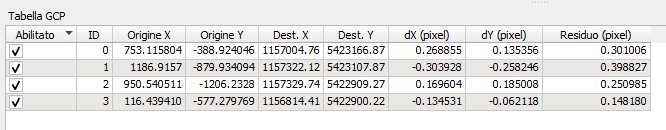{.center-img .img-70}

---

{.center-img .img-80}

{!includes/disclaimer.md!}
