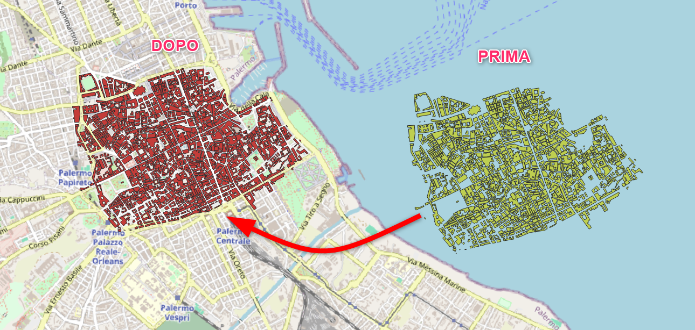
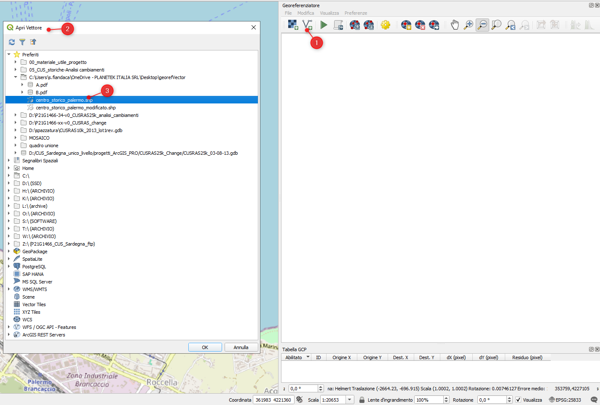
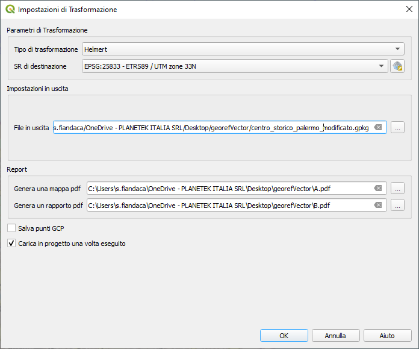
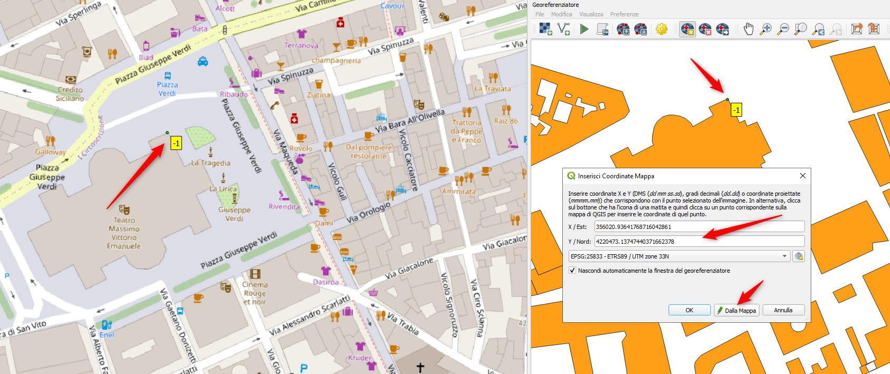
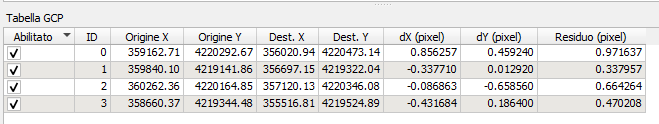
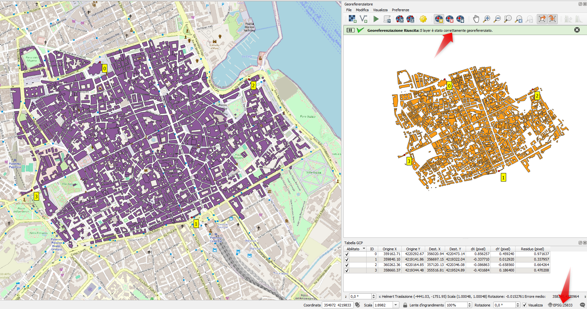

---
hide:
  # - navigation
  # - toc
title: Georeferenziatore Vector
description: Georeferenziatore Vector
---

# Georeferenziatore Vettore

## Introduzione

{.center-img .img-90}

In questa esercitazione georeferenzieremo un vettore (centro storico di Palermo) di cui è nota la località e l' EPSG di destinazione.

### Procedimento

1. Avviare QGIS e avviare il plugin Georeferenziatore (Menu Layer);
2. Configurare le Impostazioni  e caricare raster ;
3. tracciare 4 punti ;
4. avviare georeferenziatore e controllare i residui.
5. verificare se correttamente posizionata.

=== "Step1"

    Carica vettore

    {.center-img .img-70}

=== "Step2"

    configura

    {.center-img .img-70}

=== "Step3"

    Inserisci punti GCP

    {.center-img .img-70}

=== "Step4"

    Controlla i residui

    {.center-img .img-70}

---

{.center-img .img-80}

{!includes/disclaimer.md!}
