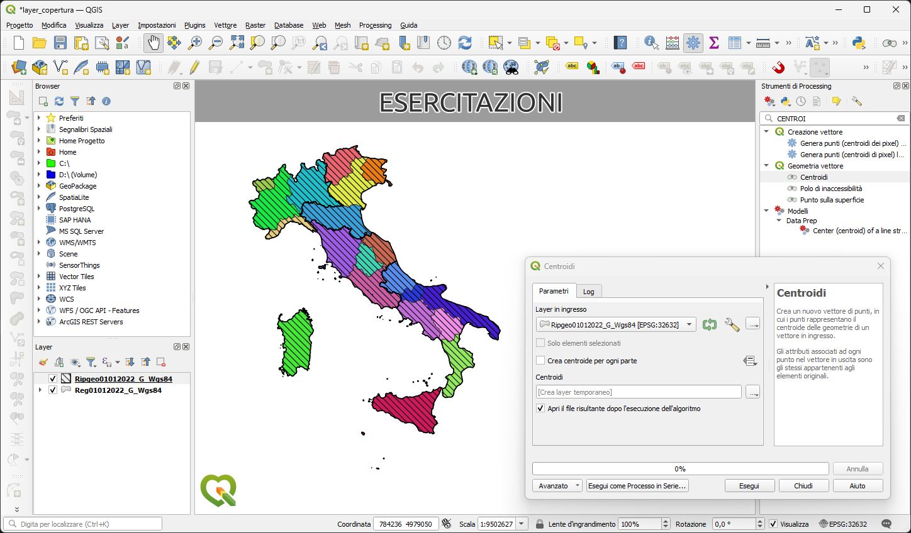

---
hide:
  # - navigation
  # - toc
title: Esercitazioni
description: Esercitazioni
---

# Programma :octicons-book-16:

-   __vari esercizi su ogni argomento__

    ---
    
    * uso tabella attributi;
    * funzioni core - vari esempio;
    * funzioni personalizzate - vari esempio;
    * stampe;
    * processing;
    * ...;

    
