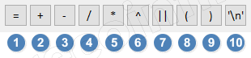
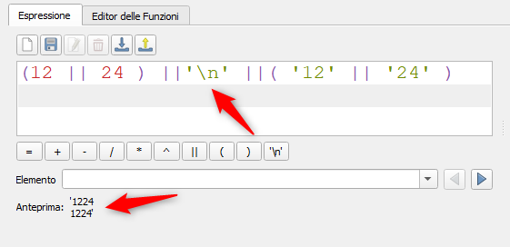
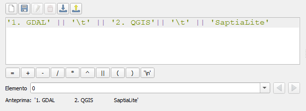
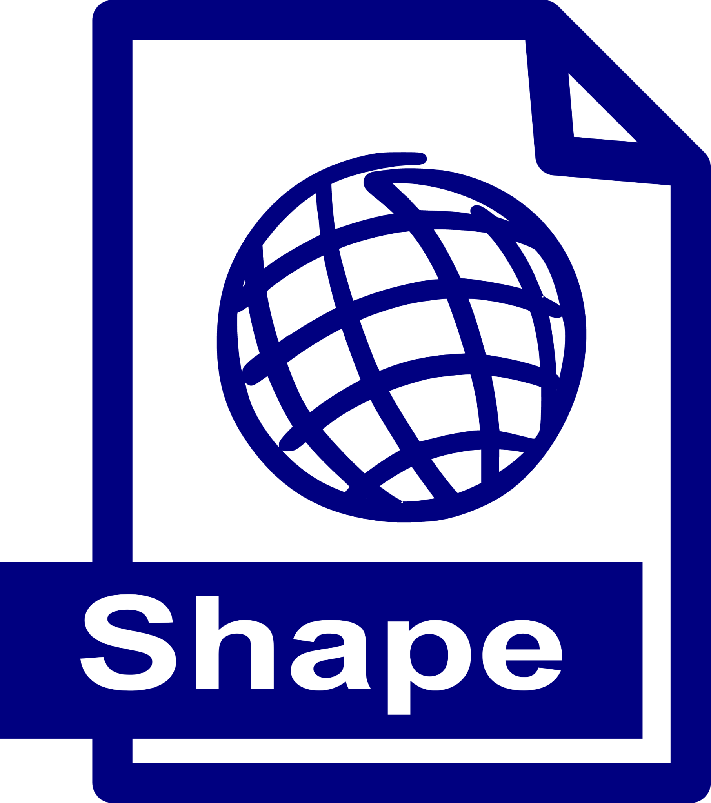

---
hide:
  # - navigation
  # - toc
title: Primi passi con il field calc
description: Primi passi con il field calc di QGIS 3.x
---

# Concetti fondamentali sul calcolatore di campi di QGIS

## Introduzione

!!! Abstract "Intro"
    **In questa sezioni sono raccolti i concetti fondamentali sul Field Calc espressi tramite un elenco puntato. La conoscenza di questi concetti permette di velocizzare il lavoro e capire il comportamento del Field Calc.**

## Memorizzare :brain:

1. il CALCOLATORE di campi è attivabile solo per layer **vettoriale**[^1] e tabelle **editabili**[^2];
2. la creazione di un **nuovo campo** è relativo al layer selezionato nella TOC (Pannello Layer);
3. il calcolatore popola **un campo per volta** (la modifica multipla è un caso particolare);
4. l'output del calcolatore popola, in generale, tutte le celle (della colonna) della tabella attributi o solo quelle selezionate (caso particolare);
5. nella tabella attributi tutte le operazioni **agiscono riga per riga** (questo è uno dei motivi della lentezza di alcuni processi);
6. è possibile richiamare altri layer tramite le funzione _get_feature_, _get_feature_by_id_ e _aggregate_ e _overlay_*_;
7. il risultato delle funzioni di aggregazione verrà ripetuto in tutte le righe (questo è uno dei motivi della lentezza di alcuni processi);
8. è possibile **aggiornare** la *geometry* >= QGIS 2.14;
9. `$area`, `$perimeter` ecc.. il `$` davanti ad una funzione significa che riguarda la geometry corrente ($ sarà sostituito con @);
10. i nomi dei layer vanno scritti tra apici semplici ('nome_layer') mentre i nomi dei campi con doppi apici ("nome_campo") ma funziona anche senza apici, ma per evitare problemi è consigliato i doppi apici;
11. i valori numerici vanno scritti senza apici es: 10, mentre i valori alfanumerici vanno scritti tra apici semplici es: 'Sicilia';
12. l'anteprima del calcolatore (pto 17 - vedi screenshot) è utile ma non sempre corretta o completa; provate la funzione _to_datetime_ o usare funzioni che restituiscono un output lungo;
13. con il doppio clic è possibile aggiungere funzioni o valori nelle espressioni nell'area di editing;
14. è possibile aggiungere funzioni personalizzate tramite codice Python nel gruppo _Custom_;
15. è possibile aggiungere altri gruppi di funzioni tramite plugin es:refFunction → gruppo Reference;
16. è possibile editare/salvare/importare/esportare e condividere espressioni utente; >= QGIS 3.12;
17. è possibile cambiare l'attributo visualizzabile in `Elemento` dalle proprietà _Suggerimenti_ del layer;
18. è possibile aumentare la dimenzione del testo all'interno dell'editor tramite la rotellina del mouse ( <kbd>Ctrl+rotellina</kbd> )
19. è possibile personalizzare i colori e i font utilizzati nell'area di scrittura espressioni da Impostazioni|Opzioni|IDE;
20. Campi e valori sono visibili sia per il layer corrente che per tutti i layer vettoriali (nel Gruppo Layer Mappa)

## Calcolatrice

Il field calc di QGIS può essere utilizzata come semplice calcolatrice per le 4 operazioni `+`, `-`, `*` e `/`

## Motore delle espressioni

Nell'interfaccia del field calc, nella parte centrale, è presente un'area dedicata alle funzioni, suddivisa per argomenti: all'interno ci sono circa 400 espressioni pronti per essere utilizzate nei nostri calcoli.

## Operatori interfaccia

L'interfaccia del calcolatore rende immediatamente disponibili alcuni operatori:

=== "= 1️⃣"

    uguale:

    - uguaglianza tra numeri `10 = 10`;
    - uguaglianza tra lettere `'A' = 'A'` ;
    - uguaglianza tra parole `'Ciao' = 'Ciao'`;
    - ugualgianza tra stringhe `'Viva QGIS' = 'Viva QGIS'`;
    - uguaglianza tra campi `"field1" = "field2"`;
    - uguaglianza tra espressioni `$area = area($geometry)`;

=== "+ 2️⃣"

    sommma:

    - somma di numeri `10 + 15.4`;
    - somma di stringhe (unione) `'QGIS' + '3.0'`;
    - somma di campi `"fied1" + "field2"`
    - somma di espressioni `$perimeter + 500`;

=== "- 3️⃣"

    sottrazione:

    - differenza tra numeri `250 -200`;
    - differenza tra campi `"field1"-"field2"`;
    - differenza tra espressioni `length("field1") - length("field2")`;

=== "/ 4️⃣"

    divisione:

    - divisione tra numeri `125/5`;
    - divisione tra campi `"field1"/"field2"`;
    - divisione tra espressioni `$area/$perimeter`;

=== "* 5️⃣"

    moltiplicazione:

    - moltiplicazione tra numeri `12*22`;
    - moltiplicazione tra campi `"field1"*"field2"`;
    - moltiplicazione tra espressioni `$perimeter*length($area)`;

=== "^ 6️⃣"

    potenza:

    - potenza tra numeri `10^2`;
    - potenza tra campi `"field1"^"field2"`;
    - potenza tra espressioni `$area^length($area)`;

=== "|| 7️⃣"

    unione di stringhe:

    - unione di numeri (che trasforma in stringhe) `12 || 24 → '1224'`;
    - unione tra lettere `'A'||'b' → 'Ab'`;
    - unione tra parole `'Ciao' || 'Mondo' → 'CiaoMondo'` ;
    - unione tra stringhe `'Viva QGIS' || 'Viva Pigreco' → 'Viva QGISViva Pigreco'`;
    - unione tra campi `"field1" = "field2"`;
    - unione tra espressioni `$area || area($geometry)`;
    - unione tra simboli `'A'||'=>'||'B' → 'A=>B'`;

=== "( 8️⃣"

    parentesi aperta:

    - il calcolatore indica se una parentesi è rimasta aperta;

=== ") 9️⃣"

    parentesi chiusa:

    - il calcolatore indica se una parentesi è rimasta chiusa;

=== "'\n' 🔟"

    nuova riga:

    - aggiunge una nuova riga:  
    `(12 || 24 ) ||'\n' ||( '12' || '24' ) → stamperà '1224' su 1224'` in due righe;
    - molto utile per le etichette su due o più righe;

    

=== "'\t'"

    tab:

    Un altro operatore nascosto è `'\t'` tabulazione:

    utile per esempio nelle legende, leggi [qui](https://geoobserver.wordpress.com/2021/07/19/qgis-tipp-tabellenartige-legenden-mit/)

    

---

## Formato GIS

Tabella attributi e tipo di formato GIS, cosa cambia.

La scelta del formato vettoriale GIS è molto importante in quanto potrebbe condizionare il lavoro che stiamo svolgendo.

Lo **shapefile** è un formato molto vecchio e si porta con se molti limiti dovuti alla vecchiaia (nato anni '90), di seguito alcuni limiti legati alla tabella attributi:

1. i nomi dei campi non possono superare i 10 caratteri, per esempio `descrizione` (descrizion), `popolazione` (popolazion) ecc..., cioè troncherebbe il nome del campo;
2. un campo testuale può contenere al massimo 255 caratteri, dal 256esimo verrebbero troncati;
3. non gestisce i campo `datatime` ma solo `data` quindi non potremmo scrivere data e ora, ma solo data;

Il **geojson** è un formato molto più modermo rispetto allp **shapefile** e non ha i limiti descritti sopra. Questo formato è solitamente _usato per realizzare mappe web_.

Il **GeoPackage** è un nuovissimo fomato GIS (_formato default di QGIS_) basato su SQLite/SpatiaLite, non ha i limiti dello **shapefile**; è un contenitore di dati GIS:
1. vettori;
2. raster;
3. semplici tabelle;
4. stili;
5. file di progetto QGIS.

Lo **SpatiaLite** è un geo-database.

!!! Warning
    Se possibile non usare mai il formato shapefile! (perché ha molte limitazioni)

Quale è la differenza | Shapefile  {.img-10}   | GeoPackage  {.img-40} 
:---------------------:|:-----------:|:--------------:
Archiviazione dati | Limitato alla memorizzazione  di un singolo livello per set di file  (con file `*.shp., *.shx, *.dbf`) | Supporta più livelli in un singolo file (utilizzansdo il database SQLite)
Limite di dimensione file| Dimensione massima  del file (`*.dbf` 2 GB)| Nessun limite praticoalla dimensione del file (supporta grandi set di dati ~ 240 TB)
Supporto attributi| Limitato a nomi di campo da 10 carattri  e non supporta tipi di dati avanzati| Supporta nomi campo lunghi, tipi di dati avanzati (come Blob) e valori NULL
Sistema di Coordinate| Supporto limitato per CRS  tramite un file `*.prj` separato| Supporta CRS integrato con ogni livello, non sono necessari file separati
Compressione|Nessuna conpressione  integrata | La compressione integrata riduce le dimensioni dei file e mantiene le prestazioni
Modificabilità| Tende a corrempersi durante la modifica,  richiede la gestione di più file| Stabile per le modifica simultanea all'interno di un singolo file
Adozione|Tecnologia ampiamente utilizzata,  ma obsoleta (1990)|Crescente adozione come alternativa moderma (2014)
Struttura dei file| Richiede più file  (`*.shp,*.shx, *.dbf, *.prj`, ecc...)| Struttura a file singolo per una facile condivisione e gestione
Indicizzazione spaziale|Non ha un meccanismo efficiente  di indicizzazione spaziale integrato|Supporta l'indicizzazione spaziale per query spaziali più rapide
Supporto topologico|Non supporta  regole topologiche avanzata| Supporta regole avanzate di topologia e vincoli all'interno del set di dati
Supporto metadati| Capacità limitata di metadati  archiviati in file separati|Metadati completi memorizzati all'interno del database stesso
Compatibilità| Compatibile con tutti i software GIS  e non solo| Piena compatibilità solo con Software Open Source
Vestizione| Non ha modo di memorizzarla| Memorizza stile, etichette e tanto altro
Funzionalità| Solo dati vettoriali| Supporta dati vettoriali, Raster, Stili, Metadati, Topologia, CRS, Attributi ecc...
Encoding| Problematico | Nessun problema di Encoding

{!includes/disclaimer.md!}

[^1]: in contrapposizione ai layer raster

[^2]: non tutti i layer in QGIS sono editabili, come per esempio layer CSV