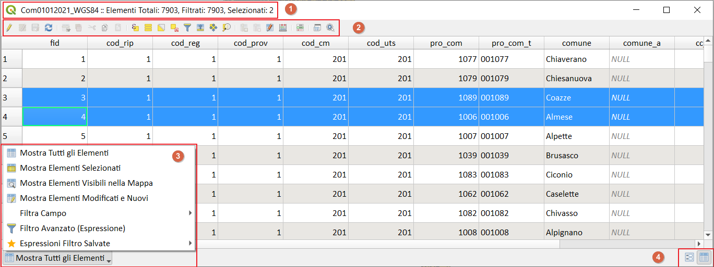
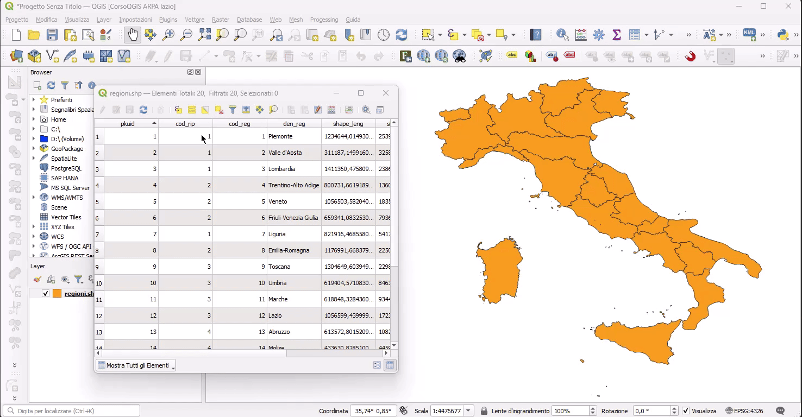
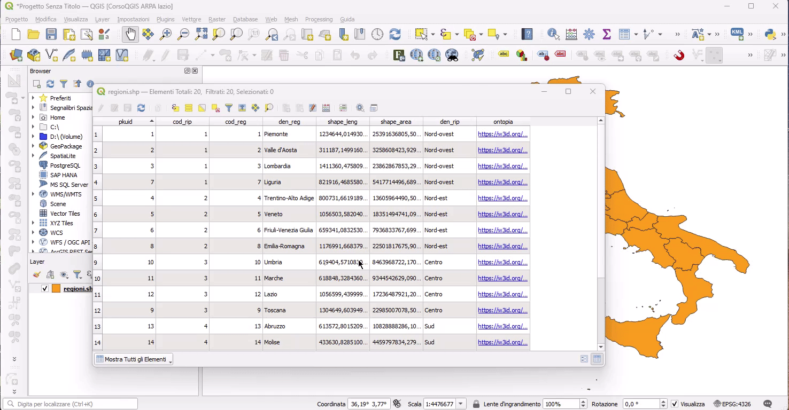
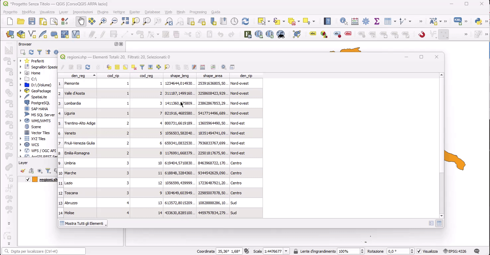
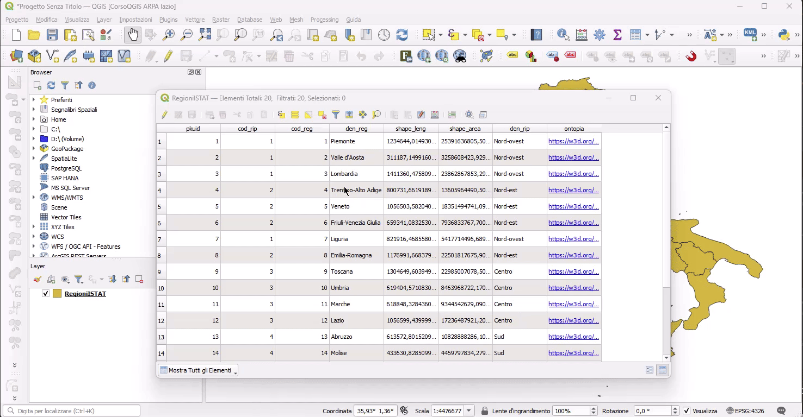
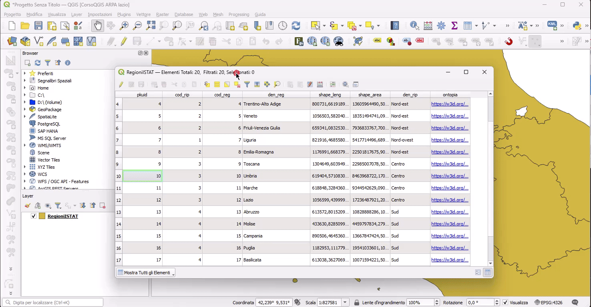
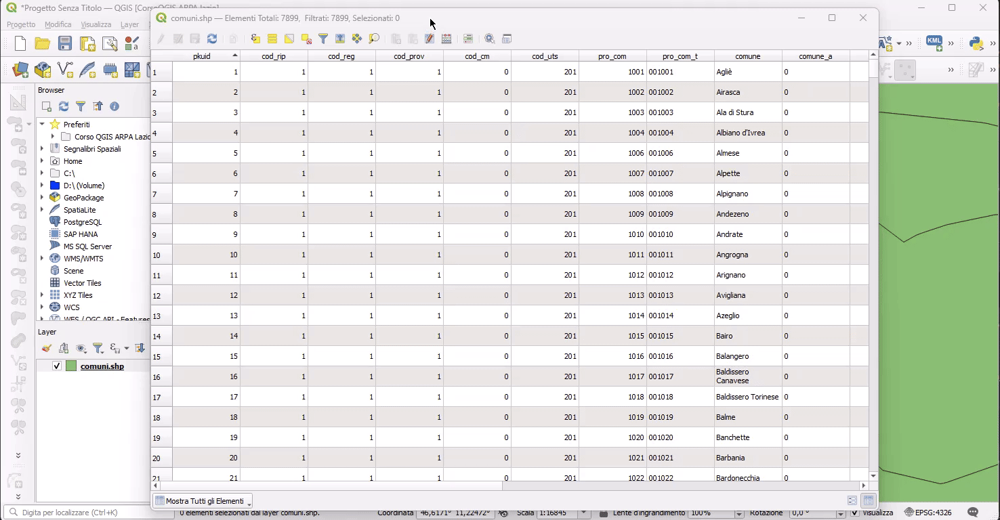

---
hide:
  # - navigation
  # - toc
title: Tabella attributi
description: Primi passi con il field calc di QGIS 3.x
---

# Tabella attributi

## Introduzione

{.center-img .img-90}

## Esempi

Sotto alcuni esempi utili  per usare al meglio la tabella degli attributi:

=== "Ordinare"

    Cliccando sull'intestazione di una colonna, è possibile, cliccando su Ordina, ordinare usando delle espressioni, per esempio concatenando più colonne:

    <div align="center">
      </a>
    </div>

=== "Organizzare"

    Utilizzando l'icona  è possibile nascondere attributi o spostarne la posizione (la modifica è solo in visualizzazione)

    <div align="center">
      </a>
    </div>

=== "Formattare"

    Utilizzando l'icona  è possibile attivare la formattazione condizionale, simile a quella usata in Excel

    <div align="center">
      </a>
    </div>

=== "Field Calc Rapido"

    Utilizzando l'icona  è possibile attivare la modifica della tabella usando il Field Calc Rapido:

    <div align="center">
      </a>
    </div>

=== "Multi Edit"

    Utilizzando l'icona  è possibile attivare la modifica Multipla:

    <div align="center">
      </a>
    </div>

=== "Filtrare"

    Utilizzando l'icona  è possibile attivare il Filtro Avanzato:

    <div align="center">
      </a>
    </div>

=== "Formattazione condizionale"

    Formattare i valori duplicati

    espressione:

    ```py
    count( 
    expression:=@value , 
    group_by:="cod_cm" )>1 -- "cod_com" attributo controllato
    ```

{!includes/disclaimer.md!}