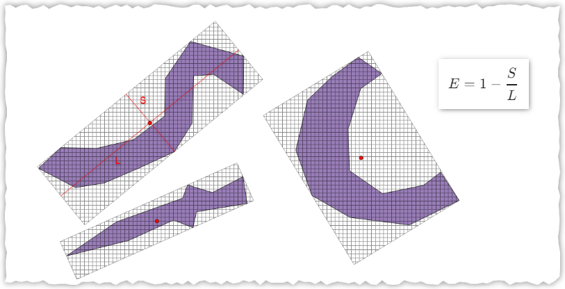
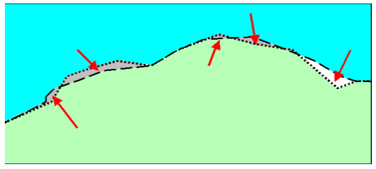

---
hide:
  # - navigation
  # - toc
title: Funzioni core
description: Primi passi con il field calc di QGIS 3.x
---

# Funzioni core

## Introduzione

1. panoramica sui gruppi di funzione nel field calc;
2. aggiungere un attributo e popolarlo;
3. aggiungere attributi geometrici (x,y,z o area, lunghezza, perimetro);
4. ...

## Esempi

=== "Calcolo fattore di forma"

    Permette di selezionare la forma dei poligoni, usato spesso per individuare poligoni stretti e lunghi.

    ```py
    (2*pi()*sqrt(area(@geometry)/pi())) /perimeter(@geometry)
    ```

    $$
    2π{\sqrt{Area\above{1pt}π}\above{1pt}perimetro}
    $$

    ``` mermaid
    graph LR
      A[Start] --> B(Calcolo);
      B --> C((Cerchio));
      C --> D[1];
      B --> E[<br> Quadrato <br> <br>];
      E --> F[≈ 0.8862]
      B --> G[Poligono stretto e lungo]
      G --> H[<< 1]
    ```

    - più il valore si allontana da 1, più la forma del poligono sarà stretta e lunga.

=== "Calcolo rapporto di allungamento"

    È una variante del fattore di forma utilizzata dagli algoritmi di [WhiteBox](https://jblindsay.github.io/ghrg/Whitebox/Help/ElongationRatio.html), permette di individuare poligoni stretti e lunghi.

    Il [rapporto di allungamento](https://hfcqgis.opendatasicilia.it/blog/2024/01/15/rapporto-di-allungamento/) (E) è:

    $$
    E = 1 - {S\above{1pt}L}
    $$

    Dove S è la lunghezza dell'asse corto e L è la lunghezza dell'asse lungo. Le lunghezze degli assi vengono determinate stimando il riquadro di delimitazione minimo orientato.

    

    ```py
    with_variable('latiBBOX',
        array_foreach(
            array_foreach(
                generate_series(1, 2),
                geometry_n(segments_to_lines(oriented_bbox($geometry)),@element)),
    round(length(@element),3)),
    1- (array_min(@latiBBOX)/array_max(@latiBBOX)))
    ```

=== "Calcolo Sliver polygon"

    Un poligono frammentato o poligono a scheggia è un poligono che ha una piccola area e un grande perimetro, una definizione più completa la trovate [qui](https://en.wikipedia.org/wiki/Sliver_polygon), su Wikipedia:
    
      <div align="center">
        </a>
      </div>

    per [individuare queste schegge](https://pigrecoinfinito.com/2023/04/04/individuare-le-sliver-polygon-con-le-espressioni-di-qgis/), il plugin core di [QGIS Geometry Checker](https://docs.qgis.org/3.34/en/docs/user_manual/plugins/core_plugins/plugins_geometry_checker.htmlhttps://docs.qgis.org/3.34/en/docs/user_manual/plugins/core_plugins/plugins_geometry_checker.html), utilizza due parametri:

    1. Spessore massimo (Maximum thinness), valore predefinito 20: è definito come il rapporto tra l’area del minimo quadrato che contiene il poligono e l’area del poligono stesso (un quadrato ha finezza pari a 1);
    2. Area massima (espressa in metri quadrati);

    ```py
    array_max( 
        array(bounds_height($geometry),bounds_width($geometry)))^2
        /
        area($geometry) > 20  -- PARAMETRO DI SOTTIGLIEZZA
    and 
        area($geometry) < 10 -- VALORE massimo AREA
    ```

=== "Spatial join"

    Immaginiamo, per semplicità, di aver caricato due layer (shapefile delle regioni ISTAT e lo shapefile delle province) sovrapposti e di voler popolare, nel layer regioni, un nuovo attributo, che chiamo lista_prov, con la lista delle province che ricadono dentro ogni regione. Quindi mi aspetto che nel rigo delle regioni Sicilia, nell’attributo lista_prov, ci sia l’elenco delle nove province: Palermo, Catania, Messina, Caltanissetta, Trapani, Siracusa, Ragusa, Enna, Agrigento. [vedi blog post](https://pigrecoinfinito.com/2023/07/30/spatial-join-one-to-many-qgis-vs-arcgis-pro)

    ```py
    array_to_string(
      overlay_contains(
      layer:='ProvCM01012023_g_WGS84',
      expression:="DEN_UTS")
    )
    ```

=== "Coordinate DDMMSS"

    Quando si importa in QGIS un file CSV **Testo Delimitato** che contiene coordinate in **DMS**, è fondamentale che ci siano i _<span style="color:red;">prime</span>_ `′` e _<span style="color:red;">douple prime</span>_ `″` altrimenti non li legge con CSV, ma occorre usare un formato file personalizzato:

    ```
    ascii('′')  = 8242 -- non da tastiera char (8242)- prime
    ascii('\'') = 39   -- da tastiera ' char (39)- apice semplice
    ascii('"')  = 34   -- da tastiera Shitf+2 - doppio apice
    ascii('″')  = 8243 -- non da tastiera char (8243)- double prime
    ```
    Se avessimo a disposizione delle coordinate DDMMSS con apice e doppio apice dovremmo sistemarle prima di darle in pasto a QGIS, e potremmo usare il Field Calc:

    ```py
    replace ('45°26’41.2"N', map('’',char(8242),'"',char(8243)))
    ```
    Oppure, come detto sopra, importare come _testo personalizzato_ vedi [qui](https://discourse.osgeo.org/t/qgis-csv-creazione-di-layer-puntuale-con-coordinate-gms-dms/28254/5)

    I file CSV generato da Excel o LibreCalc esportano in modo corretto, usando il simbolo `prime` e `double prime`.

{!includes/disclaimer.md!}
