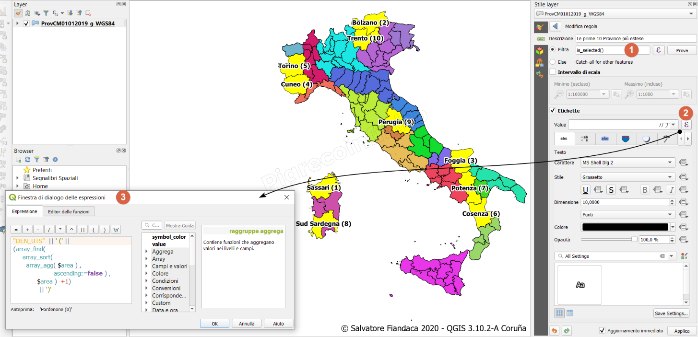
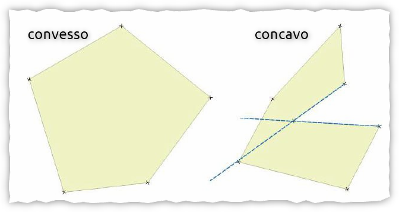
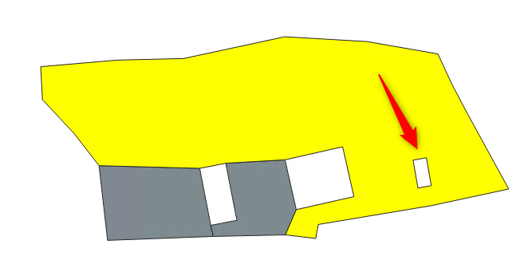

---
hide:
  # - navigation
  - toc
title: Selezione per espressione
description: Alcuni esempi su come usare la selezione per espressione
---

# Selezionare usando le espressioni

## Introduzione

Sotto alcuni esempi sulla selezione tramite espressione.

## Esempi

=== "Quesito A"

    ??? Question "Quesito A"

        Selezionare i primi 10 poligoni (per esempio le prime 10 province più estese d'Italia) di un layer poligonale usando la selezione per espressione di QGIS.

    ## Espressione per selezionare

    !!! Info inline end

        Crea un array aggregando le aree `$area`, le ordina in modo decrescente, taglia le prime 10 e poi verifica se le aree sono presenti nell'array iniziale

    ```py
    array_contains( 
        array_slice(  
        array_sort( 
        array_agg($area), 
                    ascending:=false ), 0,9 ),
            $area)
    ```

    ## Espressione per etichettare

    !!! Info inline end

        Crea una etichetta concatenando l'attributo `"DEN_UTS"` con il numero sequenziale dell'ordinamento crescente dell'estensione delle province. NB: etichettare tramite regola usando come filtro `is_selected()`
    
   
    ```py
    "DEN_UTS"  || ' (' || 
    (array_find(  
        array_sort( 
            array_agg( $area ) , 
                        ascending:=false ) ,
                $area ) +1)
                || ')'
    ```

     

=== "Quesito B"

    ??? Question "Quesito B"

        Selezionare tramite funzioni di aggregazione: minimum e maximum

    ## Minimum

    !!! Info inline end

        Confronta il valore dell'area di ogni riga con il valore _minimo_ raggruppato per ogni provincia.

    ```py
    /* confronta ogni riga */
    $area = minimum($area, group_by:= "COD_PROV" )
    ```

    ## Maximum

    !!! Info inline

        Confronta il valore dell'area di ogni riga con il valore _massimo_ raggruppato per ogni provincia.

    ```py
    /* confronta ogni riga */
    $area = maximum($area, group_by:= "COD_PROV" )
    ```

=== "Quesito C"

    ??? Question "Quesito C"

        **Selezionare poligoni convessi**: Poligoni convessi sono figure geometriche in cui tutti gli angoli sono convessi e non contengono prolungamenti dei lati al di fuori della figura stessa. In altre parole, un poligono convesso è un poligono semplice in cui ogni angolo interno è convesso. Questi poligoni sono particolarmente importanti nella geometria piana e includono forme regolari come il triangolo, il quadrato, il rettangolo, il rombo, il parallelogramma, il trapezio e altri. Inoltre, i poligoni convessi presentano solo angoli minori di 180° e, se si traccia una retta tra due punti all’interno del poligono, il segmento sarà sempre interno alla figura.

    <div align="center">
        </a>
    </div>

    ## Convex_hull

    !!! Info inline end

        Seleziona poligoni convessi tramite un calcolo OTF delle geometrie _convex_ e _centroid_ al variare della precisione (variabile)

     ```py
     /* solo per geometrie polygon */

     with_variable ('precisione', 4,

     geom_to_wkt( centroid(convex_hull(@geometry)),@precisione)
     = 
     geom_to_wkt( centroid(@geometry),@precisione))
     ```
    
    !!! Warning
         La funzione `convex_hull` crea sempre geometria di tipo `polygon`, quindi per utilizzare l'espressione di sopra occorre convertire il layer di origine in `polygon`.

=== "Quesito D"

    ??? Question "Quesito D"

        **Selezionare poligoni con almeno un buco interno**: Questo esempio è utile per selezionare tutti quei poligoni che hanno almeno un buco interno, in termini geometrici si parla di `anelli interni` (inner ring) il segmento sarà sempre interno alla figura.

    <div align="center">
        </a>
    </div>

    ## num_rings

    !!! Info inline end

        Seleziona poligoni con almeno un anello interno.

     ```py
     /* solo per geometrie polygon */

      num_rings( $geometry)>1
     ```


## riferimento

Esempi presi dalla guida [HfcQGIS](https://hfcqgis.opendatasicilia.it/)

{!includes/disclaimer.md!}