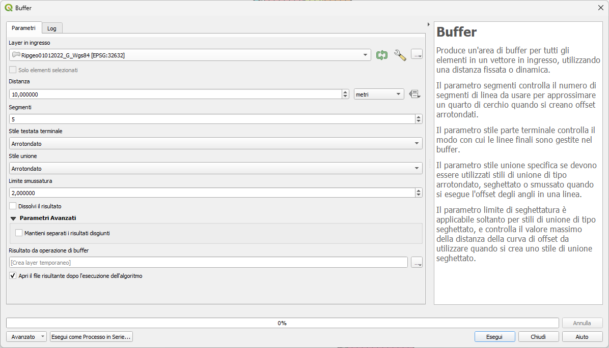
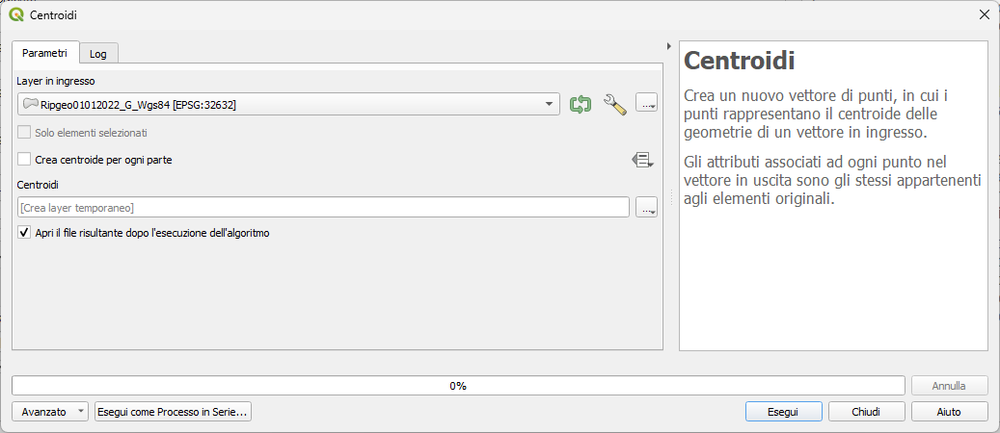
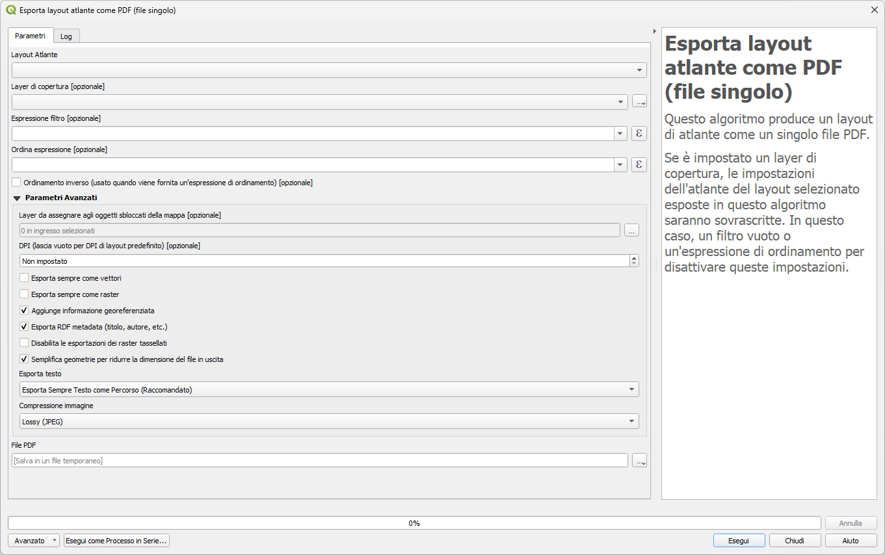
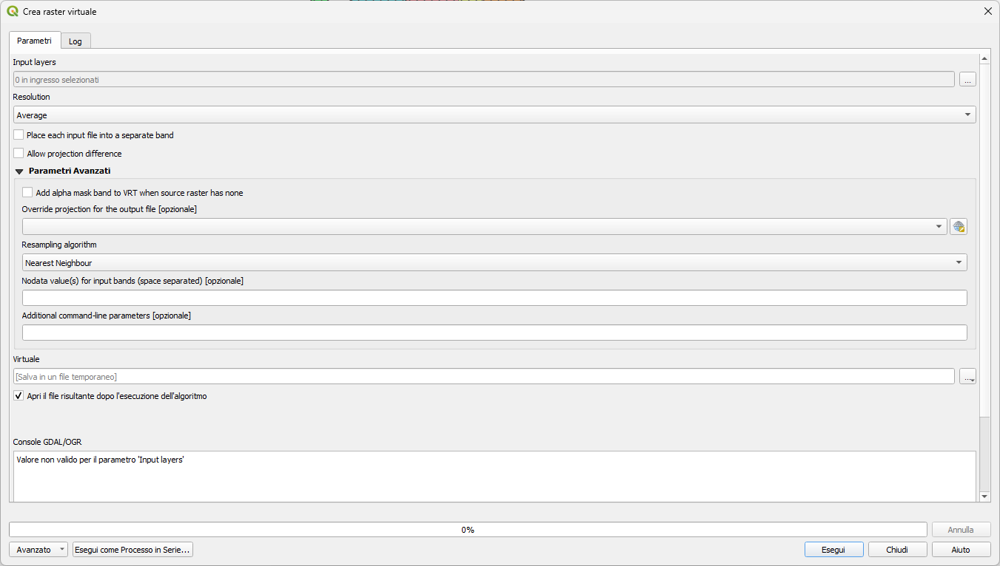
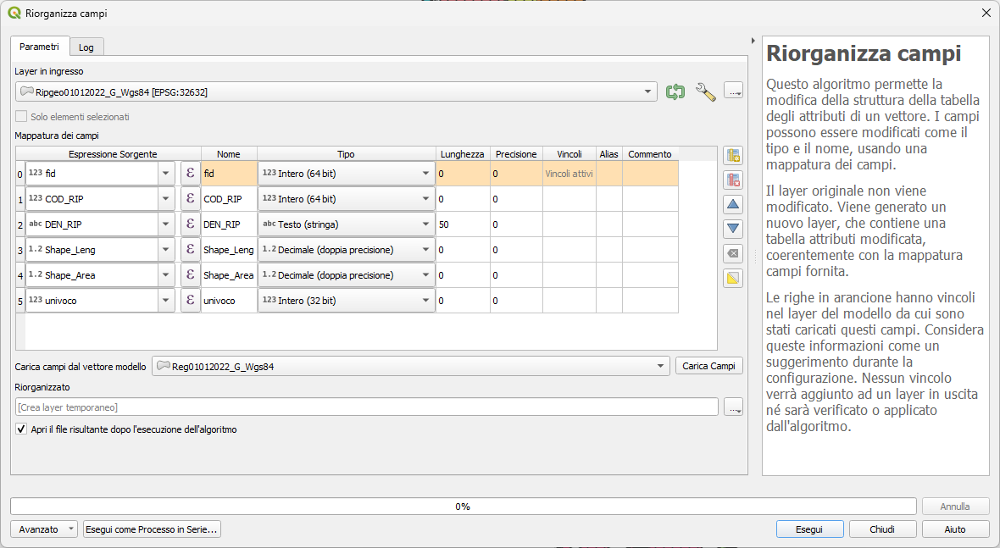

---
hide:
  # - navigation
  # - toc
title: Toolbox
description: Strumenti di Processing
---

# Alcuni esempi di algoritmi

Esempi di algoritmi di Processing, esploriamo le interfacce

## Algoritmi

=== "Buffer"
     
     Algoritmo Buffer
     

=== "Centroid"
     
     Algoritmo Centroid
    

=== "Atlas"
     
     Algoritmo Atlas multipagina PDF
     

=== "Raster Virtuale"
     
     Algoritmo Crea Raster Virtuale - è un algoritmo GDAL - nota interfaccia
     
 
=== "Riorganizza campi"

     _Riorganizza campi_ è un algoritmo di processing che permette di modificare la struttura della tabella degli attributi di un layer vettoriale o semplice tabella.

     L'algoritmo consente di:

    * Modificare i nomi e i tipi di campo;
    * Aggiungere e rimuovere campi;
    * Riordinare i campi;
    * Calcolare nuovi campi in base alle espressioni;
    * Caricare l'elenco dei campi da un altro livello.

    
     

{!includes/disclaimer.md!}