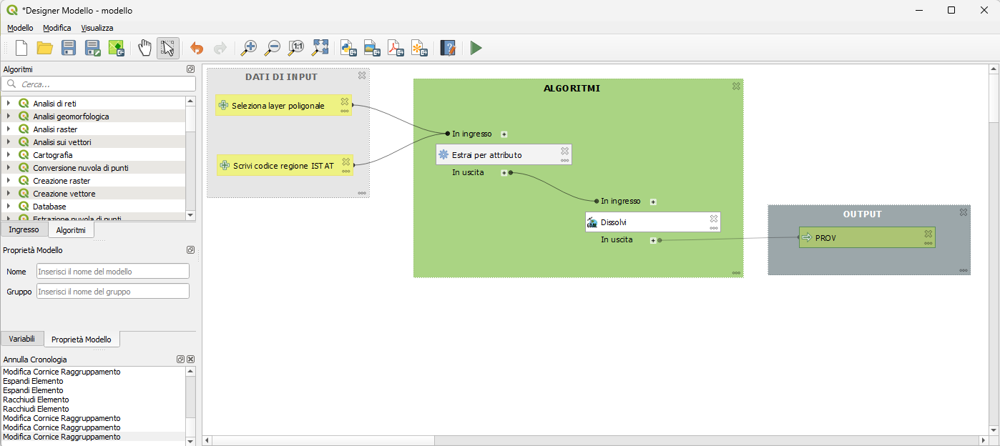
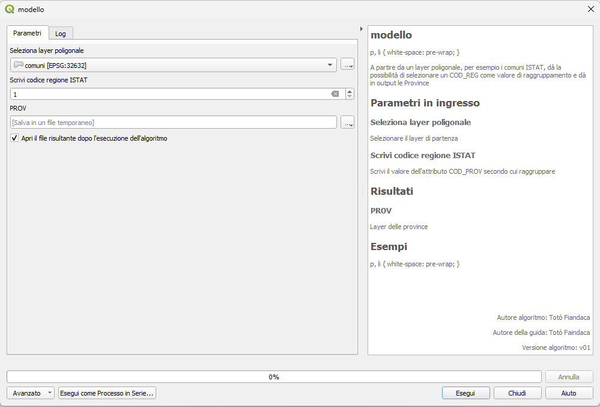
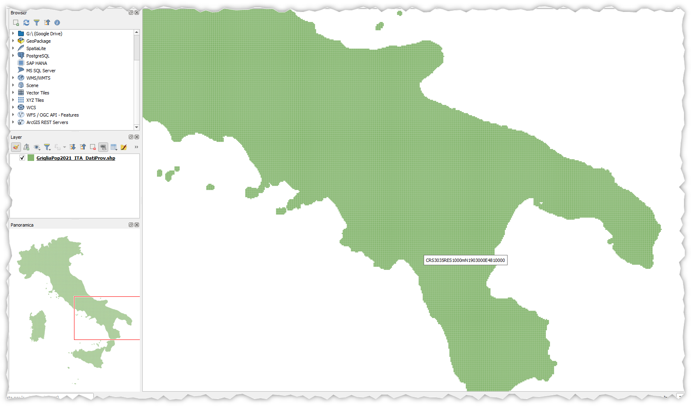
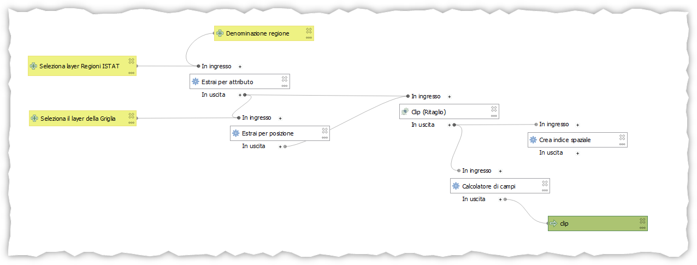
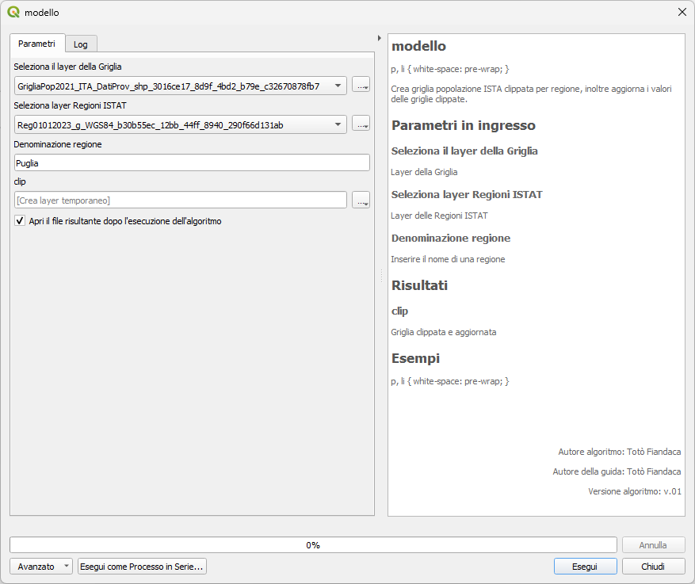
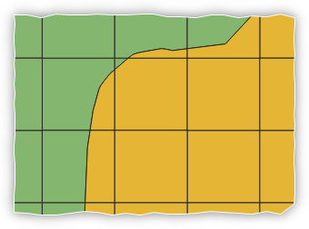
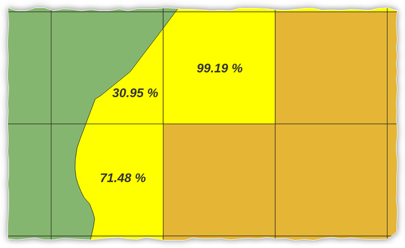
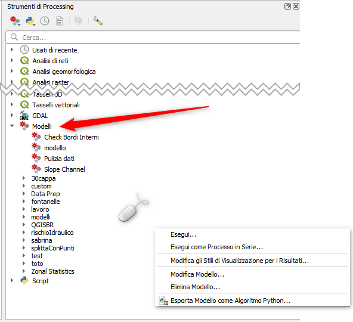

---
hide:
  # - navigation
  # - toc
title: Modellatore grafico
description: Modellatore grafico
---

# Modellatore grafico

## Introduzione

Il [modellatore](https://docs.qgis.org/3.28/it/docs/user_manual/processing/modeler.html) grafico consente di creare modelli complessi utilizzando un’interfaccia semplice e facile da usare. Quando si lavora con un GIS, la maggior parte delle operazioni di analisi non sono isolate, ma fanno parte di una catena di operazioni. Utilizzando il modellatore, questa catena di operazioni può essere racchiusa in un unico processo, che può essere eseguito in un secondo momento con una serie diversa di input. Indipendentemente dal numero di passaggi e di algoritmi diversi, un modello viene eseguito come un singolo algoritmo, risparmiando tempo e fatica e non solo, permette anche la ripetibilità del processo.

## Esercizio 1

Utilizzando lo shapefile comuni ISTAT (1), estrapolare tutti i comuni di una regione e successivamente creare lo shapefile delle province, il tutto usando un modello grafico.
{ .annotate }

1.  :man_raising_hand: Vai nella sezione [Dati](../../dati/index.md#__tabbed_1_2) e copia il link di interesse
   




## Esercizio 2

L’Istat diffonde la distribuzione della popolazione legale relativa al censimento 2021 sulla griglia regolare, con celle di un 1 km² (1). Tale diffusione ha un carattere provvisorio.
... continua su [ISTAT](https://www.istat.it/it/archivio/155162)
{ .annotate }

1.  :man_raising_hand: Vai nella sezione [Dati](../../dati/index.md#__tabbed_1_1) e copia il link di interesse

[dati](../../dati/index.md)



x = una regione a scelta

1. Selezionare le sole griglie della regione x;
2. creare un nuovo layer con la selezione;
3. ritagliare la selezione usando il poligono regione x;
4. aggiornare il valore della popolazione residente per quei riquadri che ricadano tra le varie regioni, ovvero quelli ritagliati;
5. tematizzare il layer appena creato.

creare un modello grafico.





esempio del ritaglio:





### Espressione

Sotto espressione utilizzata per il calcolo della percentuale della popolazione:

??? Note "Scopri espressione"

    ```py
    if(
    area($geometry)<1E6, -- 1E6 è area di una griglia
    "TOT_P_2021"*(area($geometry)/1E6),"TOT_P_2021")
    ```

## Extra

I modelli realizzati compariranno nella toolbox sotto la sezione `Modelli` e con ogni modello è possibile:

1. Eseguirlo;
2. Eseguirlo in serie;
3. Modificare gli stili di visualizzazione per i risultati (creando un file *.qml);
4. Modificare il modello;
5. Eliminare il modello;
6. Esportare Modello come Algoritmo Python.



{!includes/disclaimer.md!}