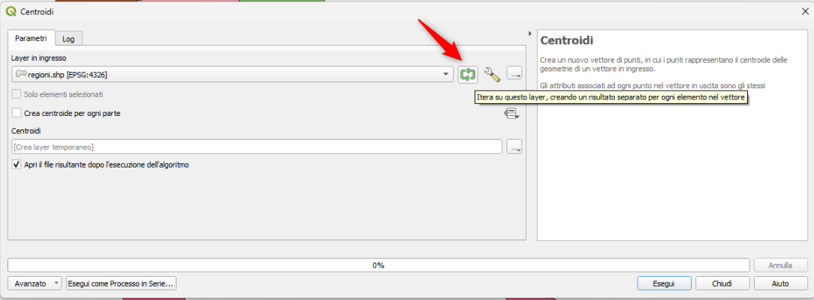
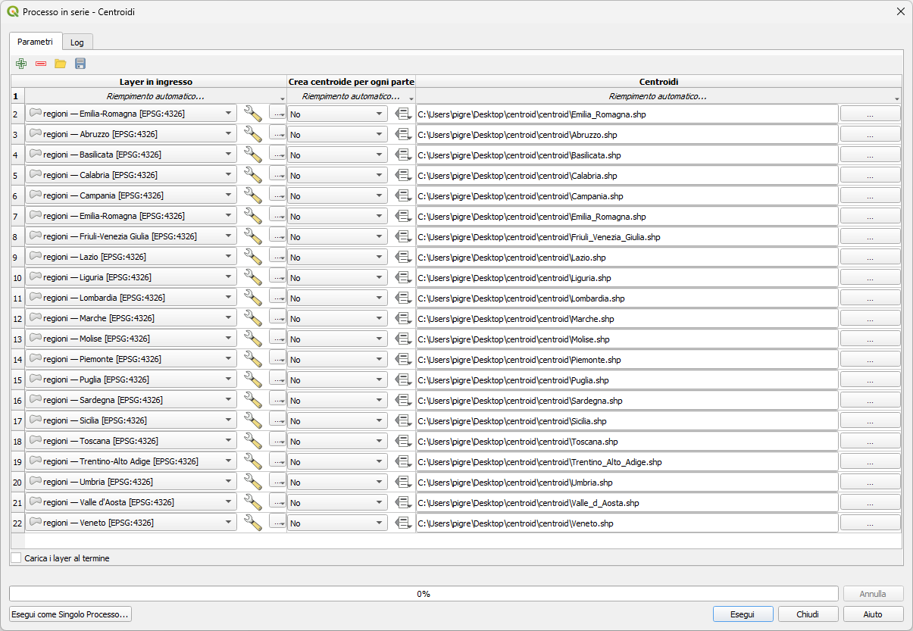
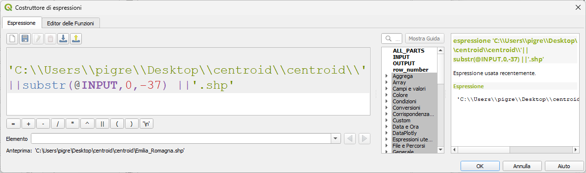
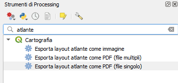
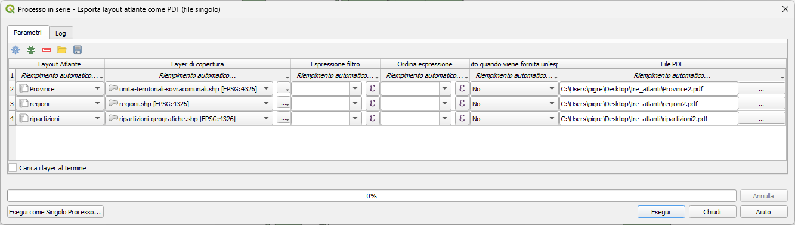
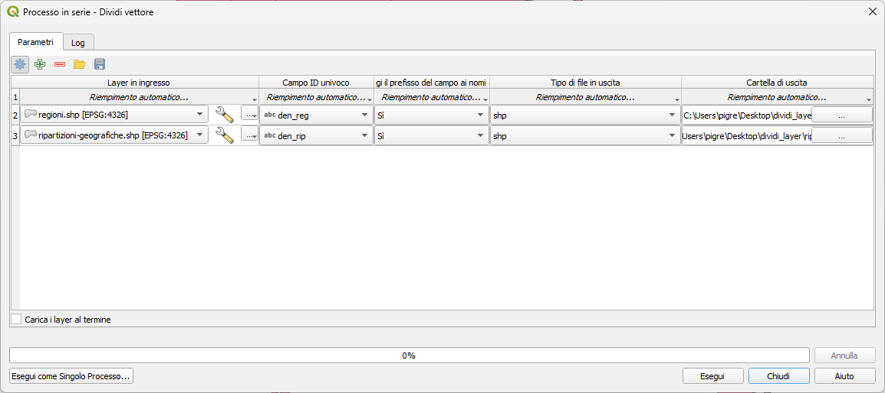
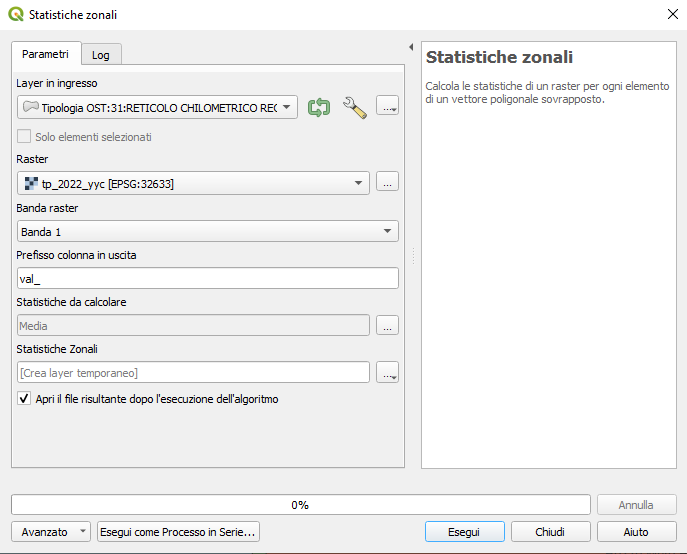
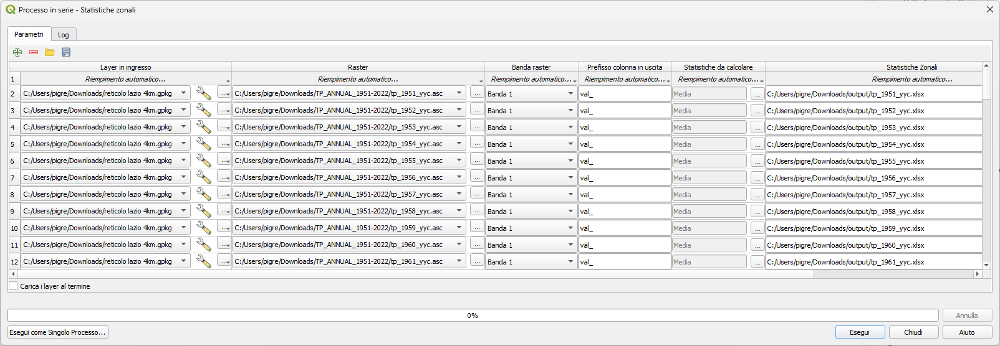

---
hide:
  # - navigation
  # - toc
title: Esecuzione in serie
description: Esecuzione in serie di uno stesso algoritmo
---

# Esempi Esecuzione in Serie

## Estrarre i centroidi

### Introduzione

A partire dal vettore poligonale Regioni ISTAT, estrarre i centroidi e creare output separati.

### Procedimento

- Caricare in QGIS il file delle [Regioni ISTAT](../../dati/index.md#__tabbed_1_2);
- dalla toolbox cercare `centroidi`;
- avviare algoritmo e settare l'interfaccia (attivare itera );

<div align="center">
   </a>
</div>

- definire cartella di output (userà il nome definito come prefisso dei file di output).

Per ottenere i nomi dei file uguali al nome delle regione occorre cambiare processo e realizzare un vero processo in serie: usare l'algoritmo [Dividi Vettore](https://docs.qgis.org/3.34/it/docs/user_manual/processing_algs/qgis/vectorgeneral.html#qgissplitvectorlayer) e poi usare questo come input del processo in serie per estrarre i centroidi.

<div align="center">
   </a>
</div>

<div align="center">
   </a>
</div>

## Stampa atlanti in serie

### Introduzione

Tra i vari strumenti di Processing, ci sono tre algoritmi legati agli atlanti:

<div align="center">
   </a>
</div>

- **Esporta layout atlante come immagine**: Esporta l’atlante di un layout di stampa come file immagine (ad esempio, immagini PNG o JPEG);
- **Esporta layout atlante come PDF (file multipli)**: Esporta l’atlante di un layout di stampa in più file PDF;
- **Esporta layout atlante come PDF (file singolo)**: Esporta l’atlante di un layout di stampa come singolo file PDF (multipagina).

Creare, in un progetto, tre atlanti (_ripartizioni_, _regioni_ e _province_) e poi stamparli con un unico processo usando **Esporta layout atlante come PDF (file singolo)**

### Procedimento

- Creare i tre atlanti;
- Salvare il progetto in una cartella;
- Da Strumenti di Processing cercare atlante e selezionare _Esporta Layout atlante come PDF (file singolo)_;
- Cliccare in basso a sinistra su _Esegui come processo in Serie..._;
- Compilare la prima colonna selezionando i nomi dei tre Layout che abbiamo creato, aggiungerne uno per ogni riga usando l'icona +;
- Compilare ultima colonna per l'output: usando _Riempimento automatico_ e _Calcola con Espressione_ usando la seguente espressione:

```py
'C:\\Users\\pigre\\Desktop\\tre_atlanti\\'||@LAYOUT ||'.pdf'
```

dove:

- `C:\\Users\\pigre\\Desktop\\tre_atlanti\\` è la cartella dove salvare i PDF;
- `@LAYOUT` è la variabile che memorizza i nomi dei trE atlanti;



## Dividere layer per attributo

### Introduzione

Dividere due layer (1) (_Regioni_ e _Ripartizioni_) usando un loro attributo (_den_reg_, _den_rip_).
{ .annotate }

1.  :man_raising_hand: --> Cliccare su [Data](../../dati/index.md#__tabbed_1_2) e copiare il link OTF utile all'esercizio



### Procedimento

1. Caricare i due layer;
2. Avviare processing _[Dividi Layer](https://docs.qgis.org/3.34/it/docs/user_manual/processing_algs/qgis/vectorgeneral.html#qgissplitvectorlayer)_;
3. Cliccare in basso a sinistra su _Esegui come processo in Serie..._;
4. Compilare la prima colonna selezionando i nomi dei due Layer che abbiamo caricato, dopo aver cliccato su _Riempimento Automatico..._ e _Seleziona da Layer Aperti..._;
5. Compilare ultima colonna per l'output: usando _Riempimento automatico_ e _Calcola con Espressione_ usando la seguente espressione:

```py
'C:\\Users\\pigre\\Desktop\\dividi_layer\\'||substr(@INPUT,0,-37)
```
dove:

- `C:\\Users\\pigre\\Desktop\\dividi_layer\\` è la cartella dove salvare gli output;
- `@INPUT` è la variabile che memorizza i nomi dei layer;
- [substr](https://hfcqgis.opendatasicilia.it/gr_funzioni/stringhe_di_testo/stringhe_di_testo_unico/#substr) è una funzione del motore delle espressioni di QGIS.

## Calcolo Statistiche zonali

L'esercizio che ci consentirebbe di caricare rapidamente sul SIRA le precipitazioni totali annue del lazio su una maglia di 4 km (ma disponiamo anche di una maglia a 2km)

### Dati

I dati ascii grid che ci servono sono [qui](https://groupware.sinanet.isprambiente.it/bigbang-data/library/bigbang_70/ascii_grid/total_precipitation/tp_annual_1951-2022/download/en/1/TP_ANNUAL_1951-2022.zip) oppure reperibile all'indirizzo [sinanet](https://groupware.sinanet.isprambiente.it/bigbang-data/library/bigbang_70/ascii_grid/total_precipitation/tp_annual_1951-2022).

Lo zip contiene, per ogni anno del periodo 1951-2022, un raster in formato [ascii grid](https://modis.ornl.gov/documentation/ascii_grid_format.html).

### Procedura

Supponiamo di averlo scompattato dentro una cartella di nome "**entrata**" in cui mi troverò un certo numero di ascii grid (magari ci metto solo gli ultimi cinque) e i relativi file di proiezione.

Per tutti i file ascii grid depositati nella cartella devo:

- caricare il file ascii grid (che copre tutta italia);
- ~~ritagliarlo usando il file "reticolo lazio 4km";~~
- fare le statistiche zonali cercando la media, usando sempre il file del reticolo come sotto



- salvare il nuovo file risultante come `.xlsx` in una determinata cartella "**uscita**".

### Soluzione

Usando l'esecuzione in serie



## Procedura

Non caricando PREVENTIVAMENTE nulla in QGIS:

1. Avviare algoritmo di processing Statistiche zonali;
2. cliccare in basso a sinistra su Esegui processo in serie;
3. popolare l'attributo Raster, cliccando nel menu a tendina e selezionando `Aggiungi tutti i file da Cartella...`;
4. popolare gli atri campi legati al raster partendo dalla prima riga e succesivamente cliccare su riempimento verso il basso;
5. popolare il primo attributo, usando il geopackage;
6. per ultimo popolare l'output di Statistiche zonali usando Riempimento automatico...| calcola con espressione;
7. salvare le impostazioni creando un file `.json` che permette in futuro di rilanciare lo stesso processo.

espressione usata per generare il link di output:

```py
'C:/Users/pigre/Downloads/output/'-- cartella di uscita
||
regexp_replace(@INPUT_RASTER,'^(.+)\\/(.+)(.{4})$','\\2')
||'.xlsx' -- formato di uscita
```

se caricassimo prima i file raster in QGIS e successivamente usassimo la voce `Seleziona da Layer Aperti...`, allora l'espressione da usare sarebbe:

```py
'C:/Users/pigre/Downloads/output/'-- cartella di uscita
||
 regexp_replace( @INPUT_RASTER,'^(.+)(.{37})$','\\1')
||'.xlsx' -- formato di uscita
```

[regex](https://regex101.com/r/wqxTMz/1)

{!includes/disclaimer.md!}
