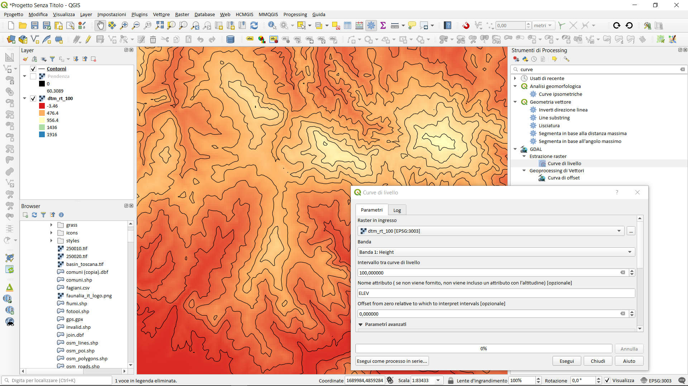

---
hide:
  # - navigation
  # - toc
title: Curve di livello
description: Estrarre curve di livello da un DTM
---

# Curve di livello

Le curve di livello, o isoipse, sono linee che collegano punti alla stessa quota altimetrica. Servono per rappresentare la morfologia del terreno su una mappa bidimensionale. Più sono vicine tra loro, maggiore è la pendenza del terreno.

## Da cosa si ricavano?

Le curve di livello si generano a partire da un modello digitale di elevazione (DEM o DTM), un raster che memorizza le quote del terreno.

I formati più comuni sono:

- .tif (GeoTIFF);
- .asc (ASCII Grid);
- .hgt (SRTM).

## Come generarle in QGIS?

Passaggi principali:

1. Carica un DEM o DTM : Layer → Aggiungi layer raster → seleziona il file .tif
2. Apri lo strumento Curve di livello: Processing → Estrazione → Curve di livello (contour)

Imposta i parametri:

- Input layer: il tuo DEM o DTM
    - Raster in ingresso: seleziona il DTM
    - Banda: generalm,emte è sempre la banda 1
    - Intervallo tra curve: es. 10 metri
    - Opzionale: genera etichette con l'attributo ELEV
    - Salva in: scegli il file di output (GeoPackage o Shapefile)

- Esegui

{.center-img .img-70}

{!includes/disclaimer.md!}
