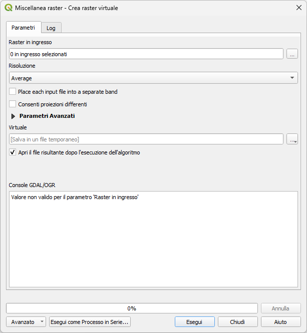

---
hide:
  # - navigation
  # - toc
title: Virtual raster
description: Virtual raster (vrt) in QGIS
---

# Virtual raster

## Cos'è un Virtual Raster?

Un Virtual Raster (VRT) è una rappresentazione virtuale di uno o più raster esistenti.
Non è un nuovo file con dati duplicati, ma un file di collegamento (con estensione .vrt) che:

- unisce più raster in un unico layer visivo,
- lascia i file originali invariati,
- consente analisi e visualizzazione come se fosse un unico raster.

⚠️ Importante: un VRT non è un raster reale, quindi non occupa spazio extra (quasi zero)

## A cosa serve?

- Unire più tasselli raster (es. tiles SRTM, Sentinel, ortofoto)
- Lavorare su un mosaico raster senza fondere i dati
- Creare una base per analisi successive (clip, classificazioni, NDVI)
- Risparmiare tempo e spazio su disco

## Come si crea in QGIS?

- Menu: Raster → Miscellanea → Costruisci raster virtuale (Catalogo)...
- Finestra di dialogo: 
    - Raster di ingresso: seleziona i raster da unire
    - Risoluzione: seleziona modalità
    - Place each input file into a separate band (se volete le bande separate in un unico file)
    - Virtuale: scegli nome e posizione file .vrt
    - Clic su "Esegui"

{.center-img .img-70}

{!includes/disclaimer.md!}
